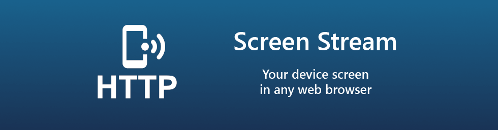

# Screen Stream over HTTP
An Android mobile app for viewing device screen in your web browser.

[](https://xscode.com/dkrivoruchko/ScreenStream) &nbsp;  &nbsp;  

[](https://xscode.com/dkrivoruchko/ScreenStream)

> *Developed by [Dmitriy Krivoruchko](dkrivoruchko@gmail.com)* &middot; If there are any issues or ideas feel free to contact me.
----

The application allows viewing the device screen in your web browser. The main idea is to show your device screen during presentations and demos.
No need of any additional software except for this app and a web browser. No annoying ads or pop-ups.

<a href='https://play.google.com/store/apps/details?id=info.dvkr.screenstream'></a> <a href="https://f-droid.org/packages/info.dvkr.screenstream/" target="_blank"></a> <a href="https://aapks.com/apk/screen-stream/"></a>

Read this in other languages (outdated): [正體中文](README.zh-tw.md)

It uses MJPEG to encode screen images and send them through the network. So it works with any desktop or mobile browser which supports MJPEG (Chrome, Safari, EDGE, Firefox).

The application works via WiFi and/or 3G/LTE network.<br>
Support for IPv4 and IPv6.<br>
Fast and stable WiFi recommended because of high traffic and low network delay requirement.
No Internet required, however, there must be a network connection between the client and the device.

The number of client connections is unlimited, but be aware that each of them requires some CPU resources and bandwidth to send data.

Application uses Android Cast feature and requires at least Android 5.0 to run.

**WARNING:** This is not a real time streaming app. Expected delay is at least 0.5-1 second or more on slow devices, bad WiFi or on heavy CPU load by other apps.<br>
**WARNING:** This app is not designed for streaming video, especially HD video. Use Chromecast instead.<br>
**WARNING:** This app does NOT support SOUND streaming, because MJPEG does not support sound.<br>
**WARNING:** Some cell operators may block incoming connections to your device for security reasons, so, even if the device has an IP address from a cell operator, you may not be able to connect to the device on this IP address.<br>
**WARNING:** Some WiFi networks (mostly public/guest) block connections between its clients for security reasons, so you may not be able to connect to the device via WiFi. For example, a laptop and a phone in this such a WiFi network will not be able to connect to each other.

### Known problems

1. On some devices no notification icon showing but notification is present. Android bug: 213309.

### Screenshots

&nbsp;
<br>
&nbsp;
<br>
&nbsp;
<br>
&nbsp;
<br>
&nbsp;
<br>
&nbsp;


## Features and libraries

Version 3.x based on Clean Architecture, Single Activity and MVI patterns and use:
* [Kotlin](https://kotlinlang.org)
* [Kotlin coroutines](https://github.com/Kotlin/kotlinx.coroutines)
* [Android Jetpack libraries](https://developer.android.com/jetpack/)
* [Koin](https://github.com/Ekito/koin)
* [ZXing](https://github.com/zxing/zxing)
* [Material Dialogs](https://github.com/afollestad/material-dialogs)
* [Binary Preferences](https://github.com/iamironz/binaryprefs)
* [Ktor](https://ktor.io/)
* [Firebase Crashlytics](https://firebase.google.com/docs/crashlytics)
* [xLog](https://github.com/elvishew/xLog)
* [LeakCanary](https://github.com/square/leakcanary)

## Contribution

If you want to contribute with translation, you have to translate this 2 files:

1. https://github.com/dkrivoruchko/ScreenStream/blob/master/app/src/main/res/values/strings.xml and
2. https://github.com/dkrivoruchko/ScreenStream/blob/master/data/src/main/res/values/strings.xml

Then, please, [make a pull request](https://help.github.com/en/articles/creating-a-pull-request) or send those 2 files to the developer via e-mail <dkrivoruchko@gmail.com> as an attachment.

Your contribution is much appreciated. Thank you.

## Developed By

Dmitriy Krivoruchko - <dkrivoruchko@gmail.com>

If there are any issues or ideas feel free to contact me.

## Privacy Policy

App [privacy policy](https://github.com/dkrivoruchko/ScreenStream/blob/master/PrivacyPolicy.md)

## License

```
The MIT License (MIT)

Copyright (c) 2016 Dmitriy Krivoruchko

Permission is hereby granted, free of charge, to any person obtaining a copy
of this software and associated documentation files (the "Software"), to deal
in the Software without restriction, including without limitation the rights
to use, copy, modify, merge, publish, distribute, sublicense, and/or sell
copies of the Software, and to permit persons to whom the Software is
furnished to do so, subject to the following conditions:

The above copyright notice and this permission notice shall be included in all
copies or substantial portions of the Software.

THE SOFTWARE IS PROVIDED "AS IS", WITHOUT WARRANTY OF ANY KIND, EXPRESS OR
IMPLIED, INCLUDING BUT NOT LIMITED TO THE WARRANTIES OF MERCHANTABILITY,
FITNESS FOR A PARTICULAR PURPOSE AND NONINFRINGEMENT. IN NO EVENT SHALL THE
AUTHORS OR COPYRIGHT HOLDERS BE LIABLE FOR ANY CLAIM, DAMAGES OR OTHER
LIABILITY, WHETHER IN AN ACTION OF CONTRACT, TORT OR OTHERWISE, ARISING FROM,
OUT OF OR IN CONNECTION WITH THE SOFTWARE OR THE USE OR OTHER DEALINGS IN THE
SOFTWARE.
```
