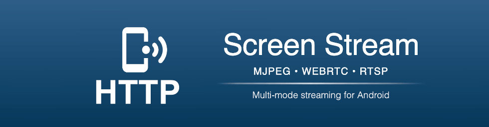
# ScreenStream

ScreenStream is a user-friendly Android application for streaming your device screen and audio. Use Local mode (MJPEG) or Global mode (WebRTC) to view the stream in a web browser, or use RTSP mode with a compatible RTSP client or player.

The Google Play version supports all modes: **Global mode (WebRTC)**, **Local mode (MJPEG)**, and **RTSP mode**, with ads included.<br>
F-Droid versions are ad-free and support only **Local mode (MJPEG)** and **RTSP mode**.

<a href='https://play.google.com/store/apps/details?id=info.dvkr.screenstream'></a> <a href="https://f-droid.org/packages/info.dvkr.screenstream/" target="_blank"></a>

## Project support

If **ScreenStream** is useful to you and you want to support its development, you can use any of the options below.

**Preferred (Tether Wallet / Tether.me):** `dmkr0@tether.me`

Tether Wallet supports Tether.me addresses as human-readable identifiers, so this is the simplest option if you already use Tether Wallet.

If you prefer direct on-chain transfers, use one of these addresses:

**USD₮ / USA₮ (Ethereum / ERC-20):** `0x5bb898c72dd3dD5E7f7A0Ab12854a60374B7c1dA`

**BTC (on-chain):** `bc1q8wuv4esej0rdyn2jwkd93v7wvyep7uutzsmlh9`

## Stream modes

ScreenStream offers three stream modes: **Global mode (WebRTC)** (available only in the [Google Play Store](https://play.google.com/store/apps/details?id=info.dvkr.screenstream) version), **Local mode (MJPEG)**, and **RTSP mode**. All modes stream the Android device screen, but they function differently. Audio support is available in **Global mode (WebRTC)** and **RTSP mode** only. The modes are independent of each other and have different capabilities, restrictions, and customization options.

| Mode                       | Transport                             | Audio | Internet required              | Server side                                                            | Security                                     |
|----------------------------|---------------------------------------|-------|--------------------------------|------------------------------------------------------------------------|----------------------------------------------|
| **Local mode (MJPEG)**     | MJPEG over HTTP                       | ✕     | No                             | Built-in                                                               | Optional 4-6 digit PIN                       |
| **Global mode (WebRTC)**   | WebRTC                                | ✓     | Yes                            | Public signaling service at [screenstream.io](https://screenstream.io) | End-to-end encryption + password             |
| **RTSP mode**              | RTSP<br>H.265/H.264<br>OPUS/AAC/G.711 | ✓     | No (server) / Depends (client) | Built‑in server (Server mode) / External server (client mode)          | Client mode supports RTSP auth + RTSPS (TLS) |

In **Global mode (WebRTC)** and **Local mode (MJPEG)**, the number of clients is not directly limited, but each client uses CPU resources and separate bandwidth.

ScreenStream uses Android's [MediaProjection](https://developer.android.com/reference/android/media/projection/MediaProjection) API and requires Android 6.0 or higher.

> [!WARNING]
>
> - **High traffic on mobile networks:** Streaming over 3G/4G/5G/LTE can consume a large amount of data.
>
> - **Streaming delay:** Expect at least 0.5-1 second of delay, and potentially more on slower devices, unstable networks, or under heavy CPU load.
>
> - **Not optimized for video playback:** ScreenStream is not designed for streaming video content, especially HD video, so playback quality may not meet your expectations.

### Local mode (MJPEG)

Local mode uses MJPEG and a built-in HTTP server. It works on a local network without internet, such as Wi-Fi, a device hotspot, Network-over-USB, or any other network between the Android device and the client's browser.

For optimal performance, a fast and stable network connection is recommended due to high traffic and low network delay requirements.

In Local mode, the app processes each frame independently, one by one, enabling additional image transformations such as cropping, resizing, rotating, and more before sending the image to the client's web browser.

The Local mode offers the following functionality:

- Uses MJPEG.
- PIN protection, no encryption.
- Video only, sent as separate images.
- Works on your local network, no internet required.
- Built-in HTTP server.
- Allows resizing by percentage or exact resolution.
- Supports Wi-Fi, mobile networks, IPv4, and IPv6.
- Clients connect in a browser using the app address.
- Highly customizable.
- Each client uses separate bandwidth.

> [!NOTE]
>
> - Please be aware that certain cell operators may block incoming connections to your device for security reasons. Consequently, even if your device has an IP address from a cell operator, connecting to the device using this IP address may not be possible.
>
> - Some Wi-Fi networks, particularly public or guest networks, may block connections between its clients for security reasons. In such cases, connecting to the device via Wi-Fi might not be feasible. For instance, a laptop and a phone within such a Wi-Fi network will not be able to connect to each other.

**Screenshots**

<p>
  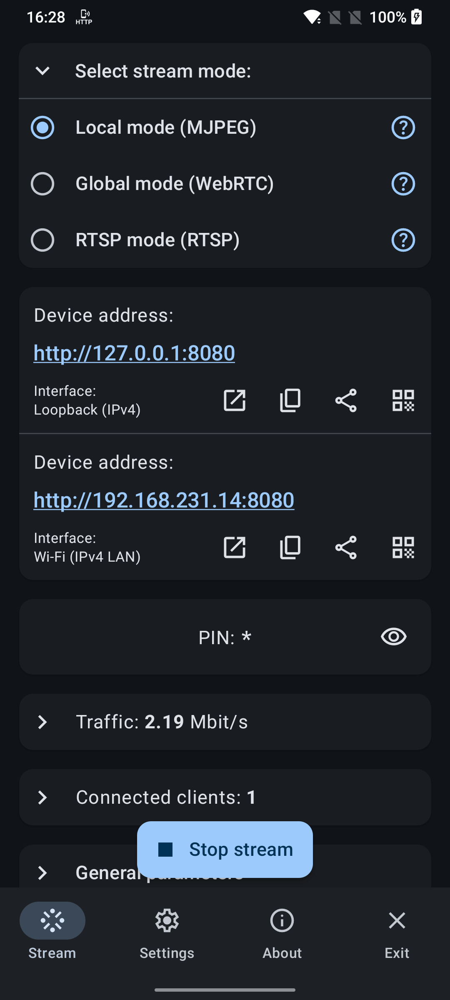&nbsp;
  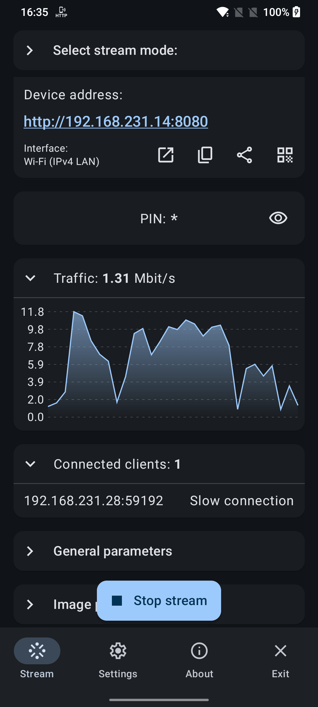&nbsp;
  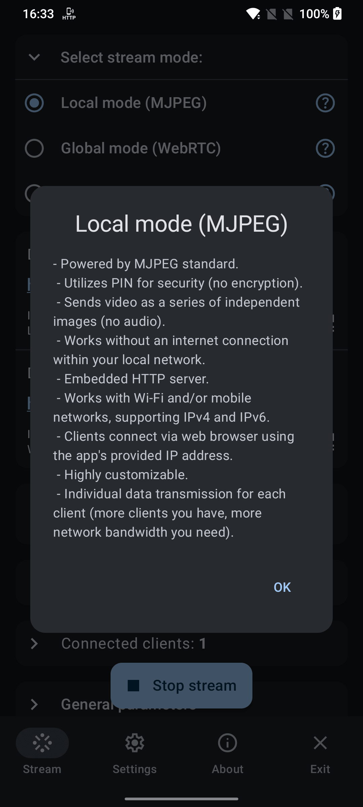
</p>
<p>
  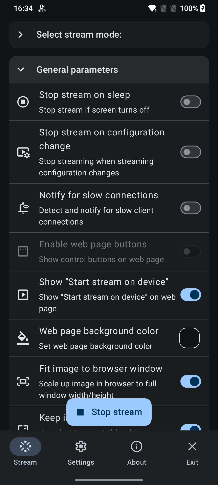&nbsp;
  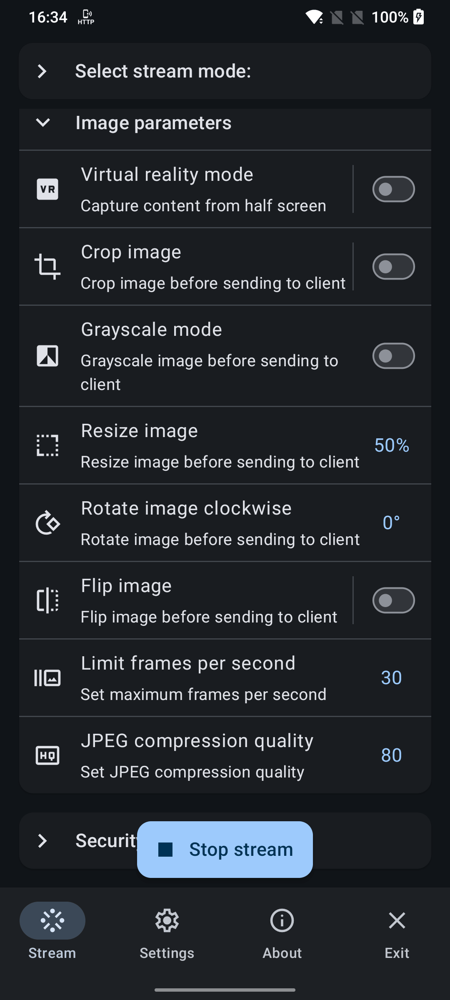&nbsp;
  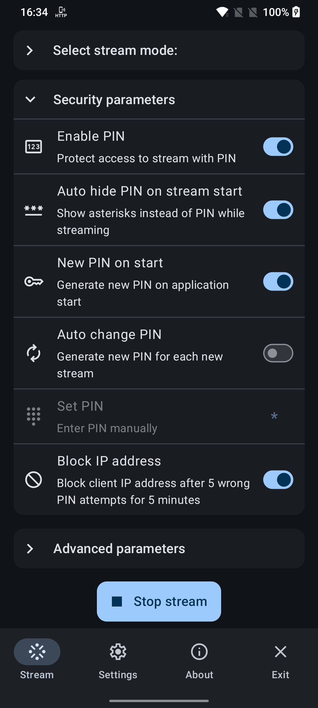
</p>
<p align="center">
  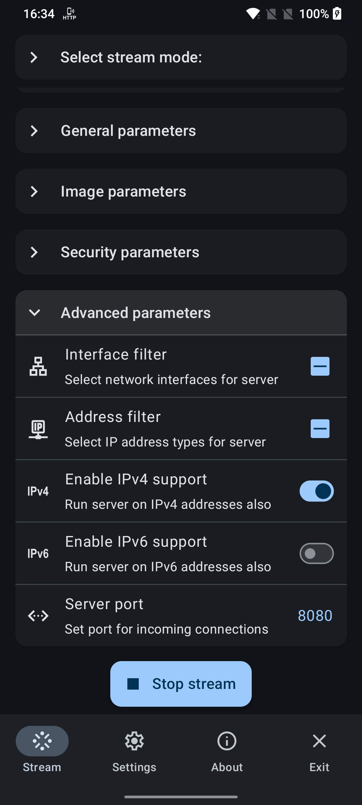
</p>

### Global mode (WebRTC)

Global mode in the ScreenStream application is built on WebRTC technology and relies on an external signaling server to facilitate communication between the streaming host (the app) and the streaming client, which is a web browser equipped with the ScreenStream [Web Client](https://screenstream.io).

Both the signaling server and the web client for ScreenStream are open-source and available in the [ScreenStreamWeb](https://github.com/dkrivoruchko/ScreenStreamWeb) repository. These components are publicly available at [screenstream.io](https://screenstream.io). The system is designed to work with modern desktop and mobile browsers that support WebRTC, including Chrome, Safari, Edge, Firefox, and others.

Global mode offers the following functionality:

- Powered by WebRTC technology.
- End-to-end encrypted communication.
- Stream protection with password.
- Supports video and audio streaming.
- Connect using a unique stream ID and password.
- Requires an internet connection for streaming.
- Each client uses separate internet bandwidth.

> [!NOTE]
> Global mode (WebRTC) is available only in the Google Play version.

**Screenshots**

<p>
  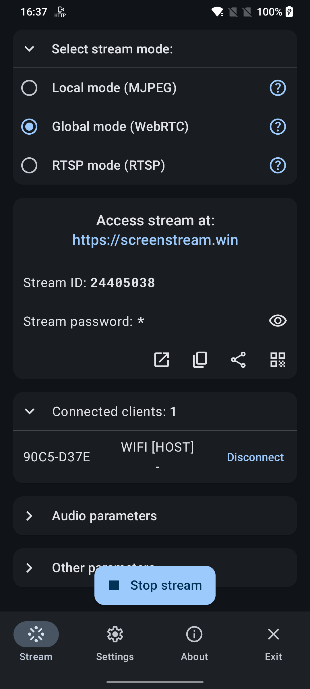&nbsp;
  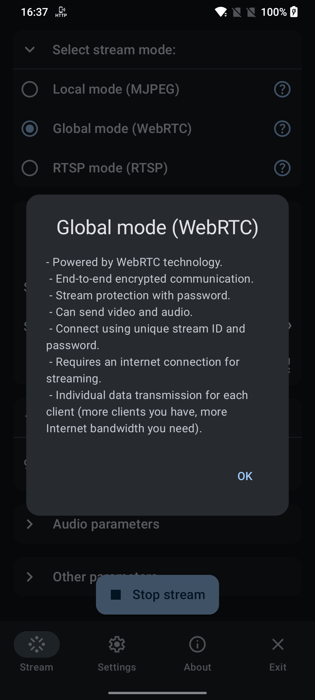&nbsp;
  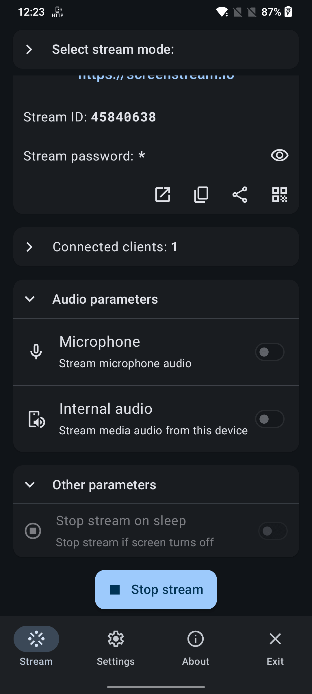
</p>

### RTSP mode

RTSP mode in ScreenStream supports two sub‑modes: server mode (default) hosts this device as an RTSP server, while client mode connects to an external RTSP media server, providing compatibility with a wide range of standard RTSP clients.

For optimal performance, a fast and stable network connection is recommended due to high traffic and low network delay requirements.

- Powered by RTSP protocol.
- Server mode (default) hosts device as an RTSP server.
- Client mode connects to a remote RTSP server (e.g., MediaMTX).
- Supports video and audio with codec configuration.
- Server mode adds protocol, interface/address filters, IPv4/IPv6, and port settings.
- Requires an RTSP client or player for viewing.
- Tested with [VLC media player](https://www.videolan.org/vlc/), [FFplay](https://ffmpeg.org/ffplay.html), [mpv](https://mpv.io/), and [gst-play-1.0](https://gstreamer.freedesktop.org/) (GStreamer) players.

> [!NOTE]
> Client mode requires an RTSP‑capable media server (e.g., [MediaMTX](https://github.com/bluenviron/mediamtx)).

**Screenshots**

<p>
  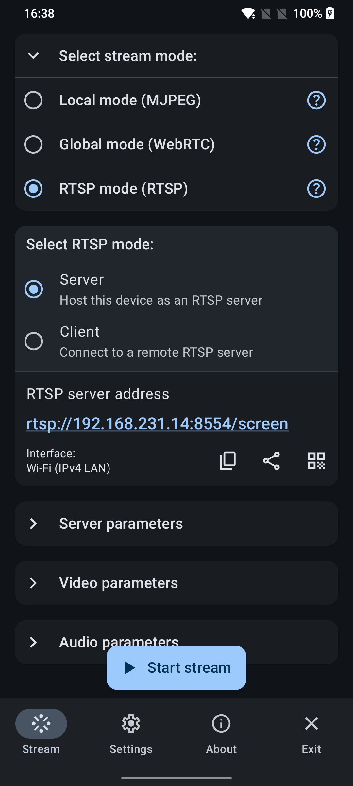&nbsp;
  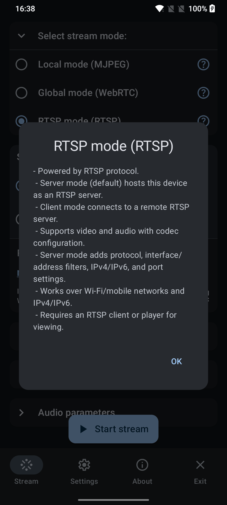&nbsp;
  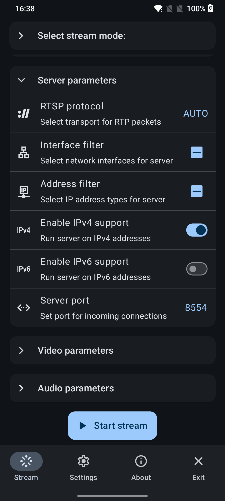
</p>
<p align="center">
  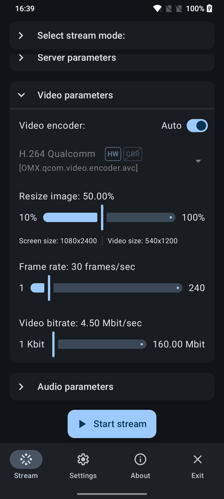&nbsp;
  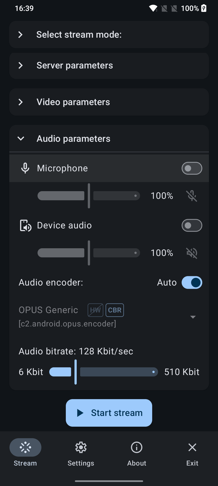
</p>

## Contribution

To contribute a translation, please translate the following five files:

1. [app/src/main/res/values/strings.xml](app/src/main/res/values/strings.xml)
1. [common/src/main/res/values/strings.xml](common/src/main/res/values/strings.xml)
1. [mjpeg/src/main/res/values/strings.xml](mjpeg/src/main/res/values/strings.xml)
1. [webrtc/src/main/res/values/strings.xml](webrtc/src/main/res/values/strings.xml)
1. [rtsp/src/main/res/values/strings.xml](rtsp/src/main/res/values/strings.xml)

Please submit a [pull request](https://docs.github.com/en/pull-requests/collaborating-with-pull-requests/proposing-changes-to-your-work-with-pull-requests/creating-a-pull-request). If that is not possible, you can send the translated files to the developer via e-mail <dkrivoruchko@gmail.com>.

Your contribution helps make the application more accessible. Thank you for your efforts.

## Developer

Developed by [Dmytro Kryvoruchko](mailto:dkrivoruchko@gmail.com). If you have any issues or ideas, feel free to contact me.

## Privacy and Terms

App [Privacy Policy](PrivacyPolicy.md) and [Terms & Conditions](TermsConditions.md)

## License

```
The MIT License (MIT)

Copyright (c) 2016 Dmytro Kryvoruchko

Permission is hereby granted, free of charge, to any person obtaining a copy
of this software and associated documentation files (the "Software"), to deal
in the Software without restriction, including without limitation the rights
to use, copy, modify, merge, publish, distribute, sublicense, and/or sell
copies of the Software, and to permit persons to whom the Software is
furnished to do so, subject to the following conditions:

The above copyright notice and this permission notice shall be included in all
copies or substantial portions of the Software.

THE SOFTWARE IS PROVIDED "AS IS", WITHOUT WARRANTY OF ANY KIND, EXPRESS OR
IMPLIED, INCLUDING BUT NOT LIMITED TO THE WARRANTIES OF MERCHANTABILITY,
FITNESS FOR A PARTICULAR PURPOSE AND NONINFRINGEMENT. IN NO EVENT SHALL THE
AUTHORS OR COPYRIGHT HOLDERS BE LIABLE FOR ANY CLAIM, DAMAGES OR OTHER
LIABILITY, WHETHER IN AN ACTION OF CONTRACT, TORT OR OTHERWISE, ARISING FROM,
OUT OF OR IN CONNECTION WITH THE SOFTWARE OR THE USE OR OTHER DEALINGS IN THE
SOFTWARE.
```
