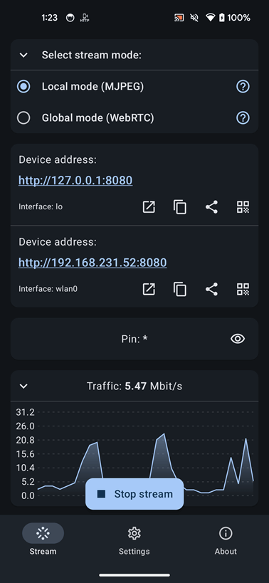

# ScreenStream

ScreenStream is a user-friendly Android application that allows users to easily share their device screen and view it directly in a web browser. No additional software is required other than the ScreenStream itself, a web browser, and an internet connection (for Global mode).

Google Play versions supports both **Global mode (WebRTC)** and **Local mode (MJPEG)** with ads included.<br>
Versions from F-Droid, AAPKS are Ad-free and support only **Local mode (MJPEG)**.

<a href='https://play.google.com/store/apps/details?id=info.dvkr.screenstream'></a> <a href="https://f-droid.org/packages/info.dvkr.screenstream/" target="_blank"></a> <a href="https://aapks.com/apk/screen-stream/"></a>

 * [Stream modes](#stream-modes)
   + [Local mode (MJPEG)](#local-mode-mjpeg)
   + [Global mode (WebRTC)](#global-mode-webrtc)
 * [Screenshots](#screenshots)
 * [Contribution](#contribution)
 * [Developer](#developed-by)
 * [Privacy Policy and Terms & Conditions](#privacy-policy-and-terms--conditions)
 * [License](#license)

## Stream modes

ScreenStream offers two stream modes: **Global mode (WebRTC)** (in [Google Play Store](https://play.google.com/store/apps/details?id=info.dvkr.screenstream) version only) and **Local mode (MJPEG)**. Both modes aim to stream the Android device screen but function differently. They are independent of each other, with unique functionalities, restrictions, and customization options.

In both modes the number of clients is not directly limited, but it's important to keep in mind that each client consumes CPU resources and bandwidth for data transmission.

The application uses Android [MediaProjection](https://developer.android.com/reference/android/media/projection/MediaProjection) feature and requires Android 6.0 or higher.

> [!WARNING]
>
> - **High Traffic on Mobile Networks**: Use caution when streaming via mobile 3G/4G/5G/LTE networks to avoid excessive data usage.
> 
> - **Delay in Streaming**: Expect a delay of at least 0.5-1 second or more in certain conditions: slow device, poor internet or network connection, or when the device is under heavy CPU load due to other applications.
> 
> - **Video Streaming Limitation**: ScreenStream is not designed for streaming video, particularly HD video. While it will function, the stream quality may not meet your expectations.

### Local mode (MJPEG)

Local mode in the ScreenStream application is built on the MJPEG standard and utilizes an embedded HTTP server within the app. As a result, an internet connection is not required; instead, it can function on a local network, such as Wi-Fi, device HotSpot, Network-over-USB, or any other network between the client's web browser and the Android device with the ScreenStream app.

For optimal performance, a fast and stable network connection is recommended due to high traffic and low network delay requirements.

In Local mode, the app processes each frame independently, one-by-one, enabling additional image transformations such as cropping, resizing, rotating, and more before sending the image to the client's web browser. 

The Local mode offers the following functionality:
- Powered by MJPEG standard.
- Utilizes PIN for security (no encryption).
- Sends video as a series of independent images (no audio).
- Works without an internet connection within your local network.
- Embedded HTTP server.
- Works with WiFi and/or mobile networks, supporting IPv4 and IPv6.
- Clients connect via web browser using the app's provided IP address.
- Highly customizable.
- Individual data transmission for each client, with more clients requiring increased internet bandwidth to maintain optimal performance.

> [!NOTE]
>
> - Please be aware that certain cell operators may block incoming connections to your device for security reasons. Consequently, even if your device has an IP address from a cell operator, connecting to the device using this IP address may not be possible.
>
> - Some WiFi networks, particularly public or guest networks, may block connections between its clients for security reasons. In such cases, connecting to the device via WiFi might not be feasible. For instance, a laptop and a phone within such a WiFi network will not be able to connect to each other.

### Global mode (WebRTC)

Global mode in the ScreenStream application is built on WebRTC technology and relies on an external signaling server to facilitate communication between the streaming host (the app) and the streaming client, which is a web browser equipped with the ScreenStream [Web Client](https://screenstream.io).

Both the signaling server and the web client for ScreenStream are open-source and available in the [ScreenStreamWeb](https://github.com/dkrivoruchko/ScreenStreamWeb) repository. These components can be accessed publicly at https://screenstream.io. The system is designed to function seamlessly with any desktop or mobile browser that supports WebRTC, such as Chrome, Safari, EDGE, Firefox, and others.

The Global mode was introduced in app version 4 and offers the following functionality:
- Powered by WebRTC technology.
- End-to-end encrypted communication.
- Stream protection with password.
- Supports both video and audio streaming.
- Connect using unique stream ID and password.
- Requires an internet connection for streaming.
- Individual data transmission for each client, with more clients requiring increased internet bandwidth to maintain optimal performance.

> [!NOTE]
> Global mode (WebRTC) only available in Google Play version

## Screenshots

&nbsp;<br>
&nbsp;<br>
&nbsp;<br>
&nbsp;<br>
&nbsp;<br>
&nbsp;<br>


## Contribution

To contribute with translation, kindly translate the following three files:

1. https://github.com/dkrivoruchko/ScreenStream/blob/master/app/src/main/res/values/strings.xml
1. https://github.com/dkrivoruchko/ScreenStream/blob/master/mjpeg/src/main/res/values/strings.xml
1. https://github.com/dkrivoruchko/ScreenStream/blob/master/webrtc/src/main/res/values/strings.xml

Then, please, [make a pull request](https://help.github.com/en/articles/creating-a-pull-request) or send those translated files to the developer via e-mail <dkrivoruchko@gmail.com> as an attachment.

Your contribution is valuable and will help improve the accessibility of the application. Thank you for your efforts!

## Developed By

Developed by [Dmytro Kryvoruchko](dkrivoruchko@gmail.com). If there are any issues or ideas, feel free to contact me.

## Privacy Policy and Terms & Conditions

App [Privacy Policy](https://github.com/dkrivoruchko/ScreenStream/blob/master/PrivacyPolicy.md) and [Terms & Conditions](https://github.com/dkrivoruchko/ScreenStream/blob/master/TermsConditions.md)

## License

```
The MIT License (MIT)

Copyright (c) 2016 Dmytro Kryvoruchko

Permission is hereby granted, free of charge, to any person obtaining a copy
of this software and associated documentation files (the "Software"), to deal
in the Software without restriction, including without limitation the rights
to use, copy, modify, merge, publish, distribute, sublicense, and/or sell
copies of the Software, and to permit persons to whom the Software is
furnished to do so, subject to the following conditions:

The above copyright notice and this permission notice shall be included in all
copies or substantial portions of the Software.

THE SOFTWARE IS PROVIDED "AS IS", WITHOUT WARRANTY OF ANY KIND, EXPRESS OR
IMPLIED, INCLUDING BUT NOT LIMITED TO THE WARRANTIES OF MERCHANTABILITY,
FITNESS FOR A PARTICULAR PURPOSE AND NONINFRINGEMENT. IN NO EVENT SHALL THE
AUTHORS OR COPYRIGHT HOLDERS BE LIABLE FOR ANY CLAIM, DAMAGES OR OTHER
LIABILITY, WHETHER IN AN ACTION OF CONTRACT, TORT OR OTHERWISE, ARISING FROM,
OUT OF OR IN CONNECTION WITH THE SOFTWARE OR THE USE OR OTHER DEALINGS IN THE
SOFTWARE.
```
