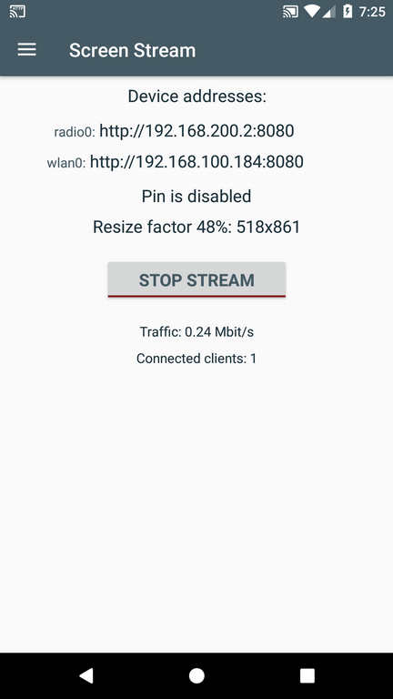
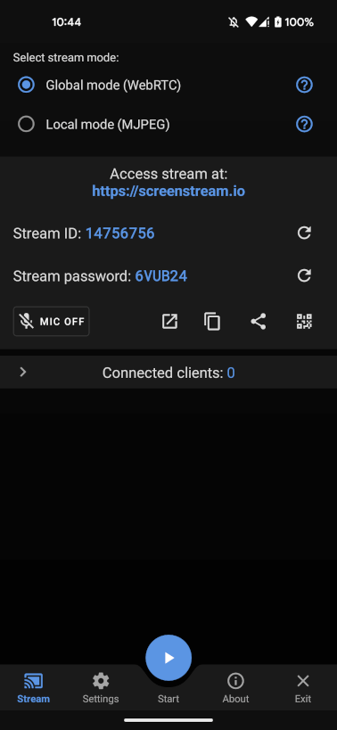
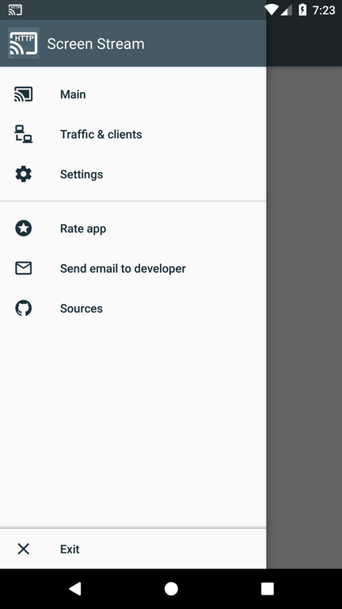
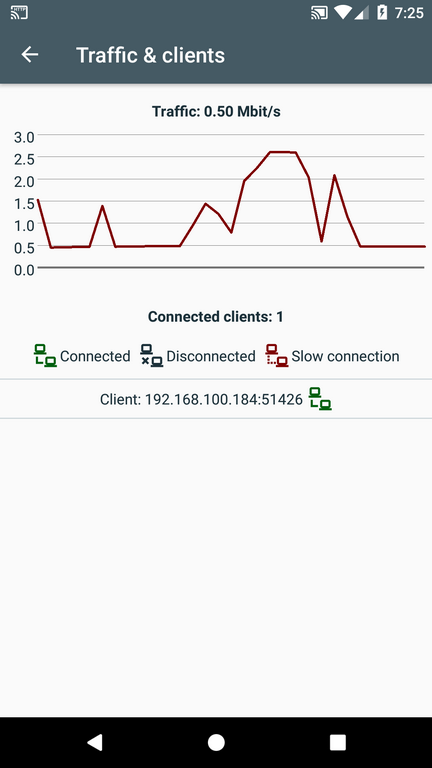
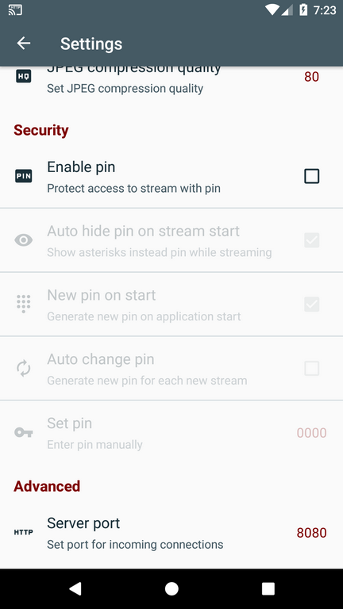
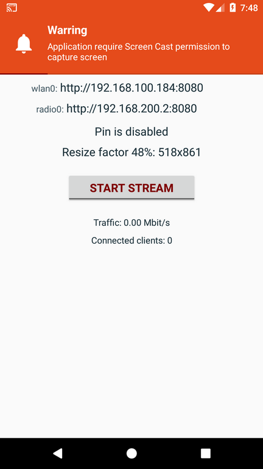
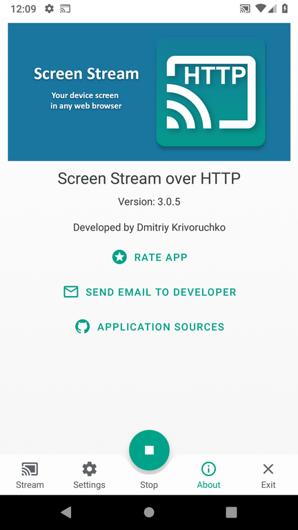
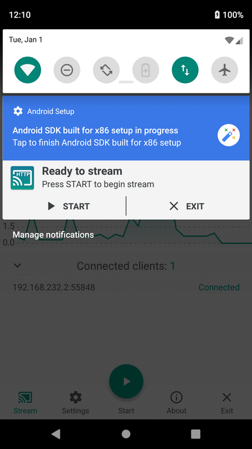
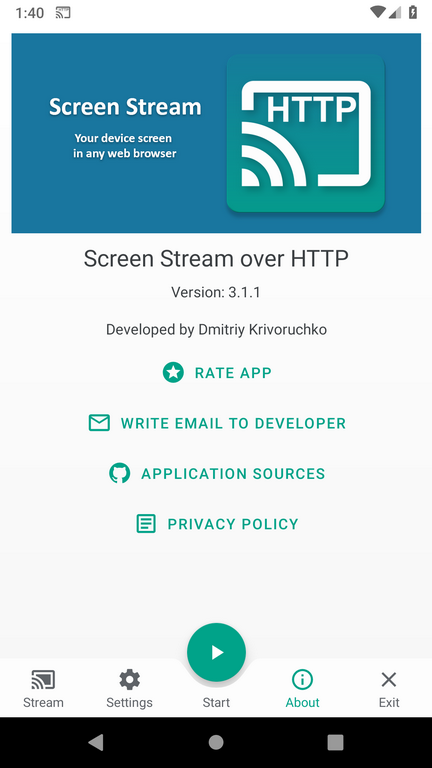
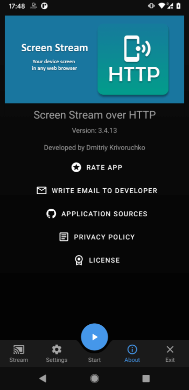

# Screen Stream over HTTP
一個Android行動裝置app用來在任何裝置上，觀看你的螢幕畫面

<a href='https://play.google.com/store/apps/details?id=info.dvkr.screenstream'>
</a>
<a href="https://f-droid.org/packages/info.dvkr.screenstream/" target="_blank">
</a>

這個app讓你可以從任何瀏覽器中觀看裝置的螢幕串流畫面
簡單來說讓你的裝置可以在簡報或是demo時投射出畫面
除了瀏覽器外，你不需要安裝任何額外軟體來使用它
沒有惱人的廣告彈出及干擾

Read this in other languages: [English](README.md)

使用MJPEG編碼並透過網路傳輸傳輸畫面。如此一來在任何支援編碼的瀏覽器上皆可觀看(Chrome, Safari, EDGE, Firefox).

這個app透過WiFi或3G/LTE網路傳輸。<br>
請使用穩定的高速WiFi以達到順暢的收看體驗。
無須連接到外部網際網路。但一個能連接裝置與用戶端的區域網路是最低需求。

無限制收看的用戶端數量，但請注意每個用戶端都會佔用一定量的cpu資源及頻寬

本程式使用Android Cast功能，因此需Android 5.0以上版本以執行。

**警示:** 這不是實時串流app。依裝置性能及網路環境不同，約有0.5至1秒甚至更多的延遲。<br>
**警示:** 這個app不是設計來串流影片的，特別是高畫質影片。如有這些需求請使用Chromecast。<br>
**警示:** 這個app不支援聲音串流，因為MJPEG僅為影像編碼。<br>
**警示:** 某些電信商可能阻擋到您裝置的連入連線，因此即使裝置取得了一個ip位置，也不見得能夠連入。<br>
**警示:** 某些WiFi網路(大部分是公用/免費網路)為了安全性的理由，阻擋連上它的裝置們彼此間的通訊。在這樣的網路環境上不一定能連入。例如在此網路環境中的筆電和手機將無法直接彼此通訊。

### 已知問題

1. 某些裝置上系統會回傳無效的影像格式。這些系統大部份是非正規的Android。很有可能是Android的bug。app將會顯示錯誤訊息。這個無解。
2. 某些裝置上不會顯示通知圖示，但通知區域訊息實際存在。 Android bug: 213309。
3. 瀏覽器MJPEG支援檢查可能有誤。你可以在設定中關閉。

### 畫面截圖

&nbsp;
<br>
&nbsp;
<br>
&nbsp;
<br>
&nbsp;
<br>
&nbsp;
<br>
&nbsp;


## 函式庫

Version 2.x 基於 Clean Architecture, Android Architecture Components (ViewModel) and MVP pattern and uses:
* [Kotlin](https://kotlinlang.org)
* [Kotlin coroutines](https://github.com/Kotlin/kotlinx.coroutines)
* [Android support libraries](https://developer.android.com/topic/libraries/support-library/index.html)
* [Android Architecture Components](https://developer.android.com/topic/libraries/architecture/index.html) (ViewModel)
* [Koin](https://github.com/Ekito/koin)
* [RxJava 1.x](https://github.com/ReactiveX/RxJava/tree/1.x)
* [RxNetty](https://github.com/ReactiveX/RxNetty)
* [MaterialDrawer](https://github.com/mikepenz/MaterialDrawer)
* [Alerter](https://github.com/Tapadoo/Alerter)
* [Binary Preferences](https://github.com/iamironz/binaryprefs)
* [Color Picker](https://github.com/jrummyapps/colorpicker)
* [GraphView](https://github.com/appsthatmatter/GraphView)
* [Crashlytics](https://try.crashlytics.com/)
* [LeakCanary](https://github.com/square/leakcanary)


## 開發者

Dmitriy Krivoruchko - <dkrivoruchko@gmail.com>

如果有任何問題或點子歡迎來信談談。

## 授權

```
The MIT License (MIT)

Copyright (c) 2016 Dmitriy Krivoruchko

Permission is hereby granted, free of charge, to any person obtaining a copy
of this software and associated documentation files (the "Software"), to deal
in the Software without restriction, including without limitation the rights
to use, copy, modify, merge, publish, distribute, sublicense, and/or sell
copies of the Software, and to permit persons to whom the Software is
furnished to do so, subject to the following conditions:

The above copyright notice and this permission notice shall be included in all
copies or substantial portions of the Software.

THE SOFTWARE IS PROVIDED "AS IS", WITHOUT WARRANTY OF ANY KIND, EXPRESS OR
IMPLIED, INCLUDING BUT NOT LIMITED TO THE WARRANTIES OF MERCHANTABILITY,
FITNESS FOR A PARTICULAR PURPOSE AND NONINFRINGEMENT. IN NO EVENT SHALL THE
AUTHORS OR COPYRIGHT HOLDERS BE LIABLE FOR ANY CLAIM, DAMAGES OR OTHER
LIABILITY, WHETHER IN AN ACTION OF CONTRACT, TORT OR OTHERWISE, ARISING FROM,
OUT OF OR IN CONNECTION WITH THE SOFTWARE OR THE USE OR OTHER DEALINGS IN THE
SOFTWARE.
```
