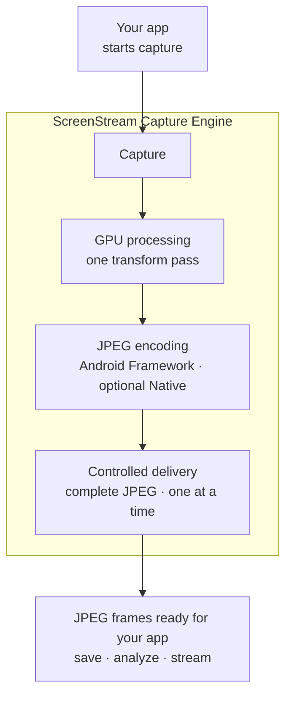

# ScreenStream Capture Engine

## Overview

ScreenStream Capture Engine is an embeddable Kotlin Android library that produces JPEG frames from a user-approved [`MediaProjection`](https://developer.android.com/reference/android/media/projection/MediaProjection). Choose image settings and receive complete frames to save, analyze, or transport.

### Capture Control

- **Receive complete, self-describing JPEG frames.** Each delivered image includes its final dimensions and the exact output details used to produce it.
- **Change output without restarting capture.** Adjust the captured region, crop, image size, rotation, mirroring, color, frame rate, repeat interval, and JPEG quality while the session is running.
- **Choose the capture measurements.** Use dimensions and density from the current default display, a fixed display, or measurements supplied by your app.

### Performance and Memory Efficiency

- **Avoid unnecessary CPU and GPU work.** The engine keeps only the newest screen image waiting for processing and applies frame-rate limits before GPU pixel readback and JPEG encoding.
- **Process each fresh output in one GPU pass.** One OpenGL ES draw applies crop, rotation, mirroring, output sizing, and color or grayscale processing, then reads only the final-size pixels needed by the JPEG encoder.
- **Capture fewer pixels when possible.** On [API 32+](https://developer.android.com/media/grow/media-projection#surface), a compatible full-source downscale can feed fewer pixels into the graphics path; see the [one final-size processing path](docs/architecture.md#one-final-size-processing-path).
- **Reuse compatible resources.** Capture targets, GPU resources, and encoding storage are reused across frames and setting changes when their size and format remain compatible, reducing repeated setup and allocation.
- **Keep callback delivery bounded.** Each session runs or schedules at most one frame callback for its current consumer at a time; if the app is still handling it, later delivery opportunities are counted as drops instead of building a memory-consuming queue.
- **Copy JPEG bytes only when requested.** Receiving a frame does not allocate an app-owned JPEG copy. `copyTo()` writes into app-provided storage, while `toByteArray()` creates an independent contiguous copy.
- **Reuse encoded JPEGs for repeat output.** When repeats are enabled, the engine can deliver the latest JPEG again without another capture, GPU readback, encode, or engine-side JPEG-byte copy.

### Built for Integration

- **Use a focused session API.** One `ScreenCaptureSession` represents one capture run and accepts live setting changes without requiring another session.
- **Observe capture as it runs.** Read-only Kotlin Flows report lifecycle state, cumulative frame statistics, and best-effort troubleshooting events.



See [Usage](docs/usage.md) for integration and [Architecture](docs/architecture.md) for pipeline design and responsibility boundaries.

## Requirements

- The supported public API is Kotlin 2.4 and later.
- The library supports Android API 24 and later. Consuming projects must use `compileSdk` 37 or later.
- Complete the [Android host prerequisites](docs/usage.md#android-host-prerequisites) before starting capture.

## Quick start

Create a session with a fresh `MediaProjection`, register a frame consumer (the function called for each delivered JPEG), then start capture. A successful factory call transfers projection ownership to the session. The lifecycle owner must call `stop()` when done, even if `start()` never runs. See [startup and ownership](docs/usage.md#start-a-capture-run).

```kotlin
val session = ScreenCaptureEngine.createSession(context, mediaProjection)

session.registerFrameConsumer { frame: EncodedImageFrame ->
    // frame contains one complete JPEG and its output details.
    // Read or copy it only inside this callback.
}

session.start()

// When capture is no longer needed:
session.stop()
```

### Work with JPEG frames

Each callback receives an `EncodedImageFrame`, an object containing one complete JPEG plus read-only output and timing details. The object is borrowed: read or copy it only inside that callback and on the same thread. If your app needs the JPEG bytes after the callback returns, copy them inside the callback with `copyTo()` or `toByteArray()`.

See [Detailed frame handling](docs/usage.md#work-with-jpeg-frames) for metadata, lifetime rules, and both copy strategies.

## Capture parameters

Pass parameters at start or update them while the session is running.

| Parameter | Default | Purpose |
| --- | --- | --- |
| `sourceRegion` | `SourceRegion.Full` | Selects the source area to capture. |
| `crop` | `CropInsetsPx.ZERO` | Removes edges from the selected content. |
| `rotation` | `Rotation.Degrees0` | Rotates the image clockwise. |
| `mirror` | `Mirror.None` | Reflects the image after rotation. |
| `outputSize` | `OutputSize.ScaleFactor(0.5)` | Sets the final JPEG dimensions. |
| `colorMode` | `ColorMode.Color` | Selects color or grayscale output. |
| `frameRate` | `FrameRate.Auto` | Controls how often new JPEGs may be produced. |
| `frameRepeatInterval` | `null` | Optionally redelivers the latest JPEG after an interval with no output. |
| `jpegQuality` | `80` | Sets the JPEG encoder quality hint. |

See [Capture parameters and live updates](docs/usage.md#choose-and-update-capture-parameters) for choices, processing order, and applied-output details.

## Session configuration

Session configuration is fixed at creation; capture parameters can change while running.

| Option | Default | Purpose |
| --- | --- | --- |
| `captureMetricsSource` | `null` | Chooses where capture dimensions and density come from. |
| `jpegBackendPolicy` | `JpegBackendPolicy.Auto` | Controls whether the optional native JPEG encoder may be used. |

See [Session configuration](docs/usage.md#configure-session-wide-behavior) for display-source choices and JPEG backend policy.

## Monitor capture

A session exposes three read-only Kotlin Flows:

| Signal | Use it for |
| --- | --- |
| `session.state` | Shows current capture status and any requested or applied output details available in that state. Use it for app decisions. |
| `session.stats` | Accumulates frame counts, processing time, JPEG size, and frame-production or delivery-drop counts. |
| `session.diagnosticEvents` | Best-effort context for app logs, support reports, and troubleshooting. |

The Flows update independently; their latest values do not form a synchronized snapshot. See [Monitoring](docs/usage.md#monitor-capture) for fields and collection rules.

## Behavior and responsibilities

### What the engine provides

- Every delivered frame is one complete, opaque, top-down JPEG together with its exact output settings and dimensions. Color uses a nominal SDR/sRGB interpretation; see [color assumptions and limits](docs/usage.md#color-assumptions-and-limits).
- Out-of-range parameter values are rejected. Requests that cannot produce valid output are reported through startup failure or session state rather than silently changed.

### What your app owns

- Complete the Android host requirements, then use a fresh `MediaProjection` and a new `ScreenCaptureSession` for each capture run.
- Use an `EncodedImageFrame` only inside its callback. Copy its bytes before returning if your app must retain them or send them to another thread.
- Source selection and crop choose the intended image area. Your app decides who may access delivered JPEGs and how they are transported, stored, retained, and deleted.

### Practical limits

- Capture, frame pacing, and repeat delivery are best effort rather than realtime guarantees. Explicit frame-rate controls set limits or sampling policies, not promised delivery rates.
- A callback admitted before a settings change can still deliver its original output. A callback already running may outlive `stop()`. Await the registration's `unregister()` successfully before releasing resources used only by that callback; this wait remains available after the session ends.
