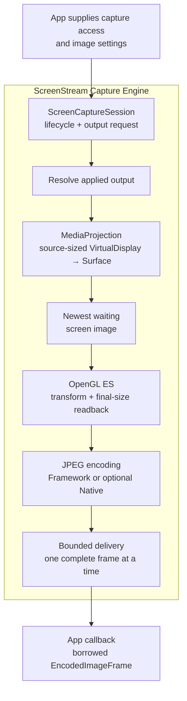
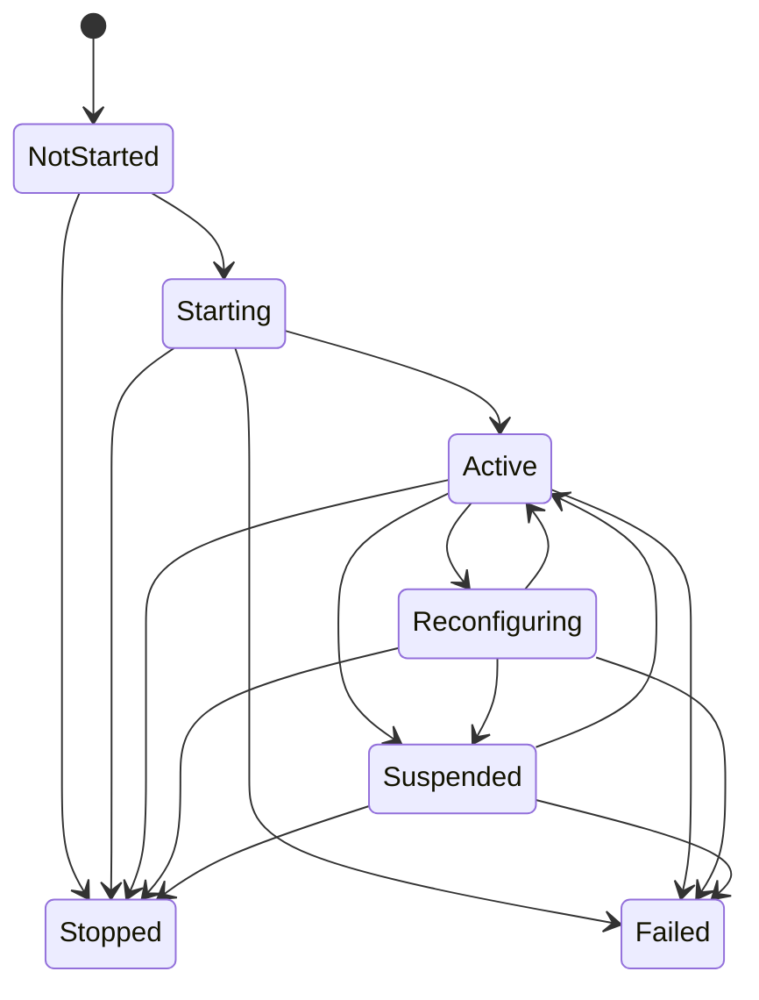

[README](../README.md) · [Usage](usage.md) · Architecture

# Architecture

This document explains the pipeline and responsibility boundaries of one capture run. See [Usage](usage.md) for integration and frame handling.

## Contents

- [Capture run model](#capture-run-model)
  - [Host and engine boundaries](#host-and-engine-boundaries)
  - [One session, one run](#one-session-one-run)
- [Android capture and JPEG pipeline](#android-capture-and-jpeg-pipeline)
  - [From MediaProjection to complete JPEG](#from-mediaprojection-to-complete-jpeg)
  - [Capture size and density](#capture-size-and-density)
  - [JPEG backend seam](#jpeg-backend-seam)
- [Session lifecycle](#session-lifecycle)
  - [Public phases](#public-phases)
  - [Recoverable pauses and final outcomes](#recoverable-pauses-and-final-outcomes)
  - [Run outcome and resource release](#run-outcome-and-resource-release)
- [Requested and applied output](#requested-and-applied-output)
  - [Why output is resolved](#why-output-is-resolved)
  - [How changes reach delivered frames](#how-changes-reach-delivered-frames)
- [Frame ownership and bounded delivery](#frame-ownership-and-bounded-delivery)
  - [Borrowed frames and app-owned bytes](#borrowed-frames-and-app-owned-bytes)
  - [Backpressure and reusable JPEGs](#backpressure-and-reusable-jpegs)
- [Observation model](#observation-model)
  - [Three signals, three roles](#three-signals-three-roles)
  - [Independent timelines](#independent-timelines)
- [Performance and memory design](#performance-and-memory-design)
  - [Avoid expensive work early](#avoid-expensive-work-early)
  - [One final-size processing path](#one-final-size-processing-path)
  - [Reuse resources and encoded data](#reuse-resources-and-encoded-data)

## Capture run model

### Host and engine boundaries

The host obtains user consent and a [`MediaProjection`](https://developer.android.com/media/grow/media-projection) for the selected display or app window. It maintains the required [`mediaProjection` foreground-service context](https://developer.android.com/develop/background-work/services/fgs/service-types#media-projection) while capture can run.

The host controls access, transport, storage, retention, and deletion of copied JPEGs.

The app requests image settings, and the engine combines them with the captured width, height, and density. The resulting `applied output` is the exact settings and resolved geometry used for a usable JPEG path. The engine owns the capture objects attached to the run, manages graphics and JPEG resources, and delivers complete frames.

### One session, one run

A `ScreenCaptureSession` owns one capture run: live settings, frame delivery, observations, and the final outcome.

Each run uses a fresh session and a fresh `MediaProjection`, matching Android's [one-use projection consent model](https://developer.android.com/media/grow/media-projection#user-consent). A successful synchronous `createSession()` transfers projection ownership to the session; a thrown factory call leaves it with the host. `start()` then starts capture without another ownership handoff. The lifecycle owner must stop every created session even if it never starts; see [startup ownership](usage.md#start-a-capture-run).

JPEG payloads are immutable and engine-owned. Read the borrowed `EncodedImageFrame` only inside its receiving callback and on that callback thread. Metadata needs no byte copy; `copyTo()` fills caller-owned storage and `toByteArray()` creates an app-owned array. Copy bytes during the callback to retain them afterward.

## Android capture and JPEG pipeline

### From MediaProjection to complete JPEG

Android projects the selected display or app-window content by calling [`MediaProjection.createVirtualDisplay()`](https://developer.android.com/reference/kotlin/android/media/projection/MediaProjection#createvirtualdisplay). The engine creates that virtual display at the current source dimensions and directs it to an engine-provided [`Surface`](https://developer.android.com/reference/kotlin/android/view/Surface). That `Surface` is backed by a [`SurfaceTexture`](https://developer.android.com/reference/kotlin/android/graphics/SurfaceTexture), which exposes captured images as an OpenGL ES texture.

The engine keeps the newest waiting image, combines spatial transforms and color-mode processing in one [OpenGL ES draw](https://developer.android.com/reference/kotlin/android/opengl/GLES20#gldrawarrays), and [reads back pixels](https://developer.android.com/reference/kotlin/android/opengl/GLES20#glreadpixels) at the final JPEG dimensions. A JPEG backend commits those pixels into a complete immutable payload. The session separately checks whether that result still belongs to current output before committing its public frame identity and offering bounded callback delivery. A completed encode can therefore be counted and discarded as stale without becoming produced output.

### Capture size and density

`CaptureMetricsSource` supplies the width, height, and density used for capture geometry. It can follow the current display or another host-selected source; the user-approved `MediaProjection` supplies the screen content.

On API 24–33, the selected metrics source supplies all three geometry values. On API 34+, those initial dimensions support provisional capture setup. Geometry-dependent output validation, preparation, and publication wait for Android's first valid authoritative [`onCapturedContentResize()`](https://developer.android.com/reference/android/media/projection/MediaProjection.Callback#onCapturedContentResize(int,%20int)) width and height, while the selected source continues to supply density. A request need not fit the provisional dimensions; necessary capture setup can still fail.

When dimensions or density change, the session resolves new output before fresh JPEG production continues.

### JPEG backend seam

The Framework path uses [`Bitmap.compress()`](https://developer.android.com/reference/kotlin/android/graphics/Bitmap#compress) with `Bitmap.CompressFormat.JPEG`. The optional Native path uses NDK [`AndroidBitmap_compress()`](https://developer.android.com/ndk/reference/group/bitmap#androidbitmap_compress), available from API 30. `JpegBackendPolicy.Auto` selects Native only after its library load and capability checks succeed. [Expected library unavailability](../internal/components/encoding.md#backend-selection-and-fallback) or an unsupported compressor selects Framework. Unexpected Native failures follow normal containment or propagation rules rather than selecting fallback. If Native later rejects compression in the one form the engine can handle safely, that attempt produces no JPEG and is not retried with Framework; later frames use Framework. `JpegBackendPolicy.FrameworkOnly` uses Framework exclusively.

Both backends preserve public frame, geometry, ownership, delivery, observation, and problem contracts, but do not promise identical JPEG bytes. Output uses the [nominal SDR/sRGB color assumptions and limits](usage.md#color-assumptions-and-limits); neither backend selection nor successful encoding proves faithful conversion of arbitrary source color spaces.

## Session lifecycle

### Public phases

`NotStarted` is the initial state. `Starting` covers creation of the first usable capture path. `Active` means the session has applied output that can produce JPEGs. Setting or geometry changes can enter `Reconfiguring`; a recoverable problem can enter `Suspended`. `Stopped` and `Failed` are permanent outcomes.

The diagram uses public state names and representative transitions:

Lifecycle state describes the run; frames describe individual JPEG outputs. `Active` establishes usable output, while a delivered frame establishes one produced JPEG.

### Recoverable pauses and final outcomes

`Reconfiguring` is a planned pause while the engine prepares output for changed settings or geometry. `Suspended` represents a recoverable problem after the session has become active. A changed parameter request or restored or changed capture geometry can trigger another attempt. The session returns to `Active` only after it prepares usable output.

`Stopped` and `Failed` finish the session permanently. `Stopped` describes a normal app-requested end or Android ending the projection. Android reports that platform event through [`MediaProjection.Callback.onStop()`](https://developer.android.com/reference/kotlin/android/media/projection/MediaProjection.Callback#onstop), and the session exposes it as a stable stop reason. `Failed` carries the stable problem category when the engine cannot continue. Apps can respond to these outcomes independently of platform exception text or diagnostic messages.

### Run outcome and resource release

As the run ends, the session closes new capture and delivery work and manages release of its projection, virtual display, surface, graphics, and encoding resources. `state`, `stats`, and `diagnosticEvents` remain available for the lifetime of the session object.

`Stopped` or `Failed` gives the final public outcome of the capture run. A frame callback that has already begun may still return afterward, and Android and graphics resources may finish releasing in the background. `stop()` is nonwaiting; a new session may start after it returns. Registration `unregister()` remains a cancellable wait for callback completion even after the session ends, so the host can separately protect resources used by an old callback. It does not wait for all engine resources. See [shutdown and successive runs](usage.md#stop-capture).

## Requested and applied output

### Why output is resolved

`ScreenCaptureParameters` describes the output requested by the app. The engine must combine that request with the actual capture width, height, and density before it knows the exact source area and final JPEG size. The resulting `ScreenCaptureEffectiveParameters` is the public description of that applied output.

A request can resolve to different concrete geometry after rotation, display changes, or app-window selection. A request that cannot currently produce output becomes a clear lifecycle problem while retaining its requested value.

### How changes reach delivered frames

`updateParameters()` records the newest request without waiting for reconfiguration or frame production. `ScreenCaptureState.Active.effectiveParameters` describes the applied session output, while `EncodedImageFrame.effectiveParameters` describes the exact output for one JPEG. The session resolves a live change against current capture geometry and reuses compatible resources or prepares replacements. `Reconfiguring` makes any required pause visible until new output is ready.

Work that has already started keeps its original applied description. Before the session commits fresh output, it discards results made obsolete by a newer request or adopted geometry. Resize notification stages new geometry; the session adopts it atomically with pausing output and invalidating the old configuration. Correctly described old-plan output may commit before that adoption, but cannot newly commit afterward. The [runtime adoption boundary](../internal/architecture/runtime.md#reconfiguration-and-recovery) defines this transition.

A frame already admitted for a callback may still arrive after `updateParameters()` returns or reconfiguration begins. That bounded handoff retains its exact original descriptor; it is never relabeled with newer settings. Updating parameters therefore does not establish a barrier after which every callback contains the newest requested output.

## Frame ownership and bounded delivery

### Borrowed frames and app-owned bytes

The encoder finishes a complete immutable JPEG payload before delivery. Session output commit associates payload bytes with effective output, a sequence, and an elapsed-realtime commit timestamp. Repeats create new output identities over existing bytes; cached delivery to a new consumer retains the original identity. These timestamps describe output commit, not source capture or callback entry. `EncodedImageFrame` is the temporary public view during one callback.

The frame is borrowed: its properties and byte-copy operations are available only inside the callback that receives it and on that callback's thread. The callback boundary defines when borrowed app access ends; the lifetime of engine storage remains behind that boundary. Bytes copied during the callback are app-owned and can outlive it, as can immutable metadata values read during the callback. The borrowed frame itself cannot.

Callbacks for one consumer are serialized on engine-provided worker execution rather than the caller or UI thread. The engine does not promise the same physical thread for later callbacks. UI or other longer-lived work therefore receives app-owned bytes copied before the callback returns, not the borrowed frame.

The app chooses how many copied JPEGs to retain, when to release them, and how they enter storage or transport.

### Backpressure and reusable JPEGs

A newer source image replaces the older waiting image. For the current consumer, the session keeps at most one callback running or waiting to begin. A later opportunity while that callback is busy becomes an observable delivery drop instead of backlog.

The latest complete immutable JPEG can be reused for later delivery or configured repeats without another capture, readback, or encode.

## Observation model

### Three signals, three roles

Lifecycle, cumulative measurements, and troubleshooting use separate read-only signals:

| Signal | Why it is separate |
| --- | --- |
| `session.state` | Describes the current lifecycle phase, applied output, recoverable pause, or final run outcome. It is the signal for app behavior. |
| `session.stats` | Accumulates frame, drop, processing-time, and JPEG-size measurements across the run without turning each measurement into a lifecycle change. |
| `session.diagnosticEvents` | Adds optional context about individual notable events for logs and support reports while lifecycle meaning remains in `state`. |

The running states can also carry Android's latest captured-content visibility observation when the platform supplies one through [`onCapturedContentVisibilityChanged()`](https://developer.android.com/reference/kotlin/android/media/projection/MediaProjection.Callback#oncapturedcontentvisibilitychanged). Visibility is informational context alongside the applied output and any session problem.

### Independent timelines

`state` and `stats` each retain an internally consistent latest value. `diagnosticEvents` publishes best-effort events to observers present when they occur. Statistics and diagnostics can update at a different pace from lifecycle. This separation assumes [nonblocking collection](usage.md#monitor-capture); collector execution may be inline and must not synchronously reenter session work that awaits publication.

Latest values do not form a synchronized snapshot: state can be newer than statistics, and diagnostic context can be absent.

## Performance and memory design

### Avoid expensive work early

The pipeline removes obsolete opportunities before expensive stages. While production is busy, the newest source image replaces the older waiting one. Frame-rate policy is evaluated before GPU readback and JPEG encoding, concentrating CPU and GPU work on images still eligible for output.

Only one fresh image proceeds through readback and encoding at a time. Parameter and geometry changes can discard an obsolete result before Session output commit. Already-admitted callback delivery remains bounded and keeps its original descriptor.

### One final-size processing path

One OpenGL ES draw combines source selection, crop, rotation, mirroring, output sizing, and color-mode processing. Rendering at final output dimensions means JPEG encoding reads only those pixels, avoiding full-size intermediate images for individual transforms.

On API 32+, Android can [scale captured content into the supplied surface while preserving its aspect ratio](https://developer.android.com/media/grow/media-projection#surface). For a compatible full-source, same-aspect downscale, the engine uses that platform behavior and supplies smaller buffer dimensions through [`SurfaceTexture.setDefaultBufferSize()`](https://developer.android.com/reference/kotlin/android/graphics/SurfaceTexture#setdefaultbuffersize). The `VirtualDisplay` remains source-sized. This reduces the number of pixels entering the graphics path while preserving the source geometry in the output description.

### Reuse resources and encoded data

Compatible capture targets, graphics objects, pixel buffers, and JPEG resources remain reusable across frames and live changes, avoiding repeated setup and allocation.

JPEG output is retained as an immutable encoded payload that can be published and reused directly. `copyTo()` can fill an app-provided destination, while `toByteArray()` creates a contiguous app-owned array only when requested. Repeats reuse the latest payload, avoiding capture, GPU readback, JPEG encoding, and an engine-side payload copy.
