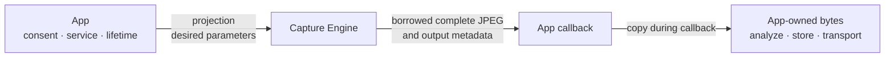
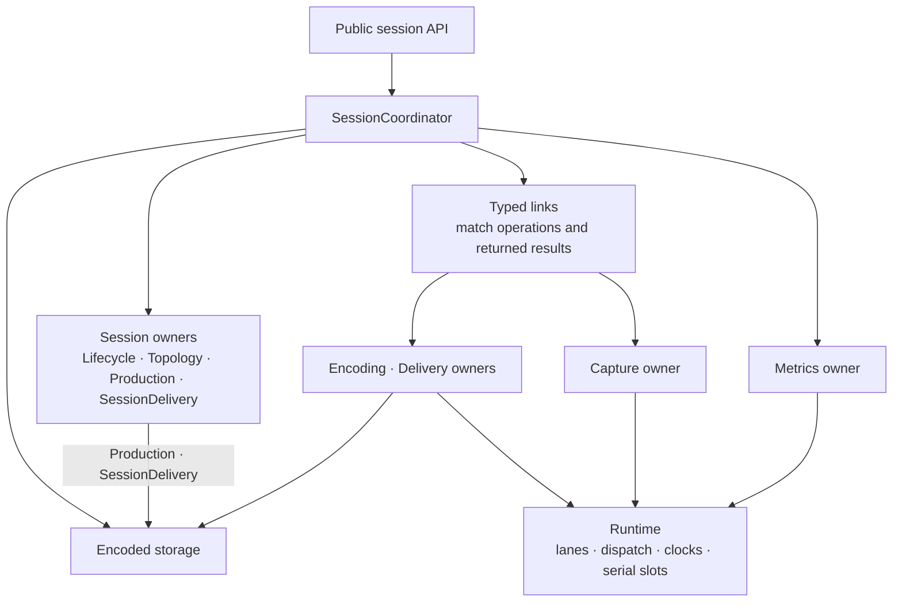
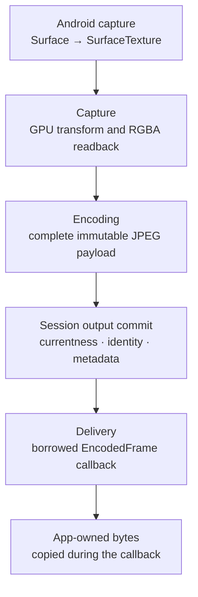
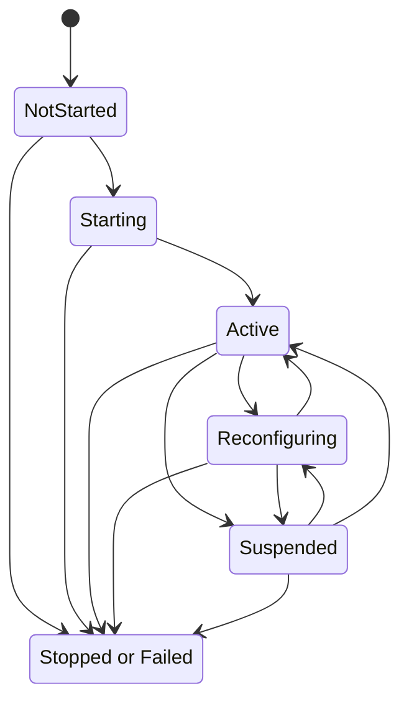

[Usage](usage.md) · Architecture

# Architecture

Screen Capture Engine owns the path from an Android `MediaProjection` to complete JPEG frames delivered to an application. It resolves image settings against changing capture geometry, coordinates GPU processing and JPEG encoding, and bounds production and delivery work. Resource owners support preparation, reuse, reconfiguration, and cleanup throughout the run.

The central design separates two questions: **is this work still useful to the current run?** and **has the component using its resources actually finished?** A new request can make an image obsolete immediately, but it cannot make an Android call, codec operation, or application callback return. This distinction shapes configuration, frame delivery, and shutdown.

This guide explains how those pieces work together. [Usage](usage.md) covers integration and the complete caller contract; the [internal guide](../internal/README.md) extends the architecture with detailed algorithms, failure handling, ABI rules, and verification methods.

## Contents

- [Capture run model](#capture-run-model)
- [Component and ownership model](#component-and-ownership-model)
- [Execution and coordination](#execution-and-coordination)
- [Requested and applied output](#requested-and-applied-output)
- [Android capture and JPEG pipeline](#android-capture-and-jpeg-pipeline)
- [Frame ownership and bounded delivery](#frame-ownership-and-bounded-delivery)
- [Session lifecycle](#session-lifecycle)
- [Observation model](#observation-model)
- [Performance and memory design](#performance-and-memory-design)

## Capture run model

### Host and engine boundaries

The application obtains Android capture authority and a [`MediaProjection`](https://developer.android.com/media/grow/media-projection) for the selected display or, where supported, app window. It maintains the required [`mediaProjection` foreground-service context](https://developer.android.com/develop/background-work/services/fgs/service-types#media-projection) and decides when capture should run. Transport, analysis, storage, access control, retention, and deletion of copied JPEGs belong to the application.

The engine owns capture, image processing, JPEG encoding, and delivery. The application supplies desired `ScreenCaptureParameters`; the engine combines them with capture dimensions and density to resolve an applied `CaptureOutputInfo`. That immutable description identifies the settings and geometry used for output. A change can require preparation before it becomes usable, so the newest request and the currently applied configuration are deliberately separate.

### One session, one run

A `ScreenCaptureSession` owns one capture run. Each run uses a new session and host-provided projection authority. The host follows Android’s [consent requirements](https://developer.android.com/media/grow/media-projection#user_consent); the engine does not interpret consent or the projection’s origin. A successful `createSession()` transfers projection ownership to the session; a throwing factory leaves it with the application. `start()` starts preparation of the already-owned projection. The application stops every created session, including one that never starts; see [run a capture session](usage.md#run-a-capture-session).

During a run, Android makes captured images available, the engine selects one for processing, and a GPU draw produces RGBA (red, green, blue, and alpha) pixels at the requested JPEG dimensions. Readback copies those pixels from the GPU into a CPU-accessible buffer, and Encoding turns them into a complete immutable payload. The session checks whether the result is still current before assigning output identity and offering it to the consumer.

The callback receives a borrowed `EncodedFrame`, not ownership of the engine's JPEG storage. It may retain immutable metadata values and bytes copied during the callback. Frame access itself is restricted to that callback and its thread. This permits encoded storage to be reused safely for later cached-first delivery without imposing an application retention policy.

## Component and ownership model

The engine separates **session decisions** from **resource ownership**. Session decisions describe the newest request, usable output, production timing, and final outcome. Resource owners know which Android objects, buffers, subscriptions, or callbacks remain in use and what must happen before they can be released.

[`SessionCoordinator`](../src/main/kotlin/io/screenstream/capture/internal/session/SessionCoordinator.kt) joins these responsibilities. It matches requests with their results and coordinates changes across owners. It neither combines all their state into one object nor takes over their resource cleanup.

Four session owners divide the decisions:

- [`SessionLifecycle`](../src/main/kotlin/io/screenstream/capture/internal/session/lifecycle/SessionLifecycle.kt) decides whether start and production are allowed, whether first `Active` is still eligible, and which terminal outcome wins.
- [`SessionTopology`](../src/main/kotlin/io/screenstream/capture/internal/session/topology/SessionTopology.kt) combines the newest request, a revision identifying which request work belongs to, capture geometry, and resource readiness into an applied plan. It also retains the last applied output description.
- [`SessionProduction`](../src/main/kotlin/io/screenstream/capture/internal/session/production/SessionProduction.kt) manages fresh capture and output pacing, the latest reusable frame, production identity, and statistics accumulation.
- [`SessionDelivery`](../src/main/kotlin/io/screenstream/capture/internal/session/delivery/SessionDelivery.kt) tracks consumer registration, frame handoff, and when a registration can finish unregistering.

Four physical owners manage work and its resources:

- [`SessionMetricsOwner`](../src/main/kotlin/io/screenstream/capture/internal/metrics/SessionMetricsOwner.kt) attaches the metrics subscription and owns its close attempt.
- [`SessionCaptureOwner`](../src/main/kotlin/io/screenstream/capture/internal/capture/SessionCaptureOwner.kt) owns the projection, virtual display, target surface, graphics resources, and readback. EGL manages the graphics context and surfaces; OpenGL ES (GLES) performs the GPU work.
- [`EncodingOwner`](../src/main/kotlin/io/screenstream/capture/internal/encoding/EncodingOwner.kt) owns the RGBA buffer, its temporary loan to Capture, backend state, and tentative encoded bytes.
- [`DeliveryOwner`](../src/main/kotlin/io/screenstream/capture/internal/delivery/DeliveryOwner.kt) owns callback scheduling and entry, the temporary frame borrow, and callback return.

The following diagram shows coordination relationships, not physical threads or a frame's route:

Runtime mechanisms schedule and serialize work without deciding session policy. Storage types hold immutable payloads and frame identity without deciding which output is current. These boundaries allow a late operation to finish its own cleanup even after the session has stopped accepting useful work.

## Execution and coordination

### Lanes and queue-less work

The Control `Handler` lane drives reconciliation and frame production. Public calls and owner callbacks also update coordinated state under the session gates (locks protecting shared session decisions); Control is not the only thread that can change session decisions.

The Capture `Handler` lane serializes projection, target, EGL, GLES, and readback work. It provides the thread-affine access that graphics resources require. Metrics, Encoding, and Delivery each use a [`SerialTaskSlot`](../src/main/kotlin/io/screenstream/capture/internal/runtime/SerialTaskSlot.kt) over shared non-inline worker execution. Each slot permits one accepted or entered operation. A slot is neither a dedicated thread nor a queue of work waiting behind a busy owner.

Scheduling, producing a result, and becoming available for another operation are different boundaries:

1. **Accepted:** the dispatcher takes responsibility for an outer task.
2. **Entered:** the task begins owner work after acceptance has been established.
3. **Result recorded:** the operation records its local result or callback outcome. Its task body may still be running.
4. **Slot released:** the outer task body returns normally and the slot removes that exact attempt.

Reporting to Coordinator depends on the owner: Encoding reports after slot release, while Delivery can report callback failure before release and physical closure afterward.

Once acceptance is established, entry and release can occur before the submitting call returns. Definite rejection proves non-entry; acceptance does not promise eventual entry or return. A task that throws without containing the failure does not release its serial slot, even though its outer invocation has ended. A nonreturning task likewise keeps the slot occupied. The engine cannot manufacture a safe successor merely because a result appeared or shutdown began.

### Gates, currentness, and typed links

Cross-component decisions use the fixed `publicationGate → sessionGate` lock order. Android calls, codec work, dispatch, waiting, application callbacks, payload copies, cleanup, clocks, and Flow assignments run with both gates released. This keeps external work out of the critical sections that coordinate the run. Public-value publication is reserved under the gates, performed outside them, and checked again before dependent work continues.

A result must identify the operation and resources that produced it. The typed links preserve that connection:

- [`SessionCaptureLink`](../src/main/kotlin/io/screenstream/capture/internal/session/SessionCaptureLink.kt) matches projection, target, source, apply, and read operations.
- [`SessionEncodingLink`](../src/main/kotlin/io/screenstream/capture/internal/session/SessionEncodingLink.kt) matches backend reconciliation, buffer loans, and encoding results.
- [`SessionDeliveryLink`](../src/main/kotlin/io/screenstream/capture/internal/session/SessionDeliveryLink.kt) matches frame offers, callback handoffs, failures, and physical close.

Coordinator then decides whether a result is still useful. A result from a superseded revision cannot become current output, but it still belongs to the operation that must return its resources. Some results also describe the health of a shared owner or backend: a capture-owner invalidation or Native backend rejection can affect current readiness even when the triggering image is obsolete. Neither old pixels nor late health information can revive a run whose terminal outcome has been fixed.

Capture and Encoding do not call each other. [`SessionReadBridge`](../src/main/kotlin/io/screenstream/capture/internal/session/production/SessionReadBridge.kt) binds one Capture read to one exact Encoding-owned RGBA loan. Once installed, a matching Capture return or definite rejection before entry is required to settle that loan. A new revision or stop request cannot substitute for either event.

The [internal concurrency contract](../internal/01-session/coordination.md) develops the detailed lock, wake, and progress rules behind this model.

## Requested and applied output

### Why output is resolved

Image settings are meaningful only in combination with the captured content's geometry. A source region, crop, rotation, or target size can resolve differently after an app-window resize or display change. `ScreenCaptureParameters` therefore describes the desired value; `CaptureOutputInfo` describes the applied settings and resolved geometry.

For example, a 1920×1080 capture with `TargetSize(1280, 1280, AspectFit)` resolves to an unpadded 1280×720 JPEG. If the current request cannot be applied, it remains visible in state together with the appropriate lifecycle problem. The engine does not silently replace it with a different request.

Three decisions must remain distinct:

- **Applying a configuration** establishes a usable image and encoding path. `Active.outputInfo` describes that path; it does not prove that a JPEG has been produced. Historical `lastOutputInfo` records the last applied configuration.
- **Committing encoded bytes** turns a complete tentative JPEG into an immutable payload. The image may already be obsolete by then.
- **Committing output** accepts a still-current payload for output and assigns its sequence, timestamp, and `CaptureOutputInfo`. Delivery is a later opportunity, not part of that commitment.

### Capture size and density

The approved projection supplies the content. `CaptureMetricsSource` supplies dimensions, density, and availability used to configure its capture. Metrics observations can arrive before `subscribe()` returns, so a positive observation alone does not complete setup: the session must also adopt the returned subscription handle. If that handle arrives after its subscription is no longer needed, the metrics owner still owns the corresponding close attempt.

On API 24–33, the selected metrics source supplies width, height, and density. On API 34+, positive metrics allow provisional preparation while the engine waits for a valid [`onCapturedContentResize()`](https://developer.android.com/reference/android/media/projection/MediaProjection.Callback#onCapturedContentResize(int,%20int)). Provisional preparation uses a full-source capture target and neutral output plan. It can prepare resources, but does not validate the requested final geometry or make the run `Active`.

After authoritative resize dimensions arrive, [`SessionPlanResolution`](../src/main/kotlin/io/screenstream/capture/internal/session/topology/SessionPlanResolution.kt) resolves the requested selection, crop, rotation, mirror, sizing, and checked RGBA layout. Adopted resize dimensions remain authoritative for the run; metrics continue to supply density and availability. [Select capture metrics](usage.md#select-capture-metrics) explains the source choices and their caller obligations.

### Reconfiguration and target replacement

An unequal parameter update advances the desired revision and makes older production ineligible for output. Metrics, adopted resize, and backend readiness changes can also require a new plan. Coordinator pauses affected production, resolves the newest request, and drives Capture apply and Encoding reconciliation. Production resumes only when the same revision and plan are current across the required owners.

Resize arrival and adoption are separate steps. A resize notification is first recorded; the Control turn can process a completed image before adopting the pending dimensions as a new revision. An old-plan result can still commit in that interval only if its desired revision matches both the pending request and the applied plan, and all other output checks pass. This does not keep old output eligible after a parameter update has already changed the desired revision.

A compatible capture target can be reused. If replacement fails before attachment and the old resources are still known to be intact, Capture can roll back and preserve them. Ambiguous surface attachment, failed rollback, or loss of that ownership evidence invalidates the owner. Uncertain resources remain retained for cleanup; a failed replacement does not generally promise restoration of the previous target.

### How changes reach delivered frames

`updateParameters()` records the newest request without waiting for preparation. `Active.outputInfo` describes the currently usable path; each `EncodedFrame.outputInfo` describes that frame. Work keeps its original configuration rather than being relabeled with a newer request.

A frame already admitted to a callback can arrive after an update or reconfiguration begins. A pacing-only update can also preserve a compatible cached frame with older `outputInfo`. Consumers interpret the frame's own metadata instead of reconstructing it from a separately collected state value. See [change capture parameters](usage.md#change-capture-parameters) for update and retry rules.

## Android capture and JPEG pipeline

### From MediaProjection to complete JPEG

Android sends projected content through [`MediaProjection.createVirtualDisplay()`](https://developer.android.com/reference/kotlin/android/media/projection/MediaProjection#createvirtualdisplay) into an engine-provided [`Surface`](https://developer.android.com/reference/kotlin/android/view/Surface). Its [`SurfaceTexture`](https://developer.android.com/reference/kotlin/android/graphics/SurfaceTexture) exposes the newest captured image as an external OpenGL ES texture.

The diagram follows the data from one fresh image to application-owned bytes. Its arrows show the image path, not direct calls between owners; Coordinator arranges each handoff.

The ownership transitions explain what can safely happen at each step:

1. Before readback, Encoding loans its RGBA carrier to Capture through Coordinator and `SessionReadBridge`. Capture does not acquire ownership of that buffer.
2. After a matching read return, Coordinator asks Encoding to settle the exact loan by accepting current input for encoding or discarding obsolete input. The read return itself does not make the carrier reusable.
3. Encoding returns a complete immutable payload. Coordinator checks currentness before assigning output identity. Successful encoding may contribute to statistics when processed before final freeze even if the image has become obsolete and cannot become output.
4. Delivery offers the published frame through a callback. The application can copy bytes before returning; return revokes the borrow. Callback-result recording and release of the worker slot remain separate events.

Every asynchronous result is checked before useful work continues. Stop can detach an outstanding read bridge from ongoing production, but only its matching late return or definite pre-entry rejection can resolve the remaining loan. Application copying is optional; output commitment does not guarantee callback delivery.

### One final-size processing path

[`GLRenderer`](../src/main/kotlin/io/screenstream/capture/internal/capture/GLRenderer.kt) combines source selection, crop, rotation, mirroring, sizing, and color processing in one draw at final JPEG dimensions. This avoids building a full intermediate image for each transform.

The spatial transform maps each output location back to the selected source region. Sampling is clamped to that region's retained pixel centers, then composed with the `SurfaceTexture` transform for the external texture. This keeps logical crop and orientation separate from Android's texture transform. Readback writes tightly packed, top-down RGBA rows into the Encoding-owned carrier, so later encoding does not need a vertical row flip.

The engine treats captured color as standard dynamic range (SDR) with a nominal sRGB interpretation. That provides a defined processing model for color and grayscale; it does not promise arbitrary color-space conversion or identical JPEG bytes across backends. Output is opaque. The exact dataspace, grayscale, and fidelity rules are in [color assumptions and limits](usage.md#color-assumptions-and-limits).

Compatible full-source, same-aspect downscales on API 32+ may request a smaller `SurfaceTexture` buffer while leaving the virtual display source-sized. Android may scale content into that surface, reducing pixels entering the graphics path. This optimization is conditional: platform buffer behavior can differ, and the renderer cannot undo upstream resampling.

### Graphics validity and cleanup

Serializing work on the Capture lane is necessary but insufficient for safe GLES access. [`EglOwner`](../src/main/kotlin/io/screenstream/capture/internal/capture/EglOwner.kt) also requires its binding thread and the exact current display, context, and read/draw surfaces. Command checks detect graphics failures that can make the context unusable; a normal function return alone is not proof that the GL work succeeded.

Resources remain associated with the owner that created them. Evidence that one EGL namespace was destroyed cannot release another owner's GL names. Uncertain release attempts are not retried as though nothing happened. This conservative ownership model prevents target replacement and shutdown from reusing or forgetting resources whose validity is unknown. Detailed graphics checks and retirement rules belong in the [Capture design](../internal/02-capture/capture.md).

### JPEG backend seam

The Framework backend copies RGBA into a reusable Android bitmap, converting rows to its pixel representation where needed, then writes JPEG bytes through [`Bitmap.compress()`](https://developer.android.com/reference/kotlin/android/graphics/Bitmap#compress) into managed segments. The Native backend can use a native RGBA carrier and compress through NDK [`AndroidBitmap_compress()`](https://developer.android.com/ndk/reference/group/bitmap#androidbitmap_compress), available from API 30.

Native JPEG segments cross JNI through a synchronous borrowed view. The managed sink copies each segment into a managed array before the native segment is freed. Counts and completion checks distinguish bytes the compressor produced from bytes successfully copied. Only a complete successful transaction can transfer the managed arrays into an immutable payload. This is a controlled copy boundary, not end-to-end zero-copy; the [native ABI contract](../internal/03-output/native-abi.md) specifies the detailed boundary checks.

`JpegBackendPolicy.Auto` separates process capability from session health. Process-wide loading and capability checks establish whether Native is available. A safely classified Native compression rejection disables Native for that session: the affected output is dropped, and later reconciliation selects Framework. There is no same-frame retry. Other unexpected failures retain their normal failure meaning. `FrameworkOnly` performs no optional Native loading, probing, allocation, compression, or release calls.

Carrier storage and compressor choice are related but distinct. After Native is disabled, Framework can reuse a compatible retained native carrier. Both backends preserve the same public geometry, ownership, observation, and delivery contracts.

## Frame ownership and bounded delivery

### Immutable storage and frame identity

Encoding builds tentative bytes inside [`ManagedEncodedTransaction`](../src/main/kotlin/io/screenstream/capture/internal/encoding/ManagedEncodedTransaction.kt). Closing the producer ends writes; it does not commit the result. Successful commitment validates the payload, normalizes a partial tail where necessary, and transfers exclusive ownership of the segment arrays into [`ImmutableEncodedPayload`](../src/main/kotlin/io/screenstream/capture/internal/storage/ImmutableEncodedPayload.kt). Producers drop their mutable references after that transfer. The payload is immutable through ownership, without flattening all segments into a second full JPEG array.

[`PublishedFrame`](../src/main/kotlin/io/screenstream/capture/internal/storage/PublishedFrame.kt) adds sequence, `outputTimestampElapsedRealtimeNanos`, and `CaptureOutputInfo` to a payload accepted for output. The timestamp records output commitment on Android's elapsed-realtime clock. It is neither the time Android captured the image nor callback-entry time.

A fresh output commit pairs newly encoded bytes with a new sequence, timestamp, and output description. Cached-first delivery to a new consumer reuses the existing published frame, including its identity, without re-encoding the JPEG.

### Borrowed frames and app-owned bytes

Delivery exposes a borrowed `EncodedFrame` inside the exact callback and on its callback thread. Callback return revokes frame access. Immutable metadata values and copied bytes can outlive that boundary; the borrowed wrapper cannot. `copyTo()` copies into caller storage, while `toByteArray()` creates a contiguous caller-owned array.

Callbacks for one registration are serialized on shared worker execution, without a promise that successive callbacks use the same physical thread. A callback already admitted when reconfiguration or shutdown begins keeps its original frame identity and metadata. Application work that must outlive the callback uses copied bytes and its own scheduling and retention policy; see [frame handling](usage.md#handle-jpeg-frames).

### Backpressure and reusable JPEGs

Source availability is latest-value: a newer image can replace one not yet selected, without a public drop-counter entry. The engine allows one materialized production across the input loan, read, encode, and unpublished result. Delivery permits one physical callback handoff. If it is occupied, a later delivery opportunity is dropped and counted instead of queued. Slow consumers therefore do not create an internal backlog of JPEGs waiting for callbacks.

Fresh-image pacing and the cap on output commits use separate histories. Scheduling avoids catch-up bursts. When the engine adopts a different `frameRate` value, it resets both histories and their pending pacing wake. A cached-first offer can reuse the latest compatible frame with its existing output identity. Reuse permits an offer; it does not guarantee that an available consumer and delivery slot will accept it.

## Session lifecycle

### Public phases

`NotStarted` is the initial state. `Starting` covers setup of the first usable path. `Active` means the applied configuration is ready to produce JPEGs, not that a first JPEG has been delivered. `Reconfiguring` describes preparation of a changed path; `Suspended` records a recoverable current problem after the run has first become active. `Stopped` and `Failed` are permanent outcomes.

This diagram is schematic: it shows the normal preparation and recovery paths. Every nonterminal phase can also end; even a session that has not started can fail, for example if it cannot allocate a consumer registration identity.

### Startup and first Active

First `Active` requires the metrics subscription and observations, resolved topology, Capture readiness, Encoding readiness, and bootstrap facts to agree. [`BootstrapOwnership`](../src/main/kotlin/io/screenstream/capture/internal/session/BootstrapOwnership.kt) owns the accepted projection and every created lane that has not yet been transferred. First Control entry transfers them to their long-lived owners. If stop or failure wins before that entry, bootstrap retains the cleanup responsibility rather than leaving the resources ownerless.

Startup can fail with `CaptureUnavailable` if the engine cannot confirm readiness for first `Active` within a ten-second window. The window starts from an elapsed-realtime sample inside `start()` before acceptance and includes deep sleep. The engine schedules an expiry check and also checks elapsed time during startup, including first Control entry and first-Active reservation. An obsolete check cannot override a settled start or terminal outcome.

This is not a guarantee that `start()` returns within ten wall-clock seconds. Scheduled work must enter to perform its check. After publishing `Active`, Coordinator rechecks that the configuration is still current and ordinary work may continue before settling startup success. If that check is invalidated, `Active` may already have been observed while `start()` remains pending until a later usable `Active` or a terminal outcome; the first-Active window is not restarted. First `Active` also does not wait for a frame or callback. [Startup details](usage.md#startup-details) explains the caller-visible timing and cancellation rules.

### Recoverable pauses and final outcomes

A changed request, metrics or resize information, or an eligible explicit retry can resume preparation from a recoverable pause. There is no retry timer or separate recovery controller. The same coordinator resolves the newest request against current resource readiness.

`Stopped` means the application requested an end, cancellation of an eligible start requested stop, or Android reported that projection stopped. `Failed` carries a stable problem category when the run cannot continue. Before the terminal outcome is claimed, projection stop takes priority over requested stop, which takes priority over failure; the first failure is retained among competing failures. Once claimed, that choice cannot be changed by late work.

### Run outcome and resource release

A terminal outcome ends ordinary session work and fixes the run’s final state and statistics. Finalization incorporates the returned work eligible for accounting, then assigns final statistics before terminal state. The two flows remain independently observed; they do not form an atomic snapshot or promise that every outstanding operation contributed.

Session completion also requires startup to be settled and the session’s projection-stop call to return normally. `stop()` requests shutdown and awaits that boundary; `requestStop()` closes admission and requests shutdown without waiting. A shutdown failure is separate from the already selected run outcome.

Resource lifetime remains with each owner. An entered consumer callback, a retained encoding operation, or graphics cleanup can outlive session completion. Registration `unregister()` independently waits for its callback, and later returns settle only the resources they actually used. This permits a new session with independent projection authority while the app continues to protect shared callback resources. [Usage](usage.md#stop-a-capture-run) covers caller cleanup and cancellation; [Session retirement](../internal/01-session/session.md#retirement-and-later-sessions) defines the internal completion and ownership protocol.

## Observation model

### Three signals, three roles

The observation API separates decisions from measurements and supplementary context:

- `session.state` describes lifecycle, applied output, recoverable problems, and the final outcome.
- `session.stats` describes work and output through counters, averages, and latest measurements.
- `session.diagnosticEvents` supplies best-effort context to observers present at emission time.

The observation signals remain available after the run ends. State and statistics each expose a consistent latest value. They are independent flows, not an atomic combined snapshot or a history of every transition. Diagnostics have no replay. Captured-content visibility is informational: `false` does not itself pause or stop capture. Semantic owners choose the values; the publication path orders and assigns them without interpreting session policy.

### Independent timelines

Doing work, incorporating its result into statistics, and publishing statistics are different events. A successfully encoded image can contribute to the relevant counters and averages even if it became obsolete before output commitment. Results processed after final statistics freeze cannot contribute. The final snapshot therefore describes the work included by that boundary, not everything that might eventually return from an outstanding operation.

Changed statistics become eligible for ordinary publication during Active Control work when the sampled elapsed time is at least one second beyond the previously committed statistics sample. There is no periodic heartbeat or catch-up wake. Measurements can accumulate while publication is deferred through quiet or suspended periods. Terminal publication bypasses that cadence and assigns the frozen final statistics before terminal state.

Flow assignment runs outside the session gates, but a collector that executes inline can still delay the publishing call. Collectors must remain nonblocking and must not synchronously reenter session work that waits for publication. [Monitor capture](usage.md#monitor-capture) describes the fields, cadence, and interpretation in detail.

## Performance and memory design

The design avoids building queues of expensive work. It coalesces source and configuration changes, applies pacing before readback and compression, renders transforms in one final-size draw, and discards obsolete results before output commitment. Compatible targets, graphics objects, RGBA carriers, bitmap storage, and backend state can be reused while the required validity checks hold.

Segmented JPEG storage avoids an engine-side flattening copy. Cached delivery reuses a committed payload. These savings coexist with deliberate copies at bitmap, codec-output, JNI, and application ownership boundaries. `toByteArray()` allocates a contiguous application copy; `copyTo()` writes into storage the application already supplied.

Bounded concurrency is not a fixed byte budget. Geometry and compressed size determine buffer sizes, cached and borrowed frames can retain different payloads, and the application controls its own copies and queues. Nor do the work bounds guarantee prompt cleanup after an unreturned call or uncertain platform release. The engine bounds ordinary production and delivery while preserving ownership until it can establish what has actually finished.
