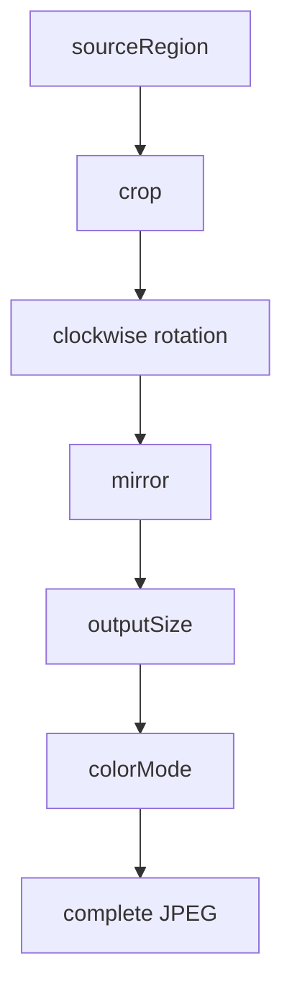

Usage · [Architecture](architecture.md)

# Using ScreenStream Capture Engine

ScreenStream Capture Engine turns an Android `MediaProjection` into complete JPEG images. Your app creates a session, chooses image and timing settings, registers a frame consumer, and starts capture. During the run it can change those settings and observe state, statistics, and diagnostics.

This guide follows session setup, frame handling, configuration, monitoring, recovery, and cleanup. The lifecycle example puts these responsibilities together; the later sections explain each operation and its contract. [Architecture](architecture.md) describes how the parts work together.

In this guide:

- [Prepare the Android host](#prepare-the-android-host)
- [Run a capture session](#run-a-capture-session)
- [Handle JPEG frames and consumers](#handle-jpeg-frames)
- [Change image settings and timing](#change-capture-parameters)
- [Configure a session and its capture metrics](#configure-a-session)
- [Monitor state, statistics, and diagnostics](#monitor-capture)
- [Handle errors and retry suspended capture](#handle-errors-and-recovery)
- [Look up session operations](#api-reference)

## Prepare the Android host

The SDK supports Android API 24 and later. The current SDK build uses Kotlin 2.4 and `compileSdk` 37.

Your app owns Android's [media-projection consent flow](https://developer.android.com/media/grow/media-projection), obtains a `MediaProjection` under the platform’s rules, and keeps the required [mediaProjection foreground service](https://developer.android.com/develop/background-work/services/fgs/service-types#media-projection) active while capture can run. The SDK does not declare permissions or application components, request consent, or start the service.

For apps targeting API 29 or later, projection capture requires the typed foreground service. For targets 34 or later, obtain consent before starting that service, then obtain the projection. The [`MediaProjectionManager` API requirements](https://developer.android.com/reference/android/media/projection/MediaProjectionManager#getMediaProjection(int,%20android.content.Intent)) and media-projection guide describe the manifest permissions and current launch restrictions.

> [!IMPORTANT]
> Supply a `MediaProjection` acquired in accordance with Android’s requirements for each `ScreenCaptureSession`. The host owns acquisition and consent policy. A successful `createSession()` transfers projection ownership to the returned session. Do not concurrently use or stop that session-owned projection directly. If creation throws, the projection remains your app’s responsibility.

Android may exclude protected content, including windows marked [`FLAG_SECURE`](https://developer.android.com/reference/android/view/WindowManager.LayoutParams#FLAG_SECURE).

## Run a capture session

Creating a session gives the SDK ownership of the projection without starting capture. Register a frame consumer—the callback that receives JPEGs—and retain its `FrameConsumerRegistration`, then call `start()` once with the initial parameters. Only one registration may remain open or unfinished at a time; [consumer replacement](#replace-or-remove-the-consumer) explains how to change it.

A normal return from `start()` means the session reached a usable `Active` configuration and startup success was settled; it does not guarantee that a JPEG has arrived or that the state is still `Active` when the caller resumes. Each callback receives a temporary `EncodedFrame`: copy its JPEG and read its immutable metadata on that callback’s thread before returning. [Frame handling](#handle-jpeg-frames) covers ownership and delivery in detail.

### Complete lifecycle integration

Run the following inside a coroutine owned by your app’s chosen lifecycle. It creates a session, copies delivered JPEGs, waits for capture to end, and stops the session during cleanup. Cancel that coroutine when its owner no longer needs capture.

`context` and `mediaProjection` come from your Android host setup. `initialParameters` is the `ScreenCaptureParameters` value you want to start with; use `ScreenCaptureParameters()` for defaults or the settings shown in [Change capture parameters](#change-capture-parameters). [Session configuration](#session-configuration), such as the JPEG backend policy, must instead be chosen when creating the session.

`enqueueOwnedFrame(jpeg, outputInfo)` and `reportCaptureProblem(problem)` stand for your app’s image handoff and error handling. Both must return promptly. The frame callback runs on an engine worker; problem reporting below runs in the calling coroutine’s context. Your app decides queue capacity and overflow behavior and dispatches UI work to the main thread.

```kotlin
// This session owns the projection and controls one capture run.
val session = ScreenCaptureEngine.createSession(context, mediaProjection)
// Keep the handle so cleanup can stop and await this consumer.
var registration: FrameConsumerRegistration? = null
try {
    registration = session.registerFrameConsumer { frame ->
        // Engine worker: copy before returning; the app handoff must not block.
        enqueueOwnedFrame(frame.toByteArray(), frame.outputInfo)
    }
    session.start(initialParameters)
    // Active means an applied configuration, not that a JPEG already exists.
    val terminal = session.state.first {
        it is ScreenCaptureState.Stopped || it is ScreenCaptureState.Failed
    }
    if (terminal is ScreenCaptureState.Failed) {
        reportCaptureProblem(terminal.problem)
    }
} catch (failure: ScreenCaptureException) {
    reportCaptureProblem(failure.problem)
} finally {
    // Covers registration/start failure and cancellation after creation.
    withContext(NonCancellable) {
        try {
            session.stop()
        } catch (failure: ScreenCaptureException) {
            reportCaptureProblem(failure.problem)
        } finally {
            // Await this consumer before releasing resources its callback uses.
            registration?.unregister()
        }
    }
}
```

A startup failure is reported through `ScreenCaptureException`; a failure after startup is reported through `Failed` state. The example handles both. It lets `CancellationException` propagate after cleanup, including normal stop before startup success is settled; the next section shows how to treat that normal-stop case separately.

Cleanup awaits session stop even when the owning coroutine was cancelled, reports shutdown failures, and then waits for the registered callback. These waits have no deadline. If the app cannot await its callback, it can omit `unregister()` and keep the callback’s resources alive instead.

### Startup details

`start()` suspends without blocking the calling thread, so it is safe to await on the main thread. A normal return means an `Active` state has been assigned and startup success has been settled. Observing `Active` alone does not mean `start()` has completed: the engine checks that capture is still usable after publishing that state. If settings or capture conditions invalidate that check, `start()` remains pending until a later usable `Active` configuration or a terminal outcome.

A genuine preparation or startup failure throws `ScreenCaptureException`. A normal owner stop or Android projection stop before startup success has been settled throws `CancellationException`, even if `Active` was already observed and the calling coroutine is still active. Once success has been settled, a later stop cannot revoke it merely because the caller has not yet resumed.

Startup can fail with `CaptureUnavailable` if the engine cannot confirm that capture is ready for its first `Active` state within a 10-second startup window. This does not guarantee that `start()` returns or throws within ten seconds: the engine must be able to run the readiness or deadline check, and the state can be published or the calling coroutine resumed later. The window does not restart if a published `Active` becomes unusable before startup success is settled. The window uses Android’s elapsed-realtime clock, including deep sleep, starting from a clock sample taken inside `start()` before the request is accepted. If the engine cannot schedule the required startup work, startup fails.

Caller cancellation remains cancellation. If the SDK detects it before accepting the start request, it requests stop only while the session is still fresh. After the request is accepted, cancelling that caller requests stop. Cancelling a repeated call or one that loses a concurrent start race cannot stop the run accepted for another call. Failure before acceptance can leave the state at `NotStarted`; once creation succeeds, the session keeps projection ownership even if startup fails.

If your app wants normal stop during startup to finish without propagating `CancellationException`, distinguish it from caller cancellation. Add this handling to the lifecycle example’s `try` block, alongside its `ScreenCaptureException` handling, and keep its `finally` cleanup:

```kotlin
try {
    session.start(initialParameters)
    // Continue with the terminal-state wait from the lifecycle example.
} catch (termination: CancellationException) {
    if (!currentCoroutineContext().isActive) {
        throw termination // Preserve caller cancellation.
    }
    // Normal stop before startup success was settled: finish without reporting a failure.
}
```

This is alternative handling for the one start call, not another call to `start()`.

### Share control with the app lifecycle

One app lifecycle owner should coordinate startup, parameter changes, consumer replacement, observation, and cleanup. It may share the session with UI actions or other app code: the public synchronous operations and Flow getters are thread-safe. Sharing that reference lets other app code control the same run; the session still owns the projection.

The handles have different roles. `ScreenCaptureSession` controls one run and exposes its settings and observations. `FrameConsumerRegistration` controls one consumer’s delivery lifetime. An app coroutine’s `Job` controls the calling coroutine; joining it waits for that coroutine to finish, not for an independently managed registration or every engine resource.

Thread-safe SDK calls do not make an app’s read–copy–update sequence atomic. Serialize changes to the app-owned desired parameters so concurrent actions do not overwrite each other’s settings. If startup is happening in another coroutine, use the [running-or-terminal check](#change-capture-parameters) before submitting updates.

The primary example creates the session inside its coroutine body, so cancellation before the body enters cannot leave a newly created session behind. If your app instead creates a session before launching the owning coroutine, that body might never enter. Install a completion hook outside the launched body:

```kotlin
// session is the app-owned session created before the launch.
// captureJob owns the coroutine with the lifecycle try/finally shown above.
captureJob.invokeOnCompletion {
    session.requestStop() // Also covers cancellation before that body enters.
}
```

The body still needs its own `finally` cleanup. Installing the hook after a very fast completion invokes it immediately. The hook only requests stop; it does not await a previously registered callback. Retain and await any such registration separately if its resources must be released safely.

### Stop a capture run

Use `session.stop()` when capture is no longer needed, including for a created session that never starts. It suspends without blocking the calling thread. Normal return means new work and new frame delivery are closed, final state and statistics are assigned, startup is settled, and the session’s projection stop call has returned. Another run requires a new session and host-provided projection authority.

Repeated calls share the shutdown result. Cancelling a caller cancels only its wait; shutdown remains requested and another caller may keep waiting. The [lifecycle example](#complete-lifecycle-integration) uses `NonCancellable` to await cleanup after owner cancellation. A required shutdown dispatch or projection-stop failure throws `ScreenCaptureException` with `InternalFailure`, independently of the capture outcome; a session already in `Failed` can stop successfully. Required work that never completes can leave the wait pending.

Session completion does not await all resource cleanup or an entered consumer callback. Await the registration’s [`unregister()`](#replace-or-remove-the-consumer) before releasing resources its callback uses. Android permission and foreground-service responsibilities remain with the [host](#prepare-the-android-host).

Use `session.requestStop()` when the calling context cannot suspend or subsequent work is independent of completion. It is idempotent and closes new starts, parameter updates, and consumer registrations before returning, while shutdown continues asynchronously. The app can then start a new session with independent projection authority. Callbacks from the old and new sessions can overlap, so protect shared callback resources until the old registration finishes.

## Handle JPEG frames

A frame consumer receives one complete JPEG at a time through an `EncodedFrame`. Its callback runs on an engine-selected worker thread. Callbacks for one registration do not overlap, but later callbacks may run on different threads. A callback can begin before `registerFrameConsumer()` returns, so initialize every value it uses before registering it.

The engine does not queue delivery opportunities behind a busy consumer: they are dropped. Capture can continue without a registered consumer. Keep the callback short and use app-owned storage for work that will continue after it returns.

The callback examples below are alternatives to the callback in [Run a capture session](#run-a-capture-session). Use one there, or successfully unregister the current consumer before registering another; do not add these consumers while an earlier one is still registered or its removal has not completed.

> [!WARNING]
> An `EncodedFrame` is borrowed. Access its properties or copy functions only inside its receiving callback and on that callback thread. Every public access throws `IllegalStateException` afterward or from another thread.

### Copy bytes and metadata together

`toByteArray()` returns a new app-owned array containing exactly the complete JPEG. Read immutable metadata in the same callback and hand the two values off together:

```kotlin
val registration = session.registerFrameConsumer { frame ->
    val ownedJpeg: ByteArray = frame.toByteArray()
    val outputInfo = frame.outputInfo
    enqueueOwnedFrame(ownedJpeg, outputInfo)
}
```

`EncodedFrame.JPEG_MIME_TYPE` is `"image/jpeg"`. Your app owns the copied array and decides its access, transport, storage, retention, and deletion policy. The immutable `CaptureOutputInfo` value read in the callback may also outlive the callback; the `EncodedFrame` may not.

### Reuse app storage

`copyTo(destination, destinationOffset = 0)` copies exactly `frame.byteCount` bytes and returns that count:

```kotlin
var reusable = ByteArray(0)

val registration = session.registerFrameConsumer { frame ->
    if (reusable.size < frame.byteCount) {
        reusable = ByteArray(frame.byteCount)
    }

    val copied = frame.copyTo(reusable)
    consumeBeforeReturn(
        jpeg = reusable,
        byteCount = copied,
        outputInfo = frame.outputInfo,
    )
}
```

Only `destinationOffset until destinationOffset + byteCount` is written. The complete range is validated before copying; a negative offset or insufficient remaining space throws `IndexOutOfBoundsException` and leaves the destination unchanged. A later callback may overwrite a reused array. Do not hand it to asynchronous work unless ownership prevents reuse until that work finishes.

### Read frame identity and output information

The engine can encode a new image or give a new consumer a cached output. These cases have different identities:

- A fresh encode converts a captured image into new JPEG bytes.
- A newly registered consumer may first receive a compatible cached output while the session is `Active`. It keeps that output’s original sequence, timestamp, and metadata.

An *output commit* is the engine accepting a freshly encoded image as its next output, whether or not a consumer receives it. Cached-first delivery reuses a previous commit; it does not perform a new encode or commit. Read a frame’s identity and metadata inside its callback:

| Member | Meaning |
| --- | --- |
| `byteCount: Int` | Positive size of the complete JPEG. |
| `sequence: Long` | Positive session-local output sequence. |
| `outputTimestampElapsedRealtimeNanos: Long` | Nonnegative output-commit time on Android’s elapsed-realtime clock. |
| `outputInfo: CaptureOutputInfo` | Immutable report of the parameters and geometry used for this JPEG. Use `ScreenCaptureParameters` to request settings; this value reports an actual output. |

Output sequences start at 1 and never wrap or repeat. Each fresh output receives a new sequence, but the first value a consumer observes can be greater than 1. Sequence exhaustion ends the run with `InternalFailure`.

The timestamp uses Android’s [elapsed-realtime clock](https://developer.android.com/reference/android/os/SystemClock#elapsedRealtimeNanos()), including deep sleep. It is not a source-capture or callback-entry time, and consecutive values may be equal.

A change limited to `frameRate` can keep a compatible cached JPEG. A new consumer receiving that cached output can therefore see metadata older than the current `Active.outputInfo`; the next fresh output commit carries `CaptureOutputInfo` for the currently applied settings.

`CaptureOutputInfo` contains:

| Field | Meaning |
| --- | --- |
| `parameters` | Requested `ScreenCaptureParameters` applied to this output. |
| `captureGeometry` | Authoritative unrotated capture width, height, and density. |
| `appliedSourceRect` | Selected and cropped rectangle in capture coordinates, before rotation and mirroring. |
| `finalImageSize` | Encoded width and height after rotation, mirroring, and sizing. |

In `appliedSourceRect`, `leftPx` and `topPx` are inclusive; `rightPx` and `bottomPx` are exclusive.

`ScreenCaptureState.Active.outputInfo` can report an applied output before any JPEG exists. A frame's `outputInfo` always describes that frame, including when a newer request is pending.

### Replace or remove the consumer

Keep the handle returned by `registerFrameConsumer()`. Calling `unregister()` prevents new delivery to that registration and waits for any callback that has already entered to return. After successful completion, you can release resources used only by that callback and, before shutdown begins, register a replacement. Calling `unregister()` again after success is safe and has no additional effect.

```kotlin
val firstRegistration = session.registerFrameConsumer { frame ->
    handleFirstConsumerFrame(frame)
}

// Later, from application control flow outside the callback:
firstRegistration.unregister()
releaseFirstConsumerResources()

val replacementRegistration = session.registerFrameConsumer { frame ->
    handleReplacementFrame(frame)
}

// Later still:
replacementRegistration.unregister()
```

The lifecycle example waits only for the registration stored in its cleanup. If you replace the consumer, retain and await each replacement registration before releasing resources used by its callback; completion of the original coroutine does not prove those callbacks have finished.

Unregistering does not stop capture or wait for all engine resources. It remains available after session stop or failure. Cancellation cancels only that caller's wait: delivery stays closed, but callback completion is unproven, so await the same registration again from a live coroutine if completion is still required.

Never call `unregister()` from its own callback or block that callback waiting for unregister elsewhere. A callback has no deadline.

### Callback failures

An `Exception` from your callback, including `CancellationException`, is treated as a delivery failure rather than automatically removing the consumer. When callback completion is safely recorded, the registration remains active. The failure increments `droppedDeliveries.byCallbackFailure` only if that exact failure is processed before the final statistics snapshot freezes. This handling does not cover arbitrary throwables outside `Exception`.

There are also execution failures outside your callback. A definite scheduling rejection for a current callback submission fails the session with `InternalFailure`. After submission has been accepted, a failure to report that the work finished can instead leave delivery blocked and unregistration waiting. In that case, neither a retry nor a session failure is guaranteed. These limits do not impose a deadline on your callback; an entered callback still has to return.

## Change capture parameters

Keep the settings your app wants in an app-owned `desired` value. `updateParameters()` submits that complete value; returning does not mean those settings are already producing images. `Active.outputInfo` reports the applied output configuration, and each frame’s `outputInfo` describes that particular frame.

Choose the starting value before the session’s single `start()` call and pass it as `initialParameters`:

```kotlin
var desired = ScreenCaptureParameters(
    outputSize = OutputSize.TargetSize(widthPx = 1280, heightPx = 720),
    frameRate = FrameRate.MaxFps(30),
)

val initialParameters = desired
```

After `start()` has returned successfully, app control code can request a change. Derive it from the latest desired value so omitted properties do not reset to defaults. Serialize this read–copy–update operation in the app:

```kotlin
desired = desired.copy(
    rotation = Rotation.Degrees90,
    colorMode = ColorMode.Grayscale,
)
try {
    session.updateParameters(desired)
} catch (_: IllegalStateException) {
    // The session began ending before it could accept this update.
}
```

The call is accepted once the engine enters its running phase and only before the session begins ending. The published state can briefly still be `Starting` when updates become acceptable; a state snapshot is not an atomic admission check. Before that running phase, or if shutdown wins the race, the call throws `IllegalStateException` and changes nothing. An accepted update does not wait for state publication, reconfiguration, or a frame. A callback accepted under older settings may still begin later; use its own metadata rather than assuming it reflects your newest request.

If startup is running in another coroutine, wait for a running state or an early terminal outcome before submitting updates:

```kotlin
val readyOrTerminal = session.state.first {
    it is ScreenCaptureState.Running ||
        it is ScreenCaptureState.Stopped ||
        it is ScreenCaptureState.Failed
}

if (readyOrTerminal is ScreenCaptureState.Running) {
    try {
        session.updateParameters(desired)
    } catch (_: IllegalStateException) {
        // Shutdown can still win after the Running state was observed.
    }
}
```

`Running` includes `Active`, `Reconfiguring`, and `Suspended`. State collection can skip intermediate values, so waiting for `Active` alone can miss the first usable configuration. An early `Stopped` or `Failed` outcome skips the update; the owning lifecycle code handles that outcome. A successful direct `start()` call needs no additional readiness wait. Neither path prevents shutdown from winning a later update.

All parameter values are immutable and use structural equality. `ScreenCaptureParameters.DEFAULT` equals a no-argument `ScreenCaptureParameters()`. Constructors immediately reject locally invalid values with `IllegalArgumentException`. Rules that need the current capture dimensions are checked later: an invalid crop or unrepresentable output size produces `InvalidRequest`, while a valid image whose RGBA storage exceeds supported addressability produces `ResourceExhausted`.

After recovery or reconfiguration, the first delivered JPEG may use source content already available to the capture path. Its pixels are not guaranteed to have been captured after recovery. An equal update is normally a no-op; [Retry suspended capture](#retry-suspended-capture) explains its one recovery use.

### Image and geometry

- **`sourceRegion` — default `SourceRegion.Full`.** `Full` selects the complete source. `LeftHalf` and `RightHalf` require a source at least 2 px wide. With an odd width, `RightHalf` receives the extra column.
- **`crop` — default `CropInsetsPx.ZERO`.** `CropInsetsPx(left, top, right, bottom)` removes nonnegative pixel insets from the unrotated selected source and must leave nonempty content.
- **`rotation` — default `Rotation.Degrees0`.** Choose clockwise `Degrees0`, `Degrees90`, `Degrees180`, or `Degrees270`.
- **`mirror` — default `Mirror.None`.** `Horizontal` reflects left and right; `Vertical` reflects top and bottom in the already-rotated image.
- **`outputSize` — default `OutputSize.ScaleFactor(0.5)`.**
  - `ScaleFactor(factor)` requires a finite positive factor. Each post-transform axis uses `floor(dimension * factor + 0.5)`. A finite result in `0..Int.MAX_VALUE` is clamped only to a minimum of 1 px; a nonfinite or out-of-range result becomes `InvalidRequest`. Integer rounding can slightly alter aspect ratio.
  - `TargetSize(widthPx, heightPx, contentMode = AspectFit)` uses `OutputSize.ContentMode.AspectFit` as its default content mode. It requires positive bounds, uses one common scale, rounds to the nearest pixel, adds no padding, and may upscale. For example, a full 1920×1080 source fitted into 1280×1280 produces an unpadded 1280×720 image.
  - `TargetSize(widthPx, heightPx, Stretch)` requires positive dimensions, produces those exact dimensions, may upscale, and may distort the image.
- **`colorMode` — default `ColorMode.Color`.** Choose `Color` or `Grayscale`.

Image operations run in this order:



Crop coordinates belong to the unrotated selected source. Crop insets select content; they are not a privacy-redaction boundary. Mirror directions apply after rotation. Upscaling a selected half or crop repeats retained edge pixels so excluded logical neighbours do not bleed across that boundary. Selection cannot undo upstream resampling already present in the image Android supplies.

Every returned `CaptureOutputInfo` is internally valid: capture dimensions and density are positive, `appliedSourceRect` is nonempty and entirely inside `captureGeometry`, and `finalImageSize` is positive. Unrepresentable output dimensions produce `InvalidRequest`. RGBA layouts that exceed supported addressability produce `ResourceExhausted`; checked calculations do not wrap.

### Frame timing

Frame pacing is best effort. Design for delayed or skipped images.

**`frameRate` defaults to `FrameRate.Auto`.** `Auto` follows available source images and processing capacity. `MaxFps(fps)` accepts `1..120` and caps fresh output. `SamplingInterval(interval)` accepts `1,000..3,600,000 ms`, allows the first available fresh image immediately, then samples later fresh images no more often than the interval.

`SamplingInterval(2.seconds)` can admit the first fresh image immediately and later fresh images at most once every two seconds. By comparison, `MaxFps(10)` limits fresh output commits to at most ten per second. Neither policy promises that rate.

When the engine adopts a different `frameRate` value, it resets fresh-image and output pacing. The next fresh image can become eligible immediately once capture is ready; delivery is still best effort. Retrying equal parameters does not reset the rate cadence.

Intervals use Kotlin `Duration`, for example `2.seconds` with `import kotlin.time.Duration.Companion.seconds`.

The public range values are `FrameRate.MAX_FPS_RANGE` and `FrameRate.SAMPLING_INTERVAL_RANGE`. Their bounds are inclusive.

### JPEG encoding

- **`jpegQuality` — default `80`.** Values in `0..100` are JPEG encoder quality hints. Higher values usually preserve more detail and may make larger files. A value does not promise identical bytes across devices or backends.

Use `ScreenCaptureParameters.JPEG_QUALITY_RANGE` when validating app UI. Changing JPEG quality invalidates cached bytes produced at the previous quality. Pacing-only changes have different [cached-output behavior](#read-frame-identity-and-output-information).

### Color assumptions and limits

The engine interprets captured colors as standard dynamic range (SDR)/sRGB. It does not guarantee faithful color reproduction or conversion of HDR content to SDR. A successfully encoded JPEG is not evidence that the source colors were reproduced accurately. Output has no transparency and uses top-down image orientation.

For `Grayscale`, the pre-JPEG calculation is `(77 * R + 150 * G + 29 * B + 128) shr 8`, using the quantized, gamma-encoded 8-bit red, green, and blue channels. This is not a linear-light luminance calculation. Shader precision and lossy JPEG encoding mean decoded channel values are not guaranteed to match the formula bit for bit.

On API 33 and later, the exact `DATASPACE_DISPLAY_P3` value reported by [`SurfaceTexture.getDataSpace()`](https://developer.android.com/reference/android/graphics/SurfaceTexture#getDataSpace()) is rejected as `UnsupportedColorSpace`. Other or unknown metadata does not prove that the source is sRGB or faithfully reproduced. Earlier APIs lack this dataspace observation.

## Configure a session

Image and timing parameters can change during a run. The metrics source and JPEG backend policy are construction choices: put them in `ScreenCaptureConfig` before creating the session.

### Session configuration

`ScreenCaptureConfig` is fixed when the session is created. Its properties are read-only, although a configured metrics source may itself be stateful and is retained by identity.

**`captureMetricsSource` defaults to `null`.** The engine then follows the current default display for capture metrics. Use `CaptureMetricsSource.fromDisplay(context, display)` to read one particular `Display`, or supply a custom source. [Select capture metrics](#select-capture-metrics) explains which source fits your integration and how Android chooses the capture dimensions.

**`jpegBackendPolicy` defaults to `JpegBackendPolicy.Auto`.** Auto may use the optional native JPEG backend when available and supported. `FrameworkOnly` uses Android’s framework JPEG encoder and makes no calls to the optional native backend.

Use this creation call in place of the one in the lifecycle example:

```kotlin
val config = ScreenCaptureConfig(
    jpegBackendPolicy = JpegBackendPolicy.FrameworkOnly,
)
val session = ScreenCaptureEngine.createSession(
    context = context,
    mediaProjection = mediaProjection,
    config = config,
)
```

With `Auto`, expected native setup unavailability or unsupported platform capability selects the framework encoder. Unexpected native failures still follow the normal failure rules. If native compression later reports a rejection the SDK can safely contain, that output is dropped and native encoding is disabled for the rest of the session. The same frame is not retried; later output uses the framework encoder.

Both backends preserve the same public frame, geometry, ownership, delivery, observation, and problem contracts. They do not promise identical JPEG bytes.

### Select capture metrics

The engine needs dimensions and density to configure capture. A `CaptureMetricsSource` supplies these values and reports when they are unavailable. The session subscribes to its configured source to receive those changes. Selecting a metrics source does not change the display or app window authorized by Android’s consent flow.

With the default `captureMetricsSource = null`, `createSession()` uses the supplied context’s application context to follow the current default display. The display used for metrics can change when Android’s default changes.

`CaptureMetricsSource.fromDisplay(context, display)` returns a reusable source that always reads the exact supplied `Display` object. Creation requires an application context and display service, and that service must currently report a valid display with the same ID; the supplied display must also be valid. Otherwise the factory throws `IllegalArgumentException`. The service’s display object never replaces the supplied object. If that same-ID association later disappears, the source reports unavailable metrics; a later valid association can restore availability.

Each subscription registers its own display observation. Closing its handle prevents new observations from being accepted before `close()` returns. Close performs or observes the observation's single unregister attempt and may wait for that platform work, including an attempt already in progress on another thread. Repeated or concurrent closes do not retry it. Close does not wait for an observer callback already in progress or for all worker work to finish; its return is not proof that all observation work has finished.

If you configure any explicit source, including one from `fromDisplay`, `createSession()` retains that exact source and does not access, forward, or retain its own `context` argument. The source must keep its display, window, Activity, and lifecycle choices consistent with the content authorized by consent.

Android version affects which dimensions the engine uses:

- On API 24–33, the metrics source’s width, height, and density determine capture geometry.
- On API 34 and later, source width and height are provisional until Android reports the first valid [`MediaProjection.Callback.onCapturedContentResize()`](https://developer.android.com/reference/android/media/projection/MediaProjection.Callback#onCapturedContentResize(int,%20int)). Projection resize callbacks then determine dimensions, including later resizes; source dimensions do not override them. The source’s density and availability are still required.

On API 34 and later, `Active` and geometry-dependent request validation wait for that authoritative resize. The requested crop and output need not fit the provisional dimensions, though resources needed for initial setup can still be unavailable. These rules apply to default, fixed-display, and custom sources alike.

### Custom capture metrics

Implement `subscribe(observer: CaptureMetricsSource.Observer): AutoCloseable` to provide one independent observation per subscription. Your source calls the supplied observer to report values and returns the handle that closes that observation:

- `observer.onMetricsChanged(CaptureMetrics(widthPx, heightPx, densityDpi))` reports positive dimensions and density. Pass `null` when geometry is currently unavailable.
- `observer.onComplete()` ends updates normally. The last positive metrics remain usable; if the last value was unavailable or none was reported, that subscription stays unavailable.
- `observer.onFailure(cause)` ends updates with a source failure. The cause is diagnostic context.

Return a non-null `AutoCloseable` for that exact observation. The engine may call `subscribe()` and the handle’s `close()` on a worker thread, so neither may assume the main thread. Your source controls notification timing and threading: it may call the observer inline before `subscribe()` returns, reentrantly, concurrently, or from its own threads. There is no callback deadline. Return from `subscribe()` promptly, publish the current value, and report later changes asynchronously. The source also defines how close stops notifications and treats callbacks already in flight.

The session subscribes at most once. You may report valid metrics inside `subscribe()`, but the session cannot become ready from them until `subscribe()` normally returns its non-null close handle. The engine keeps that exact handle. After `onComplete()`, positive metrics remain usable even if closing the handle has not finished; an unavailable completed subscription cannot recover. The engine ignores notifications after completion, failure, or when the session stops using the subscription.

The engine attempts to close the handle at most once after completion, failure, or when the session stops using the subscription. This includes a handle returned by `subscribe()` after the session has already stopped using that subscription. An attempted close does not prove that resources were released.

If `subscribe()` or a live close throws an `Exception`, the session may fail with `InternalFailure` while it can still accept a failure outcome. If `subscribe()` throws before returning a handle, your source must clean up resources it created but did not hand off. Other throwables retain their ordinary Kotlin/JVM propagation. A throwable passed to `observer.onFailure(cause)` is different: it is opaque diagnostic data, is not rethrown based on its type, and may cause `InternalFailure` while the session can still accept that outcome.

## Monitor capture

Use state to decide how the run is progressing, statistics to measure its work, and diagnostics for optional troubleshooting context. Each has a separate flow:

| Signal | Role |
| --- | --- |
| `state: StateFlow<ScreenCaptureState>` | Lifecycle, applied output, recoverable pause, and final outcome. |
| `stats: StateFlow<ScreenCaptureStats>` | Production and delivery counters, average rates/durations/sizes, and the latest encoded size. |
| `diagnosticEvents: SharedFlow<ScreenCaptureDiagnosticEvent>` | Best-effort context for logs and support reports. |

Each getter returns the same read-only flow object; reading it does not start capture. `state` and `stats` each retain a consistent latest snapshot. A slow collector can skip intermediate assignments, and reading both flows does not give one combined atomic snapshot. They do not complete when capture stops or fails, so cancel collection with your app’s observing lifecycle.

Diagnostics do not replay old events to a new collector. Their buffer is bounded, so events can be lost. Use state and the operation results—not diagnostic presence or absence—to make lifecycle decisions.

Keep collectors nonblocking. Send reactions to app work that runs independently; merely calling `launch` on an immediate or unconfined dispatcher can still run the reaction inline. In this example, the queues and their capacity/overflow policies belong to your app:

```kotlin
val stateCollector = ownerScope.launch(Dispatchers.Default) {
    session.state.collect { state ->
        captureControlQueue.trySend(state)
    }
}

val statsCollector = ownerScope.launch(Dispatchers.Default) {
    session.stats.collect { stats ->
        metricsQueue.trySend(stats)
    }
}

val diagnosticsCollector = ownerScope.launch(Dispatchers.Default) {
    session.diagnosticEvents.collect { event ->
        diagnosticQueue.trySend(event)
    }
}
```

Here the three `trySend` calls are nonblocking app handoffs. The receiving control, metrics, and logging work runs separately and applies the app's own buffering policy.

### Lifecycle states

A run begins at `NotStarted` and can enter startup and running states before ending permanently at `Stopped` or `Failed`. It can also end before ever reaching `Active`. `Reconfiguring` and `Suspended` are still running states: the same session can resume output.

| State | Meaning and fields |
| --- | --- |
| `NotStarted` | Initial state; capture has not been accepted. |
| `Starting` | Start was accepted, but no usable output is active yet. |
| `Active` | Current applied `outputInfo`, `requestedParameters`, and `isCapturedContentVisible`. |
| `Reconfiguring` | Changing output; `requestedParameters`, `lastOutputInfo`, and `isCapturedContentVisible`. |
| `Suspended` | Recoverable pause; `problem`, `requestedParameters`, `lastOutputInfo`, and `isCapturedContentVisible`. |
| `Stopped` | Permanent normal outcome; `reason`, `requestedParameters`, and `lastOutputInfo`. |
| `Failed` | Permanent failure; `problem`, `requestedParameters`, and `lastOutputInfo`. |

`Starting` does not imply a source image, JPEG, or callback. In `Active`, `requestedParameters` is the same value as `outputInfo.parameters`. During `Reconfiguring`, `requestedParameters` is being reconciled and fresh production is paused, though a previously admitted callback may finish.

`lastOutputInfo` records the last applied output configuration. It does not describe current availability or prove that a JPEG was produced. It is non-null in `Reconfiguring` and `Suspended`, and nullable in terminal states. Terminal states retain the latest accepted `requestedParameters`. A `Suspended` state contains only `InvalidRequest`, `CaptureUnavailable`, or `ResourceExhausted`; its desired parameters remain available for correction or retry.

`isCapturedContentVisible` reports Android’s latest visibility observation, or `null` when none is available. It is always `null` on API 24–33. A `false` value is informational and does not itself pause or stop capture.

`Stopped.reason` is a `ScreenCaptureStopReason`:

- `Requested` means the owner requested stop with `stop()` or `requestStop()`, or cancellation was observed by a start call allowed to stop that run under the [startup cancellation rules](#startup-details).
- `ProjectionStopped` means Android’s projection-stop callback reported that the projection had stopped.

If stop and failure compete before the terminal outcome is fixed, `ProjectionStopped` takes priority, then `Requested`, then the first failure. Once a terminal state is fixed, later events do not change it.

### Statistics

Statistics describe work and output during one run. They include cumulative counters, averages, and the latest encoded size; they are not a periodic heartbeat. Encoding, output commits, and delivery are different events: a successful encode can later become stale, and output can be produced without a consumer receiving it.

All fields start at zero. Creating the session installs that snapshot; accepting start alone does not publish another.

| Field | Meaning |
| --- | --- |
| `encodedFrameCount` | Successful JPEG encodes, including successful results later discarded as stale. Cached-first delivery does not add to it. |
| `producedFrameCount` | Fresh output commits, with or without a consumer. Cached-first delivery does not add to it. |
| `frameProductionDrops.byStaleWork` | Otherwise-successful fresh work discarded because a newer request or geometry made it stale. |
| `frameProductionDrops.byFailure` | Production failures processed by the session before final statistics freeze. |
| `frameProductionDrops.total` | Saturating sum of the two production-drop fields. Source coalescing, pacing skips, and output without a consumer are excluded. |
| `droppedDeliveries.byConsumerBusy` | Delivery opportunities skipped because the prior callback handoff was occupied. |
| `droppedDeliveries.byCallbackFailure` | Entered callbacks that threw an `Exception` and were accepted for accounting. |
| `droppedDeliveries.total` | Saturating sum of both delivery-drop fields. Producing without a consumer is not a delivery drop. Definite rejection of a current callback submission instead fails the session; see [Callback failures](#callback-failures). |
| `averageProducedFps` | Finite, nonnegative rate from first to latest output commit. Its span includes suspension and deep sleep. It is zero with fewer than two commits or no positive interval. |
| `averageReadbackDuration` | Finite, nonnegative mean of successful real readbacks, including successful stale work; zero without a sample. |
| `averageEncodingDuration` | Finite, nonnegative mean of successful real encodes, including successful stale work; zero without a sample. |
| `lastEncodedByteCount` | Latest successful encoded-size sample, including successful stale work; zero before the first encode. |
| `averageEncodedByteCount` | Rounded nonnegative mean of successful encoded sizes, capped at `Int.MAX_VALUE`; zero before the first encode. |

Counters and totals saturate at `Long.MAX_VALUE` instead of wrapping. Successful encodes and readbacks, including stale results, and production or delivery drops can contribute when processed before final statistics freeze, including outside `Active`.

Statistics are not published on a timer. While capture is `Active`, processing activity can publish a changed snapshot once at least 1,000 ms separates its elapsed-realtime clock sample from the previous regular snapshot’s sample. The first comparison uses the session-creation sample. A qualifying snapshot may be assigned and collected later, so observed updates can arrive close together. There is no catch-up, and changes remain pending while `Suspended`.

`averageProducedFps` spans the `producedFrameCount - 1` intervals between the first and latest output commits; it does not decay merely because output later stays idle. Final statistics freeze and are assigned before terminal state, and later-processed results cannot change them. Termination does not promise that every outstanding read, encode, or delivery result is drained into statistics. Because the flows are independent and can skip intermediate values, collectors are not guaranteed to observe state and statistics in the order they were assigned, as one atomic pair, or at all if the collector makes no progress.

### Diagnostics

Diagnostic events are optional context for logs and support reports. Their messages are not a stable format to parse, and a cause does not define the session’s outcome. Use `ScreenCaptureProblem` and lifecycle state for that.

Each event includes a positive, nonrepeating session-local `sequence`, approximate Unix-epoch `timestampEpochMillis`, extensible `source` and `eventName` labels, a noncontractual `message`, and an optional opaque `cause`. Wall-clock time is not monotonic. Events have no replay, can be lost or observed out of sequence under load, and stop after sequence exhaustion.

Do not use event presence, absence, count, order, throwable identity or type, loss, or collector behavior as proof of lifecycle progress or completed cleanup. Those details remain diagnostic context even when they appear repeatable on a particular device.

## Handle errors and recovery

Constructors reject locally invalid values immediately with `IllegalArgumentException`: negative crop insets, nonpositive or nonfinite sizes, out-of-range timing values, and JPEG quality outside `0..100`. Geometry-dependent invalidity is different. For example, a locally valid crop that leaves no content in the current geometry, or an unrepresentable output dimension, produces `InvalidRequest` during startup or reconfiguration. If image dimensions are representable but the RGBA layout exceeds supported addressability, the problem is `ResourceExhausted`. Neither is thrown by the earlier `updateParameters()` call.

For a genuine startup failure, read `ScreenCaptureException.problem`. Caller cancellation, or normal stop before startup success is settled, remains `CancellationException`. In state observations, `Suspended.problem` explains why output is paused, and `Failed.problem` explains a permanent failure. For these capture-run problems, choose a response using the table below. A failure returned by `stop()` has the separate [shutdown meaning](#stop-a-capture-run).

| Problem | Meaning and response |
| --- | --- |
| `InvalidRequest` | Correct the request or wait for geometry that can satisfy it. It can suspend an active run. |
| `CaptureUnavailable` | Check projection, metrics, and host lifecycle. It can suspend an active run; a terminal occurrence requires a fresh run. |
| `ResourceExhausted` | Reduce output demand or let an explicit app action retry the settled desired settings under app policy. It can suspend an active run; the category does not name the denied resource or signal when resources are available. |
| `InternalFailure` | Terminal for the run. Preserve optional diagnostics and use a fresh session if app policy permits another attempt. |
| `UnsupportedColorSpace` | Terminal when reported as the session problem. Quality or grayscale does not remove the restriction; after this failure, another attempt requires a fresh session. |

A Display P3 rejection from an obsolete read can be discarded without failing the current session.

Messages, causes, and suppressed throwables are optional diagnostic context. Do not parse them as stable semantics. `Stopped` and `Failed` are permanent.

For the first frame after recovery, the [source-content limitation](#change-capture-parameters) still applies.

### Retry suspended capture

Usually, submitting parameters equal to the last accepted value does nothing. There is one recovery case: when the current desired value has settled in `Suspended` and no newer request or retry is pending, submitting an equal value requests another evaluation. The SDK evaluates the same immutable object it already retained; an equal caller-created copy does not replace it.

For example, a user action can retry the paused request. This uses the same app-owned `desired` value as [Change capture parameters](#change-capture-parameters):

```kotlin
fun onRetryCaptureRequestedByUser() {
    val state = session.state.value
    if (
        state is ScreenCaptureState.Suspended &&
        state.requestedParameters == desired
    ) {
        try {
            session.updateParameters(desired)
        } catch (_: IllegalStateException) {
            // The session began ending after the snapshot was read.
        }
    }
}
```

A `Suspended` value tells you the request is paused; it does not tell you that resources have become available. Choose retries using app policy, user action, backoff, or evidence your app has that conditions changed. The SDK provides no automatic retry loop, retry timer, debounce, retry rate limiter, or resource-availability signal.

The session can end between the state check and the update, which explains the `IllegalStateException` catch. Equal requests coalesce while an evaluation is pending. A later update or shutdown can supersede the retry before any physical attempt, and a persistent problem can suspend the same settings again.

## API reference

### Session operations

This reference summarizes when each operation is legal. The earlier lifecycle, frame, and recovery sections explain how to combine them.

`createSession()`, `updateParameters()`, `registerFrameConsumer()`, `requestStop()`, and the three Flow getters are thread-safe and may be called from any thread. `start()`, `stop()`, and `unregister()` are main-safe suspending operations.

**`ScreenCaptureEngine.createSession()`** returns a fresh idle session without starting capture. Normal return transfers projection ownership; a thrown construction step leaves it with the caller. The default metrics path can throw `IllegalArgumentException` if it cannot obtain an application context or display service. The session starts at `NotStarted` with zero statistics, and merely reading its Flows does no work.

**`session.start(initialParameters = ScreenCaptureParameters())`** is legal exactly once. Normal return means `Active` was assigned and startup success was settled; observing `Active` alone does not establish completion. It can throw `IllegalStateException` for an already accepted, terminal, or race-losing invocation; `ScreenCaptureException` for genuine startup failure; or `CancellationException` for caller cancellation and normal terminal resolution before startup success was settled. See [Startup details](#startup-details) for cancellation, the readiness window, and failures before the request is accepted.

**`session.updateParameters(parameters)`** is synchronous and nonblocking and is accepted once the engine enters its running phase, before the session begins ending. The published state can briefly still be `Starting` when admission opens. Return acknowledges the desired settings or an eligible [equal-parameter retry](#retry-suspended-capture); it does not wait for publication, convergence, or a physical attempt. Calling before the running phase or after shutdown closes admission throws `IllegalStateException`. See [Change capture parameters](#change-capture-parameters) for the recommended readiness wait and shutdown-race handling. If the session cannot allocate an internal ID needed to track the request, it throws `ScreenCaptureException` with `InternalFailure`.

**`session.registerFrameConsumer(consumer)`** is synchronous and nonblocking. It is legal before shutdown begins, including before `start()`, provided no other registration is open or unfinished. The callback can enter before the call returns. Registering while another registration remains open or unfinished, or after shutdown has begun, throws `IllegalStateException`. If the session cannot allocate the registration’s tracking ID, it throws `ScreenCaptureException` with `InternalFailure`.

**`registration.unregister()`** closes new delivery for that registration and suspends until its entered callback has returned. It is legal after session termination and is idempotent after success, but calling it from its own callback throws `IllegalStateException`. Caller cancellation cancels only that wait and does not undo the independent close or completion process; see [consumer removal](#replace-or-remove-the-consumer).

**`session.stop()`** requests shutdown and awaits [session completion](#stop-a-capture-run). It is legal in every phase, including before start and after failure. Cancellation affects only the caller’s wait; an ordinary shutdown failure throws `ScreenCaptureException(InternalFailure)`. It does not await complete physical cleanup or an entered consumer callback.

**`session.requestStop()`** is the synchronous, nonblocking alternative when the caller cannot await completion. It is idempotent in every phase and closes new start, update, and registration admission before returning. Shutdown completes asynchronously.
