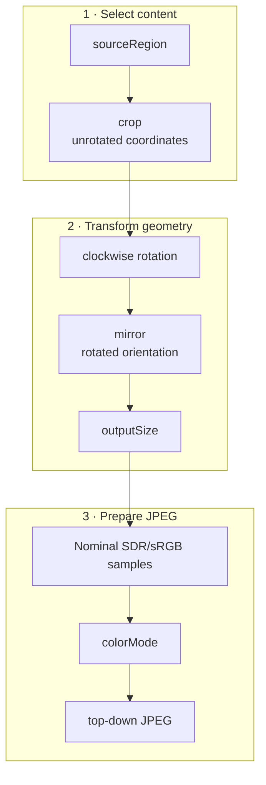

[README](../README.md) · Usage · [Architecture](architecture.md)

# Using ScreenStream Capture Engine

For member-level details, see the KDoc for [session operations](../src/main/kotlin/io/screenstream/capture/ScreenCaptureSession.kt), [parameters](../src/main/kotlin/io/screenstream/capture/ScreenCaptureParameters.kt), [frame output](../src/main/kotlin/io/screenstream/capture/ScreenCaptureOutput.kt), [metrics sources](../src/main/kotlin/io/screenstream/capture/CaptureMetrics.kt), and [statistics](../src/main/kotlin/io/screenstream/capture/ScreenCaptureStats.kt).

## Contents

- [Android host prerequisites](#android-host-prerequisites)
- [Start a capture run](#start-a-capture-run)
  - [Configure session-wide behavior](#configure-session-wide-behavior)
- [Stop capture](#stop-capture)
- [Work with JPEG frames](#work-with-jpeg-frames)
  - [Read frame information](#read-frame-information)
  - [Inspect effective output](#inspect-effective-output)
  - [Choose how to copy JPEG data](#choose-how-to-copy-jpeg-data)
  - [Change or remove the frame consumer](#change-or-remove-the-frame-consumer)
- [Choose and update capture parameters](#choose-and-update-capture-parameters)
  - [Parameter reference](#parameter-reference)
  - [How image settings combine](#how-image-settings-combine)
  - [Color assumptions and limits](#color-assumptions-and-limits)
  - [Set initial parameters](#set-initial-parameters)
  - [Update parameters while running](#update-parameters-while-running)
- [Monitor capture](#monitor-capture)
  - [Respond to lifecycle state](#respond-to-lifecycle-state)
  - [Watch output health](#watch-output-health)
  - [Record diagnostic context](#record-diagnostic-context)
  - [Handle failures and recovery](#handle-failures-and-recovery)
- [Critical limits](#critical-limits)

## Android host prerequisites

The host application owns Android's [user consent and `MediaProjection` integration](https://developer.android.com/media/grow/media-projection). It obtains a `MediaProjection` through that setup and keeps the required [`mediaProjection` foreground-service context](https://developer.android.com/develop/background-work/services/fgs/service-types#media-projection) active while capture can run. ScreenStream Capture Engine does not provide the consent flow, declare the host's required permissions or service, or start that service.

> [!IMPORTANT]
> Use fresh user consent and a fresh `MediaProjection` for each `ScreenCaptureSession`. Once `createSession()` returns successfully, the session owns that projection; do not reuse or stop it directly.

For apps targeting API 29+, Android requires the typed foreground service when obtaining and maintaining projection capture. For targets 34+, obtain consent before starting that service, then obtain the projection; the linked guides cover the required manifest permissions and current launch restrictions. A library `stop()` return or terminal state is not evidence that projection resources have finished releasing: keep the host service lifecycle consistent with Android's capture requirements. See the [platform API requirements](https://developer.android.com/reference/android/media/projection/MediaProjectionManager#getMediaProjection(int,%20android.content.Intent)).

## Start a capture run

A `ScreenCaptureSession` represents one capture run. A frame consumer is the callback that receives JPEG frames; one session can have one registered consumer at a time.

Register before starting so the consumer is ready for JPEG delivery:

```kotlin
val session = ScreenCaptureEngine.createSession(context, mediaProjection)

val registration = session.registerFrameConsumer { frame: EncodedImageFrame ->
    // Read frame information or copy the JPEG bytes here.
}

session.start()
```

1. `createSession(context, mediaProjection)` synchronously creates an idle session. Successful return transfers ownership of the projection; if the factory throws, the caller retains ownership and must release the projection when no longer needed. Creating the session does not start capture.
2. `registerFrameConsumer()` sets the callback and returns a registration to use when replacing or removing it.
3. `start()` begins capture using the session-owned projection. The consumer receives a JPEG when one is ready.

Calling `start()` without `initialParameters` uses the [capture-parameter defaults](#parameter-reference). A session can be started only once; create a new session and obtain a new projection for another capture run.

`start()` is a main-safe suspending call. It returns after the session first becomes `Active`, without waiting for a source frame, JPEG, or consumer callback. Caller cancellation remains cancellation and, once its body enters while the session is fresh or accepted, requests session stop. A cancelled repeated or losing call has no authority to stop another run. A normal stop before `Active` also ends startup with `CancellationException`; an actual startup failure throws `ScreenCaptureException`. Neither outcome returns projection ownership to the caller.

The lifecycle owner must arrange `stop()` for every successfully created session, including when its start coroutine is cancelled before entering `start()`. Cleanup only inside that coroutine is insufficient if the coroutine never runs.

Startup has a 10-second eligibility window measured on Android's elapsed-realtime clock from the `start()` call. If readiness is not established in that window, startup can fail with `CaptureUnavailable`. This is not an unconditional wall-clock deadline for the caller to resume: worker execution and result observation can be delayed. A definite refusal to schedule startup work is a startup failure, not readiness.

### Configure session-wide behavior

The default `createSession(context, mediaProjection)` call uses the current default display for capture measurements and chooses the JPEG backend automatically. When a new session needs different fixed choices, pass a `ScreenCaptureConfig` while creating it. The selected configuration remains fixed for that session.

| Setting | Default | Purpose |
| --- | --- | --- |
| `captureMetricsSource: CaptureMetricsSource?` | `null` | Selects the source of capture width, height, and density. `null` follows the current default display; `CaptureMetricsSource.fromDisplay(context, display)` retains and reads that exact `Display` object; a custom source can supply app-managed metrics. |
| `jpegBackendPolicy: JpegBackendPolicy` | `JpegBackendPolicy.Auto` | Selects the JPEG backend policy. `JpegBackendPolicy.Auto` uses the optional Native backend when it is available and supported. Expected setup unavailability or lack of platform support selects Framework; unexpected Native failures retain their ordinary behavior. `JpegBackendPolicy.FrameworkOnly` selects Framework JPEG exclusively. |

A custom `CaptureMetricsSource` supplies one independent latest-value observation for each subscription. It reports positive `CaptureMetrics` while geometry is available or `null` while it is unavailable. The source controls callback timing and threading, so callbacks may be inline, reentrant, concurrent, or on source-owned threads. `onComplete()` freezes the current availability, while `onFailure()` ends the observation with a terminal source failure; callbacks after either event are ignored. `subscribe()` returns one non-null `AutoCloseable` that closes that exact observation.

The session subscribes at most once and closes the exact returned handle at most once. After the handle has been adopted, completed positive metrics remain usable for startup independently of observation close completion; completion without available metrics cannot establish readiness. Custom sources must define how close fences new notifications and handles callbacks already in flight. A custom source is responsible for keeping its Activity, window, display, and lifecycle policy consistent with the projection consent; metrics do not choose the captured content.

If Native compression is safely rejected during a run, the rejected frame is not retried; later frames use Framework.

To select Framework JPEG explicitly:

```kotlin
val config = ScreenCaptureConfig(
    jpegBackendPolicy = JpegBackendPolicy.FrameworkOnly,
)
val session = ScreenCaptureEngine.createSession(context, mediaProjection, config)
```

On API 34+, the metrics source's initial width and height are provisional. Android reports the accurate captured-content size through [`MediaProjection.Callback.onCapturedContentResize()`](https://developer.android.com/reference/kotlin/android/media/projection/MediaProjection.Callback#oncapturedcontentresize). Capture setup begins using provisional dimensions, but geometry-dependent validation and preparation of the requested output use the first valid resize dimensions before startup completes or output is published. The request need not fit the provisional dimensions; necessary setup resources can still be unavailable. The selected source continues to provide density.

## Stop capture

Call `session.stop()` when the capture run is no longer needed, including for a session that has never started. It closes new work and requests shutdown without waiting for an entered frame callback or complete resource release. It may return before `session.state` reaches `Stopped` or `Failed`; observe `state` for the final session result.

After `stop()` returns, the app may start a new session with fresh consent and a fresh `MediaProjection`. The old session cannot restart. Old and new callbacks may overlap because serialization is per registration, not across sessions. Coordinate shared buffers, encoders, and downstream resources in the app, or await the old registration's [unregister completion](#change-or-remove-the-frame-consumer) before reusing them. Neither `stop()` nor a terminal state is a callback-completion or resource-release receipt.

## Work with JPEG frames

The frame-consumer callback receives an `EncodedImageFrame`, a temporary view of one complete JPEG and the information that describes it. Initialize any state used by the callback before calling `registerFrameConsumer()`: the callback may begin before that function returns. Callbacks for one consumer are serialized on engine-provided worker execution rather than the caller or UI thread, but they are not guaranteed to use the same physical thread each time.

> [!WARNING]
> An `EncodedImageFrame` is borrowed.\
> Access its properties and call `copyTo()` or `toByteArray()` only inside the receiving callback and on that callback thread. Copy the bytes before handing work to the UI or any longer-lived task.

### Read frame information

| Member | Meaning |
| --- | --- |
| `byteCount: Int` | Positive size, in bytes, of the complete JPEG. |
| `sequence: Long` | Positive output-commit sequence within the session, starting at 1. Fresh output and repeats receive new values; cached delivery keeps its existing value. |
| `timestampElapsedRealtimeNanos: Long` | Nonnegative output-commit time on Android's [elapsed-realtime clock](https://developer.android.com/reference/android/os/SystemClock#elapsedRealtimeNanos()), including deep sleep. It is not a source-capture or callback-entry timestamp; consecutive values may be equal. |
| `effectiveParameters: ScreenCaptureEffectiveParameters` | The capture settings applied to this JPEG. |

A consumer registered after capture is already running may first receive the latest existing JPEG. That delivery keeps the JPEG's original sequence, timestamp, and effective parameters. When `frameRepeatInterval` is enabled, the engine may deliver the latest JPEG again after a quiet period; a repeat uses the same encoded image but has a new sequence and timestamp.

### Inspect effective output

`frame.effectiveParameters` is the immutable description of the JPEG actually delivered. It records the applied parameters and the capture geometry used for that frame, which may differ from the latest request while a live update or geometry change is still being applied.

| Field | Meaning for this JPEG |
| --- | --- |
| `appliedParameters: ScreenCaptureParameters` | The requested image settings committed for this output. |
| `captureGeometry: CaptureGeometry` | The authoritative, unrotated capture width, height, and density used to resolve the output. |
| `appliedSourceRect: ImageRect` | The selected and cropped rectangle in unrotated capture coordinates, before rotation and mirroring. |
| `finalImageSize: ImageSize` | The encoded width and height after rotation, mirroring, and output sizing. |

Use this descriptor to label or route a copied JPEG. Metadata values read inside the callback, including this immutable descriptor, may be retained independently of the borrowed frame.

### Choose how to copy JPEG data

**Reuse a destination buffer.** `copyTo()` writes into app-managed storage:

```kotlin
var reusable = ByteArray(0)

val registration = session.registerFrameConsumer { frame: EncodedImageFrame ->
    if (reusable.size < frame.byteCount) {
        reusable = ByteArray(frame.byteCount)
    }

    val copied = frame.copyTo(reusable)
    // Use reusable[0 until copied] before this callback returns.
}
```

`copyTo()` returns the byte count; only that prefix contains the current JPEG. In this example, a later callback may overwrite the array, so do not hand it to asynchronous work. To hand off a buffer safely, do not reuse it or return it to its pool until the receiver finishes.

**Create an independent copy.** Use `toByteArray()` to store the JPEG or pass it to another thread:

```kotlin
val registration = session.registerFrameConsumer { frame: EncodedImageFrame ->
    val ownedJpeg = frame.toByteArray()
    // Store or enqueue ownedJpeg.
}
```

Each call allocates a contiguous app-owned array containing exactly this JPEG.

### Change or remove the frame consumer

Keep the `FrameConsumerRegistration` returned by `registerFrameConsumer()`. Call `unregister()` to close new delivery and wait for that registration's entered callback to finish. A successful return permits releasing app resources used only by that callback. Work the callback enqueued elsewhere has its own lifetime. This wait remains available after session stop or failure and does not itself stop capture. To replace the consumer, finish unregistering before registering the next one:

```kotlin
registration.unregister()

val replacement = session.registerFrameConsumer { frame: EncodedImageFrame ->
    // Handle frames for the replacement consumer.
}
```

If the frame consumer throws an `Exception`, including `CancellationException` thrown by callback code, the engine contains that delivery failure and keeps the registration active. This is separate from cancellation of a caller awaiting a suspending session operation.

`unregister()` is a main-safe suspending call. Cancelling its caller cancels the wait without reopening delivery and without proving that the callback has finished. If completion is still required, await `unregister()` again from a live coroutine. Session termination does not cancel this callback-completion wait. There is no deadline for an application callback to return; a callback that never returns prevents successful completion.

Do not call `unregister()` from its own frame callback or block that callback waiting for unregister elsewhere: unregister waits for an entered callback to return. Return from the callback first, then call and await unregister from other application control flow.

## Choose and update capture parameters

### Parameter reference

<table>
  <thead>
    <tr>
      <th>Parameter and default</th>
      <th>Options, use, and result</th>
    </tr>
  </thead>
  <tbody>
    <tr>
      <th colspan="2">Image and geometry</th>
    </tr>
    <tr>
      <th scope="row"><code>sourceRegion</code><br>Default: <code>SourceRegion.Full</code></th>
      <td>
        <ul>
          <li><code>SourceRegion.Full</code> captures the complete source.</li>
          <li><code>SourceRegion.LeftHalf</code> captures only its left half when the other side is unnecessary; the source must be at least 2 px wide.</li>
          <li><code>SourceRegion.RightHalf</code> captures only its right half under the same minimum width; an odd source width assigns the extra column to this half.</li>
        </ul>
      </td>
    </tr>
    <tr>
      <th scope="row"><code>crop</code><br>Default: <code>CropInsetsPx.ZERO</code></th>
      <td>
        <ul>
          <li><code>CropInsetsPx.ZERO</code> removes no edges.</li>
          <li><code>CropInsetsPx(left, top, right, bottom)</code> removes nonnegative pixel insets from the selected source to frame the needed content, and must leave nonempty content.</li>
        </ul>
      </td>
    </tr>
    <tr>
      <th scope="row"><code>rotation</code><br>Default: <code>Rotation.Degrees0</code></th>
      <td>
        <ul>
          <li><code>Rotation.Degrees0</code> keeps the current orientation.</li>
          <li><code>Rotation.Degrees90</code>, <code>Rotation.Degrees180</code>, and <code>Rotation.Degrees270</code> rotate clockwise by that amount to match the required output orientation.</li>
        </ul>
      </td>
    </tr>
    <tr>
      <th scope="row"><code>mirror</code><br>Default: <code>Mirror.None</code></th>
      <td>
        <ul>
          <li><code>Mirror.None</code> keeps the rotated image unchanged.</li>
          <li><code>Mirror.Horizontal</code> reflects left and right.</li>
          <li><code>Mirror.Vertical</code> reflects top and bottom.</li>
        </ul>
      </td>
    </tr>
    <tr>
      <th scope="row"><code>outputSize</code><br>Default: <code>OutputSize.ScaleFactor(0.5)</code></th>
      <td>
        <ul>
          <li><code>OutputSize.ScaleFactor(factor)</code> uses a finite positive scale. Each post-transform axis is scaled and rounded to the nearest integer, with halves rounded up and a minimum of 1 px; integer rounding can slightly change the aspect ratio.</li>
          <li><code>OutputSize.TargetSize(widthPx, heightPx, contentMode = OutputSize.ContentMode.AspectFit)</code> fits within positive bounds using a common scale and nearest-pixel rounding, adds no padding, and may upscale. Integer dimensions can slightly change the exact aspect ratio.</li>
          <li><code>OutputSize.TargetSize(widthPx, heightPx, contentMode = OutputSize.ContentMode.Stretch)</code> uses the exact positive dimensions and may distort the image.</li>
        </ul>
      </td>
    </tr>
    <tr>
      <th scope="row"><code>colorMode</code><br>Default: <code>ColorMode.Color</code></th>
      <td>
        <ul>
          <li><code>ColorMode.Color</code> produces a color JPEG.</li>
          <li><code>ColorMode.Grayscale</code> produces a grayscale JPEG when color is unnecessary.</li>
        </ul>
      </td>
    </tr>
    <tr>
      <th colspan="2">Frame timing</th>
    </tr>
    <tr>
      <th scope="row"><code>frameRate</code><br>Default: <code>FrameRate.Auto</code></th>
      <td>
        <ul>
          <li><code>FrameRate.Auto</code> follows available source frames and processing capacity.</li>
          <li><code>FrameRate.MaxFps(fps)</code>, <code>1..120</code>, caps fresh and repeated output without promising that rate.</li>
          <li><code>FrameRate.SamplingInterval(interval: Duration)</code>, <code>1,001..3,600,000 ms</code>, allows immediate processing of the first available fresh frame, then samples later fresh frames no more often than the interval.</li>
        </ul>
      </td>
    </tr>
    <tr>
      <th scope="row"><code>frameRepeatInterval</code><br>Default: <code>null</code></th>
      <td>
        <ul>
          <li><code>null</code> disables repeats.</li>
          <li>A <code>Duration</code> in <code>1,000..3,600,000 ms</code> requests a best-effort repeat after output silence when downstream needs periodic output; <code>MaxFps</code> can delay it.</li>
        </ul>
      </td>
    </tr>
    <tr>
      <th colspan="2">JPEG encoding</th>
    </tr>
    <tr>
      <th scope="row"><code>jpegQuality</code><br>Default: <code>80</code></th>
      <td>
        <ul>
          <li>An integer in <code>0..100</code> sets the JPEG quality hint; higher values usually preserve more detail and may produce larger files.</li>
        </ul>
      </td>
    </tr>
  </tbody>
</table>

Intervals use Kotlin `Duration`, for example `2.seconds` with `import kotlin.time.Duration.Companion.seconds`. Parameter KDoc specifies exact rounding and validity rules. JPEG quality is an encoder hint; it does not promise identical bytes across backends or devices.

### How image settings combine

Crop uses the unrotated selected-source coordinates, mirror directions apply after rotation, and output sizing uses the resulting orientation. Changing that order would change which content or edges appear in the JPEG.

When a selected half or crop is upscaled, sampling repeats its retained edge pixels so excluded logical neighbours do not bleed across the selected boundary. Selection operates on the image Android delivers; it cannot undo resampling or other processing already mixed into that image.



### Color assumptions and limits

Output is an opaque, top-down JPEG using a nominal SDR/sRGB interpretation. This is a best-effort screen-image path, not a colorimetric or HDR-to-SDR conversion guarantee. `Grayscale` applies fixed luma weights to gamma-encoded 8-bit samples; it is not a linear-light luminance measurement.

On API 33+, the exact `DATASPACE_DISPLAY_P3` value reported by [`SurfaceTexture.getDataSpace()`](https://developer.android.com/reference/android/graphics/SurfaceTexture#getDataSpace()) is rejected as `UnsupportedColorSpace`. Other or unknown metadata does not establish that the source is sRGB or that its colors are faithfully reproduced. Earlier APIs lack this dataspace observation. Do not infer wide-gamut normalization or HDR tone mapping from a successful JPEG.

### Set initial parameters

```kotlin
val initialParameters = ScreenCaptureParameters(
    outputSize = OutputSize.TargetSize(widthPx = 1280, heightPx = 720),
    frameRate = FrameRate.MaxFps(30),
)

session.start(
    initialParameters = initialParameters,
)
```

### Update parameters while running

Set values needed for the first output through `initialParameters` before `start()`. After `start()` returns, use `updateParameters()` for changes during that capture run.

```kotlin
session.updateParameters(
    initialParameters.copy(
        rotation = Rotation.Degrees90,
        colorMode = ColorMode.Grayscale,
    ),
)
```

`updateParameters()` requests the new settings without waiting for matching output. A request equal to the current desired parameters is a no-op, so resubmitting it is not a retry trigger. A callback already admitted under the previous settings may still begin after this call returns; use its own immutable effective parameters rather than the latest request to interpret it. If the session is already ending or terminal, including a race with termination, the call throws `IllegalStateException` and applies no change; a separate state precheck is neither required nor race-free. `ScreenCaptureState.Active.effectiveParameters` shows the currently applied output, while `frame.effectiveParameters` describes the exact settings used for that JPEG.

## Monitor capture

Collect these read-only Flows from the session already created for this run:

| Flow | What it reports |
| --- | --- |
| `session.state: StateFlow<ScreenCaptureState>` | Current capture status, applied output, and problems that require app action. |
| `session.stats: StateFlow<ScreenCaptureStats>` | Cumulative output, drop, processing-time, and JPEG-size measurements. |
| `session.diagnosticEvents: SharedFlow<ScreenCaptureDiagnosticEvent>` | Individual notable events for logs and support reports. |

The Flows update independently; their latest values do not form a synchronized snapshot. State and statistics retain their latest values, may conflate intermediate updates, and do not complete when the session ends. Cancel collection with the observing application lifecycle. See Kotlin's [StateFlow contract](https://kotlinlang.org/api/kotlinx.coroutines/kotlinx-coroutines-core/kotlinx.coroutines.flow/-state-flow/).

Keep collection handlers short and nonblocking. For reactions that need session operations, enqueue a command for an independently dispatched application control loop and return; do not wait for that operation or for a callback from the handler. A bare `launch` on an [immediate](https://kotlinlang.org/api/kotlinx.coroutines/kotlinx-coroutines-core/kotlinx.coroutines/-main-coroutine-dispatcher/immediate.html) or unconfined dispatcher can still run inline, so it does not by itself establish this separation. Independent Flows do not isolate the engine from arbitrary blocking or reentrant collector code.

### Respond to lifecycle state

Use `session.state` for lifecycle decisions:

| State | What the app should understand |
| --- | --- |
| `NotStarted`, `Starting` | No output is ready yet. |
| `Active` | Capture can produce JPEGs. Read `effectiveParameters` for the current output and `isCapturedContentVisible` when Android provides that observation. |
| `Reconfiguring` | Fresh production is paused while changed settings or source size are applied. A previously admitted callback can still deliver its original output. |
| `Suspended` | A recoverable `problem` has paused output. Inspect the problem and requested settings; a changed parameter request or restored or changed capture geometry can trigger another attempt. The session returns to `Active` only after usable output is prepared. |
| `Stopped` | The run ended with a stop reason. `reason` distinguishes an app request from Android stopping the projection. |
| `Failed` | The run ended because of `problem`. Address that category before creating another session. |

The [visibility value](https://developer.android.com/reference/kotlin/android/media/projection/MediaProjection.Callback#oncapturedcontentvisibilitychanged) is optional and is unavailable on Android 7–13, so do not treat `null` as hidden content.

### Watch output health

Use `session.stats` for trends rather than per-frame decisions. Counters start at zero; all values cover this run:

| Field | Meaning |
| --- | --- |
| `encodedFrameCount: Long` | Successful fresh JPEG encodes, including results later discarded as stale. |
| `producedFrameCount: Long` | Fresh and repeated output produced, whether or not a consumer is registered. |
| `droppedFrames.total: Long` | Sum of stale-work and production-failure drops; excludes source coalescing and pacing skips. |
| `droppedFrames.byStaleWork: Long` | Otherwise-successful fresh work discarded because newer settings or capture geometry made its result obsolete. |
| `droppedFrames.byFailure: Long` | Fresh-frame production failures before output was produced. |
| `droppedDeliveries.byConsumerBusy: Long` | Deliveries skipped because the previous consumer callback was still busy. |
| `droppedDeliveries.byCallbackFailure: Long` | Consumer callbacks that threw an `Exception`. |
| `averageProducedFps: Double` | Rate from the first to latest output commit, including repeats and elapsed pauses/deep sleep; zero until two outputs exist. Cached delivery does not add an output. |
| `averageReadbackDuration: Duration` | Average duration of successful screen readbacks. |
| `averageEncodingDuration: Duration` | Average duration of successful JPEG encodes. |
| `lastEncodedByteCount: Int` | Size, in bytes, of the latest successful JPEG encode. |
| `averageEncodedByteCount: Int` | Average size, in bytes, of successful JPEG encodes. |

Statistics publication is activity-driven rather than timer-driven. Changes may remain pending while the session is `Suspended` and publish after later eligible activity while it is `Active`. At termination, final Stats are assigned before the terminal State, but the independent Flows do not guarantee that collectors observe those assignments atomically or in that order. Producing output while no consumer is registered is not counted as a drop.

### Record diagnostic context

Use `session.diagnosticEvents` only for troubleshooting. Events contain a sequence, approximate wall-clock time, source and event names, message, and optional cause. They are not replayed and may be omitted under load, so state—not diagnostic text or event arrival—must drive app behavior.

### Handle failures and recovery

`session.state` is authoritative for lifecycle and recovery decisions. If startup fails before the session becomes `Active`, `session.start()` throws `ScreenCaptureException`; inspect its `problem` property. Caller cancellation or a normal stop during startup remains cancellation, not a capture problem. After startup, collect `session.state` for `Suspended.problem` on a recoverable pause or `Failed.problem` on terminal failure. A suspended state's `requestedParameters` identifies the retained request; `lastEffectiveParameters` describes historical output. This asynchronous result is not an exception from the earlier `updateParameters()` call. Diagnostic messages and causes are optional context and must not be parsed as failure semantics.

| Problem | Practical app action |
| --- | --- |
| `InvalidRequest` | Correct the parameters or wait for capture geometry that can satisfy them, then request valid parameters. |
| `CaptureUnavailable` | Check the projection, metrics source, and host lifecycle. If the state is `Suspended`, observe for recovery; if it is terminal, start a new run with fresh host authority. |
| `ResourceExhausted` | Reduce output demand with a changed parameter request when suspended, or stop and start a new run. Buffer-addressability rejection before allocation suspends an already-active run, but this problem category does not identify the particular resource that was denied. Resubmitting an equal request does not trigger recovery. |
| `InternalFailure` | Preserve available diagnostic context, stop or retry according to the app's policy, and do not depend on the message or cause text. |
| `UnsupportedColorSpace` | The observed input dataspace is rejected by the supported [color policy](#color-assumptions-and-limits). Changing JPEG quality or selecting grayscale does not remove that restriction. |

The engine retries suspended demand only after an unequal parameter request or a relevant change in capture geometry or availability. An unchanged suspended request is not retried automatically. `Stopped` and `Failed` are terminal; create a new session and obtain fresh projection authority for another run.

## Critical limits

- Design the app to tolerate delayed or skipped frames. Frame-rate and repeat controls are limits or best-effort intervals, not timers or realtime guarantees.
- After recovery from `Suspended` or `Reconfiguring`, do not use the first delivered frame as proof that its pixels were captured after recovery; it may come from content already available to the capture path.
- Stop the previous session before starting the next run. Old callbacks and resource release may still overlap the new run; see [Stop capture](#stop-capture).
- Respect the [color assumptions and limits](#color-assumptions-and-limits); successful capture does not prove color fidelity.
- Android can exclude protected content, including windows marked [`FLAG_SECURE`](https://developer.android.com/reference/android/view/WindowManager.LayoutParams#FLAG_SECURE). The engine cannot promise that every visible screen element is present in the JPEG.
- Use source selection and crop for image composition. Retained-edge sampling cannot remove pixels already mixed into the Android-delivered image by upstream processing.
- Protect every copied screen image according to the app's access-control, transport, storage, retention, and deletion policy.
