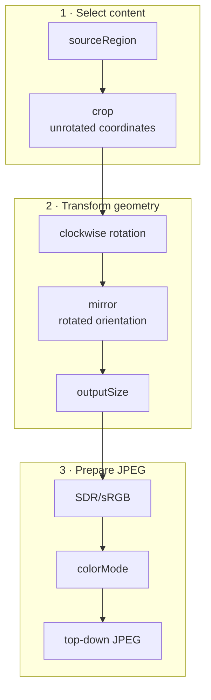

[README](../README.md) · Usage · [Architecture](architecture.md)

# Using ScreenStream Capture Engine

Follow one capture run from Android setup through JPEG delivery, live changes, monitoring, and shutdown.

## Contents

- [Android host prerequisites](#android-host-prerequisites)
- [Start a capture run](#start-a-capture-run)
  - [Configure session-wide behavior](#configure-session-wide-behavior)
- [Stop capture](#stop-capture)
- [Work with JPEG frames](#work-with-jpeg-frames)
  - [Read frame information](#read-frame-information)
  - [Inspect effective output](#inspect-effective-output)
  - [Choose how to copy JPEG data](#choose-how-to-copy-jpeg-data)
  - [Change or remove the frame consumer](#change-or-remove-the-frame-consumer)
- [Choose and update capture parameters](#choose-and-update-capture-parameters)
  - [Parameter reference](#parameter-reference)
  - [How image settings combine](#how-image-settings-combine)
  - [Set initial parameters](#set-initial-parameters)
  - [Update parameters while running](#update-parameters-while-running)
- [Monitor capture](#monitor-capture)
  - [Respond to lifecycle state](#respond-to-lifecycle-state)
  - [Watch output health](#watch-output-health)
  - [Record diagnostic context](#record-diagnostic-context)
  - [Handle failures and recovery](#handle-failures-and-recovery)
- [Critical limits](#critical-limits)

## Android host prerequisites

The host application owns Android's [user consent and `MediaProjection` integration](https://developer.android.com/media/grow/media-projection). It obtains a `MediaProjection` through that setup and keeps the required [`mediaProjection` foreground-service context](https://developer.android.com/develop/background-work/services/fgs/service-types#media-projection) active while capture can run. ScreenStream Capture Engine does not provide the consent flow, declare the host's required permissions or service, or start that service.

> [!IMPORTANT]
> Use a fresh `MediaProjection` for each `ScreenCaptureSession`. After passing it to `start()`, do not reuse it.

## Start a capture run

A `ScreenCaptureSession` represents one capture run. A frame consumer is the callback that receives JPEG frames; one session can have one registered consumer at a time.

Use this order so the consumer is ready for the first JPEG:

```kotlin
val session = ScreenCaptureEngine.createSession(context)

val registration = session.registerFrameConsumer { frame: EncodedImageFrame ->
    // Read frame information or copy the JPEG bytes here.
}

session.start(mediaProjection)
```

1. `createSession()` creates an idle session. It does not start screen capture.
2. `registerFrameConsumer()` sets the callback and returns a registration to use when replacing or removing it.
3. `start(mediaProjection)` begins capture with the fresh projection supplied by the host. The consumer receives a JPEG when one is ready.

Calling `start()` without `initialParameters` uses the [capture-parameter defaults](#parameter-reference). A session can be started only once; create a new session and obtain a new projection for another capture run.

`start()` is a main-safe suspending call. It returns after the session first becomes `Active`, without waiting for a source frame, JPEG, or consumer callback. Caller cancellation remains cancellation; after the call has been accepted, it also requests that the session stop. An engine startup failure throws `ScreenCaptureException` instead.

### Configure session-wide behavior

The default `createSession(context)` call uses the current default display for capture measurements and chooses the JPEG backend automatically. When a new session needs different fixed choices, pass a `ScreenCaptureConfig` while creating it. The selected configuration remains fixed for that session.

| Setting | Default | Purpose |
| --- | --- | --- |
| `captureMetricsSource: CaptureMetricsSource?` | `null` | Selects the source of capture width, height, and density. `null` follows the current default display; `CaptureMetricsSource.fromDisplay(context, display)` follows one `Display`; a custom source can supply app-managed metrics. |
| `jpegBackendPolicy: JpegBackendPolicy` | `JpegBackendPolicy.Auto` | Selects the JPEG backend policy. `JpegBackendPolicy.Auto` uses the optional Native backend when it is available and supported. Expected setup unavailability or lack of platform support selects Framework; unexpected Native failures retain their ordinary behavior. `JpegBackendPolicy.FrameworkOnly` selects Framework JPEG exclusively. |

A custom `CaptureMetricsSource` supplies one independent latest-value observation for each subscription. It reports positive `CaptureMetrics` while geometry is available or `null` while it is unavailable. The source controls callback timing and threading, so callbacks may be inline, reentrant, concurrent, or on source-owned threads. `onComplete()` freezes the current availability, while `onFailure()` ends the observation with a terminal source failure; callbacks after either event are ignored. `subscribe()` returns one non-null `AutoCloseable` that closes that exact observation. A custom source is responsible for keeping its Activity, window, display, and lifecycle policy consistent with the projection consent.

If Native compression is safely rejected during a run, the rejected frame is not retried; later frames use Framework.

For example, choose Framework JPEG explicitly instead of automatic selection:

```kotlin
val config = ScreenCaptureConfig(
    jpegBackendPolicy = JpegBackendPolicy.FrameworkOnly,
)
val session = ScreenCaptureEngine.createSession(context, config)
```

On API 34+, the metrics source's initial width and height are provisional. Android reports the accurate captured-content size through [`MediaProjection.Callback.onCapturedContentResize()`](https://developer.android.com/reference/kotlin/android/media/projection/MediaProjection.Callback#oncapturedcontentresize); startup and frame admission wait for the first valid resize dimensions, while the selected source continues to provide density.

## Stop capture

Call `session.stop()` when the capture run is no longer needed. It requests shutdown and may return before `session.state` reaches `Stopped` or `Failed`; observe `state` if the app needs the final session result. A stopped or failed session cannot restart, so create a new session with a fresh `MediaProjection` for another run.

## Work with JPEG frames

The frame-consumer callback receives an `EncodedImageFrame`, a temporary view of one complete JPEG and the information that describes it. Initialize any state used by the callback before calling `registerFrameConsumer()`: the callback may begin before that function returns. Callbacks for one consumer are serialized on engine-provided worker execution rather than the caller or UI thread, but they are not guaranteed to use the same physical thread each time.

> [!WARNING]
> An `EncodedImageFrame` is borrowed.\
> Access its properties and call `copyTo()` or `toByteArray()` only inside the receiving callback and on that callback thread. Copy the bytes before handing work to the UI or any longer-lived task.

### Read frame information

Read metadata directly while the callback is running:

| Member | Meaning |
| --- | --- |
| `byteCount: Int` | Positive size, in bytes, of the complete JPEG. |
| `sequence: Long` | Positive, nonrepeating sequence number within the session, starting at 1. |
| `timestampElapsedRealtimeNanos: Long` | Nonnegative timestamp, in nanoseconds on Android's elapsed-realtime clock, assigned to this frame. |
| `effectiveParameters: ScreenCaptureEffectiveParameters` | The capture settings applied to this JPEG. |

A consumer registered after capture is already running may first receive the latest existing JPEG. That delivery keeps the JPEG's original sequence, timestamp, and effective parameters. When `frameRepeatInterval` is enabled, the engine may deliver the latest JPEG again after a quiet period; a repeat uses the same encoded image but has a new sequence and timestamp.

### Inspect effective output

`frame.effectiveParameters` is the immutable description of the JPEG actually delivered. It records the applied parameters and the capture geometry used for that frame, which may differ from the latest request while a live update or geometry change is still being applied.

| Field | Meaning for this JPEG |
| --- | --- |
| `appliedParameters: ScreenCaptureParameters` | The requested image settings committed for this output. |
| `captureGeometry: CaptureGeometry` | The authoritative, unrotated capture width, height, and density used to resolve the output. |
| `appliedSourceRect: ImageRect` | The selected and cropped rectangle in unrotated capture coordinates, before rotation and mirroring. |
| `finalImageSize: ImageSize` | The encoded width and height after rotation, mirroring, and output sizing. |

Use this value when labeling or routing a copied JPEG if the app needs to know what was actually produced. The session's requested parameters describe the desired output; the frame's effective parameters describe the committed output for that JPEG.

### Choose how to copy JPEG data

When JPEG data must outlive the callback, choose one of two copy approaches.

**Reuse a destination buffer.** Use `copyTo()` when your app manages the destination's lifetime and wants to reuse its own storage:

```kotlin
var reusable = ByteArray(0)

val registration = session.registerFrameConsumer { frame: EncodedImageFrame ->
    if (reusable.size < frame.byteCount) {
        reusable = ByteArray(frame.byteCount)
    }

    val copied = frame.copyTo(reusable)
    // Use reusable[0 until copied] before this callback returns.
}
```

`copyTo()` returns the number of bytes copied. Only that prefix contains the current JPEG. Do not send the reused array to asynchronous work: a later callback may overwrite it. If an asynchronous receiver owns buffers from a pool, return each buffer to the pool only after that receiver is finished.

**Create an independent copy.** Use `toByteArray()` for the simplest standalone array to store or pass to another thread:

```kotlin
val registration = session.registerFrameConsumer { frame: EncodedImageFrame ->
    val ownedJpeg = frame.toByteArray()
    // Store or enqueue ownedJpeg.
}
```

The returned array contains exactly this JPEG and belongs to the app. This is the simplest ownership model, but it allocates and copies a contiguous array for each call.

### Change or remove the frame consumer

Keep the `FrameConsumerRegistration` returned by `registerFrameConsumer()`. Call `unregister()` when that consumer should stop receiving frames; the capture session keeps running. A successful `unregister()` waits for that registration's current callback to finish and closes later delivery. Await it before calling `stop()` only if the app needs that guarantee. To replace the consumer, finish unregistering before registering the next one:

If the frame consumer throws an ordinary `Exception`, the engine contains that callback failure and keeps the registration active for later frames.

```kotlin
registration.unregister()

val replacement = session.registerFrameConsumer { frame: EncodedImageFrame ->
    // Handle frames for the replacement consumer.
}
```

`unregister()` is a main-safe suspending call. Caller cancellation does not reopen delivery. If terminal stop or failure wins before unregister completes, the call ends with `CancellationException` or `ScreenCaptureException`, respectively.

Do not call `unregister()` from its own frame callback or block that callback waiting for unregister elsewhere: unregister waits for an entered callback to return. Return from the callback first, then call and await unregister from other application control flow.

## Choose and update capture parameters

The reference below shows each parameter's default, available choices, when to use them, and the visible result.

### Parameter reference

<table>
  <thead>
    <tr>
      <th>Parameter and default</th>
      <th>Options, use, and result</th>
    </tr>
  </thead>
  <tbody>
    <tr>
      <th colspan="2">Image and geometry</th>
    </tr>
    <tr>
      <th scope="row"><code>sourceRegion</code><br>Default: <code>SourceRegion.Full</code></th>
      <td>
        <ul>
          <li><code>SourceRegion.Full</code> captures the complete source.</li>
          <li><code>SourceRegion.LeftHalf</code> captures only its left half when the other side is unnecessary; the source must be at least 2 px wide.</li>
          <li><code>SourceRegion.RightHalf</code> captures only its right half under the same minimum width.</li>
        </ul>
      </td>
    </tr>
    <tr>
      <th scope="row"><code>crop</code><br>Default: <code>CropInsetsPx.ZERO</code></th>
      <td>
        <ul>
          <li><code>CropInsetsPx.ZERO</code> removes no edges.</li>
          <li><code>CropInsetsPx(left, top, right, bottom)</code> removes nonnegative pixel insets from the selected source to frame the needed content, and must leave nonempty content.</li>
        </ul>
      </td>
    </tr>
    <tr>
      <th scope="row"><code>rotation</code><br>Default: <code>Rotation.Degrees0</code></th>
      <td>
        <ul>
          <li><code>Rotation.Degrees0</code> keeps the current orientation.</li>
          <li><code>Rotation.Degrees90</code>, <code>Rotation.Degrees180</code>, and <code>Rotation.Degrees270</code> rotate clockwise by that amount to match the required output orientation.</li>
        </ul>
      </td>
    </tr>
    <tr>
      <th scope="row"><code>mirror</code><br>Default: <code>Mirror.None</code></th>
      <td>
        <ul>
          <li><code>Mirror.None</code> keeps the rotated image unchanged.</li>
          <li><code>Mirror.Horizontal</code> reflects left and right.</li>
          <li><code>Mirror.Vertical</code> reflects top and bottom.</li>
        </ul>
      </td>
    </tr>
    <tr>
      <th scope="row"><code>outputSize</code><br>Default: <code>OutputSize.ScaleFactor(0.5)</code></th>
      <td>
        <ul>
          <li><code>OutputSize.ScaleFactor(factor)</code> preserves proportions with a finite positive scale; the default <code>0.5</code> produces half the post-transform width and height.</li>
          <li><code>OutputSize.TargetSize(widthPx, heightPx, contentMode = OutputSize.ContentMode.AspectFit)</code> uses positive bounds, preserves aspect ratio, and adds no padding.</li>
          <li><code>OutputSize.TargetSize(widthPx, heightPx, contentMode = OutputSize.ContentMode.Stretch)</code> uses the exact positive dimensions and may distort the image.</li>
        </ul>
      </td>
    </tr>
    <tr>
      <th scope="row"><code>colorMode</code><br>Default: <code>ColorMode.Color</code></th>
      <td>
        <ul>
          <li><code>ColorMode.Color</code> produces a color JPEG.</li>
          <li><code>ColorMode.Grayscale</code> produces a grayscale JPEG when color is unnecessary.</li>
        </ul>
      </td>
    </tr>
    <tr>
      <th colspan="2">Frame timing</th>
    </tr>
    <tr>
      <th scope="row"><code>frameRate</code><br>Default: <code>FrameRate.Auto</code></th>
      <td>
        <ul>
          <li><code>FrameRate.Auto</code> follows available source frames and processing capacity.</li>
          <li><code>FrameRate.MaxFps(fps)</code>, <code>1..120</code>, caps fresh and repeated output without promising that rate.</li>
          <li><code>FrameRate.SamplingInterval(interval)</code>, <code>1,001..3,600,000 ms</code>, allows immediate processing of the first available fresh frame, then samples later fresh frames no more often than the interval.</li>
        </ul>
      </td>
    </tr>
    <tr>
      <th scope="row"><code>frameRepeatInterval</code><br>Default: <code>null</code></th>
      <td>
        <ul>
          <li><code>null</code> disables repeats.</li>
          <li><code>1,000..3,600,000 ms</code> requests a best-effort repeat after output silence when downstream needs periodic output; <code>MaxFps</code> can delay it.</li>
        </ul>
      </td>
    </tr>
    <tr>
      <th colspan="2">JPEG encoding</th>
    </tr>
    <tr>
      <th scope="row"><code>jpegQuality</code><br>Default: <code>80</code></th>
      <td>
        <ul>
          <li>An integer in <code>0..100</code> sets the JPEG quality hint; higher values usually preserve more detail and may produce larger files.</li>
        </ul>
      </td>
    </tr>
  </tbody>
</table>

### How image settings combine

Crop uses the unrotated selected-source coordinates, mirror directions apply after rotation, and output sizing uses the resulting orientation. Changing that order would change which content or edges appear in the JPEG.



### Set initial parameters

```kotlin
val initialParameters = ScreenCaptureParameters(
    outputSize = OutputSize.TargetSize(widthPx = 1280, heightPx = 720),
    frameRate = FrameRate.MaxFps(30),
)

session.start(
    mediaProjection = mediaProjection,
    initialParameters = initialParameters,
)
```

### Update parameters while running

Set values needed for the first output through `initialParameters` before `start()`. After `start()` returns, use `updateParameters()` for changes during that capture run.

```kotlin
session.updateParameters(
    initialParameters.copy(
        rotation = Rotation.Degrees90,
        colorMode = ColorMode.Grayscale,
    ),
)
```

`updateParameters()` requests the new settings without waiting for matching output. If the session is already ending or terminal, including a race with termination, the call throws `IllegalStateException` and applies no change; a separate state precheck is neither required nor race-free. `ScreenCaptureState.Active.effectiveParameters` shows the currently applied output, while `frame.effectiveParameters` describes the exact settings used for that JPEG.

## Monitor capture

Monitoring uses the same `ScreenCaptureSession` created for the current capture run:

```kotlin
val session = ScreenCaptureEngine.createSession(context)
```

That session exposes three read-only observation Flows:

| Flow | What it reports |
| --- | --- |
| `session.state: StateFlow<ScreenCaptureState>` | Current capture status, applied output, and problems that require app action. |
| `session.stats: StateFlow<ScreenCaptureStats>` | Cumulative output, drop, processing-time, and JPEG-size measurements. |
| `session.diagnosticEvents: SharedFlow<ScreenCaptureDiagnosticEvent>` | Individual notable events for logs and support reports. |

Keep each collection handler short and nonblocking. If reacting to an update requires a Session operation, start that Session work separately rather than synchronously waiting for it from the handler.

### Respond to lifecycle state

`session.state` is the source for UI or application behavior that depends on whether capture can currently produce output:

| State | What the app should understand |
| --- | --- |
| `NotStarted`, `Starting` | No output is ready yet. |
| `Active` | Capture can produce JPEGs. Read `effectiveParameters` for the current output and `isCapturedContentVisible` when Android provides that observation. |
| `Reconfiguring` | Output is paused while changed settings or source size are applied; wait for another state. |
| `Suspended` | A recoverable `problem` has paused output. Inspect the problem and requested settings; a changed parameter request or restored or changed capture geometry can trigger another attempt. The session returns to `Active` only after usable output is prepared. |
| `Stopped` | The run ended without a capture failure. `reason` distinguishes an app request from Android stopping the projection. |
| `Failed` | The run ended because of `problem`. Address that category before creating another session. |

The [visibility value](https://developer.android.com/reference/kotlin/android/media/projection/MediaProjection.Callback#oncapturedcontentvisibilitychanged) is optional and is unavailable on Android 7–13, so do not treat `null` as hidden content.

### Watch output health

Use `session.stats` for trends rather than per-frame decisions. Counters start at zero and cover the current run; averages and latest values come from that run:

| Field | Meaning |
| --- | --- |
| `encodedFrameCount: Long` | Successful fresh JPEG encodes. |
| `producedFrameCount: Long` | Fresh and repeated output produced, whether or not a consumer is registered. |
| `droppedFrames.total: Long` | Total frame-production drops. |
| `droppedFrames.byStaleWork: Long` | Otherwise-successful fresh work discarded because newer settings or capture geometry made its result obsolete. |
| `droppedFrames.byFailure: Long` | Fresh-frame production failures before output was produced. |
| `droppedDeliveries.byConsumerBusy: Long` | Deliveries skipped because the previous consumer callback was still busy. |
| `droppedDeliveries.byCallbackFailure: Long` | Consumer callbacks that threw an `Exception`. |
| `averageProducedFps: Double` | Average produced-output rate in frames per second. |
| `averageReadbackDuration: Duration` | Average duration of successful screen readbacks. |
| `averageEncodingDuration: Duration` | Average duration of successful JPEG encodes. |
| `lastEncodedByteCount: Int` | Size, in bytes, of the latest successful JPEG encode. |
| `averageEncodedByteCount: Int` | Average size, in bytes, of successful JPEG encodes. |

Statistics publication is activity-driven rather than timer-driven. Changes may remain pending while the session is `Suspended` and publish after later eligible activity while it is `Active`. At termination, final Stats are assigned before the terminal State, but the independent Flows do not guarantee that collectors observe those assignments atomically or in that order. Producing output while no consumer is registered is not counted as a drop.

### Record diagnostic context

Use `session.diagnosticEvents` only for troubleshooting. Events contain a sequence, approximate wall-clock time, source and event names, message, and optional cause. They are not replayed and may be omitted under load, so state—not diagnostic text or event arrival—must drive app behavior.

The three Flows update independently. Do not combine their latest values as if they described one synchronized instant.

### Handle failures and recovery

`session.state` is authoritative for lifecycle and recovery decisions. If startup terminates before the session becomes `Active`, `session.start()` throws `ScreenCaptureException`; inspect its `problem` property. After startup, the same stable problem categories appear in `Suspended.problem` for a recoverable pause or `Failed.problem` for a terminal failure. Diagnostic messages and causes are optional context and must not be parsed as failure semantics.

| Problem | Practical app action |
| --- | --- |
| `InvalidRequest` | Correct the parameters or wait for capture geometry that can satisfy them, then request valid parameters. |
| `CaptureUnavailable` | Check the projection, metrics source, and host lifecycle. If the state is `Suspended`, observe for recovery; if it is terminal, start a new run with fresh host authority. |
| `ResourceExhausted` | Reduce output or resource demand and retry according to the app's policy; a terminal session requires a new session. |
| `InternalFailure` | Preserve available diagnostic context, stop or retry according to the app's policy, and do not depend on the message or cause text. |
| `UnsupportedColorSpace` | Use a captured source/device that can be represented as the required SDR/sRGB output, or stop and retry according to the app's policy. |

The engine may recover from a `Suspended` state after a changed request or restored capture geometry, but it does not promise automatic retry for every problem. `Stopped` and `Failed` are terminal; create a new session and obtain fresh projection authority for another run.

## Critical limits

- Design the app to tolerate delayed or skipped frames. Frame-rate and repeat controls are limits or best-effort intervals, not timers or realtime guarantees.
- After recovery from `Suspended` or `Reconfiguring`, do not use the first delivered frame as proof that its pixels were captured after recovery; it may come from content already available to the capture path.
- Do not overlap active capture runs. Concurrent runs are unsupported and have no promised behavior, resource, or progress guarantees.
- Consume output as an opaque, top-down SDR/sRGB JPEG.
- Use source selection and crop for image composition, not privacy redaction; filtering can mix pixels near a selected edge.
- Protect every copied screen image according to the app's access-control, transport, storage, retention, and deletion policy.
