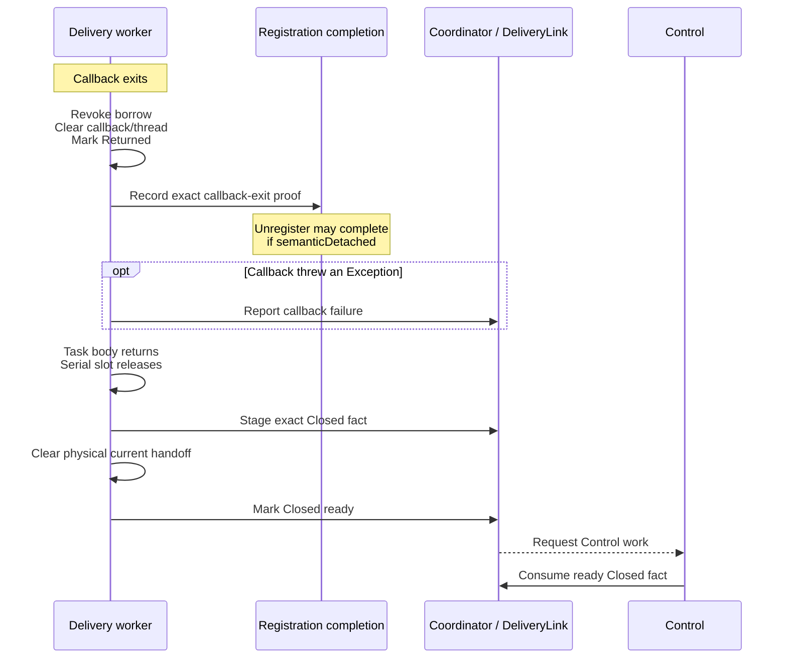

# Delivery

Delivery performs one physical callback handoff at a time. Public behavior is in [frame ownership and bounded delivery](../../docs/architecture.md#frame-ownership-and-bounded-delivery) and [Usage](../../docs/usage.md#replace-or-remove-the-consumer). Flow assignment and diagnostic mechanics belong to [Coordination](../01-session/coordination.md#observation-and-diagnostics).

## Contents

- [Delivery responsibility and owned roots](#delivery-responsibility-and-owned-roots)
- [Semantic offer and exact correlation](#semantic-offer-and-exact-correlation)
- [Borrowed frame lifetime](#borrowed-frame-lifetime)
- [Closure handoff and queue-less progress](#closure-handoff-and-queue-less-progress)
- [Consumer replacement and unregister](#consumer-replacement-and-unregister)
- [Implementation and verification](#implementation-and-verification)

## Delivery responsibility and owned roots

`DeliveryOwner` is the sole physical callback authority. It owns one queue-less handoff, its non-inline task, callback, borrowed public facade, entry/return state, and the immutable `PublishedFrame` roots required while that borrow can still be used. There is at most one admitted or executing handoff. A busy consumer drops a later delivery at the session policy layer; Delivery never queues it.

The session owns consumer registration admission, cached-first eligibility, semantic offer admission, drop accounting, and terminal selection. Each registration also owns a small gated completion record. Session Delivery reserves the exact `DeliveryHandoffToken` and installs its completion endpoint before any unlocked physical offer; the record retains only that token and callback-lifetime evidence, not callback or frame roots. The registration retains its own completion responsibility across Session termination and cancellation of individual waits. `SessionDeliveryLink` carries bounded identity correlation between one pre-minted token, its offer return, and physical facts. Delivery reports facts but never decides whether they remain current for Session accounting or which public counter changes.

Offer admission installs the complete handoff under Delivery's private gate before dispatch. Dispatch is non-inline, but acceptance proves neither entry nor progress. Rejection revokes the unopened borrow and clears the handoff without fabricating callback or closure facts. Pause and reconfiguration stop new semantic offers but do not revoke an already-admitted immutable frame.

## Semantic offer and exact correlation

`SessionDelivery` owns one registration, its callback, one-shot cached-first check, and one unresolved offer. It never invokes the application callback or accesses payload bytes. The offer retains the exact registration, pre-minted token, completion endpoint, callback, and published frame. `SessionDeliveryLink.prepareOfferLocked` installs correlation before physical dispatch; callback failure or closure can therefore arrive before the unlocked offer call returns.

The Link compares token identity as well as registration ID. A fact for an older registration is stale; a future ID or a different token at the same ID is a mismatch. One callback-failure fact may precede one closure. Duplicate failure/closure is not consumed twice, and callback failure after closure is a mismatch. Only ready closure is consumable. Recording a fact is distinct from applying its [Session consequence](../01-session/session.md#stable-problem-mapping).

A published-frame offer requires an open registration, no unresolved semantic offer, and a free physical handoff. Cached-first is a one-shot opportunity for that exact registration: a stale registration check cannot consume a successor's opportunity. Whether the latest frame is compatible is decided by [Production](../01-session/production.md#output-identity-and-cache-compatibility). Reconfiguration or pause suppresses new offers, while a previously admitted callback keeps its original immutable frame. No-consumer, busy-consumer, and rejected-submission outcomes remain distinct for [accounting](../01-session/production.md#accounting-before-terminal-freeze).

## Borrowed frame lifetime

On callback entry, Delivery records the exact executing thread and opens one `EncodedFrame` borrow over the retained immutable frame. For normal or caught-`Exception` callback completion, it revokes that borrow, clears the callback and marks the exact handoff `Returned` with its callback thread cleared, then records durable callback-exit evidence before any fallible fact publication. An escaping callback `Error` still revokes the borrow but does not reach this ordinary proof suffix.

The facade delegates every property and copy function through `BorrowedFrame.checkedFrame()`. That check requires an open borrow, a retained frame, and exact callback-thread identity before reaching immutable Storage. Wrong-thread or post-callback access throws `IllegalStateException`. The access gate is released before metadata retrieval or copying; same-thread callback ownership keeps the borrow valid for that operation.

`byteCount`, `sequence`, `outputTimestampElapsedRealtimeNanos`, and `outputInfo` are reads of the retained frame's immutable values. Storage's `copyTo(destination, destinationOffset)` computes the end in `Long` and validates the entire range before its first write; a negative offset or insufficient destination throws `IndexOutOfBoundsException` and leaves the destination unchanged. It then copies segments in order with `System.arraycopy` and returns the exact byte count. `toByteArray()` allocates one exact caller-owned array and performs the same copy. Allocation or copy failure does not mutate engine-owned bytes.

[Encoding](encoding.md#immutable-segmented-storage) owns segment adoption and invariants. Borrow revocation clears the retained-frame and callback-thread roots. A retained facade does not extend access; immutable metadata values read during the callback and successful caller-owned copies may outlive it. The app must keep its copied destination stable until asynchronous consumers finish with it; the engine tracks no downstream app ownership.

Callback `Exception`s produce at most one callback-failure fact after borrow revocation, subject to the [boundary-specific cancellation rule](../01-session/session.md#exception-and-cancellation-boundaries). Uncontained throwables still revoke the borrow but do not fabricate task release or closure. A callback that never returns keeps its callback, frame, payload, and serial occupancy rooted; elapsed time and terminal state are not return evidence. After an actual abnormal exit, unresolved physical occupancy is distinct from payload retention: neither continued payload retention nor reclamation timing is promised once the borrow is revoked.

## Closure handoff and queue-less progress

After application code returns, Delivery records one immutable `Closed` outcome. For Session accounting, serial-task release stages that exact fact in `SessionDeliveryLink` before clearing the physical `current`; the fact becomes ready for Control only after that handoff is released. Control can consume only ready closure.

This diagram follows a normal callback return or a caught callback `Exception`, with live Session correlation and successful reporting and scheduling. It separates registration proof from physical handoff release:

This two-phase stage/ready protocol prevents the session from admitting a successor while Delivery still physically owns the previous handoff. A staging failure retains the current handoff. A ready/wake failure may leave the physical slot free while the staged fact remains rooted; neither path retries or invents a receipt. The serial task releases its own occupancy before invoking this suffix, but Delivery's separate `current` still prevents physical overlap until staging succeeds and `current` is cleared. Registration completion may already have valid evidence while this closure protocol is unresolved. Session-facing retirement must not discard the only callback-exit evidence required by the registration's independent completion. Establishing that completion does not require reopening a frozen Session Link or admitting successor work.

A callback-failure reporting `Exception` becomes the closure's `InternalFailure` outcome. The durable callback-return proof was recorded before that report. Similarly, an uncontained throwable from later reporting may prevent physical closure without undoing already-recorded registration proof. This differs from an `Error` escaping the application callback itself: the borrow is revoked, but the ordinary callback-return proof suffix was never reached.

## Consumer replacement and unregister

`unregister()` closes new delivery and remains a cancellable wait for the exact registration's callback completion, independently of Session terminal state. An app may need this completion before closing a socket, encoder, or buffer still used by the callback. Session stop or failure does not itself end that wait exceptionally or make an entered callback count as returned. Successful completion proves that no callback for the registration can newly enter and that any entered callback has exited. Semantic registration detach may happen as soon as exact cutoff or callback-exit proof arrives, while the physical handoff remains occupied until its existing stage/release/ready path. [Session completion](../01-session/session.md#retirement-and-later-sessions) does not wait for this independent registration boundary.

Cancelling a caller's wait does not reopen delivery, cancel the underlying completion record, or prove successful drain. A later wait can still observe actual completion. A nonreturning callback can keep that wait pending without synthetic success. Completion ownership survives Session freeze without retaining unrelated roots or reviving Session work.

The registration completion predicate is `callbackSafe && semanticDetached`, claimed once. Exact pre-entry cutoff, a definite offer return that did not start, actual callback-return proof, or proof that no offer exists can establish callback safety. Session unregister/terminal logic establishes semantic detachment separately. Detachment can permit replacement before waiter notification and before physical handoff release; the still-unresolved Link and Delivery handoff continue to block a successor physical offer. All detach actions and waiter notification run after the registration's completion gate is released.

Only one unresolved registration exists per session. While the session is nonterminal, registering a replacement is legal after the prior registration's unregister settlement, not merely after clearing an app reference. The session may ask Delivery to cut off the exact registration's handoff and interprets only identity-matched evidence:

| Evidence | What it proves |
| --- | --- |
| `NoHandoff` | No matching physical handoff was visible at that instant; an offer call may still be in flight. |
| `CutoffBeforeEntry` | The queued callback cannot enter; task release may still be pending. |
| `Entered` | Callback entry occurred; return remains unproved. |
| ready `Closed` | The exact handoff reached its physical return suffix. |

Unregister may complete from exact pre-entry cutoff or exact callback-exit evidence. If cutoff observes no handoff while the offer call is unlocked, completion waits for that offer return and any required identity-matched cutoff. A later accepted offer permits one exact successor cutoff; a repeated `NoHandoff` from that successor is recorded as effective without retrying or inventing callback-exit proof. A definite return that did not start establishes callback safety. Cutoff's `Entered` result is deliberately coarse: it also covers the physical `Returned` state, so it cannot itself replace durable callback-return evidence. An entered callback is never interrupted. Self-unregister is recognized from the exact entered callback thread and rejected before mutation so it cannot wait on itself.

If unregister begins while ordinary publication is in flight, Session defers the physical action and requests Control work. The next admitted `runControlTurn` calls `executePendingUnregisterAction`, which claims at most one exact action from `SessionDelivery.claimPendingUnregisterAction`: either complete immediately when no offer remains or request cutoff for the exact outstanding offer.

Before terminal claim, Session calls Delivery's idempotent retirement fence outside session locks. Normal return prevents queued callback entry. Claim freezes Session-facing correlation and admission while retaining registration completion; it waits for neither callback return, task release, nor `Closed`. A real late return or exact queued cutoff may settle the durable completion record without reopening admission or changing frozen State/Stats. See [Session retirement](../01-session/session.md#retirement-and-later-sessions).

The [next-run boundary](../01-session/session.md#retirement-and-later-sessions) permits callbacks from different sessions to overlap. Each new session has its own registration, and the host coordinates application-owned resources shared by those callbacks.

## Implementation and verification

- [DeliveryOwner](../../src/main/kotlin/io/screenstream/capture/internal/delivery/DeliveryOwner.kt) owns physical admission, borrow access, callback proof, and stage/release/ready. [EncodedFrame](../../src/main/kotlin/io/screenstream/capture/EncodedFrame.kt) owns the public facade; [ImmutableEncodedPayload](../../src/main/kotlin/io/screenstream/capture/internal/storage/ImmutableEncodedPayload.kt) implements checked copies.
- [SessionDelivery](../../src/main/kotlin/io/screenstream/capture/internal/session/delivery/SessionDelivery.kt) owns registration and durable completion. [SessionDeliveryLink](../../src/main/kotlin/io/screenstream/capture/internal/session/SessionDeliveryLink.kt) correlates physical facts; [SessionCoordinator](../../src/main/kotlin/io/screenstream/capture/internal/session/SessionCoordinator.kt) applies admission, deferred unregister, and terminal policy.
- [Verification contracts](../04-testing/verification-contracts.md) `DEL-01`–`DEL-03` and `STO-01` distinguish executable checks from inspection. Focused [Delivery lifecycle tests](../../src/test/kotlin/io/screenstream/capture/internal/delivery/DeliveryOwnerLifecycleTest.kt), [Session Delivery tests](../../src/test/kotlin/io/screenstream/capture/internal/session/delivery/SessionDeliveryLifecycleTest.kt), and [Link correlation tests](../../src/test/kotlin/io/screenstream/capture/internal/session/SessionDeliveryLinkCorrelationTest.kt) exercise borrow checks, closure failures, offer races, and completion surviving terminal detach. [Coordination](../01-session/coordination.md#progress-limits) owns shared dispatch and nonreturning-work limits.
