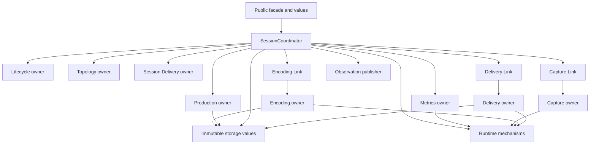

# Internal architecture overview

This document defines the component model and ownership boundaries of the Android capture library. Caller-visible behavior is in [Architecture](../../docs/architecture.md) and [Usage](../../docs/usage.md).

## Component boundaries

An internal component is an ownership and responsibility boundary. It is not necessarily one class, package, lock, or thread.

| Component | Owns | Does not own |
| --- | --- | --- |
| Public API (`io.screenstream.capture`) | Stable caller values, facade operations, and read-only observations | Resource policy or internal lifecycle state |
| Session (`internal.session`) | One run's lifecycle, desired/applied topology, production, registration, publication, and terminal decisions | Leaf-private resources or platform mechanics |
| Runtime (`internal.runtime`) | Clocks, non-inline dispatch, delayed scheduling, Handler posting, and queue-less single occupancy | Session policy, currentness, or failure classification |
| Metrics (`internal.metrics`) | Source subscription, bounded ingress, current immutable snapshot, and subscription close | Session lifecycle, plan selection, or startup deadline |
| Capture (`internal.capture`) | `MediaProjection`, Capture lane, virtual display, target surface, EGL/GLES, newest source availability, readback, and retirement | JPEG policy, delivery, or semantic revision selection |
| Encoding (`internal.encoding`) | RGBA carrier and loan, JPEG runtime/backend, encoded transaction, Native health, and retirement | Capture resources, Session lifecycle, or output publication |
| Storage (`internal.storage`) | Immutable encoded payload and published-frame value | Active storage policy, callback access, or scheduling |
| Delivery (`internal.delivery`) | One physical callback handoff and its callback-scoped borrowed frame | Registration policy, Stats, pacing, or terminal selection |
| Observation | Mechanical publication of already-built State, Stats, and diagnostics | Semantic selection or cleanup |

The Session component divides semantic state among four exclusive owners:

- `SessionLifecycle` owns start admission, startup eligibility, running/paused/terminal phase, terminal priority, and start settlement.
- `SessionTopology` owns desired and applied configuration, configuration revisions, metrics identity, plan convergence, effective output, readiness, and captured-content visibility.
- `SessionProduction` owns materialized production, cache, pacing and repeat schedules, output identity, and Stats.
- `SessionDelivery` owns consumer registration admission, cached-first eligibility, the outstanding semantic offer, and unregister admission. The registration's completion responsibility survives Session terminal freeze, as defined in [Delivery](../components/delivery-observation.md#consumer-replacement-and-unregister).

`SessionCoordinator` is the permanent transaction root around these owners. It joins cross-owner decisions, correlates leaf evidence, reserves publication, and authorizes effects after releasing its locks. It is not a fifth semantic store and must not mirror state owned by the four domains.

Three typed Links keep concrete leaf owners out of the semantic domains:

- `SessionCaptureLink` correlates the one bounded Capture command/result and current raw resize, visibility, source, and read evidence.
- `SessionEncodingLink` correlates reconcile and production requests, including the exact input-loan phase.
- `SessionDeliveryLink` correlates one physical handoff with its pre-minted token and staged completion facts.

A Link holds O(1) correlation only. It does not decide currentness, lifecycle, Stats, terminal outcome, or successor work. Leaf owners return through narrow typed ports and release their private synchronization before entering Session.

## Authority and ownership

The core transition shape is:

```text
immutable intent or leaf evidence
  -> Coordinator correlation and currentness check
  -> atomic semantic-owner commit
  -> unlocked publication or physical effect
  -> typed result ingress and revalidation
```

Physical ownership stays in the owner that can actually settle it. Session creation accepts the projection before capture starts; once Capture adopts it, Capture owns projection and graphics roots. Encoding owns carriers, tentative bytes, and backend work; Delivery owns callback entry and the temporary borrow. Semantic close or terminal State never transfers those resources to Coordinator and never proves that a physical call returned.

Before Capture adopts the projection, the session must retain that exact root and its cleanup responsibility, including when `start` never enters. `SessionBootstrap` and `BootstrapOwnership` cover physical bootstrap: they retain every constructed, untransferred lane until the exact first Control task enters or becomes cutoff-inert. On entry, Capture adopts the projection and each lane passes to its owner. Bootstrap creates no alternate Session authority or publication route. The public acceptance boundary is defined in [Session creation and projection ownership](runtime.md#session-creation-and-projection-ownership).

## Dependency direction

Arrows mean a narrow contract or mechanism may be used in that direction; they do not transfer semantic authority.



Public contract types are dependency roots. Capture and Encoding do not call each other: a `SessionReadBridge` binds one Capture read return to the exact Encoding input loan. Runtime and Storage contain no Session or leaf policy; Observation accepts complete public values without interpreting the Session protocol.

## Coordination identities

The engine uses the smallest identity needed for each boundary:

- `configRevision` is a positive, checked, Session-local number naming desired configuration.
- `registrationId` is a separate positive, checked, Session-local number naming a consumer registration.
- A `SessionProductionRecord` object identifies one materialized production and carries its owner, revision, and JPEG quality.
- Request objects, return ports, projection/source identities, Metrics snapshots, input loans, payloads, published frames, publication reservations, wake identities, and handoff tokens use exact object identity.

Checked numeric identities never wrap or repeat. Exhaustion makes no partial mutation and becomes `InternalFailure`. Exact object identity prevents a value-equal but unrelated callback, result, or candidate from settling current work.

## Cross-component invariants

- Only Coordinator joins semantic owners, Link correlation, and public publication into one transaction.
- Public State/Stats assignment, clocks, Android calls, codec work, callback invocation, payload copying, dispatch, cleanup, blocking, and waiting run outside both Session locks.
- A leaf result is physically settled first, correlated second, and admitted semantically only after exact identity and currentness checks. Stale or terminal-frozen evidence cannot revive Session work; exact callback-exit evidence may still settle independent registration completion.
- Mutable pixels and tentative encoded bytes remain inside Capture and Encoding ownership. Only a complete immutable payload can become a `PublishedFrame`.
- Delivery exposes frame access only during the exact callback and on the callback thread. Application-owned bytes exist only after a callback performs an explicit copy.
- Work is bounded: one materialized fresh production, one unresolved physical delivery handoff, latest-value ingress where applicable, and no general event or frame queue.
- A terminal claim closes semantic authority plus ordinary and alternate publication admission. The already-reserved terminal suffix remains the sole route for final Stats, the optional diagnostic, and terminal State. The claim does not assert callback return, task release, or physical resource cleanup.

See [Runtime flows](runtime.md) for transitions, [Concurrency and liveness](../contracts/concurrency-and-liveness.md) for synchronization and progress, and [Failures and terminal semantics](../contracts/failures-and-terminal-semantics.md) for failure folding.
