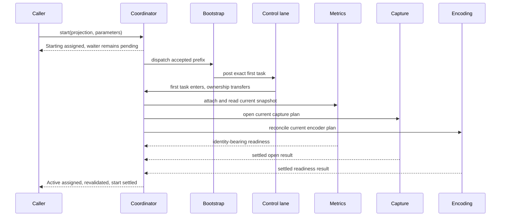

# Runtime flows

This document describes representative responsibility transitions within one capture run. It complements the reader-facing [session lifecycle](../../docs/architecture.md#session-lifecycle) without restating the public API. The component and ownership model is defined in [Internal architecture](overview.md).

## Start and first Active

Start has two distinct parts: semantic admission and physical bootstrap.

1. The caller path samples coroutine cancellation, reads elapsed realtime, and checked-constructs the single ten-second startup cutoff. These operations inspect neither the projection nor Session state.
2. Under `publicationGate -> sessionGate`, Lifecycle admits one start, Topology installs the initial desire, Bootstrap adopts the projection, and Coordinator reserves `Starting`. The Flow assignment occurs after both gates are released.
3. Runtime submits Bootstrap to its shared non-inline worker. Bootstrap starts the Control and Capture lanes, constructs the fixed graph, and posts one exact first Control task while retaining every untransferred root.
4. Entry of that task transfers the projection directly to Capture, transfers the lanes to their owners, installs the three Links and Metrics owner, and opens the first Coordinator turn. If terminal cutoff wins first, the task is inert and Bootstrap retains the prefix for safe retirement.
5. Coordinator attaches Metrics, opens Capture, resolves current Capture and Encoding plans, and waits for all current readiness evidence. On API 34+, the first authoritative captured-content resize participates in that readiness decision; Android documents resize and projection-stop callbacks in its [Media projection guide](https://developer.android.com/media/grow/media-projection#customization).
6. First `Active` is reserved only when the current immutable Metrics snapshot, topology, leaf readiness, Bootstrap acceptance facts, and strict startup cutoff all agree. After unlocked assignment, Coordinator revalidates the Metrics snapshot before opening output and completing `start`.

Dispatch or `Handler.post()` acceptance does not mean task entry. The two normal-true Bootstrap submission results are explicit readiness facts; neither substitutes for first-task entry or plan readiness. Definite rejection by the shared worker is a terminal internal failure. A normally returned `false` from the first Control post supplies no readiness fact, retry, replacement lane, or inline fallback; startup can therefore remain pending under the documented [progress limits](../contracts/concurrency-and-liveness.md#progress-limits).

## Reconfiguration and recovery

An unequal parameter update durably replaces the desired parameters and advances `configRevision`. Metrics changes, an authoritative resize, or a Session-wide Native-health change can invalidate the current plan without a caller update.

When an already-active plan becomes invalid, Coordinator atomically pauses affected output/work admission, invalidates incompatible cache, and commits `Reconfiguring` before the first resulting physical effect. Topology resolves the latest desire and current geometry, then Coordinator drives Capture Apply and Encoding reconcile through their Links. Each return is correlated to its exact request and checked against the current revision and plan. Only the current converged plan can reserve a new `Active` value and reopen production.

Intermediate desires may conflate before Control consumes them. An equal desire is a no-op after admission. Work started for an older revision keeps its old descriptor; if it becomes obsolete before output commit, Production accounts and discards it rather than relabeling it.

A recoverable current problem produces `Suspended` only after the Session has previously become Active. Recovery re-enters the same resolution and convergence path; there is no separate recovery controller. The detailed boundary between recoverable and terminal problems is in [Failures and terminal semantics](../contracts/failures-and-terminal-semantics.md).

## Fresh production and delivery

Fresh production begins only while Lifecycle permits production and Topology supplies a current ready plan.

1. A source callback records latest source availability; it does not start GPU or JPEG work itself.
2. Coordinator allocates one exact `SessionProductionRecord`, installs the matching Encoding request, and asks Encoding to lend one exact RGBA input capability.
3. After revalidating currentness, Production constructs a `SessionReadBridge` around that record and input. The bridge and loan are not yet installed in Capture.
4. Production evaluates fresh pacing against the previously sampled time. Only a current grant installs the bridge in the Capture Link and commits the pacing phase before dispatching the read. Deferred, denied, or stale pacing discards the uninstalled bridge and its exact input loan and advances no pacing phase.
5. A real Capture return allows Coordinator to authorize either encode or discard of the exact loan. Encoding alone settles the input and its tentative transaction before returning a result.
6. Coordinator accounts the settled result and revalidates the production record, revision, and plan. A successful current result becomes one immutable `PublishedFrame`; a successful stale result is accounted and discarded.
7. Session Delivery decides whether the current registration can receive the frame. `SessionDeliveryLink` installs a pre-minted handoff token before invoking physical Delivery. Delivery opens the borrowed frame only for the exact callback thread and revokes it on callback exit.

At most one materialized production spans read construction, Capture read, Encoding loan/transaction, and unpublished output. At most one callback invocation or unresolved submission exists. A busy consumer turns a later opportunity into a delivery-drop count rather than backlog. Cached-first delivery reuses the existing immutable frame identity; repeat output reuses its bytes but commits a new sequence and timestamp. See the public [frame ownership and bounded delivery](../../docs/architecture.md#frame-ownership-and-bounded-delivery) description for caller-visible behavior.

## Production schedules, cache, and statistics

Production is the semantic owner of fresh and all-output pacing history, cache and repeat eligibility, output identity, schedule identities, and accumulated Stats. Coordinator combines its immutable candidates with current Lifecycle, Topology, and Session Delivery evidence; only a revalidated committed grant advances pacing or publishes output. Fresh pacing and all-output pacing remain independent; repeat must satisfy both its quiet-period eligibility and all-output pacing, and fresh output wins a simultaneous opportunity. There is no catch-up output. Cache reuse likewise requires the exact current image-compatible plan and backend health. A change that invalidates that compatibility clears the cache before affected output admission can reopen.

Pacing and repeat each have at most one current logical wake and one stable Control callback. Suppression removes the corresponding wake without inventing successor work. A true replacement reposts that callback; a stale entry is inert. Dispatch rejection is a session failure, while accepted work that never enters remains subject to the shared liveness limits rather than authorizing a retry or replacement.

Stats publication is activity-driven, not a heartbeat. Ordinary changed Stats are eligible only on a naturally entered eligible `Active` Control turn whose elapsed-realtime sample is at least 1,000 ms after the previous ordinary Stats assignment. There is no Stats-only wake or catch-up; changes remain pending through ineligible turns and `Suspended` until a later eligible turn. Terminal publication bypasses ordinary cadence and assigns the final complete Stats before terminal State. Observation only publishes the already-selected values and owns none of this cadence or accounting policy.

## Stop and terminal transition

`stop()` offers `Requested` and closes ordinary public work before returning. Projection callback evidence offers the higher-priority `ProjectionStopped`; a contained fatal boundary offers `Failed(problem)`. An offer starts terminal contention but does not itself publish terminal State.

Coordinator makes progress toward one irreversible claim:

1. Physical Delivery retirement establishes an entry fence: queued callback work cannot newly enter, while an already-entered callback may return later or never return.
2. Coordinator consumes already-admitted Delivery facts and real Capture read returns that are eligible to affect final accounting.
3. With no ordinary publication in flight, one `publicationGate -> sessionGate` transaction prepares complete Lifecycle, Topology, Production, and Session Delivery terminal evidence, final Stats, terminal State, optional diagnostic request, and waiter settlements. In that same transaction Coordinator revalidates terminal priority and every owner candidate, prevalidates Capture/Encoding freeze, freezes Links, commits all four semantic owners, invalidates active topology, and records the sole publication claim.
4. The unlocked monotone suffix publishes final Stats, attempts the optional diagnostic, publishes terminal State, settles eligible `start`/`unregister` waiters, removes pacing/repeat callbacks, requests leaf retirement, and asks the Control thread to quit safely.

Terminal publication never waits for a callback, an accepted task, a Capture/Encoding operation, or resource retirement. Late real returns follow owner-local settlement and are cleanup-only after freeze. This is why the public [run outcome](../../docs/architecture.md#run-outcome-and-resource-release) is authoritative about the run but not a cleanup receipt.

Before first Control entry, the same claim and publication rules run through the pre-Control arbitration path. That path does not create a replacement executor or a second publication authority.
