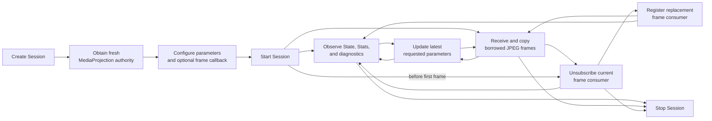

# Screen Capture Engine — Product and Public Design

This file is the product and public API source of truth. Internal mechanisms are defined in [02_architecture.md](02_architecture.md), and acceptance coverage is
defined in [03_verification.md](03_verification.md).

## 1. Purpose and status

This document is the product and public API source of truth for Screen Capture Engine V1. It defines caller-visible behavior, failure handling, and supported
limits.

The public package is `io.screenstream.engine`. The supported product baseline is Android 7/API 24 through Android 17/API 37.

V1 produces JPEG through a mandatory baseline and transparent optional accelerations that preserve the same public image contract. Runtime selection uses only
deterministic API, configuration, and capability facts; device allowlists, soak results, image-quality scores, and measured performance benefit never
participate. V1 provides best-effort SDR output, including defined handling of observable color-space information. Every public domain and result is closed.

## 2. Product model

Screen Capture Engine turns one Android `MediaProjection` capture into a sequence of JPEG images. An application creates a Session, optionally registers one
frame callback, starts with fresh projection authority, and may update capture parameters while the Session is running. State, Stats, and diagnostics are
available as Kotlin Flows.

Capture authority remains attached to one Session lifecycle while consumers may be replaced. At most one frame-callback path is active at a time, and controlled
consumer replacement does not stop or recreate the Session or consume new projection authority.

The default output selects the full source, scales it to half size, preserves orientation and color, emits frames as the source allows, and encodes framework or
capable native JPEG at quality 80. Applications can select a source half, crop, size, rotate, mirror, grayscale, pace, repeat, and change JPEG quality. V1 always
keeps a mandatory full-size capture path with Direct readback and may transparently use capable downscaled-target or native-JPEG paths without changing the public
image contract.



The sections below define the complete product and public API. Platform algorithms, concurrency, ownership, and cleanup are defined in
[02_architecture.md](02_architecture.md).

## 3. Public API

All declarations belong to `io.screenstream.engine`; imports and documentation annotations are omitted. The declarations in this section are the complete V1
public inventory.

### 3.1 Typical use

The application owns the consent UI, notification, permissions, and a compliant media-projection foreground service. On API 34+ it declares the
media-projection foreground-service permission and type, starts that typed service from an allowed foreground context, obtains one fresh projection, and then
starts the Session. An application targeting API 35+ does not start this service from `BOOT_COMPLETED`.

```kotlin
public object ScreenCaptureEngine {
    public fun create(context: Context, config: ScreenCaptureConfig = ScreenCaptureConfig()): ScreenCaptureSession
}

public interface ScreenCaptureSession {
    public suspend fun start(
        mediaProjection: MediaProjection,
        initialParameters: ScreenCaptureParameters = ScreenCaptureParameters(),
    ): Unit
    public fun updateParameters(parameters: ScreenCaptureParameters): Unit
    public fun onFrame(callback: (EncodedImageFrame) -> Unit): FrameSubscription
    public fun stop(): Unit
    public val state: StateFlow<ScreenCaptureState>
    public val stats: StateFlow<ScreenCaptureStats>
    public val diagnosticEvents: SharedFlow<ScreenCaptureDiagnosticEvent>
}

public interface FrameSubscription {
    public suspend fun unsubscribe(): Unit
}
```

```kotlin
val session = ScreenCaptureEngine.create(
    context = activity,
)

session.onFrame { borrowedFrame ->
    // Copy only when the bytes must outlive this callback.
    transport(borrowedFrame.copyBytes())
}

try {
    session.start(mediaProjection)
    session.updateParameters(ScreenCaptureParameters(frameRate = FrameRate.MaxFps(30)))
    runUntilApplicationStopsStreaming()
} finally {
    session.stop()
}
```

Applications may subscribe to `state`, `stats`, and `diagnosticEvents` before `start`.

To replace a consumer while the Session remains nonterminal, first await that subscription's `unsubscribe()` and register the replacement only after it returns
successfully. If a normal terminal stop wins that race, `unsubscribe()` throws the documented `CancellationException` and no replacement is registered; callers
handle that terminal result as applicable rather than delaying owner `stop()` behind the unsubscribe wait.

### 3.2 Session operations and lifecycle

| Operation | Visible contract |
| --- | --- |
| `create(context, config)` | Creates a fresh one-shot Session. It normally retains `context.applicationContext`; a configured metrics provider may retain the display association documented below. |
| `start(mediaProjection, initialParameters)` | Starts exactly once with fresh projection authority. Success returns after `Running(Active)` is visible; the first JPEG is not required. Repeated/concurrent calls throw `IllegalStateException` and do not touch their losing projection. Cancellation remains `CancellationException`. |
| `updateParameters(parameters)` | Synchronous latest-wins setter, legal in every nonterminal `Running` variant. It returns after the desired parameters are accepted, not after output changes. Equal desire is a no-op; unequal calls are totally ordered and intermediate desires may be conflated. |
| `onFrame(callback)` | Registers the one current consumer path and returns its subscription. Registration while another subscription has not successfully unsubscribed, or after terminal, throws `IllegalStateException`. |
| `FrameSubscription.unsubscribe()` | Idempotently closes new delivery for that subscription immediately, then suspends until the complete handoff settles, including any unresolved in-call dispatcher side after callback return. Callback return releases its frame authority and lease but does not permit replacement until `dispatch` returns or throws. Only successful unsubscribe return permits replacement registration. Failed/normal terminal results are defined below. It does not stop capture. |
| `stop()` | Idempotently commits owner stop and closes all new work before returning. Terminal State and physical cleanup may complete later; a callback that already entered may finish. |
| `state`, `stats`, `diagnosticEvents` | Hot observation surfaces described below. Flow access does not start capture. |

Before `start` is accepted, caller cancellation leaves the Session and supplied projection untouched. After acceptance, caller cancellation remains
`CancellationException`, commits `Stopped(OwnerStop)`, detaches that waiter, and lets entered mechanics converge independently. If
`Stopped(OwnerStop)` or `Stopped(CaptureEnded)` wins after accepted start but before `Running(Active)`, terminal State is assigned and `start` throws
`ScreenCaptureException(CaptureUnavailable)`. If `Failed(problem)` wins, terminal State is assigned and `start` throws
`ScreenCaptureException(problem)` with its selected cause. The first committed terminal fact is permanent. Within one controller turn, terminal priority is
`CaptureEnded`, then `OwnerStop`, then `Failed`.

Wrong-state behavior is closed:

`updateParameters` first runs the same bounded local scalar/structure validation as construction and throws `IllegalArgumentException` on violation. It then
linearizes the state/revision decision below; geometry/device validation belongs to asynchronous reconciliation.

| Call | State/condition | Exact result and side effects |
| --- | --- | --- |
| `start` | winning `NotStarted` | Accepts and transfers only that projection. |
| `start` | `Starting`, any `Running`, or terminal | Throws `IllegalStateException`; does not read, register, stop, or retain the supplied projection and allocates nothing. |
| `updateParameters` | `NotStarted`, `Starting`, or terminal after shared local validation | Throws `IllegalStateException` at its linearization point; publishes no desired revision and performs no projection/resource work. |
| `updateParameters` | any `Running`, structurally equal to current requested parameters | Returns `Unit` with requested parameters and revision unchanged. |
| `updateParameters` | any `Running`, unequal | Atomically replaces the latest desired parameters/revision, signals asynchronous reconciliation, and returns `Unit`. Revision exhaustion commits `Failed(InternalFailure)` and throws `ScreenCaptureException(InternalFailure)`. |
| `onFrame` | `NotStarted`, `Starting`, or any nonterminal `Running`, with no current registration | Registers; Suspended has no valid cached replay and waits for later output. |
| `onFrame` | a registration has not successfully unsubscribed, or terminal | Throws `IllegalStateException`; creates no generation, handoff, lease, or worker. |
| `unsubscribe` | any nonterminal state | Closes that registration immediately and waits as described above; a handle already successfully unsubscribed returns `Unit`. |
| `unsubscribe` | unresolved when `Failed(problem)` wins or is already visible | Throws `ScreenCaptureException(problem)`; any unresolved physical handoff remains retained and replacement stays forbidden. |
| `unsubscribe` | unresolved when `Stopped(...)` wins or is already visible | Throws `CancellationException`; any unresolved physical handoff remains retained and replacement stays forbidden. |
| `unsubscribe` | already returned successfully, then any terminal state | Remains idempotent and returns `Unit`. |

A Session never restarts. A later capture uses a new Session, new consent, and a fresh `MediaProjection`. `start` and `unsubscribe` are main-safe suspending
operations; `updateParameters`, `onFrame`, and `stop` are thread-safe, synchronous/nonblocking control calls. Heavy work is never performed on their caller
thread. Calling `unsubscribe` from that
subscription's own entered callback fails fast with `IllegalStateException` because it would wait on itself. Cancelling an unsubscribe waiter does not reopen
delivery or fabricate resolution; a later idempotent `unsubscribe` call on the same handle may await and successfully observe the real resolution. Failed and
normal terminal winners use the exact table mapping above. The engine retains each unresolved handoff and exactly the resources its unsettled sides still own
until real completion or process death, and no replacement can register.

A successful new subscription immediately admits delivery of the current valid cached JPEG when one exists; callback execution still follows the configured
dispatcher. Otherwise it waits for a future produced output. Cached-first delivery preserves the JPEG's original sequence, timestamp, image size, and bytes,
performs no encode, is not delayed by `MaxFps` or repeat pacing, and does not increment `framesProduced`. It uses the same single handoff slot and unsubscribe
rules as every other delivery. A synchronous caller-dispatcher throw/rejection drops only that delivery and increments `byDispatchFailure` when its disposition
commits before trampoline entry. If entry commits first, a later dispatcher return or throw cannot reclassify that delivery or change its counters. An inline
callback may return while the dispatch invocation itself remains unresolved: its borrowed-frame authority and encoded lease are released, but the sole handoff
and delivery-worker capacity remain occupied until that invocation actually returns or throws. A new delivery opportunity in that gap records
`byConsumerBusy`; it creates no record or worker. A pre-entry rejection leaves the subscription active for the next produced or cached opportunity and creates
no retry queue. A normally accepted pre-entry task that does not
enter within five seconds remains a terminal Session failure. A supported dispatcher eventually returns or throws from each `dispatch` invocation and
eventually executes an accepted task; a dispatcher that violates those caller-owned progress conditions may leave the sole handoff record unresolved, with no
second delivery admitted behind it.

If an entered frame callback throws and its return commits before terminal arbitration, the engine catches it at the callback boundary, records exactly one
`byCallbackFailure`, and resolves the borrowed-frame/callback side exactly once. The delivery record becomes reusable only after its dispatch-call side has
also settled, and then keeps the subscription active. A later eligible produced or cached output may
invoke that subscription again while the Session remains nonterminal. If terminal arbitration already transferred the unresolved callback occurrence to
cleanup, the same caught late throw changes no Stats, State, or `DeliveryProblem`. It may still cause the ordinary mandatory `QuarantineChanged` attempt when
consuming its receipt actually changes `SessionQuarantineRoot`; resolution completed before quarantine emits none.

Structural equality compares the full deeply immutable `ScreenCaptureParameters` graph with the current requested parameters, not merely today's resolved
pixels. A structurally different request receives a new revision even if it currently resolves to identical output, so a later geometry change still follows
the latest desire. Setter return acknowledges desired acceptance. A newer call may replace an unapplied intermediate value, and StateFlow publication may
follow the return and conflate intermediate requested snapshots. Applications observe reconciliation through requested versus effective state in the atomic
Running snapshot.

The latest desired value remains visible while reconciliation selects one of these outcomes. “After retirement” means the old output can no longer be resumed.
Capacity checks use only checked arithmetic and representation plus deterministic device/backend limits. Actual allocation and creation results are authoritative;
the engine does not sample available memory or predict whether a later allocation will succeed.

| Allocation/reconciliation outcome | Visible result |
| --- | --- |
| Startup cannot satisfy a deterministic device/backend capacity limit, or a required startup allocation/creation fails | Terminal `Failed(ResourceExhausted)`; `start` receives the matching `ScreenCaptureException` through the ordinary terminal mapping. |
| Current desire is invalid for current geometry | `Running(Suspended(InvalidRequest))`; retain the desire and retry after a new desire or geometry fact. |
| Capture or required metrics are unavailable | `Running(Suspended(CaptureUnavailable))`; retain the desire and retry after a new desire or availability/geometry fact. |
| Deterministic current mandatory capacity denial before retirement | `Running(Suspended(ResourceExhausted))`; retain the desire, park the old pipeline without output, and retry after a new desire, geometry, capture-availability, or relevant backend-health fact. |
| Current required allocation or creation failure after retirement | Terminal `Failed(ResourceExhausted)` with no rollback. |
| Current required pixel-storage or encoded-storage allocation failure during Running | Terminal `Failed(ResourceExhausted)`; this is not an optional-backend fallback. |
| Current safely returned optional-path failure | Disable only that optional acceleration monotonically and use its mandatory fallback for later work; do not retry the same frame. |
| Stale safe success or stale safe/clean failure | Commit no stale output or lifecycle failure; safely retire/settle that work and reconcile the latest desire. A materialized production attempt that mechanically returned a failure records `byFailure` even when its key is stale; `byStaleWork` is reserved for otherwise successful work suppressed solely by stale identity. A safely returned failure of a still-current Session-monotone optional-health occurrence may also disable that path so it cannot be reused. |
| Unsafe or ownership-ambiguous failure, including stale work | Terminal `Failed(InternalFailure)`. |

`Stopped` or `Failed` means the Session is terminal: the engine's capture authority for that Session, capture/delivery admission, and all new public work have
ended. It is not a physical cleanup or projection-stop receipt. Physical cleanup may continue asynchronously or retain unresolved resources until process
death; the API exposes no cleanup-completion handle or Flow.

### 3.3 Configuration, metrics, and display selection

```kotlin
public class ScreenCaptureConfig(
    public val captureMetricsProvider: CaptureMetricsProvider? = null,
    public val frameCallbackDispatcher: CoroutineDispatcher = Dispatchers.Default,
    public val jpegBackendPolicy: JpegBackendPolicy = JpegBackendPolicy.Auto,
)

public enum class JpegBackendPolicy { Auto, FrameworkOnly }

public fun interface CaptureMetricsProvider {
    public fun observe(): Flow<CaptureMetrics?>
}

public class CaptureMetrics(
    public val widthPx: Int, public val heightPx: Int, public val densityDpi: Int,
)

public object CaptureMetricsProviders {
    public fun fromDisplay(context: Context, display: Display): CaptureMetricsProvider
}
```

| Config field | Meaning | Default | Domain and interaction |
| --- | --- | --- | --- |
| `captureMetricsProvider` | Supplies capture width, height, and density changes. | `null` | Null creates a Session-private provider bound to `Display.DEFAULT_DISPLAY` through the application `DisplayManager`. `fromDisplay` returns an immutable reusable built-in definition for one explicitly selected logical Display; a custom provider supplies Activity-, window-, or caller-lifecycle-following policy. On API 24–33 provider width, height, and density are authoritative. On API 34–37 provider width/height are provisional until the first valid projection-resize callback, after which that callback is authoritative for width/height; provider density remains live and authoritative throughout. |
| `frameCallbackDispatcher` | Dispatcher used only to enter the application frame callback. | `Dispatchers.Default` | Nonnull and caller-owned; the engine never closes it. Deliberately undispatched/Unconfined callback execution is unsupported. A supported dispatcher eventually returns or throws from each `dispatch` invocation and eventually executes an accepted task. An ordinary dispatcher may still enter inline according to its contract, which the handoff handles. |
| `jpegBackendPolicy` | Chooses whether native JPEG may be used. | `Auto` | `Auto` selects native JPEG whenever its API/runtime checks pass and otherwise uses Framework. `FrameworkOnly` never attempts native JPEG. Native health is Session-monotone: a safely returned Native runtime failure disables Native for the remainder of the Session when its health occurrence is still current, whether the work key is current or stale. The attempt records `byFailure`; a current-key failure drops that frame without retry and uses Framework for later frames, while a stale-key failure publishes no stale frame or lifecycle failure. Unsafe ownership remains terminal. JPEG backend and target selection remain independent. |

`CaptureMetrics(widthPx, heightPx, densityDpi)` requires all three values to be positive. A custom provider returns a cold `Flow<CaptureMetrics?>`; null means
the currently associated geometry is unavailable. `fromDisplay(context, display)` returns an immutable reusable definition fixed to the supplied exact
logical Display as metrics authority. A missing or invalid association at construction throws `IllegalArgumentException`; later unavailability emits null and
the same association may recover. The caller remains responsible for matching that Display to the source selected by projection consent. A custom provider
expresses Activity-, window-, dynamic-display-, or caller-lifecycle-following policy.

The built-in definition's `observe()` returns a cold Flow whose direct, repeated, concurrent, and cross-Session collections are independent. Each collection
owns its listener and state, delivers `DisplayListener` callbacks through an engine-private Handler backed by the process Main Looper, and performs
registration, reads, emission, and unregister in its upstream context. Callback work is limited to a fenced constant-time refresh signal; a late callback is
inert after collection closure. The engine invokes `observe()` once on the exact configured provider object; null configuration creates one Session-private
internal default-display provider and invokes that exact object. It collects the returned Flow until completion, classified provider failure, or terminal
cancellation. Visible outcomes are:

| Provider outcome | Visible Session behavior |
| --- | --- |
| Completion before a valid value or first-valid-value timeout | `start` throws `ScreenCaptureException(CaptureUnavailable)` and the Session becomes `Failed(CaptureUnavailable)`. |
| Getter throw, unusable Flow, or collection throw before the first valid value | `start` throws `ScreenCaptureException(InternalFailure)` and the Session becomes `Failed(InternalFailure)`. |
| Required metrics become null or otherwise unusable after a first valid value but before `Running(Active)` | `start` throws `ScreenCaptureException(CaptureUnavailable)` and the Session becomes `Failed(CaptureUnavailable)`. One source-`MetricsProvider` `CapabilityCheck` attempt identifies startup metrics loss and carries the raw boundary cause when one exists and otherwise null; `SessionTerminal` follows. |
| Normal completion after a valid value | The last valid metrics remain active and one source-`MetricsProvider` `CapabilityCheck` attempt identifies successful metrics completion. |
| Collection throw after a valid value | The Session becomes `Failed(InternalFailure)`. |
| Null runtime value, or no usable positive provider/source geometry, after `Running(Active)` | Output becomes `Running(Suspended(CaptureUnavailable, ..., lastKnownCaptureGeometry))`; the last valid committed capture geometry is retained. |
| Later valid runtime value | The Session may recover and publish `Running(Active)` after any required resize/rebuild. |

`Unusable Flow` means exactly a null Flow reference returned through Java/platform interop. A throw from `observe()` is a getter throw; every nonnull Flow is
collected, and any later throw is classified before/after first valid value as above. A `CancellationException` from provider code while metrics collection
remains active is classified as that provider's throw. Cancellation caused by the terminal metrics-cancellation intent remains mechanics cancellation. The
engine performs no separate runtime coldness probe.

On API 34–37, the first valid projection-resize callback replaces provisional provider width/height; provider density remains live. These rules do not change
that authority split. Requesting metrics-collection cancellation during shutdown records cancellation intent; it is not proof that collection mechanics have
returned. The sole metrics-lifecycle completion receipt proves that lifecycle has completed, including cancellation before collection entry, and the
[cleanup forest](02_architecture.md#73-cleanup-forest) defines the cleanup consequence. A positive geometry that is incompatible with the requested half/crop
is an `InvalidRequest`, not `CaptureUnavailable`.

### 3.4 Capture parameters

```kotlin
public class ScreenCaptureParameters(
    public val sourceRegion: SourceRegion = SourceRegion.Full,
    public val crop: CropInsetsPx = CropInsetsPx.Zero,
    public val outputSize: OutputSize = OutputSize.ScaleFactor(0.5),
    public val rotation: Rotation = Rotation.Degrees0,
    public val mirror: Mirror = Mirror.None,
    public val colorMode: ColorMode = ColorMode.Color,
    public val frameRate: FrameRate = FrameRate.Auto,
    public val frameRepeatIntervalMillis: Long? = null,
    public val jpegQuality: Int = 80,
)

public enum class SourceRegion { Full, LeftHalf, RightHalf }

public class CropInsetsPx(
    public val left: Int, public val top: Int, public val right: Int, public val bottom: Int,
) {
    public companion object { public val Zero: CropInsetsPx }
}

public sealed interface OutputSize {
    public class ScaleFactor(public val factor: Double) : OutputSize
    public class TargetSize(
        public val width: Int, public val height: Int,
        public val contentMode: ContentMode = ContentMode.AspectFit,
    ) : OutputSize
}

public enum class ContentMode { Stretch, AspectFit }
public enum class Rotation { Degrees0, Degrees90, Degrees180, Degrees270 }
public enum class Mirror { None, Horizontal, Vertical }
public enum class ColorMode { Color, Grayscale }

public sealed interface FrameRate {
    public object Auto : FrameRate
    public class MaxFps(public val fps: Int) : FrameRate
    public class SampleEvery(public val intervalMillis: Long) : FrameRate
}
```

| Parameter | Meaning | Default | Domain and interaction |
| --- | --- | --- | --- |
| `sourceRegion` | Chooses the full source, left half, or right half before other transforms. | `Full` | `Full`, `LeftHalf`, or `RightHalf`. A half-region requires authoritative source width of at least 2 px; for odd widths the right half owns the final column. Half selection disables the downscaled capture target but not output scaling. |
| `crop` | Removes pixels from the selected region's unrotated left, top, right, and bottom edges. | `CropInsetsPx.Zero` | Every inset is nonnegative. Feasibility against authoritative geometry is evaluated during startup or reconciliation, where the resulting source must remain nonempty. Crop is selection, not privacy redaction, because filtering can mix edge texels. Any nonzero crop uses the Full capture target. |
| `outputSize` | Resolves the final JPEG dimensions after region, crop, and rotation. | `ScaleFactor(0.5)` | `ScaleFactor.factor` is finite and positive. `TargetSize.width/height` are positive; `Stretch` uses them exactly, while `AspectFit` fits without padding. Only a scale below 1 with Full source and zero crop can select the downscaled target. |
| `rotation` | Rotates cropped content clockwise before mirror and sizing. | `Degrees0` | `Degrees0`, `Degrees90`, `Degrees180`, or `Degrees270`; 90/270 swap oriented dimensions. |
| `mirror` | Mirrors the oriented image. | `None` | `None`, `Horizontal`, or `Vertical`; horizontal/vertical refer to the image after rotation. |
| `colorMode` | Chooses color or grayscale output. | `Color` | `Color` or `Grayscale`. Grayscale runs after source color handling and sizing. |
| `frameRate` | Controls admission of fresh source frames. | `Auto` | `Auto` uses source/capacity pace. `MaxFps(1..120)` caps fresh work and all publication. `SampleEvery(1_001..3_600_000ms)` admits the first eligible current source immediately, then requests fresh sampling slower than 1 FPS, up to once per hour. Timing is best effort. |
| `frameRepeatIntervalMillis` | Requests a target maximum interval between produced outputs by republishing the latest valid JPEG during static content. | `null` | Null disables repeat; otherwise `1_000..3_600_000ms`. This is best effort, not a deadline guarantee. Repeat changes sequence/timestamp but performs no capture, transform, JPEG encode, or payload copy. Fresh output wins ties and `MaxFps` still caps produced publication. Cached replay to a new subscription is the explicit `MaxFps` exception described above. |
| `jpegQuality` | JPEG encoder quality hint. | `80` | `0..100`. Changing quality invalidates the repeat source so bytes encoded under the old quality are not repeated. |

The visible transform composition is fixed:

```text
source region -> unrotated crop -> clockwise rotation -> oriented mirror
-> output sizing -> source-to-SDR/sRGB handling -> color mode -> top-down JPEG rows
```

Let `(Rw,Rh)` be the positive oriented dimensions after region, crop, and rotation. `ScaleFactor(f)` resolves in this exact binary64 order:

```text
scaledW = binary64(Rw) * f; roundedW = floor(scaledW + 0.5)
scaledH = binary64(Rh) * f; roundedH = floor(scaledH + 0.5)
Ow = max(1, checkedNonNegativeInt(roundedW))
Oh = max(1, checkedNonNegativeInt(roundedH))
```

`checkedNonNegativeInt` accepts exactly `0..Int.MAX_VALUE`. A nonfinite product/sum or an out-of-range rounded value is `InvalidRequest`: start throws
`ScreenCaptureException(InvalidRequest)`, while a Running reconciliation uses the outcome table in Section 3.2. The only size clamp is the documented minimum
of one. `TargetSize.Stretch` uses its requested dimensions exactly. For `TargetSize(A,B,AspectFit)`, checked positive Long arithmetic
uses no padding: when `A*Rh <= B*Rw`, `Ow=A` and `Oh=min(B,max(1,(A*Rh+Rw/2)/Rw))`; otherwise `Oh=B` and
`Ow=min(A,max(1,(B*Rw+Rh/2)/Rh))`. These integer formulas use half-up rounding.

`MaxFps(1)` is the one-frame-per-second maximum; it is not a delivery guarantee. Parameter objects validate their local scalar/structural domains immediately
with `IllegalArgumentException`. Geometry-dependent validity and device feasibility are checked by `start` or asynchronous reconciliation after a setter
accepts desire; the action matrix is in [Latest desired parameters](02_architecture.md#21-latest-desired-parameters).

The adjacent millisecond domains are intentional: `MaxFps(1)` owns fresh/output pacing at up to once per 1,000 ms, so `SampleEvery` starts at 1,001 ms to mean
strictly slower fresh sampling. Repeat starts at 1,000 ms because it may target one cached republication per second without acquiring or encoding a fresh frame;
`MaxFps` still caps that produced repeat, while a new-subscription cached replay remains the explicit exception.

### 3.5 Frame delivery and effective output

```kotlin
public class ImageRect internal constructor(
    public val left: Int, public val top: Int, public val right: Int, public val bottom: Int,
)

public class CaptureGeometry internal constructor(
    public val widthPx: Int, public val heightPx: Int, public val densityDpi: Int,
)

public class ImageSize internal constructor(
    public val widthPx: Int, public val heightPx: Int,
)

public class ScreenCaptureEffectiveParameters internal constructor(
    public val captureGeometry: CaptureGeometry,
    public val sourceRegion: SourceRegion,
    public val crop: CropInsetsPx,
    public val appliedSourceRect: ImageRect,
    public val outputSize: OutputSize,
    public val finalImageSize: ImageSize,
    public val rotation: Rotation,
    public val mirror: Mirror,
    public val colorMode: ColorMode,
    public val frameRate: FrameRate,
    public val frameRepeatIntervalMillis: Long?,
    public val jpegQuality: Int,
)

public interface EncodedImageFrame {
    public val byteCount: Int
    public val imageSize: ImageSize
    public val sequence: Long
    public val timestampElapsedRealtimeNanos: Long
    public fun copyTo(destination: ByteArray, destinationOffset: Int = 0): Int
    public fun copyBytes(): ByteArray
}
```

`CaptureGeometry` is the authoritative source width, height, and density currently used by the Session. `ImageSize` is a positive width/height pair owned by
the engine. `ImageRect` is a left/top-inclusive, right/bottom-exclusive rectangle in that source. `ScreenCaptureEffectiveParameters` reports the current geometry, caller selections, applied source rectangle,
final image size, pacing/repeat, and JPEG quality from the last committed startup/reconciliation; it is observation, not a reusable mutable config object.

| Frame member | Meaning |
| --- | --- |
| `byteCount` | Exact number of JPEG bytes available through this lease. |
| `imageSize` | Width and height represented by the JPEG. |
| `sequence` | Session-local produced-frame sequence, starting at one; repeats receive a new sequence. |
| `timestampElapsedRealtimeNanos` | Engine elapsed-realtime sample at output commit; equal timestamps are allowed. |
| `copyTo(destination, destinationOffset)` | Copies exactly `byteCount` bytes after validating the entire destination range. Invalid range throws `IndexOutOfBoundsException` and copies nothing. |
| `copyBytes()` | Returns a new exact-sized caller-owned byte array. |

The frame object itself is borrowed: every property and copy operation is legal only on the callback thread and only until that callback returns. Wrong-thread
or post-return access throws `IllegalStateException`. Copy bytes inside the callback when they must outlive it.

### 3.6 State and errors

```kotlin
public sealed interface ScreenCaptureState {
    public object NotStarted : ScreenCaptureState
    public object Starting : ScreenCaptureState
    public class Running internal constructor(
        public val requestedParameters: ScreenCaptureParameters,
        public val runningState: ScreenCaptureRunningState,
        public val capturedContentVisible: Boolean?,
    ) : ScreenCaptureState
    public class Stopped internal constructor(
        public val reason: ScreenCaptureStopReason,
        public val requestedParameters: ScreenCaptureParameters,
        public val lastEffectiveParameters: ScreenCaptureEffectiveParameters?,
    ) : ScreenCaptureState
    public class Failed internal constructor(
        public val problem: ScreenCaptureProblem,
        public val requestedParameters: ScreenCaptureParameters,
        public val lastEffectiveParameters: ScreenCaptureEffectiveParameters?,
    ) : ScreenCaptureState
}

public sealed interface ScreenCaptureRunningState {
    public class Active internal constructor(
        public val effectiveParameters: ScreenCaptureEffectiveParameters,
    ) : ScreenCaptureRunningState
    public class Suspended internal constructor(
        public val problem: ScreenCaptureProblem,
        public val lastEffectiveParameters: ScreenCaptureEffectiveParameters,
        public val lastKnownCaptureGeometry: CaptureGeometry?,
    ) : ScreenCaptureRunningState
}

public enum class ScreenCaptureStopReason { OwnerStop, CaptureEnded }

public enum class ScreenCaptureProblem {
    InvalidRequest, CaptureUnavailable, Reconfiguring, ResourceExhausted, InternalFailure,
}

public class ScreenCaptureException internal constructor(
    public val problem: ScreenCaptureProblem,
    cause: Throwable? = null,
) : Exception(problem.name, cause)
```

| State/variant | Meaning |
| --- | --- |
| `NotStarted` | Fresh Session; no projection has been accepted. |
| `Starting` | The one start request has been accepted and startup is in progress. |
| `Running(Active)` | Output is active through an actually owned, healthy live topology compatible with `effectiveParameters`; `requestedParameters` is the latest accepted desire, so the two may differ while reconciliation is pending. A historical effective value alone cannot make the Session Active after its resources were retired. |
| `Running(Suspended)` | The Session is alive but output is unavailable/reconfiguring. The enclosing Running still carries latest `requestedParameters`; Suspended reports the problem, last committed effective parameters, and nullable last-known geometry. |
| `Stopped(OwnerStop)` | The application stopped the Session or cancelled accepted startup; terminal retains final requested and nullable last-effective parameters. |
| `Stopped(CaptureEnded)` | Android ended projection authority; terminal retains final requested and nullable last-effective parameters. |
| `Failed(problem)` | The Session ended because of the problem and retains final requested and nullable last-effective parameters. |

`capturedContentVisible` starts null. It remains null on API 24–33; on API 34–37 it becomes the latest value received from
`MediaProjection.Callback.onCapturedContentVisibilityChanged(Boolean)`. It is informational and has no capture, pacing, fallback, or lifecycle authority.
`lastKnownCaptureGeometry` is historical observation only. Its being nonnull never proves that current capture geometry is available or that requested output
has reconciled.

Every Running value is one immutable snapshot of `requestedParameters`, running/effective state, and visibility. Terminal values freeze the final requested
parameters and last committed effective parameters (`null` if none ever committed); observers never join these fields from separate Flows.

| Problem | Caller meaning |
| --- | --- |
| `InvalidRequest` | Caller geometry/parameters cannot produce the requested result. |
| `CaptureUnavailable` | Projection, capture source, or required capture metrics are unavailable, including stopped/revoked/reused projection and API 34+ projection-resize readiness failure. |
| `Reconfiguring` | Reports the post-retirement reconciliation gap: output is suspended after irreversible retirement and before a current result commits. |
| `ResourceExhausted` | A clean device, backend, memory, or allocation limit denied the request. |
| `InternalFailure` | Android, EGL/GL, JPEG, ownership, or engine behavior became unsafe or inconsistent. |

During the single `MediaProjection.createVirtualDisplay` attempt, a null result or `SecurityException` is `CaptureUnavailable`, and an
`OutOfMemoryError` thrown directly by that call is `ResourceExhausted`. `IllegalStateException` and every other unexpected throwable are `InternalFailure`.

Suspending operations report engine problems as `ScreenCaptureException(problem, cause)` and preserve ordinary coroutine cancellation as
`CancellationException`; `unsubscribe` also uses `CancellationException` for a normal Stopped winner as defined in Section 3.2. Detailed component information
belongs to diagnostics rather than the compact public problem enum.

### 3.7 Stats and diagnostics

```kotlin
public class ScreenCaptureStats internal constructor(
    public val framesEncoded: Long, public val framesProduced: Long,
    public val droppedFrames: ScreenCaptureFrameDropStats,
    public val droppedDeliveries: ScreenCaptureDeliveryDropStats,
    public val averageProducedFps: Double, public val averageEncodeMs: Double,
    public val averageReadbackMs: Double, public val lastEncodedByteCount: Int,
    public val averageEncodedByteCount: Int,
)

public class ScreenCaptureFrameDropStats internal constructor(
    public val byRateLimit: Long, public val byPipelineBusy: Long,
    public val byStaleWork: Long, public val byFailure: Long,
) { public val total: Long get() = saturatingSum(byRateLimit, byPipelineBusy, byStaleWork, byFailure) }

public class ScreenCaptureDeliveryDropStats internal constructor(
    public val byConsumerBusy: Long, public val byDispatchFailure: Long,
    public val byCallbackFailure: Long,
) { public val total: Long get() = saturatingSum(byConsumerBusy, byDispatchFailure, byCallbackFailure) }

public class ScreenCaptureDiagnosticEvent internal constructor(
    public val sequence: Long,
    public val timestampEpochMillis: Long,
    public val source: String,
    public val label: String,
    public val message: String,
    public val cause: Throwable? = null,
)
```

| Stats member | Meaning |
| --- | --- |
| `framesEncoded` | Successful fresh JPEG encodes; repeat does not increment it. |
| `framesProduced` | Fresh plus repeat output commits, whether or not a frame consumer is registered. Cached-first delivery does not increment it. |
| `droppedFrames` | Classified materialized fresh-attempt outcomes that do not commit a produced output. Terminal retirement of unclassified or unpublished work is not a frame drop. |
| `droppedDeliveries` | Classified handoff/callback losses while a frame registration is active; output produced with no registration is not a delivery drop. |
| `averageProducedFps` | Produced-output rate over the exact elapsed window from the first production commit through the latest production commit, including repeats. It is `0.0` until at least two outputs exist or when that elapsed window is nonpositive. |
| `averageEncodeMs`, `averageReadbackMs` | Finite running means over mechanically successful real operations; repeats add no samples. |
| `lastEncodedByteCount`, `averageEncodedByteCount` | Latest and rounded running-mean sizes of successful fresh encodes. |

Every numeric field is zero at creation. A mean is `0.0` with zero samples. `averageEncodedByteCount` is zero with no encode samples and otherwise
`min(Int.MAX_VALUE, floor(meanBytes + 0.5))`. Produced FPS is zero with fewer than two production commits or a nonpositive first-to-last interval; otherwise it
is `(framesProduced - 1) * 1e9 / (lastProductionTime - firstProductionTime)`, including repeats and elapsed suspension/deep-sleep time inside that window.
Counters and aggregate totals saturate at `Long.MAX_VALUE` rather than wrap. Public Doubles are always finite: a nonfinite mean update retains its last finite
value, a nonfinite exposed FPS clamps to the greatest finite Double, and a saturated contributing count freezes its derived mean/FPS at the last finite value.

Frame-drop fields expose the retained `byRateLimit` field, occupied pipeline capacity, otherwise successful work suppressed solely by stale identity, and
mechanically returned production failure. A fresh source signal received before its pacing boundary remains the sole unmaterialized latest-pending source and
is processed when eligible; V1 pacing therefore creates no rate-limit drop and `byRateLimit` remains zero. Deferral increments no other dropped-frame field. A
returned failure records
`byFailure` even if its work identity is stale; safe staleness prevents output and lifecycle failure, while unsafe failure retains the terminal rule.
Delivery-drop fields distinguish a busy consumer slot, caller-dispatcher rejection/failure, and a callback that
threw. Engine delivery-worker scheduling rejection is an internal Session failure, not `byDispatchFailure`. Each `total` is the saturating sum of its fields.
Counters saturate rather than wrap.

Diagnostics are best-effort operational detail. The closed labels cover capability decisions, runtime profile, actual mode changes and fallbacks, delivery
faults, Stats finite-value protection, color action, quarantine, and terminal state. `message` is short engine-generated semantic text that makes the
applicable mode, transition, decision, failure, or fallback visible; exact wording is not contractual. Raw `cause` remains separate. Diagnostics are not a
parser or business API and cannot change lifecycle or fallback behavior.

`source` and `label` are plain Strings with the closed exact values in the single table in [Diagnostics contract](#5-diagnostics-contract); they are not enums. `source` is one of these exact
engine strings: `Session`, `MetricsProvider`, `MediaProjection`, `VirtualDisplay`, `SurfaceTarget`, `GlPipeline`,
`FrameworkJpeg`, `NativeJpeg`, `FrameConsumer`, `Controller`, `ColorPipeline`, or `Cleanup`. Provider/callback faults retain the
boundary source that observed them. Both Strings are descriptive text, never control input.

At creation, State is `NotStarted` and every numeric Stats/drop field is zero. Final Stats is assigned immediately before terminal State, but State and Stats
are separate Flows rather than one atomic snapshot. Before that final snapshot, terminal arbitration folds every already-complete production return and every
already-selected classified production disposition through ordinary accounting. An already-classified production failure remains counted, including the
`byFailure` that causes the terminal transition. If terminal wins while a materialized attempt has neither committed output/cache nor selected a classified
drop, or retires a completed but unpublished JPEG, no dropped-frame field increments. A production return committed only after its unresolved occurrence
transfers to cleanup releases only its exact residue and changes no Stats. A callback return or throw committed before terminal arbitration is folded into final Stats. Once terminal
arbitration transfers an unresolved callback occurrence whole to cleanup, its later return or throw only resolves that occurrence and lease; it changes no
counter, State, or `DeliveryProblem`. An actual resulting change to `SessionQuarantineRoot` still attempts `QuarantineChanged`; cleanup resolution before
quarantine emits none. Ordinary dirty Stats snapshots publish at most once per second of engine elapsed
time; start/run, suspension/resume, rebuild/fallback, and terminal changes publish immediately, with final Stats immediately before terminal State. Scheduler or
collector delay can make observation slower and creates no catch-up burst.

The diagnostic Flow has `replay = 0`, `extraBufferCapacity = 128`, and `BufferOverflow.DROP_OLDEST`. Each event contains its ordering sequence, system timestamp,
fixed engine source and label, short message, and optional raw cause. A raw `cause` is retained by reference and may retain caller/application object graphs.
The application owns collection, filtering, and retention policy. Subscribe before `start` to observe startup capability and mode events.

### 3.8 Value, threading, and observation rules

Public API uses ordinary classes, never data classes. Parameters, parameter values, metrics, geometry, `ImageSize`, states, effective parameters, and Stats have
manual structural equality and hash. Their `toString` renders the fixed scalar/enum/value fields and class names without byte buffers, raw image data, callback
objects, provider objects, dispatcher objects, or Throwable graphs. Config, provider, dispatcher, Session, subscription, frame lease, and exception retain
identity semantics. Diagnostic sequence, system timestamp, source, label, message, and raw cause remain observation data, never control input. Diagnostic events
define no structural equality, hash, or identifier semantics.

`ScreenCaptureParameters` and every reachable parameter value are deeply immutable: only immutable scalar/enum/value references are stored, no mutable
collection/array/buffer is retained, and future composite inputs must defensively copy into immutable value objects before construction returns.

Only caller-input models have public constructors. They reject local scalar or structural violations with `IllegalArgumentException` and never clamp invalid
input. Kotlin/JVM non-null checks retain normal behavior. Engine-produced rectangles, geometry, effective parameters, states, Stats/drop vectors, diagnostics,
and `ScreenCaptureException` have internal constructors with public types/getters. `FrameSubscription` is engine-produced and retains identity semantics.

| Surface | Threading/dispatch rule |
| --- | --- |
| constructors, `create`, Flow access | Any thread; bounded validation or snapshot access only. |
| `start`, `unsubscribe` | Any thread and main-safe. Unsubscribe may suspend until the queued or entered callback is fully settled. |
| `updateParameters`, `onFrame`, `stop` | Thread-safe synchronous control calls, nonblocking relative to capture/encode/callback work. |
| frame callback | Runs through `frameCallbackDispatcher`; at most one invocation is outstanding. A normally accepted dispatch task must enter within five seconds or the Session fails terminally. An entered callback has no execution timeout. |
| State/Stats/diagnostic collectors | Must not block the publishing thread or synchronously reenter engine operations that wait on publication. `Dispatchers.Unconfined` is unsupported where it creates that reentry/liveness risk. `Main.immediate` is supported for nonblocking, non-reentrant collection. |

State and Stats are latest-value `StateFlow`s. With the supported nonblocking, non-reentrant collectors above, observation does not participate in capture
progress or resource cleanup; unsupported collectors may delay Session progress.

All readiness deadlines and entered-operation safety boundaries other than the callback task-entry deadline are positive finite private constants whose exact
values require explicit user agreement during Gate B. They are not public timing guarantees or service-level objectives. Among readiness, entered-operation
safety, and observation-cadence rules, the only fixed public timing values are the 5,000 ms callback task-entry deadline and the rule that ordinary dirty Stats
publish at most once per 1,000 ms of engine elapsed time. Private deadline values cannot change failure classification, ownership, lifecycle arbitration,
supported APIs, or runtime-path selection.

## 4. Visible behavior and limits

Capture and delivery are best effort rather than realtime. Source activity, device capacity, requested pacing, callback availability, and suspension all affect
when output appears. An early paced source signal is retained as the one latest-pending source until it becomes eligible, so a source that then becomes static
can still produce that pending frame. Static content with no source signal may never produce a first frame, and absence of a frame is not itself a failure
timeout.

V1 emits SDR JPEG and has no fixed product-level image or encoded-byte cap. Feasibility is determined by checked arithmetic and representation, requested
geometry, deterministic device/backend limits, and actual allocation or creation outcomes. The engine does not sample available memory or predict future
allocation success. Concurrent Sessions are allowed without a process-wide aggregate guarantee. The application owns copied-JPEG transport, access control,
retention, and aggregate cross-Session pressure.

Optional Downscaled and Native paths preserve the public output dimensions, orientation, and requested semantic transform. Early Downscale remains
conforming when its filtering, rounding, or platform scaling produces minor decoded-pixel differences from the Full path. A safely classified failure disables
only the affected acceleration and uses its mandatory fallback; uncertain ownership is terminal. Reconciliation that crosses retirement may create the visible
Suspended gap specified above.

Native JPEG uses the mandatory Framework JPEG backend when Native is cleanly ineligible. A mechanically returned
`ANDROID_BITMAP_RESULT_ALLOCATION_FAILED` is also a safe Native-backend failure when its input and writer/sink transaction remain exact and the sink itself did
not fail allocation. A current- or stale-key occurrence whose Native-health occurrence is still current disables Native monotonically and permits Framework
only for later frames: both outcomes record `byFailure`; a current-key occurrence consumes that attempt once, while a stale-key occurrence publishes no stale
frame or lifecycle failure. A required
input-storage or sink allocation failure remains `ResourceExhausted`. Native nonreturn or ambiguous input/output ownership is terminal. Readback and target
selection remain independent.

Suspension and resume invalidate cached JPEG/repeat state. A healthy retained Surface target is not replaced solely to establish freshness. On resume, the
first available producer buffer may have been queued before or during the pause; producer timestamps have no freshness authority. This is accepted best-effort
behavior with no post-resume freshness guarantee. Engine generations still reject stale engine work/results, but do not classify platform-buffer age.

## 5. Diagnostics contract

`diagnosticEvents` uses `replay = 0`, `extraBufferCapacity = 128`, and `BufferOverflow.DROP_OLDEST`. Every required observation makes one best-effort emission
attempt. A slow or absent collector never changes lifecycle, results, fallback, Stats, ownership, or cleanup.

`sequence` is the Session-local monotonically increasing ordering authority for diagnostic attempts. It starts at 1 and is assigned when an event is created
for each emission attempt. Drop-oldest overflow can therefore appear to a collector as a sequence gap. `timestampEpochMillis` is sampled from
`System.currentTimeMillis()` when the event is created so applications can correlate it with system and application logs. The system clock may jump forward or
backward; this timestamp is not ordering or deadline authority.

Every event has one of the fixed source/label pairs below. Its message is short engine-generated text for that observation and semantically identifies the
applicable mode, transition, decision, failure, or fallback. Tests do not require literal wording. A boundary throwable is retained only in `cause`;
Throwable text is not copied into `message`.

| Label | Fixed source | Required observation |
| --- | --- | --- |
| `CapabilityCheck` | boundary source: `MetricsProvider`, `MediaProjection`, `VirtualDisplay`, `SurfaceTarget`, `GlPipeline`, `FrameworkJpeg`, `NativeJpeg`, or `Controller` | Each top-level capability-axis selection or failure and its outcome; individual predicates within one axis do not require separate events. |
| `RuntimeProfile` | `Session` | Initial Running target, GLES2 Direct readback, precision, JPEG, Framework transfer, and color modes. |
| `RuntimeModeChanged` | changed-axis source: `SurfaceTarget`, `FrameworkJpeg`, or `NativeJpeg` | Every actual mode change and safe fallback, identifying the previous mode, new mode, and fallback action. |
| `DeliveryProblem` | `FrameConsumer` | Dispatch or delivery failure and its action. |
| `StatsProblem` | `Controller` | Finite-value protection and its action. |
| `ColorAction` | `ColorPipeline` | Observed color classification and applied color action. |
| `QuarantineChanged` | `Cleanup` | Quarantine ownership change and cleanup action. |
| `SessionTerminal` | `Session` | Terminal state, stop reason or failure problem, and the last active modes. |

`RuntimeProfile` and `RuntimeModeChanged` make selected modes and fallbacks observable without participating in their control. `StatsProblem` has a null
`cause`. Routine geometry, visibility, rebuild, consumer lifecycle, and frame production do not require diagnostic events; State and Stats expose the relevant
public observations and aggregate outcomes.

## 6. Future evolution

- A future HDR mapper may add PQ/HLG/scRGB-to-SDR handling behind the internal color seam.
- A separately named linear-light grayscale mode may decode, apply Rec.709 luma, and re-encode.
- General early-target planning for crop, half-regions, `TargetSize`, and a smaller logical VirtualDisplay is deferred; it must preserve the Full baseline and
  explicit content-rectangle authority.
- Video may use a sibling transformed-GPU-output Surface and codec path, mutually exclusive with V1 readback/JPEG. It owns codec input, timestamps, keyframes,
  buffering, and failure policy.
- A future audio path owns capture/codec resources and an explicit monotonic A/V timebase.
