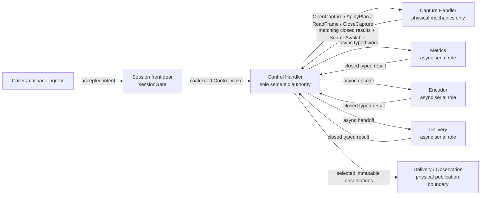

# Screen Capture Engine — Internal Architecture

## Scope and authority

This document is the sole cross-component authority for a Session's internal execution roles, semantic
authority, synchronization, currentness, bounded ownership, terminal cutoff, and physical-residue model.
Caller-visible values and outcomes belong to [the product contract](01-product-contract.md). Platform capture,
rendering, encoding, storage, delivery, JNI/package, and verification details belong to their respective leaf
documents. Those documents may refine their own mechanics but may not create another lifecycle, currentness,
fallback, terminal, or cross-component commit authority.

A Session is one nonrestartable capture lifetime. Its front door, finite Bootstrap surface, and Control loop are
temporal surfaces of one semantic authority:

- before Control handoff, the front door owns accepted intent and Bootstrap may apply only the already-selected
  pre-Control terminal outcome;
- at the first Control Runnable's entry under `sessionGate`, authority transfers exactly once;
- after that entry, Control is the sole writer of applied lifecycle, currentness, reconciliation, production,
  counters, observation decisions, and terminal state.

Posting work is never authority, entry evidence, or ownership transfer. Helpers and physical roles return facts;
they do not commit Session policy.

## Front door and bootstrap

### The one gate

`sessionGate` is the Session's sole cross-component semantic, lifecycle, and resource-admission gate. It
linearizes public command acceptance, bounded callback ingress, role entry and return versus cutoff,
registration admission, and the one-way `terminalAdmissionClosed: Open -> Cutoff` transition. It is short and
nonfair, is never nested with an engine lock, and is not itself a lifecycle or currentness generation.

The private `diagnosticGate` described by [Delivery and observation](07-delivery-observation.md) is for
observation-sequence reservation and emission only. It owns no lifecycle, resource admission, currentness,
counter, fallback, or cleanup choice and is never nested with `sessionGate`.

While holding `sessionGate`, code may validate or compare existing immutable values; replace the latest desired
parameters; advance a cross-boundary identity; choose the accepted start or terminal contender; swap bounded
references, tags, bits, or scalars; install or close a registration; and mark the front door dirty.

Gate code must not perform heavy allocation, outward platform/source/application work, rendering or encoding,
payload copying, Flow publication, cleanup, waiting, or submit-and-wait work. Public ingress never invokes
Control inline.

An accepted unequal update commits only the latest desired record, its new `configRevision`, and the obligation
to pause affected production and delivery. The front door neither constructs nor assigns public
`Reconfiguring`. Control alone drains that intent, revalidates it, constructs and assigns the coherent public
value, and does so before issuing the first outward reconfiguration effect.

Accepted intent is durable before any wake. A single lossless dirty bit and `wakeScheduled` bit coalesce all
front-door producers. A producer requests a Control wake only when changing `wakeScheduled` from false to true.
Control clears it only after a gated stable rescan finds no dirty work; a racing producer is either included in
that scan or leaves dirty work and schedules one successor. Wake cardinality therefore does not grow with the
number of producers.

### Finite Bootstrap handoff

Session construction creates one `BootstrapCapsule` before accepted-start work can escape. It roots the accepted
projection and every partial startup owner. Its private state is only `Queued`, `Entered`, `CutoffInert`, or
`Closed`. Bootstrap is one fixed, non-looping startup attempt; “finite” describes that bounded source shape, not
a deadline or progress guarantee.

Immediately before starting either HandlerThread, the attempt arbitrates `Queued -> Entered` versus
`CutoffInert` under `sessionGate`. Cutoff-inert starts neither HandlerThread. Startup entry releases the gate and
then proceeds through the fixed attempt below.

The capsule records each partial HandlerThread start, Looper acquisition, Handler construction, and the first
Control-post outcome as it becomes known. Every complete or partial owner remains rooted there until a known-safe
fact permits its transfer or retirement. The accepted projection follows one ownership chain:

```text
Session front door -> BootstrapCapsule -> OpenCapture capsule -> CaptureCapsule
```

Before the first Control Runnable enters, a null Looper, a definite `post == false`, or a caught ordinary startup
exception offers the existing pre-Control `InternalFailure`. Pre-Control closure and the first Control Runnable's
entry arbitrate under `sessionGate`; their winner is fixed. Cutoff-first may close semantics without fabricating
physical release and retains every exact partial owner. Entry-first performs the sole semantic handoff and is not
undone by a later submission return or throw. A caught startup fault learned after handoff becomes a typed Control
startup-failure fact. A direct fatal follows the bounded uncaught policy in this document.

An accepted post whose Runnable has not entered proves neither handoff nor rejection. Startup-call nonreturn
likewise proves no release, failure return, or safe replacement. There is no Bootstrap watchdog, retry,
replacement Handler, or fabricated receipt; cutoff may close semantics while exact partial owners remain rooted.
Latest accepted intent and any competing stop are durable throughout. Bootstrap may apply only the selected
pre-Control terminal publication and waiter resolution; it cannot become a second controller.
`BootstrapCapsule` is neither a fifth role, a second state graph, nor a reusable protocol.

## Execution roles and responsibilities

The required runtime is two Session-owned Handler lanes plus three asynchronous, non-direct serial roles.

| Role | Execution shape | Exact responsibility |
| --- | --- | --- |
| Control | one Session-owned Handler lane | sole applied policy, lifecycle, currentness, reconciliation, pacing and production decisions, counters, observation selection, terminal winner |
| Capture | one Session-owned Handler lane | all capture, Target, rendering, readback, affinity-bound mechanics, and their dependency-local release |
| Metrics | a distinct serial blocking view with its own permit | one attachment, bounded observer ingress, blocking reads/source calls, returned handle, and close |
| JPEG | an injected serial view over the shared CPU executor | one carrier-backed encode operation and backend-local ownership closure |
| Delivery | a distinct serial blocking view with its own permit | one application callback, borrowed-frame validity, lease release, and closed completion |

These ownership boundaries are strict. Capture owns no lifecycle, desired policy, counters, cache, delivery, or
fallback decision. Metrics owns no combined geometry or Active decision. JPEG owns no currentness, fallback,
cache publication, or counters. Delivery owns no registration policy, output currentness, counters, or terminal
winner. FrameStore is Control-confined logical ownership of the one production, latest payload, displaced leased
payload, and delivery lease; it owns no physical capture, encode, or callback policy. ObservationPublisher
directly publishes only already-selected immutable values and owns no selection or recomputation authority.

### Execution and ownership topology

The two diagrams in this document summarize the surrounding normative prose; they are not a second authority
and add no calls, states, identities, or framework.



Metrics and Delivery must have independent permits so one entered task in each may progress concurrently. JPEG's
serial view may share a process CPU substrate but not its sequencing permit. All three roles dispatch
asynchronously and non-directly: submission never runs role code inline on Control, Bootstrap, or a caller and
never waits for it. Their operations are non-suspending, run-to-completion serial tasks. The serial guarantee is
not thread affinity; Capture uses its Handler lane for affinity.

Control performs bounded state transitions, checked small arithmetic, typed fact validation, direct publication
of already-selected immutable values, and asynchronous role submission. It performs no source, capture,
rendering, encoding, callback, full-frame copy, payload allocation, or cleanup call that may block. It never
uses a cross-role `join`, blocking `get`, latch, `runBlocking`, busy wait, or synchronous request.

Small private pure or stateless calculation helpers and State/Stats-construction helpers are allowed. They own no
authority, lifecycle, mutable ownership, outward work, or commit path; Control revalidates their immutable result
against current state before committing it. This permission does not admit a generic ownership state machine.

Each Control turn drains a bounded accepted-intent snapshot and the closed typed component results, fixes its
decisions, publishes selected observations, and only then posts independent outward actions. No role may call
back into Control synchronously.

### Delayed wakes

Control may schedule exactly these six resource-free delayed-wake families:

1. readiness;
2. pacing;
3. repeat;
4. Stats;
5. the current Capture timeout;
6. the current JPEG timeout.

Each family has at most one current wake. A wake is only a prompt to recheck eligibility from elapsed realtime;
it is not deadline authority. An early or stale wake performs no work, a late wake creates no catch-up burst,
and superseded wakes do not accumulate semantic work. Handler behavior is used only through public APIs; queue
inspection or private-layout assumptions have no correctness role.

## Closed Control–Capture seam

Control sends exactly four immutable command families to Capture:

| Command | Purpose |
| --- | --- |
| `OpenCapture` | adopt the accepted capture authority and establish the initial plan |
| `ApplyPlan` | converge Capture's actual mechanics toward one immutable revisioned plan |
| `ReadFrame` | lend the sole writable carrier for one identified production |
| `CloseCapture` | request the terminal capture-local release suffix |

Capture returns only the matching closed semantic result family:

| Command or notification | Allowed results |
| --- | --- |
| `OpenCapture` | `Opened` or `OpenFailed` |
| `ApplyPlan` | `Applied`, `SkippedBeforeEntry`, or `ApplyFailed` |
| unsolicited | `SourceAvailable` only |
| `ReadFrame` | `FrameReady`, `NoCurrentSource`, `SkippedBeforeEntry`, or `ReadFailed` |
| `CloseCapture` | `Closed` or `RetainedLocally` |

Failure is a variant of its matching result, carrying the exact ownership needed by that boundary. There is no
universal result envelope, mutable component context, generic bus, registry, or untyped lookup. Private DTO
layout is not an architecture contract.

`SourceAvailable` is the sole unsolicited Capture notification. Capture maintains one pending/notification bit;
Control maintains one durable `SourceCandidate`. Repeated source notifications coalesce. A source arriving while
readback or encoding is busy remains represented once for a later eligibility scan. It creates no frame queue,
attempt, drop, second read, or extra carrier.

Immediately before the first outward call, each concrete role arbitrates its durable capsule from `Queued` to
either `Entered` or `CutoffInert` under `sessionGate`, then releases the gate. After an outward return is durable,
the role re-enters the gate. If admission is open, it installs only its matching typed result, marks the shared
dirty bit, and requests the coalesced Control wake. If cutoff has won, it performs no Control or public mutation;
it records only exact local cleanup state and routes the result through the terminal path described below.

## Bounded ownership and currentness

### Typed capsules and retirement fields

Resources are adopted immediately into concrete typed owners. A queue entry, request, Boolean, raw handle, or
cancellation token is never the sole ownership evidence. The runtime has exactly four permanent role-local
capsules and four corresponding typed Control retirement fields:

| Capsule | Durable responsibility |
| --- | --- |
| `MetricsCapsule` | attachment attempt, returned-late close handle, Metrics entry state, and exact Metrics retirement |
| `CaptureCapsule` | capture owner, fixed `SourceCandidate`, reusable Capture command slot, close request, Capture entry state, and exact Capture retirement |
| `EncoderCapsule` | backend and carrier ownership, one reusable production record spanning readback through completed-unpublished encoding, Encoder entry state, and exact Encoder retirement |
| `DeliveryCapsule` | one reusable handoff, registration/lease/callback ownership, Delivery entry state, and exact Delivery retirement |

Each private entry field has only `Queued`, `Entered`, `CutoffInert`, and `Closed`. Each retirement field has only
`Closed`, `ReturnExpected(exact capsule)`, and `ProcessLifetimeResidue(exact capsule)`. These similar shapes do
not share a base type, registry, iterable manifest, or common transition framework.

A capsule is durable before dispatch and remains the ownership root through submission, entry, return, and
cutoff arbitration. Executor cancellation or rejection is not evidence of entry, return, release, or physical
reclamation. A reusable command, production, or handoff slot must return to its named closed state before reuse;
entered or nonreturning work prevents a successor from using it.

### Three cross-boundary identities

Only these positive, monotonically increasing cross-boundary numeric identities exist:

| Identity | Allocation authority | Purpose |
| --- | --- | --- |
| `configRevision` | front door; consumed by Control | latest desired plan and capture/encoder topology currentness |
| `productionId` | Control | one materialized readback-through-payload attempt |
| `registrationId` | front door; consumed by Control | current callback registration and handoff fencing |

Each identity fails terminally before wrap or reuse. Resource identity and operation-private state may be checked
within their owner but are not additional Session generations. No lifecycle, geometry, Target, frame-admission,
or generic occurrence generation may supplement these three across roles.

### Structural maxima

At any instant a Session stays within all of these maxima:

| Item | Maximum |
| --- | ---: |
| accepted projection, `VirtualDisplay`, EGL context | 1 each |
| active capture topology | 1 |
| Capture mechanic or render | 1 |
| writable raw carrier, encode | 1 each |
| pending source, `SourceCandidate`, `ProductionRecord` | 1 each |
| current registration, callback invocation, Delivery handoff | 1 each |
| latest immutable payload, displaced payload retained by the sole lease | 1 each |
| Control Handler lane, Capture Handler lane | 1 each |

The carrier is transferred through one readback, one encode, and one closed result before it can be reused.
Delivery may concurrently lease an older immutable payload, but it cannot create another raw carrier or encode.
The detailed storage roles and transitions remain solely owned by the encoding/storage document.

Logical work is fixed and bounded even though Android Handler queues and injected process executors are not
claimed to have bounded physical queues. Source storms, callbacks, frames, raw buffers, encoded results, and
publications never become engine-owned per-item queues or per-frame coroutines.

## Readiness, reconciliation, and production

### Active readiness

Control may publish Active only after it has rechecked one complete current configuration with:

- both Handler lanes live;
- adopted joint Metrics readiness;
- the sole capture display and its callback ingress established;
- authoritative capture dimensions and density where the supported API band requires them;
- the Target producer, source listener, complete render/readback ownership, and no provisional frame admission;
- the sole raw carrier and one complete selected encoder backend;
- an empty, valid FrameStore and Delivery state.

Active does not depend on a first source frame, a first encoded output, or a subscriber. A start waiter succeeds
only after Active publication has returned. The metrics and capture leaf documents own how readiness evidence is
obtained; this document owns only their joint adoption and Active decision.

### Latest desire and one serial cycle

The front door holds one latest desired configuration. Control owns at most one reconciliation cycle and claims
only the newest pending desire. An unclaimed predecessor may be superseded without mechanics. Once work may have
entered or exposed an owner, that exact work settles against its original `configRevision`; its returned fact
updates only truthful actual mechanical state. Control then reconciles the latest desire from that actual state.

For reconfiguration, Control first commits a truthful paused logical state and closes new production, repeat,
cached-first, and handoff admission. Control publishes that state before the first outward reconfiguration
effect. It then drains only relevant mechanical predecessors, performs at most one Capture mechanic at a time,
settles actual state,
and either resumes a complete current topology or continues one next cycle. If actual state does not match the
latest desire, there is no intervening Active or admission-open gap.

An application registration may persist while paused, but no new callback handoff is created. A handoff admitted
before the pause is grandfathered with its immutable old descriptor: reconfiguration neither revokes it nor
waits for the callback. New production and handoff resume only after complete current ownership is installed.

A returned fact must match its type, the applicable cross-boundary identity, and the exact live owner before it
can affect current output. Safe stale success or failure publishes nothing and may only settle truthful actual
state before reconciliation continues. Ownership ambiguity, malformed evidence, or unsafe state remains fatal to
the Session even when stale; staleness never downgrades it. A late or terminal result cannot reopen admission,
publish bytes, change fallback health, add active counters, or revive lifecycle.

Native encoder health, Target-mode health, and rendering health are independent monotone axes. A safely returned
optional-axis failure may disable only its own axis for later production. It never causes a second encode or
render attempt for the same frame. Mandatory fallback production resumes only after its full current ownership
is installed.

## Time, allocation, failure, and data safety

Elapsed realtime, including deep sleep, is the sole interval clock for reconciliation timing, pacing, repeat,
Stats cadence, produced-frame time, readiness, and finite operation boundaries. Wall time may be used only for
diagnostic correlation.

For a positive duration `C` and nonnegative start `S`, deadline construction must be checked and must fail before
overflow. With deadline `D` and durable return time `T`, only `T < D` is timely; equality is expiry. A wake,
message order, scheduling delay, or later observation never replaces this comparison. Timeout may classify lack
of progress and close semantic admission, but it is never cancellation, return, release, or reuse evidence.
Queued work before entry, application callback duration, observation collectors, scheduler progress, and
post-terminal cleanup have no watchdog.

All dimensions, byte counts, ranges, strides, cumulative lengths, and narrowings are checked before the relevant
allocation or outward boundary. Runtime policy does not sample free memory or predict allocation success.
Failure precedence is:

1. ownership ambiguity, malformed evidence, contract violation, or unexpected non-memory failure;
2. otherwise coherent exhaustion at an exact required allocation boundary;
3. only then a documented returned success, rejection, or safe optional fallback.

The leaf authority maps these categories to caller-visible problems. A partial return is adopted immediately;
retaining it must not depend on another allocation.

Ordinary `Exception` families are caught and classified at their named role boundary. A directly thrown `Error`
or other non-`Exception` throwable is not an ordinary failure, drop, or fallback. A fixed outer role boundary may
perform only allocation-free best-effort admission closure and exact ownership recording before delegating to
the runtime's uncaught handling. It must not replace a Handler, commit lifecycle from a foreign role, swallow the
throwable, or promise State, Stats, diagnostics, cleanup, or recovery. Only an explicitly documented allocation
`OutOfMemoryError` may receive that allocation boundary's ordinary classification.

Rejection of current required dispatch fails the Session closed; rejection after work is stale, detached, or
terminal is cleanup-only. Failure to post to an already-closed Control lane never creates a replacement Control
authority. Submission ambiguity preserves the exact capsule and cannot be treated as proven no-entry.

Raw pixels, mutable carrier data, tentative encoded data, and immutable payloads remain within exact owner or
lease boundaries. Failed, partial, stale, or unleased bytes never publish. Reusable storage is not repurposed
until its last lease has settled and any leaf-required clearing is complete. Managed logical retirement is not
a physical reclamation receipt. Only the public copy operations defined by the product contract create
caller-owned JPEG bytes; diagnostics and text representations expose no raw data, handles, tokens, sources, or
copied throwable text.

## Terminal cutoff, publication, and residue

The first terminal application closes every admission and selects one permanent winner with priority
`CaptureEnded`, then `OwnerStop`, then `Failed`. Under `sessionGate`, the current semantic authority folds only
already-durable results and accounting facts, fixes final counters and waiter results, and initializes the four
typed retirement fields. Work not complete at cutoff becomes `ReturnExpected(exact capsule)`; cutoff never
fabricates completion or directly invents process-lifetime residue.

With no lifecycle or resource gate held, the semantic authority completes the Product-owned terminal publication
before any retirement activation. Public observation facades remain open, and publication does not wait for
collectors or physical cleanup. The product contract owns the terminal observation values and semantic
publication sequence; [Delivery and observation](07-delivery-observation.md) owns their physical construction,
emission, and post-terminal cleanup-observation routing. Neither can select or revise the already-fixed terminal
winner or final accounting. During this publication prefix, a concurrent role return
remains capsule-rooted and cannot mutate semantic retirement state or activate residue.

Immediately after terminal publication returns, in the same terminal turn, Control—or Bootstrap before
handoff—makes exactly four typed, identity-bound, exactly-once activation attempts in this fixed order:

```text
Metrics -> Capture -> Encoder -> Delivery
```

Each attempt invokes only its role-specific retirement transition and returns without waiting for role
completion. There is no dynamic registry, deferred activation wake, shared activation lifecycle, or cardinality
drift. Four direct statements are the preferred clear spelling, not a mandatory Kotlin source form; any private
equivalent must preserve the explicit four attempts and their fixed order. Terminal publication and all four
attempts must return before the semantic authority itself is eligible for retirement.

For each role, activation and that role's real return are the only competitors for its retirement ownership. A
durable return that wins before activation changes `ReturnExpected -> Closed`. Activation that wins first changes
`ReturnExpected -> ProcessLifetimeResidue`; a real later return may reduce or remove only that exact residue.
Duplicate calls, stale retirement identities, empty reductions, and losing transitions change nothing. A return
durable before activation remains capsule-rooted for that activation to consume; a later return cannot post a
semantic Control result or strand or revive Session work. The Delivery and observation authority owns the
physical publication, typed retirement-transition execution, and cleanup-observation implementation;
Architecture owns activation routing, semantic ordering, and ownership rules.

### Terminal sequence

```mermaid
sequenceDiagram
    participant I as Caller / onStop ingress
    participant C as Current semantic authority<br/>Control or pre-handoff Bootstrap
    participant O as Delivery / Observation
    participant M as Metrics
    participant P as Capture
    participant E as Encoder
    participant D as Delivery

    I->>C: terminal contender reaches cutoff
    Note over C: select winner; fold final accounting; initialize four retirement fields
    C->>O: selected Product terminal publication
    O->>O: final Stats
    O->>O: SessionTerminal attempt
    O->>O: terminal State
    O->>O: TerminalCleanupOnly
    O-->>C: publication prefix complete
    Note over C,D: Architecture-routed activations; no role-completion wait
    C->>O: activateMetrics
    O-->>C: activation returns
    C->>O: activateCapture
    O-->>C: activation returns
    C->>O: activateEncoder
    O-->>C: activation returns
    C->>O: activateDelivery
    O-->>C: activation returns
    opt matching role returns later
        M-->>O: Metrics local reduction
        P-->>O: Capture local reduction
        E-->>O: Encoder local reduction
        D-->>O: Delivery local reduction
    end
    Note over C,D: no semantic revival and no wait
```

Physical cleanup remains dependency-local. Capture closes its local resources on its own lane when reachable;
Metrics, Encoder, and Delivery likewise release only their owned suffixes. Control never waits or joins and does
not treat timeout, cancellation, queue state, thread return, or process-lifetime residue as release evidence. A
late return may shrink only its matching capsule. Independent components and Sessions may continue even when a
vendor, native, source, or application call never returns. Permanent nonreturn may retain exact resources until
process death; the architecture promises no safe replacement lane or recovery from that condition.

Capture requests orderly Handler-lane retirement only after its reachable close suffix is queued, capture
ingress is fenced, and every accepted Capture command is closed, cutoff-inert, or rooted by its exact capsule.
Control requests orderly Handler-lane retirement only after semantic terminal, public waiter resolution,
inertness of remaining wakes and result ingress, and classification of all four typed roles as closed or detached
self-contained residue. Neither lane requires a join, queue census, thread-return signal, or fabricated
termination receipt.

Once cutoff wins, no result, cleanup fact, diagnostic outcome, or residue reduction may reopen admission,
publish stale output, revise final counters or terminal cause, install a replacement, or resume the Session.

## Source cohesion guidance

Cohesion is normative: a unit must have one intelligible responsibility and must not hide multiple independent
lifecycles, synchronization authorities, resource families, or policy and outward mechanics behind one owner.
Such mixed responsibilities require a real boundary or an evidence-backed reason they are one lifecycle. One
component should ordinarily own at most one synchronization primitive or one confined execution context. Tests
and generated or JNI tables are judged by responsibility and cohesion rather than raw line count.

The following numbers are advisory review signals only:

- 250–650 handwritten lines is a common cohesive-file range;
- crossing 650 lines suggests checking whether responsibilities are still singular;
- crossing 800 lines is a stronger prompt to document why the unit remains cohesive or to consider a split;
- 1,000 or more handwritten lines is a strong outlier, not by itself an architecture failure;
- a component or package approaching roughly 3–5 KLOC suggests a boundary review;
- roughly 5–7 substantial mutable state groups suggests checking whether one owner still exists.

None of these thresholds is a mandatory gate, refactoring command, runtime selector, product or verification
rule, or proof of architecture correctness or failure. Outliers are evaluated by responsibility, ownership, and
dependency evidence. File names and private class layout remain implementation choices.

## Negative Manifest

The implementation must contain none of the following as architecture:

- a second lifecycle, currentness, fallback, counter, publication-decision, or terminal authority;
- a fixed six-thread topology or a thread, executor, actor, lock, or state machine per component;
- a generic bus, registry, provider/plugin lookup, mutable component context, common capsule base, universal
  result envelope, generic occurrence/settlement or ownership state machine, endpoint census, or fatal-proof
  framework;
- a global cleanup forest, iterable shutdown manifest, Control-owned cleanup orchestra, or fabricated
  termination/release receipt;
- synchronous Control-to-role calls, cross-lane waits, cleanup joins, callback interruption, or timeout as
  reclamation evidence;
- frame, raw-buffer, encoded-result, callback, or source-event queues; per-frame coroutines; polling or spin
  loops;
- a fourth cross-boundary Session generation or reuse of the three identities;
- same-frame optional-to-mandatory retry, a second raw carrier, parallel encode, second live capture topology, or
  speculative full-frame resource pool;
- direct capture/rendering, encoding, source, application callback, or caller-copy work on Control;
- private Handler/MessageQueue reflection, queue census, or assumptions about executor queue capacity;
- swallowed stale ownership, publication of raw/tentative/stale/unleased bytes, fabricated release, or reuse of
  an unresolved resource;
- runtime selection by diagnostics, tests, benchmarks, device identity, opaque memory estimates, or the source
  cohesion thresholds above.
