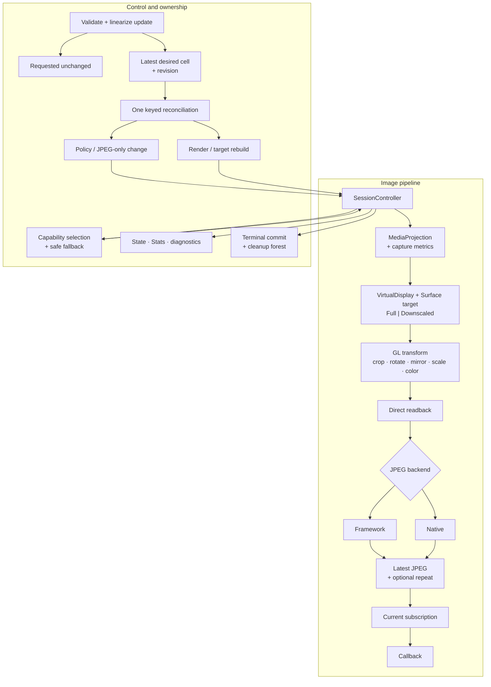

# Screen Capture Engine — Architecture

This file is the current internal architecture and platform source of truth. Product/public behavior is defined in [01_design.md](01_design.md); Gate-B implementation-binding requirements and completion criteria are defined in [05_gate_b_inputs.md](05_gate_b_inputs.md).



## 1. Android capture and metrics

### 1.1 Application and platform contract

The application owns consent UI, notification, permissions, and a compliant media-projection foreground service. On API 34+ it declares the media-projection
foreground-service permission and type. The application starts that typed service from an allowed foreground context, obtains one fresh projection, and then
starts the Session. An app targeting 35+ does not start this service from `BOOT_COMPLETED`.

One Session-private serial Android lane performs every `MediaProjection`/`VirtualDisplay` mutation and every `MediaProjection.Callback`
registration/unregistration: projection-callback registration, `createVirtualDisplay`, `resize`, `setSurface`, VirtualDisplay release, projection-callback
unregister, and projection stop. MediaProjection callback bodies post immutable facts and never mutate platform objects from another lane. Acquisition and
cleanup therefore have one explicit Android order rather than relying on cross-thread platform behavior.

Startup order is:

1. commit Starting and projection ownership;
2. attach the metrics flow and obtain a first valid tuple;
3. register and acknowledge one `MediaProjection.Callback` on an explicit Handler;
4. prepare a provisional target and enter the sole `createVirtualDisplay` call;
5. on API 34–37 wait for first valid captured-content resize and reconcile the target to its authoritative `W,H` and selected target mode before frame admission;
6. validate the baseline pipeline, assign initial Stats, assign Running, and resume `start`.

On API 34–37, expiry of the initial captured-content-resize readiness deadline commits
`Failed(CaptureUnavailable)`, attempts a source-`MediaProjection` `CapabilityCheck` identifying the missing initial capture geometry, and makes `start` throw
`ScreenCaptureException(CaptureUnavailable)` with that same timeout cause. It never admits a frame using provisional provider dimensions.

The engine creates one VirtualDisplay for the Session. It uses positive logical dimensions and density, `VIRTUAL_DISPLAY_FLAG_AUTO_MIRROR`, a nonnull Surface,
and passes `callback = null` and `handler = null`. The flag is a request; correctness depends on the MediaProjection callbacks, explicit operation returns, and
pixels, not flag equality. The engine never calls `VirtualDisplay.setRotation`.

`MediaProjection.Callback` attachment precedes `createVirtualDisplay`. A null result or `SecurityException` from `createVirtualDisplay` maps to
`CaptureUnavailable`. A directly thrown `OutOfMemoryError` maps to `ResourceExhausted`. `IllegalStateException` and any other unexpected failure map to
`InternalFailure`.

### 1.2 Metrics providers and geometry authority

The visible provider outcomes are defined in [Configuration, metrics, and display selection](01_design.md#33-configuration-metrics-and-display-selection).
Internally, one cold `CaptureMetricsProvider.observe()` Flow is collected from accepted start until
terminal. The Session retains that provider and collection for exactly this lifetime and never creates a replacement collector during geometry storms.

Built-in providers behave as follows:

- `fromActivityDisplay` snapshots the Activity's associated Display and does not retain the Activity;
- `fromUiContext` uses the unwrapped Activity display on API 24–29 and retains the real UI Context for associated maximum WindowMetrics on API 30+;
- `fromDisplay` retains an application-safe display context and exact Display, never switching display;
- null configuration uses `Display.DEFAULT_DISPLAY` through application `DisplayManager`.

Missing UI/display association throws `IllegalArgumentException`.

| API | Width/height authority | Density authority |
| --- | --- | --- |
| 24–29 all built-ins | explicit/snapshotted/unwrapped-Activity Display `getRealSize` | that display's Configuration |
| 30–33 | display/window-context maximum WindowMetrics | display Configuration |
| 34–37 before valid resize | provider provisional maximum | provider density |
| 34–37 after valid resize | `MediaProjection.Callback.onCapturedContentResize` | latest provider density |

On API 24–29 a UI Context supplies display association, not app-window capture bounds; all built-ins resolve that associated display's real size. On API 24–33
the selected display provider is width/height authority. On API 34–37 provider dimensions only bootstrap the VirtualDisplay: frame admission stays
closed until the first valid projection resize, after which projection width/height is authoritative and provider density remains live. The initial-resize
readiness timeout has the terminal startup result defined in Section 1.1. On API 24–33 `capturedContentVisible` remains null. On API 34–37 the registered
`MediaProjection.Callback.onCapturedContentVisibilityChanged(Boolean)` supplies visibility facts on the same explicit callback Handler as resize/stop. It starts
null until the first visibility callback. The controller processes each fact in serial fact order with geometry, desired, and lifecycle facts; a changed value
is included in the next single immutable Running assignment, while a duplicate value is conflated without assignment. Callback occurrence and lifecycle epoch
fence late facts, and terminal state discards them. Visibility is observation only and never changes admission, capture, pacing, fallback, or lifecycle.

All provider and projection-geometry emissions update one authoritative accumulator and publish its combined width/height/density tuple into one latest-value
cell; an emission changes only the fields its source owns under the API table. Each accepted combined tuple receives a non-reused geometry revision before it can
replace the cell. Overwriting an unclaimed revision coalesces it as `Superseded` and creates no rebuild. The controller claims only the newest cell value; once a geometry
revision materializes a rebuild, later revisions continue to overwrite the single cell and are reconsidered after that rebuild settles. Every materialized
revision ends once as `Applied`, `Superseded`, `Invalid/Suspended`, or terminal failure. Revision exhaustion terminally fails before identity reuse. No geometry
event queue or parallel rebuild grows during a storm. Provider/source absence uses `CaptureUnavailable` as defined in
[State and errors](01_design.md#36-state-and-errors). A valid geometry that cannot
satisfy the stored requested crop/region fails startup or suspends runtime output with `InvalidRequest`, according to the geometry rules in Section 5.

Before the initial `Running(Active)` commit, loss of any currently required metrics authority commits `Failed(CaptureUnavailable)` and makes `start` throw
`ScreenCaptureException(CaptureUnavailable)` with the boundary cause when one exists. Before the terminal observation, the controller makes one mandatory
source-`MetricsProvider` `CapabilityCheck` attempt identifying startup metrics loss and carrying the raw nullable boundary cause; the ordinary
`SessionTerminal` attempt follows. This startup path never publishes `Running(Suspended)` without a last effective
plan. After initial Active, the existing Suspended/recovery rule applies.

### 1.3 Target lifecycle

`SurfaceTexture(textureName, false)` calls `setDefaultBufferSize(Tw,Th)` with the selected positive target size before producer attachment and installs a Handler-bound
`SurfaceTexture.OnFrameAvailableListener` before that attachment.
Its `onFrameAvailable` invocation only sets the target's latest-pending bit. Retirement removes the listener and posts a same-Handler sentinel; the sentinel
proves listener-invocation ordering, not source freshness.

Each installed target owns a strictly increasing, non-reused `targetGeneration`. Its SurfaceTexture listener captures that generation and includes it in every
posted fact. Retirement fences the generation before listener removal. A listener fact carrying any noncurrent generation is cleanup-only: it cannot set the
pending bit, alter geometry/cache/admission, or access a released target. Target-generation exhaustion terminally fails before reuse.

The private target mode is exactly `Full` or `Downscaled`. Both modes keep the VirtualDisplay at authoritative logical dimensions `W,H` and density
`D`; only the SurfaceTexture/Surface buffer dimensions `Tw,Th` may differ.

`Full` is the mandatory API 24–37 baseline:

```text
VirtualDisplay = W x H at D
Surface target = W x H
Tw = W; Th = H
```

`Downscaled` is eligible exactly when all of these deterministic checks pass: API 32–37; `sourceRegion == Full`; `crop == Zero`; `outputSize` is
`ScaleFactor(f)` with `f < 1`; and the checked planner below returns `k < g`. Rotation, mirror, and color mode remain eligible. `TargetSize`, either half-region,
any crop, or a planner result of `k == g` selects `Full`. After mode selection, checked arithmetic, deterministic device/backend limits, and actual allocation
outcomes decide whether the selected plan can build; a mandatory clean denial follows the normal `ResourceExhausted` start/reconciliation semantics and does
not reselect Full. No device, GPU, driver, benchmark, soak, or
image-score allowlist is consulted.

For resolved output `(Ow,Oh)`, checked positive integer planning is:

```text
g = gcd(W, H)
baseW = W / g
baseH = H / g

rotation 0/180: requiredSourceW = Ow; requiredSourceH = Oh
rotation 90/270: requiredSourceW = Oh; requiredSourceH = Ow

ceilDiv(n,d) = n / d + (if n % d == 0 then 0 else 1)
k = max(ceilDiv(requiredSourceW, baseW), ceilDiv(requiredSourceH, baseH))
k = min(g, max(1, k))
Tw = baseW * k
Th = baseH * k
```

All arithmetic is checked before narrowing. `Tw:Th` therefore equals `W:H` exactly and never undersamples either source axis required by the resolved output. If
`k == g`, planning selects `Full`. The VirtualDisplay remains `W x H` at authoritative density `D`; density is never scaled. On API 32–37 Android applies its
documented uniform aspect-preserving media-projection fit-and-center behavior to the smaller exact-aspect Surface, filling `[0,0,Tw,Th)`. Platform filtering and
rounding may produce minor pixel differences from Full; Downscaled does not promise pixel identity. Runtime uses no inferred content rectangle.

API 32–33 plan from authoritative display metrics. API 34–37 first create a provisional `Full` target from provider metrics, then wait for the first valid
resize fact. If authoritative `W,H` and the selected mode require the exact same Full target, the startup owner retains it and records no detach, Surface-release,
GL-destruction, replacement, or retarget receipt. Otherwise, before Running and frame admission, the startup owner uses the same
drain/detach/retire-before-replace order as an ordinary destructive target rebuild to install the authoritative Full or Downscaled target. This
conditional pre-Running transition publishes no Suspended state.

For unchanged authoritative `W,H`, a healthy current Full target is retained only when the deterministic checks select Full. If they select
Downscaled, a current Full target uses the ordinary destructive target rebuild. A healthy current Downscaled target is retained while the new
plan remains eligible and its `Tw,Th` provide at least the new required source-axis samples; it is never rebuilt only to shrink further. Changed authoritative
dimensions always rebuild. From a current downscaled target, a larger eligible demand or an ineligible plan also rebuilds. There is always one target and at
most one healthy complete pipeline.

Ineligibility selects Full. A safely returned actual target incompatibility or runtime target-path fault disables Downscaled for the rest of the
Session, loses the affected frame as applicable, and permits at most one destructive Full-target fallback. An ambiguous entered platform/GL operation,
timeout, or uncertain ownership terminally fails and quarantines under the ordinary rules; it never claims a fallback-safe target.

A density-only change closes admission, drains entered frame work, calls `VirtualDisplay.resize(W,H,newDensity)`, invalidates the cache, and reopens admission
while retaining the healthy target and pipeline. A dimension or target-health change replaces the target and only its target-dependent or otherwise
exact-incompatible owners under Section 2; healthy exact-compatible output owners remain retained. A healthy retained target is not
replaced solely for freshness. After target readiness or engine-controlled admission reopening, acquisition may use the first available producer buffer even
when it was queued before or during the closed-admission interval; producer timestamps remain diagnostic-only and provide no age authority. Reconciliation,
frame-attempt, and target generations fence stale engine work/results, not platform-buffer age. `MediaProjection.Callback.onStop` is the sole platform
`CaptureEnded` authority; explicit VirtualDisplay release remains an ownership-cleanup operation and creates no lifecycle fact.

## 2. Parameters and rebuild

### 2.1 Latest desired parameters

The setter linearization atomically replaces one immutable desired cell `(requestedParameters, desiredRevision)` and commits a new immutable Running snapshot
that preserves the current running/effective/visibility fields. Revisions are Session-local, strictly increasing, and never reused. Structural equality publishes
nothing. Revision exhaustion commits terminal `InternalFailure` before wrap.

The cell begins at revision zero with default parameters. The winning accepted `start` replaces it with `initialParameters` at the first nonzero revision before
startup mechanics; subsequent unequal setters advance it. Thus even a pre-Running terminal snapshot has one defined final requested value.

There is at most one reconciliation occurrence plus the one latest desired cell. Its currentness key is exactly
`(desiredRevision, geometryGeneration, lifecycleEpoch)`. Desired, geometry, capture-availability, and relevant fallback facts signal the
controller through the lossless wake protocol in Section 2.3. The cell retains only the latest desired value; reconciliation outcomes and diagnostics arise
from materialized reconciliation work.

`geometryGeneration` advances for each accepted authoritative combined geometry. `lifecycleEpoch` advances on accepted-start authority, capture
available/unavailable transitions, terminal, and a committed monotone target/backend-health fallback; it does not advance for Active/Suspended publication or
for steps performed by the reconciliation already carrying that epoch. A private occurrence identity separately fences late returns from an earlier retry of
the same key. All identities exhaust terminally before reuse.

Action selection first verifies the actually owned live topology, not only the last committed effective value. A topology is reusable only when every resource
required by that effective plan is still owned, healthy, generation-current, and compatible with the resolved geometry and selected backend/target health.
Missing or retired required scope selects the smallest applicable rebuild row below. `Running(Active)` is committed or retained only while such a topology
exists.

The closed reconciliation action matrix is:

| Difference from last committed effective plan | Action |
| --- | --- |
| none after geometry resolution, with a compatible healthy live topology | Commit/retain Active without resource work. |
| none after geometry resolution, but required live scope is missing, retired, unhealthy, or incompatible | Rebuild the missing or retired required scope; do not infer Active from the historical effective value. |
| pacing and/or repeat only | Replace policy/wake eligibility; preserve target, pipeline, and current cache. Disabling repeat removes only its eligibility from the one pacing/repeat wake. |
| JPEG quality only | Invalidate cached bytes and repeat eligibility; preserve every healthy exact-compatible JPEG owner and reconcile only an incompatible scope. |
| density only | Use the density-only path in Section 1.3. |
| region, crop, output size, rotation, mirror, or color | Fence affected work and reconcile the output scope; reuse every healthy exact-compatible owner and rebuild only the smallest incompatible scope. Section 1.3 independently decides target retention. |
| capture dimensions, target-health fault, larger downscaled demand, or downscale ineligibility | Replace the target plus only target-dependent or exact-incompatible output owners; retain every healthy exact-compatible output owner. |

### 2.2 Bounded reconciliation

Reconciliation snapshots one key and never redirects an already-entered platform/GL/JPEG operation when a newer desired value arrives. Before irreversible
retirement, a healthy old output may remain `Running(Active)`: the enclosing snapshot exposes the latest requested parameters while Active exposes the older
effective parameters. After retirement begins, output is truthfully `Running(Suspended(Reconfiguring))` until a current outcome commits.

Reconciliation uses the existing desired revision and current topology as its only plan and ownership authority. For an image-affecting change it closes the
affected admission, drains entered work, fences the superseded work identity, and invalidates cached JPEG/repeat state. It then tests each currently owned
target, output texture/FBO, CPU carrier, Framework Bitmap/row scratch, and JPEG owner for health and exact compatibility with the current resolved plan. Each
compatible owner remains in place; only the smallest incompatible scope is retired and rebuilt. This is a direct owner-by-owner decision, not a resource
registry, alternative planner, replacement generation, or rollback pipeline.

A target-retaining rebuild retires only that smallest incompatible output scope. A target-replacing rebuild retires the target and its physical dependents,
then separately retires only output owners that are unhealthy or exact-incompatible with the current resolved plan; target replacement alone does not retire a
healthy exact-compatible FBO/texture, CPU carrier, Bitmap/scratch, or JPEG owner. It uses the order below. Preflight checks only geometry, checked arithmetic,
and deterministic device/backend limits; it allocates nothing. Neither scope allocates a replacement before the old incompatible scope is retired and safely
released; unsafe residue is quarantined only with terminal failure and authorizes no replacement. Neither scope keeps two healthy pipelines.

```text
snapshot key -> validate geometry and plan -> deterministic feasibility preflight
-> keep old output Active while work remains reversible
-> close fresh/repeat/delivery admission and invalidate cache/old identities
-> drain entered work -> cross irreversible retirement -> publish Suspended(Reconfiguring)
-> detach/retire/release-or-quarantine old scope
-> allocate/attach/validate one replacement
-> classify result against current key -> commit current or retire stale
```

Every completion rechecks the full key, its active occurrence fence, and the resulting owned topology. Current-key/current-occurrence success commits effective
parameters, reopens admission, and publishes Active only after the compatible healthy required scope is live. A stale success publishes
nothing and retires its newly built resources safely before reconciling the latest key. A safe/clean stale failure, including one after retirement, never fails
the Session: it settles exact ownership and then reconciles latest. Unsafe or ownership-ambiguous failure is terminal `InternalFailure` regardless of staleness.

Current-key recoverable outcomes retain the latest desired value: unavailable capture/metrics publishes `Suspended(CaptureUnavailable)` and retries on a new
desired or availability/geometry fact; geometry-invalid desire publishes `Suspended(InvalidRequest)` and retries on a new desired or geometry fact. Clean
deterministic mandatory denial during Running reconciliation before retirement publishes `Suspended(ResourceExhausted)`, parks the retained old pipeline
without output, and retries only on a new desired or relevant geometry/capability fact. Startup has no Suspended outcome: a mandatory deterministic denial or
actual allocation failure ends startup as `Failed(ResourceExhausted)`. A current mandatory allocation/replacement failure after retirement is likewise
terminal `Failed(ResourceExhausted)` with no rollback.
Among safe/clean reconciliation outcomes, terminal failure after retirement requires the current key and a fatal classification. A current-key clean mandatory
build failure after retirement is terminal with its classified problem; a safe optional-axis failure follows its bounded monotone fallback instead. A safe
stale success or failure publishes no stale output or lifecycle failure, settles only its exact owners, and reconciles the latest key. If it is a materialized
production attempt that mechanically returned a failure, that attempt still ends as `byFailure`; otherwise successful work suppressed solely by its stale
identity ends as `byStaleWork`. A safely returned optional-axis fault may still commit that Session-monotone health disable and advance the lifecycle epoch
before reconciling latest. Unsafe or ownership-ambiguous work is terminal `InternalFailure` even when stale.

Continuous desired/geometry/capability mutation has no convergence-time guarantee, but capacity remains one in-flight occurrence plus latest desired. Once
writers and relevant facts quiesce, the latest key must converge to Active, an exact recoverable Suspended state, or terminal. Terminal closes reconciliation admission;
the terminal snapshot retains the final desired parameters and last committed effective parameters.

### 2.3 Platform mutation

A target replacement prepares no replacement until old work has drained and detachment is proven. The closed prerequisites for `Surface.release()` are exactly:
fresh/repeat/delivery admission is closed; all entered target work is drained; `targetGeneration` is fenced; the target listener is removed and its
same-Handler sentinel is recorded; exact target detachment is proved by the current `VirtualDisplay.setSurface(null)` normal return or the applicable current
`VirtualDisplay.release` normal-return receipt; and target leases are zero. A `setSurface(null)` normal return authorizes the documented detach/teardown ordering
but is not producer-drain or happens-before proof. The complete target bag remains retained until every prerequisite is recorded. The `CurrentTarget` logical
owner then submits its one `Surface.release()` occurrence to the existing
Session-private serial GL lane. The lane is only the execution site: `CurrentTarget` retains the Surface, SurfaceTexture, target GL objects, occurrence records,
dependent carriers, and resources until their exact receipts permit release. A normal Surface return is the Surface-return receipt; only then may
`SurfaceTexture.release` and target GL-object destruction complete. The old pipeline is fully retired before replacement allocation begins. The
Android lane then applies `resize` when the authoritative dimensions/density changed, calls `setSurface(newSurface)`, and validates the attached replacement.

`targetGeneration` is the sole target-listener callback fence: after retirement fences it, every listener fact carrying that retired generation is cleanup-only.
Android target-operation returns retain their existing operation identity and typed return cell; a late return from any other occurrence is cleanup-only and
cannot satisfy the current target's detach prerequisite. These generation and occurrence checks require no additional callback-drain prerequisite.

A `setSurface(null)` or replacement-attach throw/timeout/ambiguous return cannot prove platform ownership and terminally roots every possibly referenced target.
Late return is occurrence-fenced and cleanup-only. At terminal, a normally returned `VirtualDisplay.release` can supply the corresponding detach receipt instead;
the remaining target prerequisites and Surface-return rule are unchanged.

`Surface.release()` is a typed specialization of the generic `OperationOccurrence` and settlement protocol in Section 6.3, not a separate state machine. Its
owner bag contains the target-dependent resources above, and its normal-return discriminator is the sole Surface-return receipt. Entry while nonterminal uses
`androidEnteredOperationSafetyNanos`; a normal return settled at `T < D` permits current reconciliation, while a timely throw or expiry supplies the documented
`InternalFailure` candidate and retains every owner lacking a receipt. A normal return settled at or after `D` remains usable only as the physical receipt for
dependent cleanup; a late throw supplies no receipt. A terminal winner before entry converts the same occurrence to the generic post-terminal no-watchdog
cleanup path. A terminal winner after entry folds an already-published return, retires the active deadline, and transfers the unresolved occurrence and owner
bag intact. The fixed terminal priority and startup exception mappings remain unchanged.

A timely normal result for a stale reconciliation key settles the old target, builds no stale replacement, and reconciles the latest key. A throw, nonreturn,
or other ownership ambiguity remains unsafe regardless of staleness and forbids target replacement and the Downscaled-to-Full fallback. Submission of the
mandatory release to the GL lane uses the occurrence settlement gate. Synchronous rejection settles only the current unresolved scheduler submission while
the release occurrence is unentered and its entry and return cells are empty; an existing terminal, cancellation, entry, return, or cleanup disposition remains
authoritative. A winning rejection is `InternalFailure` while nonterminal and cleanup-only after terminal. The rejected submission settles only scheduling;
the Surface-release receipt remains absent, and the exact Surface owner stays attached to its mandatory one-shot cleanup obligation through the specialized terminal/no-watchdog
path. Queued engine work retains the general no-start-timer and scheduler-nonprogress rules in Sections 6.3 and 7.2.
Because every GL lane is Session-private, a blocked Surface release in one Session does not occupy another Session's GL executor. Provably independent GL
resources are destroyed before release entry; a blocked or unresolved release roots only the target-dependent GL/EGL/lane chain and its live resources while
unrelated cleanup roots continue.

## 3. EGL, GL, readback, and JPEG

### 3.1 GL pipeline and Direct readback

`EGLDisplay` is a shared process/framework handle and is not Session-owned. The engine may initialize/use it but never calls `eglTerminate` as if it had exclusive
ownership. Each Session privately owns its GLES2 EGLContext, 1×1 pbuffer EGLSurface, serial GL lane, and all GL objects/programs; none is shared with application
rendering or another Session. The selected EGLConfig is a non-owned descriptor: pbuffer-capable RGBA8, no required depth/stencil, and the ES2 renderable bit.
Successful `eglMakeCurrent` is required before Session GL ownership begins.

The 1×1 pbuffer exists only to keep the private context current; it is never the render or readback target. One pipeline-owned `RenderTarget` contains exactly
one output-sized 2D color texture and one framebuffer object. It uses the GLES2 core `glTexImage2D` combination `internalformat = GL_RGBA`,
`format = GL_RGBA`, and `type = GL_UNSIGNED_BYTE`; this does not guarantee the texture's physical component storage width. It allocates for `(Ow,Oh)` and
attaches the texture at `GL_COLOR_ATTACHMENT0`. The checked `B = 4*Ow*Oh` is the exact RGBA transfer and CPU-carrier byte count; it is not an estimate of the
texture's physical storage. The target is
accepted only when checked `glCheckFramebufferStatus` returns `GL_FRAMEBUFFER_COMPLETE` without a GL error. Every transformed
frame draws into that FBO, and Direct readback reads that FBO. A concrete clean allocation limit maps to `ResourceExhausted`; other incomplete/error evidence
fails the mandatory pipeline with `InternalFailure`. Retirement destroys the FBO and texture on the GL lane after their leases close.

The `EGLDisplay` and EGLConfig references are not Session-owned and never enter `SessionQuarantineRoot`; only Session-owned context,
pbuffer, lane work, and GL objects do.

The baseline uses GLES2 ESSL 1.00 plus `GL_OES_EGL_image_external`. Fragment highp is selected when the runtime precision query reports the required support;
otherwise the mediump best-effort shader is selected. No device record or image score participates, and absence of highp alone never rejects start or reconciliation.
The chosen precision is included in mandatory diagnostics.

Every frame validates current context, drains a bounded old-error set, acquires OES once, copies and validates all 16 transform values, reads dataspace where
available, installs canonical state, draws, reads back, and performs a final bounded error drain. Canonical state fixes framebuffer, program, viewport, OES
unit, inputs, color mask, pack state, and disables blend/depth/stencil/scissor/cull/dither.

Direct readback writes tight `RGBA/UNSIGNED_BYTE` rows directly into one stable CPU carrier of `B = 4 * outputWidth * outputHeight` checked bytes. It adds
no second B-sized copy.

### 3.2 JPEG

The private synchronous `FrameEncoder` boundary receives positive dimensions, tight CPU RGBA, nominal-SDR metadata, quality, and one transactional encoded sink.
`FrameEncoder` is private and closed to the two mutually exclusive V1 JPEG backends.

Framework JPEG is mandatory. Its encoder owner keeps one mutable non-HARDWARE sRGB `ARGB_8888` Bitmap of `(Ow,Oh)` and reuses that same Bitmap across
reconciliation while it remains healthy and exactly shape-compatible. Engine-canonical RGBA is always opaque (`A=255`). Checked `R=4*Ow` is the exact byte
width used to validate rows; the portable transfer path owns one reusable `IntArray(Ow)`, likewise retained while exact-compatible. `Bitmap.createBitmap` and
row-scratch construction are attempted directly after their checked sizes are representable; their actual OOM maps to `ResourceExhausted`.

Before incompatible Bitmap replacement, and during terminal retirement, the Framework encoder first waits until every copy/compress use and lease of that
Bitmap has mechanically settled. It then consumes the exact Bitmap owner into one generic `OperationOccurrence` on the existing Framework-encoder execution
lane and calls `Bitmap.recycle()` exactly once. A preterminal replacement occurrence uses `jpegEnteredOperationSafetyNanos`; normal return is the sole physical
recycle receipt and permits the old reference to be dropped before replacement allocation. A timely throw, winning scheduler rejection, expiry, or nonreturn
retains the exact Bitmap owner and occurrence under the ordinary terminal/quarantine rules and neither retries nor calls `recycle()` again. Terminal cleanup uses the same
occurrence and owner bag without a watchdog; normal return permits the reference to be dropped, while throw, rejection, or nonreturn retains the exact owner.
This is the generic operation-settlement protocol, not a Bitmap-specific state machine or constant. Same-shape reuse creates no recycle occurrence.

The fast transfer path is selected per built Bitmap only when checked `bitmap.rowBytes == 4*Ow`, `bitmap.byteCount == B`, and the tight RGBA ByteBuffer has
`position == 0`, `limit == B`, and `remaining == B`. It then calls `copyPixelsFromBuffer` once. Raw RGBA is portable for this guarded path because
`ARGB_8888`'s native packing on Android's supported little-endian ABIs has the same memory byte order; `ByteBuffer.order()` does not participate. The engine
never uses an IntBuffer view.

Otherwise the mandatory portable path reuses exactly one `IntArray(Ow)` row scratch, packs each canonical pixel as the logical Kotlin Int `0xFFRRGGBB`, and
calls `Bitmap.setPixels(row, 0, Ow, 0, y, Ow, 1)` once for each row. It records the actual `rowBytes`, expected tight stride, and row-conversion selection in
the mandatory runtime diagnostic. Gate B supplies small red/blue, odd-width, alpha, row-tail, transfer-path, and fast-path-guard vectors. Tests validate JPEG
structure, decoded dimensions/orientation, and absence of obvious channel or row corruption; they do not require lossy decoded pixels or bytes to be equal.
Bitmap/scratch creation OOM or checked-size denial maps to `ResourceExhausted`; unsafe transfer behavior follows the ordinary terminal rule.
Framework JPEG uses this closed entered-frame outcome partition; it does not change the startup/update allocation mappings above:

| Entered Framework outcome | Disposition |
| --- | --- |
| `Bitmap.compress` returns true and the checked transactional sink commits | Publish the complete JPEG through the ordinary currentness fence. |
| `Bitmap.compress` returns false | Atomically discard all tentative bytes, end the current fresh attempt once as `byFailure`, and continue with Framework for later frames. The same frame is not retried. |
| `Bitmap.compress` or an entered sink operation directly throws `OutOfMemoryError`, or the checked cumulative sink length is unrepresentable | Atomically discard all tentative bytes, end the current fresh attempt once as `byFailure`, and commit terminal `Failed(ResourceExhausted)`. |
| An unexpected `Exception`/runtime failure, or a malformed sink offset, count, cumulative-length, or writer-contract observation | Atomically discard all tentative bytes, end the current fresh attempt once as `byFailure`, and commit terminal `Failed(InternalFailure)`. |
| The entered call does not return or leaves pixel/sink ownership uncertain | End the current fresh attempt once as `byFailure`, commit terminal `Failed(InternalFailure)`, and quarantine the exact operation, input, sink, and tentative bytes until mechanical return proves what can be released. |

Partial bytes never publish. A non-`OutOfMemoryError` fatal VM `Error` is not normalized into a recoverable frame drop or fallback; it retains ordinary fatal
process/thread semantics.

The JPEG runtime has one typed RGBA-carrier owner and one Session-monotone `NativeJpegHealth`, whose values are exactly the payload-free `Enabled` and
`Disabled`. The health value is stored once inside the combined runtime owner; there are no separate loader, backend, and fallback-health cells. No Session,
Kotlin, global, or native stored state retains a platform-compressor function address. The only reachable stable combinations are:

```text
NativeEnabled(NativeMallocCarrier)
FrameworkOnNativeCarrier(NativeMallocCarrier, FrameworkTransferAdapter)
FrameworkOnManagedCarrier(ManagedDirectCarrier, FrameworkTransferAdapter)
```

`NativeMallocCarrier` owns one positive checked allocation, its pointer, one direct `ByteBuffer` view, and an explicit one-shot free operation.
`ManagedDirectCarrier` owns one checked direct `ByteBuffer` and has no fabricated physical-free receipt: after every lease and entered operation resolves, one
owner transition drops the last engine reference, while JVM reclamation timing remains outside engine control. An unresolved operation roots its actual carrier
under `SessionQuarantineRoot`. The common Framework adapter accepts either carrier's guarded byte view, sets `position=0` and `limit=B` under the sole carrier
lease, and uses the fast or portable transfer already specified above. Byte order does not affect that raw-byte transfer. Native JPEG accepts only
`NativeMallocCarrier`; managed storage never creates a Managed+Native combination.

The engine's own optional JNI library is loaded synchronously and publishes its bridge before any native carrier ownership. Static initialization and
`JNI_OnLoad` must not allocate or publish a carrier, sink, Session resource, worker, or any other ownership-producing side effect. Only a synchronous
`UnsatisfiedLinkError` or `SecurityException` observed before bridge publication and before any engine JNI operation entry, with zero native ownership, proves
clean unavailability; that exact outcome selects `FrameworkOnManagedCarrier` and disables Native JPEG for the Session. An `OutOfMemoryError` thrown directly
by the library-load boundary is `ResourceExhausted`. Partial initialization, any failure after bridge publication or engine JNI entry, any other load failure, or
ambiguous native ownership is terminal `InternalFailure`, permits no managed fallback, and quarantines its exact residue. Once the own bridge is available,
failure to allocate the `NativeMallocCarrier` is `ResourceExhausted` and never switches to managed storage. The pipeline keeps a successfully created
`NativeMallocCarrier` even if the platform compressor is unavailable or later disabled;
Framework does not require the platform compression symbol and does not replace that carrier.

The engine native module links the system `jnigraphics` library and enables the NDK 28 weak-API definitions with unguarded-availability diagnostics kept as
errors. This is a native-module binding only; it prescribes no root-project Gradle, Android Gradle Plugin, or Kotlin-plugin wiring. Because a library dependency
is not weak, the resulting direct `DT_NEEDED` dependency may map the system `libjnigraphics.so` when the engine JNI library loads even on API 24–29 or under
`FrameworkOnly`. The exact incremental resident cost of that system mapping is unknown and is not an input to predictive memory accounting.

`FrameworkOnly` fixes `NativeJpegHealth.Disabled`, never evaluates or invokes the platform compressor, and uses Framework with the carrier selected solely by
the own-bridge outcome above. Loading the own bridge for explicit native-carrier ownership is not a Native JPEG attempt. It creates no compressor capsule,
owned platform-library handle, compressor lease, or compressor-close obligation.

Under `Auto`, native JPEG is enabled exactly when the own bridge is available, the current ABI is shipped, and the following same-function nested weak-API
guard observes a nonnull `AndroidBitmap_compress` address during preparation:

```cpp
if (__builtin_available(android 30, *)) {
    auto compressor = &AndroidBitmap_compress;
    if (compressor != nullptr) {
        // Publish only the payload-free Enabled capability result.
    }
}
```

API 24–29 never enters the guarded scope and never invokes the compressor. On API 30+, a null weak address is clean static compressor ineligibility. Either
ineligible result selects Framework during pipeline preparation, before any fresh attempt is assigned to Native. There is no per-Session `dlopen`, `dlsym`,
`dlclose`, compensating close, ambiguous platform-handle cleanup, `CompressorCapsule`, or owned compressor handle. These closed static checks are the complete
startup eligibility decision. The first real frame assigned to Native is the first compression call and follows the complete real-call outcome partition
below. Real frames use the complete descriptor below; shipped native packaging is 16-KiB-page compatible. No device allowlist, soak result, decoded-image
score, or measured speedup participates.

Each actual `nativeCompress` reruns that same same-function nested availability and nonnull-address guard. Only inside the successful inner branch does it pass
the typed non-owning compressor pointer by value into the JNI-free runtime for that one call; the pointer is discarded when that call returns and is never
published into stored state. A defensive unavailable or null result after preparation already published payload-free `Enabled` is a pre-compressor-invocation
`InternalFailure`; it is not clean ineligibility, Native disablement, or Framework fallback.

Every real native call receives one immutable `NativeFrameDescriptor` whose complete fields are: the stable tight-RGBA `pixels` address and `pixelByteCount=B`;
an `AndroidBitmapInfo` with `width=Ow`, `height=Oh`, `stride=4*Ow`, `format=ANDROID_BITMAP_FORMAT_RGBA_8888`, and
`flags=ANDROID_BITMAP_FLAGS_ALPHA_OPAQUE` with the hardware bit clear; `dataspace=ADATASPACE_SRGB`;
`compressFormat=ANDROID_BITMAP_COMPRESS_FORMAT_JPEG`; requested `quality`; and the exact transactional-sink `userContext` plus nonnull
`AndroidBitmap_CompressWriteFunc`. Checked narrowing to the C field widths precedes entry. The descriptor and pixel/sink leases remain rooted through mechanical
return; the writer validates every `(data,size)` segment before accepting it.

Both backends write a checked segmented sink. Each write validates offset, count, and cumulative `Int`-representable length before attempting the next actual
segment allocation and accepting bytes. Success atomically transfers all segments to immutable storage; every other outcome discards the tentative transaction.
There is no arbitrary public encoded-size cap.

A timely real native return settled at `T < D` is classified from all evidence accumulated across every writer callback, JNI, and the returned compressor
integer, in this order. Uncertain ownership, any malformed writer call or writer-contract violation, or any non-`OutOfMemoryError` JNI exception is terminal
`InternalFailure`, even if another
callback recorded OOM or the compressor returned a different integer. Otherwise, an exact writer/sink OOM, unrepresentable cumulative length, or pending or
propagated JNI `OutOfMemoryError` is terminal `ResourceExhausted`. Only then is the compressor integer considered.
`ANDROID_BITMAP_RESULT_SUCCESS` with accepted bytes and a committable transaction is success. `ANDROID_BITMAP_RESULT_ALLOCATION_FAILED` with exact returned
ownership and no writer or JNI fault is a safe optional-axis failure: it drops that frame once,
discards tentative bytes, changes `NativeEnabled` monotonically to `FrameworkOnNativeCarrier`, and uses Framework only for later attempts. Framework feasibility
is determined only by its later actual allocation outcome. `ANDROID_BITMAP_RESULT_BAD_PARAMETER`,
`ANDROID_BITMAP_RESULT_JNI_EXCEPTION` without an exact OOM, an unknown code, or an impossible result/sink combination is terminal `InternalFailure` for the
engine-generated descriptor. No returned native failure retries the same frame through `Bitmap.compress`; Framework resources are not precreated while Native
is healthy. A native nonreturn, timeout, or uncertain pointer/sink ownership fails the Session and quarantines the exact operation, carrier lease, writer
context, and tentative sink. For a real native return settled at `T >= D`, the controller atomically commits expiry under
`sessionGate -> settlementGate`; its actual result and receipts are cleanup-only, and Native health remains unchanged.

Thus a safely returned native compressor allocation failure may lose one switchover frame, disables only native JPEG, and uses Framework for later frames. The
same frame is never encoded twice. If that safely returned optional-axis failure belongs to an attempt made stale by a newer key, the attempt records
`byFailure` and publishes neither stale output nor lifecycle failure, but still commits the same Session-monotone Native disable before reconciling the latest
key. Backend checks compare JPEG structure, decoded
dimensions/orientation, and visible channel/row correctness using the Gate-B vectors and tolerances; lossy pixels and JPEG bytes need not match.

Reachable products are Direct+Framework and Direct+Native. Target mode is orthogonal to JPEG health and never couples its independent fallback behavior.

## 4. Frame scheduling, cache, and delivery

### 4.1 Fresh source selection

One target owns one latest-pending source bit. An `onFrameAvailable` invocation only sets that bit; repeated invocations while it is set coalesce and are neither
attempts nor drops.
Materialization occurs exactly when the controller clears the bit, assigns a fresh attempt occurrence, reserves its one final-outcome slot and the sole
production slot, and admits or queues the owner work. That slot remains occupied from materialization through the attempt's final disposition: cache/output
commit, classified drop, or terminal transfer. It therefore remains occupied by a successfully encoded JPEG waiting for output pacing or another publication
condition. The same single latest-pending source bit may coexist with the occupied slot, but no second attempt is materialized and no JPEG queue exists.

`EngineClock` is the sole interval clock and returns raw `SystemClock.elapsedRealtimeNanos()`, which includes deep sleep. Pacing, repeat, public frame
timestamps, Stats, readiness and operation deadlines, callback deadlines, and duration samples use only this clock. Wall time, uptime,
`System.nanoTime()`, and producer/`SurfaceTexture` timestamps never provide authority; an observed producer timestamp is diagnostic-only.

Pacing stores the last actual grant time and the bounded elapsed interval required before the next grant. The controller's current wake carrier owns at most
one queued pacing/repeat scheduler submission, separate from the Stats-cadence wake. Its eligibility time is the earliest future time currently needed by the
one pending fresh source, the completed-unpublished JPEG, or repeat of the current cache. Replacing policy or any candidate first cancels, removes, or coalesces
the prior still-queued submission before posting the current one. If cancellation races dequeue, at most that one already-dequeued stale callback may coexist
with the one current queued submission; no second queued pacing/repeat submission exists. Dequeue consumes the callback's identity before clock resampling,
and only the callback whose identity still matches the current carrier may perform an action or install a successor. Candidate dequeue/commit and terminal
fence the same identity. There is no timer queue, per-purpose timer set, or catch-up state.

A scheduled delay or Handler post is only a wake hint. When it runs, the callback first consumes and checks its queued identity. A stale identity returns
without resampling the clock, performing an action, or installing a successor. A current callback then resamples the clock and checks candidate identity,
policy, and elapsed delta. An early current wake performs no action and installs at most one current successor if future eligibility remains. A timely or late
current wake admits at most one action and likewise installs at most one successor after re-evaluating all three candidate kinds. The engine makes no exact
execution-time guarantee. Valid SampleEvery and repeat intervals convert to positive representable nanosecond durations; pacing represents only the last grant
plus that bounded duration and has no sentinel deadline state.

Synchronous rejection of the current required pacing/repeat submission uses the existing active internal scheduler-rejection rule: it commits terminal
`Failed(InternalFailure)` and fabricates no frame drop. Rejection after its wake became stale, detached, or terminal is cleanup-only. Consequently a retained
pending candidate is either represented by the current queued/in-flight wake, made immediately eligible in a controller turn, or closed by terminal failure;
it cannot be silently stranded.

- `Auto` admits pending source as soon as capacity permits.
- `SampleEvery` admits the first current source immediately, then at most one pending fresh source on each elapsed interval; no source means no attempt.
- `MaxFps` limits both fresh admission and all output publication to its rational cadence.

Production-slot occupancy or an unelapsed fresh cadence before materialization retains the pending bit without a drop counter. `Auto`, `SampleEvery`, and
`MaxFps` clear and materialize only an eligible source. An early source therefore remains the one latest-pending candidate until its cadence boundary and
increments neither `byRateLimit` nor another dropped-frame counter. If the bounded owner slot synchronously rejects a materialized submission before entry
because capacity changed, it ends once as `byPipelineBusy`; queued work has no timer. Cache commit is success. An otherwise successful result rejected solely
by its stale identity is `byStaleWork`; a mechanically returned production failure is `byFailure` even if its identity is stale. A safe stale failure publishes
no output or lifecycle failure, while an unsafe failure retains its terminal classification.
Suspension, rebuild, target replacement, or terminal clears an unmaterialized pending bit without a counter. No occurrence returns to pending or receives two
dispositions.

Terminal arbitration acquires `sessionGate ->` the production occurrence's existing `settlementGate`. Before final Stats it folds any already-complete
production return and any already-selected classified disposition through the same cache/output or drop-accounting path used outside terminal arbitration.
An already-classified production failure remains `byFailure`, including when that failure supplies the terminal winner. If terminal instead wins while a
materialized attempt has no cache/output commit and no classified drop, retires a completed-unpublished JPEG, or transfers an unresolved production
occurrence whole to cleanup, that terminal disposition increments no dropped-frame counter. A return committed after whole-occurrence transfer is
cleanup-only and cannot change Stats.

`MaxFps` uses independent fresh and output phases. For `S=1_000_000_000`, `F=fps`, `q=S/F`, `r=S%F`, and `phase in 0 until F`, an actual grant performs
`sum=phase+r`, `carry=if(sum>=F) 1 else 0`, `phase=sum-carry*F`, and stores `requiredGap=q+carry` with that `grantTime`. A phase advances only for its own actual
grant; pending-source retention, stale work, and timer wake do not advance it. Anchoring at the actual grant prevents catch-up bursts while the rational phase avoids
accumulated truncation drift. An output-ineligible completed JPEG waits in one unpublished slot and is not encoded again.

### 4.2 Static-frame repeat

`frameRepeatIntervalMillis` is a best-effort target maximum-silence interval over produced output, not a deadline guarantee. It is inactive until one current
fresh JPEG has published. When due, it republishes metadata and a lease over the same immutable bytes: no acquisition, GL, readback, JPEG, or payload copy occurs. Fresh unpublished content has
priority over a due repeat. `MaxFps` may delay repeat because it caps every output.

Pause, suspension, untrusted source, target replacement, render/JPEG rebuild, and terminal invalidate the cache and repeat eligibility. A late old-generation
result cannot restore them.

A cache is current exactly when its `LastPublished` bytes and metadata belong to the current image-affecting plan (geometry, region, crop, output size,
rotation, mirror, color, and JPEG quality) plus the current target, render, and JPEG generations, and none of the invalidating events above has occurred since
publication. Pacing and repeat policy are not image-affecting and do not by themselves stale the cache. Successful subscription registration atomically checks that currentness while claiming the
single handoff slot. If current, it delivers a lease over those bytes immediately with the original sequence, timestamp, and image size; it performs no encode,
payload copy, `framesProduced` increment, or output-`MaxFps` phase advance. If absent or stale, registration creates no waiting cache record and simply awaits a
future output. The same registration-generation and unsubscribe fences used for fresh/repeat output govern cached-first delivery.

### 4.3 Encoded ownership

Storage's sole production slot contains at most one tentative sink or one completed unpublished generation, never both for different attempts. Separately it
may hold one last-published generation and one displaced old leased generation. The frame
store always owns the immutable backing bytes; the sole outstanding callback record owns only a reference-counted lease, which may coexist with
`LastPublished` in any prepared, dispatching, queued, or entered state. Publication moves unpublished bytes and their output metadata into `LastPublished`.
A repeat updates `LastPublished` to its new sequence/timestamp while retaining the same immutable bytes. Displaced bytes free at zero leases or become the
single old leased generation until that record resolves/quarantines. Repeat adds metadata and a lease transition, never another payload owner.

Each fresh or repeated publication receives a Session-local sequence starting at one and the `EngineClock` sample taken at output commit. Sequence exhaustion
terminally fails before wrap. Equal timestamps are permitted.

### 4.4 Frame-consumer handoff

At most one current frame-consumer registration exists, and it owns at most one outstanding record and encoded lease. A registration generation must reach
exact resolution before a replacement generation can register, so old and new callbacks can never overlap. The outstanding record's exact state graph is:

```text
Idle -> Prepared -> Dispatching -> AcceptedQueued -> Entered -> Resolved
Prepared -> Resolved
Dispatching -> Entered
Dispatching -> Resolved
Dispatching | AcceptedQueued -> DetachedPreEntry -> Resolved
Dispatching | AcceptedQueued | DetachedPreEntry | Entered -> Quarantined
Resolved -> Idle  (only while the same registration remains active)
```

The direct `Prepared -> Resolved` edge is controlled unregistration or terminal winning before external dispatch begins. `DetachedPreEntry` means that winner
committed after dispatch began or accepted the trampoline but before entry; a late dispatch throw/rejection or trampoline self-rejection emits the exact
callback-resolution receipt and moves the record to `Resolved` without invoking user code, while a normal dispatch return waits for that trampoline
self-rejection under the accepted-task deadline. `Quarantined` anchors the exact record and lease when terminal
cleanup still lacks a dispatcher return, accepted-task resolution, or entered-callback return. A busy record counts `byConsumerBusy`.
Frame-callback invocation N resolves or quarantines before N+1 can be selected; quarantine therefore permanently consumes the sole slot.
Callback normal return, callback throw, and a caller dispatcher's synchronous throw/rejection return `Resolved` to `Idle` only when every required side of that
record has settled and the registration is still active. If inline callback return precedes dispatch-call return, the callback side immediately releases the
borrowed-frame authority and encoded lease, but the record remains occupied in `Entered` and retains the sole delivery worker until the actual dispatch return
or throw settles its separate side. Unsubscribe or terminal resolution instead closes the registration generation and cannot return it to `Idle`.

Controlled unregistration is idempotent, permanently closes admission for that registration generation, and waits for its sole queued or entered record's
exact resolution. Only after successful return may a replacement callback register. Cancellation of the waiting coroutine does not reopen the old generation,
fabricate resolution, or admit a replacement; mechanical convergence continues, and another `unsubscribe()` call on the same handle may await the same
idempotent operation. `unsubscribe()` invoked from its own entered callback fails fast with `IllegalStateException` to avoid self-wait. The Session and its
MediaProjection continue throughout successful unregistration and replacement.

Terminal or quarantine wins over a pending unsubscribe success. `Failed(problem)`, including failure created by quarantine while nonterminal, completes the
waiter with `ScreenCaptureException(problem)`; `Stopped(OwnerStop|CaptureEnded)` completes it with `CancellationException`, even if unresolved residue is then
quarantined under that already-won terminal state. The record/lease remains physically rooted. The registration generation stays closed and replacement is
forbidden even if a late callback return later reduces the root.

Delivery first creates the engine-owned trampoline and commits its fenced record/lease as `Prepared`; no external dispatcher transfer has begun. Stop or
controlled unregistration acquires `sessionGate` and then that exact record's `settlementGate`, allowing `Prepared -> Resolved` and release of the exact lease.
The delivery worker uses only the record gate: it either moves the still-admitted record `Prepared -> Dispatching` immediately before invoking caller
`dispatch`, or publishes an internal dispatch-skipped resolution when stop/unregistration already detached it. The internal resolution records only the
engine-side skip fact, with the caller-dispatcher outcome slot remaining empty. Every external call and resulting action occurs after the gate is released.

Delivery-worker capacity is fixed at exactly one active worker occurrence per Session. Sequential occurrences may reuse that capacity; no callback, rejection,
cached replay, or unsubscribe creates parallel workers or a queue.

Submission of that worker is an engine-internal scheduling occurrence, distinct from the later caller-dispatch call. A synchronous scheduling rejection is
arbitrated under `sessionGate -> settlementGate`. If the current delivery is still admitted and unentered, with no prior detachment or terminal disposition,
the rejection supplies `Failed(InternalFailure)` subject to the fixed terminal priority; it records no `byDispatchFailure`. Because no external dispatch or
callback entry occurred, terminal cleanup resolves the safely unentered delivery record and releases its exact encoded lease. If controlled unregistration,
terminal selection, entry, or another disposition committed first, that disposition remains authoritative and the rejection only settles the scheduler
submission as cleanup evidence.

The delivery record precreates the typed dispatch-return slot, its return/throw/rejection discriminator and fixed reference fields, the separate trampoline-entry
disposition, lease owner bag, and optional accepted-task entry-deadline link used by its `settlementGate`. Immediately before invoking caller `dispatch`, the
worker uses that record gate to confirm `Dispatching` and record call entry; it releases the gate before the external call. The caller dispatcher's actual
normal return, throw, or synchronous rejection is written allocation-free into the precreated dispatch-return slot and committed under that gate. Trampoline
entry acquires `sessionGate -> settlementGate`, verifies that the Session and registration still admit this exact record, and commits either `Entered` or the
applicable detached self-rejection. It releases both gates before invoking user code or performing follow-on cleanup. Three one-shot outcomes race after
`Dispatching`:

- trampoline entry may run inline, claim `Entered`, and invoke user code;
- normal dispatch return before entry commits `AcceptedQueued`, samples the return time, and arms the sole 5,000 ms task-entry deadline from that sample;
- caller dispatcher throw/rejection before entry records `byDispatchFailure` and resolves that exact record/lease. It consumes only that delivery opportunity;
  the registration remains active for a later produced or distinct cached opportunity, with no retry queue and no immediate redispatch of the rejected record.

If trampoline entry wins before `dispatch` later returns or throws, entry remains authoritative. The later dispatch outcome retires only its dispatch-call
return occurrence: it cannot resolve or reclassify the entered record, cannot increment `byDispatchFailure`, and cannot replace the callback outcome. The entered
callback's mechanical return or throw settles its callback side and releases frame authority and lease. If the dispatch call is still unresolved, the record
and sole worker capacity remain occupied; another output records `byConsumerBusy`, creates no new record or worker, and therefore cannot encounter a new worker
scheduling rejection. Actual dispatch return or throw later settles the remaining side without changing the entry-owned outcome.

If stop or controlled unregistration changes the still-in-call record to unresolved `DetachedPreEntry`, a later normal `dispatch` return arms the same sole
5,000 ms accepted-task entry/self-rejection deadline from that return's time; the record remains `DetachedPreEntry`. Trampoline entry before that deadline
self-rejects, invokes no user code, and resolves the exact record. A supported caller dispatcher eventually returns or throws from every `dispatch` call. If
it does not, the engine has no dispatcher-call watchdog: the one bounded record and worker remain unresolved, no second delivery is admitted, unsubscribe
continues waiting, and a later terminal winner transfers that exact residue to cleanup/quarantine.

In `AcceptedQueued` or its `DetachedPreEntry` successor, entry/self-rejection settlement at or beyond the sole deadline, or an empty entry fact observed at or
beyond it, atomically claims expiry under `sessionGate -> settlementGate`. While the Session is nonterminal, expiry commits `Failed(InternalFailure)` and
transfers the writable occurrence, record, owner bag, and lease to cleanup ownership. Once `Stopped` or another terminal State is selected, the retained
preterminal entry deadline may still expire, but the terminal State remains authoritative; expiry roots only the unresolved delivery residue under
`SessionQuarantineRoot`. A late trampoline is occurrence- and terminal-fenced,
invokes no user code, and publishes its exact self-rejection resolution through the record gate; that receipt may release the record/lease and reduce
`SessionQuarantineRoot`. A late caller dispatcher return/throw/rejection or entered-callback return is likewise cleanup-only and may reduce only its exact
rooted residue. A post-terminal callback fact changes no Stats, State, or `DeliveryProblem`; consuming its receipt attempts the ordinary `QuarantineChanged`
only when the root's actual ownership changes, while cleanup completed before quarantine emits none. Each dispatcher result is the actual fact returned by that external call; trampoline entry remains a separate entry fact. Stop/unregistration
winning the record gate before trampoline entry prevents user invocation; trampoline entry winning first defines an entered frame-callback invocation that
may start or finish after `stop` returns. Dispatch-call return, trampoline entry, deadline retirement, and frame-callback return/throw are separate facts and
each disposes only its own occurrence once. Terminal stop wins over replacement admission and resolves every safely resolvable record or anchors the unresolved
exact record under the Session root.

An entered frame-callback invocation has no execution watchdog. Stop, controlled unregistration, and waiter cancellation cannot interrupt it or fabricate its
return. An invocation that never returns permanently anchors its record and lease. On callback return or throw, the precreated callback-return cell is committed
under its `settlementGate`. Terminal arbitration under `sessionGate -> settlementGate` first folds an already-complete cell. A throw in that cell records
`byCallbackFailure`, and normal return or throw resolves the callback side and lease before final Stats is built. The record itself resolves only when its
dispatch-call side is also settled; otherwise terminal transfers that remaining worker/dispatch residue without the released lease. If the callback cell is
still empty, terminal transfers the whole entered occurrence, gate, writable cell, callback record, borrowed-frame authority, and encoded lease to cleanup. A later return or throw then only
releases that exact authority and lease and reduces its cleanup/quarantine root; it records no counter or `DeliveryProblem` and cannot change State. An actual
quarantine-root ownership change still attempts the ordinary `QuarantineChanged`; cleanup before quarantine does not. Fatal
process/thread termination remains outside library completion guarantees.

## 5. Pixels, geometry, and color

The canonical pre-JPEG image is top-to-bottom opaque RGBA8 with nominal/best-effort SDR color. Public transform order is:

```text
SourceRegion -> unrotated crop -> clockwise rotation -> oriented mirror
-> output sizing -> source-to-SDR/sRGB handling -> ColorMode -> top-down rows
```

Full is `[0,W)`, LeftHalf is `[0,W/2)`, and RightHalf is `[W/2,W)`; a half-region requires `W >= 2`, and the right half receives an odd final column. A half
request with `W < 2` is geometry-invalid and maps to `InvalidRequest`. Crop uses nonnegative edge insets and must leave a nonempty source. Rotation swaps
oriented dimensions at 90/270 degrees.

For positive capture dimensions `(W,H)`, the selected region is `(rx0,ry0,rw,rh)`:
Full `(0,0,W,H)`, LeftHalf `(0,0,W/2,H)`, RightHalf `(W/2,0,W-W/2,H)`.
After crop, `x0=rx0+left`, `y0=ry0+top`, `Sw=rw-left-right`, `Sh=rh-top-bottom`; `Sw` and `Sh` must be positive.
Rotation gives `(Rw,Rh)=(Sw,Sh)` for 0/180 and `(Sh,Sw)` for 90/270.

For cropped view origin `(x0,y0)` and size `(Sw,Sh)`, oriented size is `(Rw,Rh)`. Output center `(i,j)` starts at
`u0=(i+0.5)*Rw/Ow`, `v0=(j+0.5)*Rh/Oh`. Undo mirror with `Horizontal: u=Rw-u0`, `Vertical: v=Rh-v0`; the other coordinate is unchanged. Undo clockwise rotation:

```text
0:   xs=u,      ys=v       90:  xs=v,      ys=Sh-u
180: xs=Sw-u,   ys=Sh-v    270: xs=Sw-v,   ys=u
```

Logical capture edge position is `(x0+xs,y0+ys)`. Full mode has `Tw=W,Th=H`; Downscaled preserves `Tw:Th == W:H`. In both modes active content fills
`[0,0,Tw,Th)` and normalized pre-OES position is `((x0+xs)/W, (y0+ys)/H)`. All oracle geometry above uses binary64 arithmetic without intermediate integer
rounding.
The copied 4×4 OES matrix multiplies the column vector `(preOesX,preOesY,0,1)` exactly once; its resulting x/y are the normalized external-texture sample.
Framebuffer row inversion is separate and once. External sampling is `LINEAR` with `CLAMP_TO_EDGE`.

The CPU sampling oracle maps normalized `(a,b)` after OES to texel-center coordinates `qx=a*Tw-0.5`, `qy=b*Th-0.5`, clamps each to
`[0,Tw-1]`/`[0,Th-1]`, chooses `x0=floor(qx)`, `x1=min(x0+1,Tw-1)` and equivalently for y, then bilinearly interpolates with the fractional parts.
Its final normalized channel is clamped to `[0,1]` and quantized as `min(255,max(0,floor(255*c+0.5)))`. Small Gate-B vectors check dimensions, orientation,
crop and transform order, row/channel order, alpha, and obvious sampling corruption. Sampling uses practical tolerances rather than universal pixel equality;
test results never select a runtime path.

`ScaleFactor(f)` resolves from the oriented positive dimensions `(Rw,Rh)` in this exact binary64 order:

```text
scaledW = binary64(Rw) * f
scaledH = binary64(Rh) * f
roundedW = floor(scaledW + 0.5)
roundedH = floor(scaledH + 0.5)
Ow = max(1, checkedNonNegativeInt(roundedW))
Oh = max(1, checkedNonNegativeInt(roundedH))
```

The constructor already requires finite positive `f`. `checkedNonNegativeInt` accepts exactly `0..Int.MAX_VALUE`; the following `max` is the specified
one-pixel clamp. At `start`, a nonfinite product or sum, a negative rounded value, or a rounded value above `Int.MAX_VALUE` throws
`ScreenCaptureException(InvalidRequest)`. During reconciliation the same condition publishes `Suspended(InvalidRequest)` for the latest desire. A representable
output denied by a documented deterministic device/backend limit or actual allocation uses the `ResourceExhausted` pre/post-retirement rules in Section 2.2. Half-up ties are ties in the
actual binary64 products above; no decimal reinterpretation or intermediate integer rounding occurs.
`TargetSize.Stretch` uses exact requested dimensions.
`AspectFit` creates no padding. For bound `(A,B)`, if `A*Rh <= B*Rw`, `Ow=A` and
`Oh=min(B,max(1,(A*Rh+Rw/2)/Rw))`; otherwise `Oh=B` and `Ow=min(A,max(1,(B*Rw+Rh/2)/Rh))`.
All products are checked positive Long values.

Required checks are defined in [03 Verification](03_verification.md); concrete implementation bindings are defined in
[05 Gate-B Inputs](05_gate_b_inputs.md#7-required-test-slices).

After SDR handling, `Grayscale` computes the inexpensive gamma-coded value:

```text
Y = (77*R + 150*G + 29*B + 128) >> 8; R=G=B=Y; A=255
```

This is not linear-light Rec.709. Gate-B tests define practical tolerances for fragment highp and mediump output. Mediump remains best effort for
coordinate/sampling precision; tests check the visible grayscale result and obvious corruption rather than universal pixel equality.

On API 33+, the GL owner reads `SurfaceTexture.getDataSpace()` after every acquisition. Classification uses this exact first-match order:

| Evidence | V1 action |
| --- | --- |
| exact sRGB | pass nominal values + mandatory `ColorAction` |
| exact Display-P3 | fused P3-to-sRGB conversion in the selected highp/mediump shader + mandatory `ColorAction` |
| exact scRGB/scRGB-linear | system-composited 8-bit best effort + mandatory `ColorAction` |
| remaining ST2084 or HLG transfer | system-composited 8-bit best effort + mandatory `ColorAction` |
| every other integer | nominal-SDR best effort + mandatory `ColorAction` |
| API 24–32 | nominal-SDR best effort + one mandatory `ColorAction` per target |

`ColorAction` emits once for the selected target and again only when classification/action actually changes; the per-acquisition dataspace read never creates
routine per-frame diagnostics.

Exact equality checks precede transfer-mask checks. P3 conversion decodes sRGB transfer, applies this D65 linear matrix, clamps to `[0,1]`, and encodes
sRGB in the fused shader without another framebuffer:

```text
R' =  1.2247452668R - 0.2249043652G
G' = -0.0420579309R + 1.0420810013G
B' = -0.0196422806R - 0.0786549180G + 1.0985371988B
decode: c/12.92 if c<=0.04045 else ((c+0.055)/1.055)^2.4
encode: 12.92c if c<=0.0031308 else 1.055*c^(1/2.4)-0.055
```

The P3 CPU oracle takes each sampled normalized channel `c` in `[0,1]` (an exact 8-bit source value enters as `c8/255.0`), evaluates the shown breakpoints,
powers, and matrix in binary64 in written order, clamps each
linear matrix result before encoding, then quantizes with `min(255,max(0,floor(255*c+0.5)))`. Display capability is never source-buffer evidence. V1 exposes no
HDR flag or colorimetric HDR guarantee. Gate-B vectors and practical tolerances verify this path; mediump remains sampling-best-effort. Test results never
become runtime selection gates.

## 6. Architecture, lifecycle authority, concurrency, and ownership

### 6.1 Components and owner model

The public facade validates calls. `SessionController` is the sole lifecycle, policy, plan, counter, and result authority. Android capture owns projection,
VirtualDisplay, MediaProjection callbacks, and target-listener control. Its `CurrentTarget` owns the Surface, SurfaceTexture, target generation and leases,
target OES/GL objects, Surface-release occurrence, and their dependent carriers and resources; an execution lane never receives that ownership. The GL pipeline
owns Session EGL, transform, Direct readback, and non-target pipeline resources and executes target GL work for `CurrentTarget`. The
JPEG path owns CPU input, encoder choice, transactional output, and immutable storage. Delivery owns the one current registration generation, single handoff
slot, and callback lease. Runtime services own metrics, deadlines, cleanup, and observations.

The controller is a non-reentrant serial drainer of immutable facts and performs only short non-suspending turns. Android calls, GL, JPEG, application callbacks,
Flow collection, allocation, and destruction run in their owners. No owner calls application code or another potentially blocking owner while holding controller
state.

An **occurrence** is one identity-fenced instance of work or ownership. A **carrier** is a resource or byte range with one current owner. A **fact** is an
immutable outcome offered to the controller. A **critical receipt** proves an ownership-sensitive operation returned or produced its classified outcome.
`SessionQuarantineRoot` anchors resources whose safe release can no longer be proved; quarantine preserves ownership and is neither recovery nor reuse.

The four high-level mechanics are:

```text
start:  metrics -> projection callback -> target -> pipeline -> Running
frame:  source signal -> acquire -> transform/readback -> JPEG -> cache -> callback handoff
desire: validate -> latest cell -> keyed reconcile -> policy/rebuild -> current commit
finish: commit terminal -> close all admission -> final observation -> cleanup or quarantine
```

### 6.2 Lifecycle authority

The winning `NotStarted -> Starting` controller commit is the `start` linearization point and permanently transfers its projection. A concurrent/repeated loser
throws `IllegalStateException` without reading, registering, stopping, or otherwise touching its projection. Startup succeeds only after direct assignment of
`Running(Active(...))` returns. Startup failure assigns one terminal State and throws `ScreenCaptureException` with its selected problem/direct cause.

If `Stopped(OwnerStop)` or `Stopped(CaptureEnded)` wins after accepted start but before Running, `start` throws
`ScreenCaptureException(CaptureUnavailable)` after terminal State assignment. A winning `Failed(problem)` throws that same problem/cause. Caller cancellation
remains `CancellationException`: before acceptance it leaves no operation; after acceptance it commits `Stopped(OwnerStop)`, detaches the waiter, and lets entered
mechanics converge independently.

The first committed terminal fact is permanent. Within one controller turn priority is `CaptureEnded`, then `OwnerStop`, then `Failed`. `stop()` synchronously
commits its idempotent private winner and closes start, desired/reconciliation, fresh-frame, repeat, and delivery admission before returning. Terminal
arbitration folds any already-complete callback-return cell before constructing final Stats; the remaining unresolved delivery occurrence then transfers to
cleanup with exactly the callback/lease or dispatch-worker contents it still owns.
Final Stats and terminal State are assigned asynchronously in that order, followed by cleanup. An entered frame callback may finish and release its lease later,
but a result committed only after that transfer is cleanup-only.

An unequal legal setter reserves the next desired revision at the same linearization as desired replacement. If that revision cannot advance without reuse,
the same gate commits `Failed(InternalFailure)` and the setter throws `ScreenCaptureException(InternalFailure)`; desired and reconciliation admission are then
terminally closed.

### 6.3 Controller and operation settlement

The SessionController is the sole writer of lifecycle, current plan, pacing, counters, and public observation values. It drains serially and never reenters
itself. Every entered opaque, system, or ownership-sensitive operation owns one exact `OperationOccurrence`. The occurrence contains its one-shot Entered
latch, a precreated typed `OperationReturnCell`, its owner bag, and its per-occurrence `settlementGate`. Before entry, the return cell preallocates its
result-discriminator slot and fixed scalar and reference fields for the returned value, throwable, receipt, and any existing owner reference that the
operation can produce. The gate, writable return cell, and owner bag travel together through normal ownership, cleanup, and quarantine. An operation explicitly
designated as finite deadline-governed additionally owns one `DeadlineOccurrence` with its own identity, the bound operation identity, checked deadline `D`,
and retired/expired disposition. Callback, caller-dispatch duration, metrics, readiness, and specialized no-watchdog operations use the named completion rule
assigned by their sections.
Expiry preserves the writable one-shot return cell, so a mechanically late return remains available for exact cleanup.

Workers fill their return/latest cells before signaling the controller and never place carrier evidence in a fallible queue. Controller wakeup uses one atomic
state with exactly `IDLE`, `RUNNING`, and `RUNNING_DIRTY`:

```text
signal after publishing a cell:
  IDLE          -> RUNNING        and schedule exactly one drainer
  RUNNING       -> RUNNING_DIRTY  without scheduling another drainer
  RUNNING_DIRTY -> RUNNING_DIRTY

drainer after each bounded scan:
  CAS RUNNING       -> IDLE        then return
  CAS RUNNING_DIRTY -> RUNNING     then scan again
```

If a producer races the `RUNNING -> IDLE` CAS, it either changes RUNNING to RUNNING_DIRTY and forces another scan, or observes IDLE and schedules the next
drainer. Thus no published return/carrier fact is lost. Desired parameters and geometry each retain a latest-value cell; source retains its pending bit. Public commands commit through
`sessionGate` and use the same signal protocol.

Queued engine-owned work has no independent queue-start timer. Immediately before an opaque, system, or ownership-sensitive call, the worker enters the exact
`settlementGate`, confirms that its scheduler submission and operation occurrence are current and unresolved, and records the one-shot Entered latch. A finite
deadline-governed occurrence arms its `DeadlineOccurrence` at that transition; another occurrence retains its named completion rule. The worker releases the
gate before calling outward. After the call returns or throws, it performs only allocation-free writes of returned references, scalar values, discriminator,
throwable reference, and receipt fields into the precreated return cell. It then enters the same gate and commits the complete cell. For a finite
deadline-governed occurrence, it samples `EngineClock` as the settlement linearization sample `T` immediately before that commit. A worker preempted after the
sample still owns the gate, so `T` remains authoritative. The worker releases the gate before signaling the controller and never acquires `sessionGate`.
Diagnostics, wrappers, public values, and every other result-derived allocation are produced only after complete settlement and gate release.

The controller acquires locks only in `sessionGate -> one exact settlementGate` order. For a finite deadline-governed occurrence, a populated cell with
`T < D` applies the timely outcome and retires the deadline; a populated cell with `T >= D` atomically claims expiry and retains the returned fact and receipts
for cleanup only; and an empty cell observed with `now >= D` atomically claims expiry. A return committed after expiry or retirement settles only its exact
cleanup residue. A nondeadline occurrence applies its named completion rule to the complete cell under the same gate. The controller records the resulting
pointer/state transition, releases both gates, and performs every resulting action afterward. Terminal retirement first folds a populated cell and its
mechanical receipts according to the occurrence's finite-deadline or named completion rule. An unresolved entered, in-call, or externally accepted occurrence
transfers as a whole with its gate, writable return cell, applicable deadline state, owner bag, and live worker or trampoline record to cleanup ownership.
`SessionQuarantineRoot` retains only the residue whose resolution or ownership remains unsafe. A safely cancellable unentered occurrence resolves directly.
A mandatory cleanup occurrence retains its exact owner and specialized obligation until one mechanical execution settles or roots that obligation.
Synchronous rejection settles only a current unresolved engine-owned scheduler submission while the operation is unentered and its entry and return cells are
empty. Any prior cancellation, terminal conversion, entry, return, or cleanup disposition remains authoritative; rejection of a mandatory cleanup submission
settles that submission while preserving the owner and cleanup obligation.

Callback admissibility is the bounded exception that must inspect both Session admission and its delivery record: trampoline entry acquires
`sessionGate -> settlementGate`, commits entry or detached self-rejection for that exact occurrence, and releases both gates before application code. Terminal
arbitration uses the same order. It consumes a callback-return cell already complete under `settlementGate` before final Stats, then transfers any still-unresolved
delivery side with exactly its remaining owners; an empty callback cell transfers with its writable cell and lease. Return or throw committed after that
transfer is cleanup-only and cannot update counters, `DeliveryProblem`, or State; an actual
resulting `SessionQuarantineRoot` ownership change still attempts the existing `QuarantineChanged` category.

`EngineClock` is the sole bounded dependency inside `settlementGate`. The critical section consists only of identity/disposition reads, allocation-free scalar
and reference writes, the finite-deadline clock sample when applicable, and complete return publication. Opaque calls, callbacks, cleanup/release, scheduling,
diagnostics, Flow/public observation publication, wrapping, and allocation execute after the gate is released.

The finite-deadline outcome rule is exact: complete settlement at `T < D` is timely; settlement at `T >= D` is late. Timer enqueue/run order has no authority,
and an early or stale wake leaves the occurrence unchanged. Expiry establishes missing timely settlement; the late writable slot preserves the real return and receipts for
cleanup without authorizing production, replacement, rollback, or reuse.

The `Surface.release()` specialization uses that generic representation and the existing Android-operation deadline kind. A pre-entry terminal conversion
keeps the same single occurrence and enters it without a watchdog. Terminal after entry folds any complete return, retires the active deadline, and transfers an
unresolved whole occurrence through the generic cleanup path; quarantine retains only its unresolved residue. If no higher-priority terminal fact wins, a
normal Surface return settled at `T >= D` is both
a lifecycle timeout and the real typed Surface-return receipt: it permits only dependent physical cleanup, never production, fallback, replacement, or
revival. A throw never supplies that receipt.

Framework `Bitmap.recycle()` uses the same generic representation after all Bitmap uses and leases settle. Its single scheduler submission and single call are
one-shot: rejection, throw, expiry, or nonreturn retains the exact occurrence and Bitmap owner under terminal cleanup/quarantine and is never resubmitted.
Preterminal entry uses the existing JPEG-operation deadline; terminal or terminal-converted entry has no watchdog. Only normal return supplies the typed recycle
receipt that permits reference drop and, before terminal, replacement allocation.

A separate finite readiness deadline waits for a required external fact such as first valid startup metrics or API 34+ initial capture geometry. It creates no
ownership proof. In particular, the API 34–37 initial-resize deadline selects the exact terminal startup outcome in Section 1.1. A performance target is
telemetry/release evidence only: missing it cannot change State, result, runtime selection, fallback, drop accounting, cleanup, or ownership.
Normal return from caller dispatch creates the sole externally queued state governed by Section 4.4.

Separate critical receipts exist only where physical ownership cannot be inferred from a generic return:

- projection/VirtualDisplay detach;
- listener sentinel ordering;
- Surface return;
- GL destruction;
- JPEG transaction commit;
- frame-callback runnable entry/resolution;
- metrics collector mechanical return;

All other operation-specific names are views of the generic record, not new state machines.

### 6.4 Direct State and Stats publication

At the end of a controller turn, after authoritative state is committed and required cleanup is scheduled, the controller directly assigns StateFlow and Stats
values while holding no controller mutex, resource carrier, or cleanup dependency.

Event order decides startup versus terminal publication:

- a ready fact processed first commits and assigns Running; `start` succeeds after assignment returns;
- a terminal fact processed first commits final Stats then terminal State; Running is never assigned;
- a terminal fact processed after Running is assigned produces the later terminal State.

Equal StateFlow values may conflate according to StateFlow semantics. State represents current lifecycle, not event history. State and Stats are separate flows
and are not an atomic combined snapshot. Supported nonblocking, non-reentrant collectors do not participate in controller locks or resource ownership;
unsupported synchronous blocking/reentry can delay the drainer after the already-safe commit.

Requested parameters, running/effective state, and visibility are never assigned as separate public values: the controller constructs and assigns one immutable
`Running` instance. Desired acceptance commits the new requested field while preserving the other fields until reconciliation facts change them. Likewise one
terminal instance freezes requested plus last-effective fields. StateFlow may skip intermediate desired snapshots under rapid setters, consistent with
latest-value semantics.

### 6.5 Diagnostic publication

The Session owns exactly one `MutableSharedFlow<ScreenCaptureDiagnosticEvent>` configured with `replay=0`, `extraBufferCapacity=128`, and
`BufferOverflow.DROP_OLDEST`. At the end of a completed controller turn, with no lock or carrier held, the controller assigns the next Session-local
`sequence`, samples `timestampEpochMillis` from the system wall clock for correlation with application logs, and calls `tryEmit` once. Sequence is the only
ordering authority; wall time may repeat or move and never controls the engine. Emission is best effort: the engine does not retry, track subscribers, or use
the result for control. The event carries only `sequence`, `timestampEpochMillis`, `source`, `label`, `message`, and the raw optional `cause` defined by the
public [Diagnostics contract](01_design.md#5-diagnostics-contract).

### 6.6 Stats

Private counters update on every classified outcome. Creation exposes the all-zero snapshot; accepted start publishes the initial runtime snapshot immediately.
Lifecycle, suspension/resume, rebuild/fallback, and terminal facts publish an immediate dirty snapshot and reset the periodic anchor.
For other changes, the first dirty fact after a public snapshot arms one wake for the bounded interval after `lastStatsPublicationTime`. Facts coalesce, and the
first controller turn whose sampled `EngineClock` delta reaches `1_000_000_000ns` publishes the latest complete snapshot and establishes the next anchor. There is no catch-up publication. Ordinary
snapshots therefore occur no more than once per second of engine time, but sleep, scheduler delay, an owner stall, or prohibited collector blocking means there
is no promise that a dirty snapshot becomes observable within one second of real time. No dirty fields arms no deadline. Final Stats is immediate.

Every materialized fresh attempt ends once as cache success, `byPipelineBusy`, `byStaleWork`, `byFailure`, or terminal retirement without a frame-drop
classification. Terminal retirement is available only when the attempt has no cache/output commit and no classified drop, when terminal retires its
completed-unpublished JPEG, or when the unresolved occurrence transfers whole to cleanup. A fresh source held pending until its pacing
boundary is not materialized and increments no drop field; the retained public `byRateLimit` field remains zero. A mechanically returned production failure
takes `byFailure` precedence even when the
attempt identity is stale. `byStaleWork` is only an otherwise successful attempt suppressed solely by that identity fence. A safe stale failure changes no
output or lifecycle result; an unsafe failure remains terminal. Pre-materialization coalescing and cadence deferral are not counted.
Every JPEG backend success increments `framesEncoded` and samples encoded bytes even if a later currentness check makes that result stale; repeat does neither.
Each fresh or repeat output commit increments `framesProduced` before the optional sole frame-consumer handoff, including when no frame consumer is registered.

Delivery outcomes are normal return, `byConsumerBusy`, `byDispatchFailure`, or `byCallbackFailure`. `byDispatchFailure` is reserved for the caller dispatcher's
recorded throw or rejection; active engine delivery-worker scheduling rejection is terminal `InternalFailure`. Terminal detachment before runnable entry
invents no drop; late self-rejection only retires capacity. A callback return or throw committed before terminal arbitration is included in final Stats. Once
the unresolved occurrence transfers whole to cleanup, its later return or throw changes no counter.

For production, terminal arbitration follows the same `sessionGate -> settlementGate` cutoff: it applies every return cell already complete and every
classified disposition already selected before constructing final Stats. Existing cache/output commits and `byPipelineBusy`, `byStaleWork`, or `byFailure`
accounting remain authoritative. An attempt that terminal retires without either kind of commit, a completed-unpublished JPEG retired by terminal, and an
unresolved occurrence transferred whole to cleanup add no frame drop. A later production return is cleanup-only and cannot update Stats.

Encode/readback duration averages sample only mechanically successful real operations, including a success later classified stale; a repeat supplies no sample.
Each duration is `end-start` from nondecreasing `EngineClock` samples. A running mean updates in occurrence order as
`meanNanos = meanNanos + (sampleNanos-meanNanos)/sampleCount` using binary64; zero samples expose `0.0`. If an update would be nonfinite, the last finite mean is
retained and one source-`Controller` `StatsProblem` attempt has a message naming the affected average and saying that its previous finite value was retained.
Public millisecond means divide by `1_000_000.0` using IEEE-754 round-to-nearest.

`lastEncodedByteCount` is zero before encode success and then the exact latest successful Int size. Encoded byte size uses the same ordered finite running-mean
update; a nonfinite update retains the last finite mean and makes one source-`Controller` `StatsProblem` attempt identifying the affected average and retained
finite value. `averageEncodedByteCount` is zero with no samples and otherwise
`min(Int.MAX_VALUE,floor(meanBytes+0.5))`. Counters and drop vectors saturate at
`Long.MAX_VALUE` and never wrap. Produced FPS is `0.0` for fewer than two production commits or a nonpositive first-to-last interval. Otherwise it is
`(framesProduced-1)*1e9/(lastProduction-firstProduction)` in Double, where the denominator is the exact elapsed-realtime window from the first production
commit through the latest production commit. Repeats count; suspension and deep sleep count only when they fall inside that window; time before the first or
after the latest production does not. A nonfinite produced-FPS computation is replaced with the greatest finite value and one source-`Controller`
`StatsProblem` attempt identifies that clamp; public Stats
never contains NaN or infinity. When a contributing count saturates, its derived average/FPS freezes at the last finite value rather than accepting
mathematically unrepresentable additional samples.

## 7. Allocation, deadlines, cleanup, and quarantine

### 7.1 Checked allocation and ownership bounds

Feasibility uses only checked local sizes and narrowing, requested geometry, documented deterministic device/backend limits, and the actual return, error, or
OOM from the allocation boundary.

Every byte count used as an API argument or buffer bound is computed before allocation with checked arithmetic. In particular, tight RGBA transfer uses
`B = 4*Ow*Oh`, the Framework row width uses `R = 4*Ow`, and every encoded-sink write checks offset, count, cumulative `Int`-representable length, and required
narrowing before it attempts the next segment allocation. These exact logical sizes do not claim the physical size of an ES2 texture, gralloc queue, Bitmap,
allocator metadata, or driver object.

Resource efficiency is structural:

| Owner/role | Bound topology |
| --- | --- |
| capture target | one current Full or Downscaled target and its exact Android/Surface/SurfaceTexture owners |
| output render | one output texture/FBO using the GLES2 core `GL_RGBA`/`GL_UNSIGNED_BYTE` binding |
| CPU pixels | one stable tight `B`-byte typed carrier owner |
| Framework JPEG | one shape-compatible reusable Bitmap and, only for the portable path, one reusable `IntArray(Ow)` row scratch; incompatible replacement follows one generic settled `Bitmap.recycle()` occurrence after all uses close |
| encoded storage | one sole production-slot role, occupied by at most one tentative transaction or completed unpublished generation, plus one latest generation and one displaced leased generation |
| control and cleanup | one desired cell, one reconciliation occurrence, bounded operation records, and exact unresolved quarantine children |

Startup attempts the selected optional paths and mandatory baseline in their documented order. A mandatory checked-size or deterministic-limit denial, or an
actual mandatory allocation failure, ends startup as `ResourceExhausted`. During Running reconciliation, the same deterministic mandatory denial before the
irreversible crossing publishes `Suspended(ResourceExhausted)` and retains the desire; an actual current mandatory allocation failure after retirement is
terminal `ResourceExhausted`. A safe stale result or failure publishes neither stale output nor lifecycle failure and settles only its exact owners. A
mechanically returned production failure still records `byFailure`; an otherwise successful stale attempt records `byStaleWork`. A safely returned optional-path
failure follows that path's monotone fallback. Ownership ambiguity or nonreturn is terminal `InternalFailure` regardless of currentness.

Each successful allocation immediately belongs to one typed owner. Transfer consumes the prior owner's reference; release occurs only through the resource's
real release/free operation or, for managed storage, through logical detachment after every lease and entered operation has resolved. Logical detachment drops
the last engine strong reference but makes no claim about when the JVM physically reclaims storage. If an unresolved operation still references managed or
native storage, the actual carrier moves with that operation under `SessionQuarantineRoot`. Managed reclamation remains JVM authority and creates no physical
free receipt.

Normal replacement never keeps two healthy pipelines: old work drains, every healthy exact-compatible owner is retained, and only the smallest incompatible
scope is released before its replacement allocation begins. A normal `Bitmap.recycle()` return is the required physical receipt before incompatible Bitmap
replacement; unresolved recycle ownership terminally closes production instead of authorizing replacement. A safe managed logical detach may still overlap
later physical JVM reclamation; reclamation remains JVM authority. An unsafe old owner terminally closes production rather than authorizing a replacement from
ambiguous residue. Concurrent Sessions remain valid, and the application owns
aggregate cross-Session pressure.

### 7.2 Deadlines

Startup readiness is finite. A `DeadlineOccurrence` belongs exactly to each readiness, entered-operation safety, or callback-entry boundary designated in this
architecture. Production/transition opaque operations designated as deadline-governed use a finite post-entry safety boundary. Every late result is
occurrence-fenced and preserves only its actual cleanup evidence. Engine-owned queued work begins its timing boundary at entry. The externally queued callback
trampoline uses the public pre-entry boundary and terminal behavior in Section 4.4.

Every private readiness and operation-safety deadline is a positive finite non-public Gate-B constant bound by the closed
[private constants checklist](05_gate_b_inputs.md#2-private-constants). Their numeric values require explicit user agreement during
Gate B and define internal safety policy, not a public SLA. The callback pre-entry deadline remains the value fixed in
[Frame-consumer handoff](#44-frame-consumer-handoff), and the Stats cadence remains the public one-second value. The remaining private GL-error bounds are
bound by the same checklist.

Long-lived metrics collection after startup readiness, caller-dispatcher call duration, entered application frame-callback invocations, blocking/Unconfined
Flow collectors, scheduler progress, public publication, post-terminal cleanup calls/completion, and post-terminal or terminal-converted `Surface.release()`
occurrences are explicit watchdog exclusions. A `Surface.release()` occurrence that enters while the Session is nonterminal instead uses the existing Android entered-operation boundary in
Section 2.3. Terminal cleanup records are rooted before each excluded call, so nonreturn leaves only already-admitted resources under cleanup/quarantine and
never implies release.

### 7.3 Cleanup forest

After terminal commit, the controller closes all admission, invalidates cache/repeat, and creates rooted cleanup records for every present owner before public
assignment. It then assigns final Stats and terminal State. Cleanup is a forest of independent roots. Only the Android-lane and target branches have the fixed
subchains below; unrelated roots continue independently:

| Root branch | Required receipts and dependency order |
| --- | --- |
| Android capture | On the sole Android lane: `MediaProjection.unregisterCallback` -> `VirtualDisplay.release` -> `MediaProjection.stop`. A returned throw is recorded and the next step is still attempted; a nonreturn blocks only the remainder of this Android subchain. Already-completed/inapplicable steps produce their fenced no-op fact. |
| Current target | `CurrentTarget` retains logical ownership throughout. Before the existing Session-private serial GL lane enters the one `Surface.release()` occurrence, fresh/repeat/delivery admission is closed; all entered target work is drained; `targetGeneration` is fenced; the target listener is removed and its same-Handler sentinel is recorded; exact target detachment is proved by the current `VirtualDisplay.setSurface(null)` normal return or the applicable current `VirtualDisplay.release` normal-return receipt; and target leases are zero. Retired-generation listener facts and returns from other Android target-operation occurrences are cleanup-only and cannot satisfy these prerequisites. A preterminal occurrence uses the existing Android-operation deadline; a post-terminal or terminal-converted occurrence has no watchdog. Only a normal return authorizes dependent `SurfaceTexture` release and target GL destruction. A throw or nonreturn roots the exact worker/occurrence, Surface, SurfaceTexture, target OES/GL objects, live carriers and resources, and transitively dependent EGL context, pbuffer, and GL-lane records that cannot yet be destroyed. Provably independent GL resources retire before entry; Android capture, JPEG/storage, frame-consumer, metrics, unrelated deadline, allocation, and diagnostics roots continue independently. |
| JPEG and storage | Retire encoder work, transactional sink, CPU/raw carriers, unpublished/latest payload roles, and leased displaced payloads according to their exact operation/lease receipts. After all Bitmap copy/compress uses settle, consume its owner into exactly one generic no-watchdog `Bitmap.recycle()` occurrence; normal return drops the reference, while rejection, throw, or nonreturn retains the exact owner and occurrence without retry. |
| Frame consumer | Resolve `Prepared` directly, or move dispatching/accepted pre-entry work through `DetachedPreEntry` until its exact callback-resolution receipt. An entered callback is released only by its mechanical return/throw receipt. Unsafe nonreturn quarantines the exact record and lease. |
| Metrics | Request collection cancellation, but treat that request as intent only. The first valid metrics tuple is data readiness, not owner release. Only the mechanical collector-return receipt releases the provider/Flow collection owner; nonreturn anchors that exact collector. |
| Deadlines | Cancel and retire each identity-fenced deadline/wake record independently; a late wake can retire only its own occurrence. |
| Allocation and diagnostics | Retire diagnostic references and logically detach or physically release only carriers whose exact leases, operations, and required receipts permit it. |
| EGL session | After all target GL-object dependencies are satisfied, unbind and destroy the healthy context and pbuffer in order; release the non-owned display handle without `eglTerminate`. |

Cleanup never dispatches public State/Stats while holding a cleanup lock or carrier. All independent safe roots continue after a returned throw or a nonreturn
in another root. A nonreturn blocks only its physical dependents; unresolved residue is anchored under `SessionQuarantineRoot` rather than being treated as
released.

### 7.4 One quarantine root

One empty `SessionQuarantineRoot` exists from Session creation, before resources or work can escape normal ownership. If ownership ambiguity wins while the Session
is nonterminal, it commits terminal failure. If `OwnerStop`, `CaptureEnded`, or another terminal winner already committed, unresolved cleanup residue attaches to
the same root without changing that winner or its public State. After every independent safe cleanup, each remaining unresolved worker, native handle, carrier,
target, and owner record moves under the root. `SessionQuarantineRoot` is the sole quarantine owner. The root contains only resources already owned by the
Session; no new production work enters it. Late facts retire only their exact occurrence and may reduce the root, never revive or rewrite the Session.

A fresh factory Session and fresh projection may be attempted. It has no guarantee that opaque process/driver damage from the prior Session has recovered. Rare
failure may retain substantial memory until process death.

Raw pixels, Bitmap storage, tentative JPEG, and immutable payloads remain behind their exact leases. Stale bytes never publish. Reusable CPU storage clears
after its last lease before cross-purpose reuse. Allocator, gralloc, codec, driver, and OS zeroization is outside engine control.

## 8. Official references

- Android capture: [media projection](https://developer.android.com/media/grow/media-projection),
[MediaProjection](https://developer.android.com/reference/android/media/projection/MediaProjection),
[MediaProjection.Callback](https://developer.android.com/reference/android/media/projection/MediaProjection.Callback),
[VirtualDisplay](https://developer.android.com/reference/android/hardware/display/VirtualDisplay), [Android 12L media-projection
scaling](https://developer.android.com/about/versions/12/12L/summary#media-projection), [Android 14 projection
changes](https://developer.android.com/about/versions/14/behavior-changes-14#media-projection), [Android 15 projection
changes](https://developer.android.com/about/versions/15/behavior-changes-all#media-projection-status-bar-chip), [media-projection
FGS](https://developer.android.com/develop/background-work/services/fgs/service-types#media-projection), and [FGS launch
restrictions](https://developer.android.com/develop/background-work/services/fgs/restrictions-bg-start).
- Display and buffers: [WindowMetricsCalculator](https://developer.android.com/reference/androidx/window/layout/WindowMetricsCalculator),
[DisplayManager](https://developer.android.com/reference/android/hardware/display/DisplayManager),
[Surface](https://developer.android.com/reference/android/view/Surface),
[SurfaceTexture](https://developer.android.com/reference/android/graphics/SurfaceTexture), [SurfaceTexture
transform](https://developer.android.com/reference/android/graphics/SurfaceTexture#getTransformMatrix(float[])), [SurfaceTexture
dataspace](https://developer.android.com/reference/android/graphics/SurfaceTexture#getDataSpace()), and
[DataSpace](https://developer.android.com/reference/android/hardware/DataSpace).
- Graphics and color: [Android OpenGL ES](https://developer.android.com/develop/ui/views/graphics/opengl/about-opengl),
[GLES20](https://developer.android.com/reference/android/opengl/GLES20),
[OpenGL ES 2.0 specification](https://registry.khronos.org/OpenGL/specs/es/2.0/es_full_spec_2.0.pdf),
[EGL14](https://developer.android.com/reference/android/opengl/EGL14), [OES external
texture](https://registry.khronos.org/OpenGL/extensions/OES/OES_EGL_image_external.txt), [Android color
management](https://source.android.com/docs/core/display/color-mgmt), and [HDR tone mapping](https://source.android.com/docs/core/display/tone-mapping).
- JPEG and native: [Bitmap](https://developer.android.com/reference/android/graphics/Bitmap),
[Bitmap.Config](https://developer.android.com/reference/android/graphics/Bitmap.Config),
[Bitmap.copyPixelsFromBuffer](https://developer.android.com/reference/android/graphics/Bitmap#copyPixelsFromBuffer(java.nio.Buffer)),
[Bitmap.setPixels](<https://developer.android.com/reference/android/graphics/Bitmap#setPixels(int[],int,int,int,int,int,int)>),
[ColorSpace](https://developer.android.com/reference/android/graphics/ColorSpace), [AndroidBitmap
compression](https://developer.android.com/ndk/reference/group/bitmap#androidbitmap_compress),
[AndroidBitmapInfo](https://developer.android.com/ndk/reference/struct/android-bitmap-info), [Android ABIs](https://developer.android.com/ndk/guides/abis),
[newer NDK APIs](https://developer.android.com/ndk/guides/using-newer-apis), and
[16-KiB page sizes](https://developer.android.com/guide/practices/page-sizes).
- Runtime and JNI: [SystemClock](https://developer.android.com/reference/android/os/SystemClock), [JNI tips](https://developer.android.com/ndk/guides/jni-tips),
and [JNI direct buffers](https://docs.oracle.com/en/java/javase/17/docs/specs/jni/functions.html#nio-support).
- Coroutines: [StateFlow](https://kotlinlang.org/api/kotlinx.coroutines/kotlinx-coroutines-core/kotlinx.coroutines.flow/-state-flow/),
[MutableSharedFlow](https://kotlinlang.org/api/kotlinx.coroutines/kotlinx-coroutines-core/kotlinx.coroutines.flow/-mutable-shared-flow/),
[BufferOverflow](https://kotlinlang.org/api/kotlinx.coroutines/kotlinx-coroutines-core/kotlinx.coroutines.channels/-buffer-overflow/),
[CoroutineDispatcher](https://kotlinlang.org/api/kotlinx.coroutines/kotlinx-coroutines-core/kotlinx.coroutines/-coroutine-dispatcher/),
[Dispatchers.Unconfined](https://kotlinlang.org/api/kotlinx.coroutines/kotlinx-coroutines-core/kotlinx.coroutines/-dispatchers/-unconfined.html), and
[cancellation](https://kotlinlang.org/docs/cancellation-and-timeouts.html).

Official APIs define the contract. AOSP implementation source can explain behavior but does not create a public guarantee; absent guarantees use the
conservative baseline.
