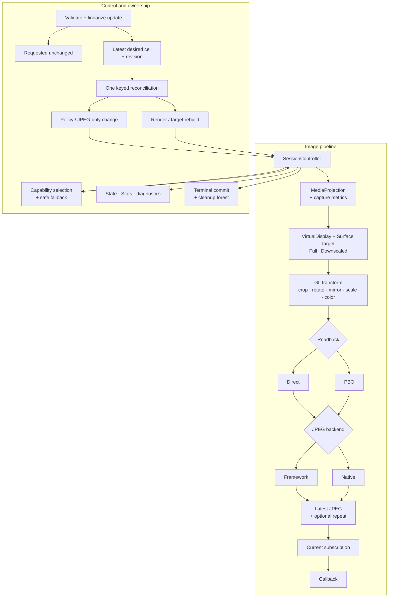

# Screen Capture Engine — Architecture

This file is the current internal architecture and platform source of truth. Product/public behavior is defined in [01_design.md](01_design.md); private implementation bindings are closed in [05_gate_b_inputs.md](05_gate_b_inputs.md).



## 1. Android capture and metrics

### 1.1 Application and platform contract

The application owns consent UI, notification, permissions, and a compliant media-projection foreground service. On API 34+ it declares the media-projection
foreground-service permission and type. The application starts that typed service from an allowed foreground context, obtains one fresh projection, and then
starts the Session. An app targeting 35+ does not start this service from `BOOT_COMPLETED`.

One Session-private serial Android lane performs every `MediaProjection`/`VirtualDisplay` mutation and every `MediaProjection.Callback`
registration/unregistration: projection-callback registration, `createVirtualDisplay`, `resize`, `setSurface`, VirtualDisplay release, projection-callback
unregister, and projection stop. MediaProjection callback bodies post immutable facts and never mutate platform objects from another lane. Acquisition and
cleanup therefore have one explicit Android order rather than relying on cross-thread platform behavior.

Startup order is:

1. commit Starting and projection ownership;
2. attach the metrics flow and obtain a first valid tuple;
3. register and acknowledge one `MediaProjection.Callback` on an explicit Handler;
4. prepare a provisional target and enter the sole `createVirtualDisplay` call;
5. on API 34–37 wait for first valid captured-content resize and reconcile the target to its authoritative `W,H` and selected target mode before frame admission;
6. validate the baseline pipeline, assign initial Stats, assign Running, and resume `start`.

On API 34–37, expiry of the initial captured-content-resize readiness deadline commits
`Failed(CaptureUnavailable)`, attempts source `MediaProjection`, label `CapabilityCheck`, message
`Initial capture geometry did not arrive before timeout`, and makes `start` throw
`ScreenCaptureException(CaptureUnavailable)` with that same timeout cause. It never admits a frame using provisional provider dimensions.

The engine creates one VirtualDisplay for the Session. It uses positive logical dimensions and density, `VIRTUAL_DISPLAY_FLAG_AUTO_MIRROR`, a nonnull Surface,
and passes `callback = null` and `handler = null`. The flag is a request; correctness depends on the MediaProjection callbacks, explicit operation returns, and
pixels, not flag equality. The engine never calls `VirtualDisplay.setRotation`.

`MediaProjection.Callback` attachment precedes `createVirtualDisplay`. A null result or `SecurityException` from `createVirtualDisplay` maps to
`CaptureUnavailable`. A directly thrown `OutOfMemoryError` maps to `ResourceExhausted`. `IllegalStateException` and any other unexpected failure map to
`InternalFailure`.

### 1.2 Metrics providers and geometry authority

The visible provider outcomes are defined in [Configuration, metrics, and display selection](01_design.md#33-configuration-metrics-and-display-selection).
Internally, one cold `CaptureMetricsProvider.observe()` Flow is collected from accepted start until
terminal. The Session retains that provider and collection for exactly this lifetime and never creates a replacement collector during geometry storms.

Built-in providers behave as follows:

- `fromActivityDisplay` snapshots the Activity's associated Display and does not retain the Activity;
- `fromUiContext` uses the unwrapped Activity display on API 24–29 and retains the real UI Context for associated maximum WindowMetrics on API 30+;
- `fromDisplay` retains an application-safe display context and exact Display, never switching display;
- null configuration uses `Display.DEFAULT_DISPLAY` through application `DisplayManager`.

Missing UI/display association throws `IllegalArgumentException`.

| API | Width/height authority | Density authority |
| --- | --- | --- |
| 24–29 all built-ins | explicit/snapshotted/unwrapped-Activity Display `getRealSize` | that display's Configuration |
| 30–33 | display/window-context maximum WindowMetrics | display Configuration |
| 34–37 before valid resize | provider provisional maximum | provider density |
| 34–37 after valid resize | `MediaProjection.Callback.onCapturedContentResize` | latest provider density |

On API 24–29 a UI Context supplies display association, not app-window capture bounds; all built-ins resolve that associated display's real size. On API 24–33
the selected display provider is width/height authority. On API 34–37 provider dimensions only bootstrap the VirtualDisplay: frame admission stays
closed until the first valid projection resize, after which projection width/height is authoritative and provider density remains live. The initial-resize
readiness timeout has the terminal startup result defined in Section 1.1. On API 24–33 `capturedContentVisible` remains null. On API 34–37 the registered
`MediaProjection.Callback.onCapturedContentVisibilityChanged(Boolean)` supplies visibility facts on the same explicit callback Handler as resize/stop. It starts
null until the first visibility callback. The controller processes each fact in serial fact order with geometry, desired, and lifecycle facts; a changed value
is included in the next single immutable Running assignment, while a duplicate value is conflated without assignment. Callback occurrence and lifecycle epoch
fence late facts, and terminal state discards them. Visibility is observation only and never changes admission, capture, pacing, fallback, or lifecycle.

All provider and projection-geometry emissions update one authoritative accumulator and publish its combined width/height/density tuple into one latest-value
cell; an emission changes only the fields its source owns under the API table. Each accepted combined tuple receives a non-reused geometry revision before it can
replace the cell. Overwriting an unclaimed revision coalesces it as `Superseded` and creates no rebuild. The controller claims only the newest cell value; once a geometry
revision materializes a rebuild, later revisions continue to overwrite the single cell and are reconsidered after that rebuild settles. Every materialized
revision ends once as `Applied`, `Superseded`, `Invalid/Suspended`, or terminal failure. Revision exhaustion terminally fails before identity reuse. No geometry
event queue or parallel rebuild grows during a storm. Provider/source absence uses `CaptureUnavailable` as defined in
[State and errors](01_design.md#36-state-and-errors). A valid geometry that cannot
satisfy the stored requested crop/region fails startup or suspends runtime output with `InvalidRequest`, according to the geometry rules in Section 5.

Before the initial `Running(Active)` commit, loss of any currently required metrics authority commits `Failed(CaptureUnavailable)` and makes `start` throw
`ScreenCaptureException(CaptureUnavailable)` with the boundary cause when one exists. Before the terminal observation, the controller makes one mandatory
diagnostic attempt with source `MetricsProvider`, label `CapabilityCheck`, exact message `Required capture metrics became unavailable during startup`, and the
raw nullable boundary cause; the ordinary `SessionTerminal` attempt follows. This startup path never publishes `Running(Suspended)` without a last effective
plan. After initial Active, the existing Suspended/recovery rule applies.

### 1.3 Target lifecycle

`SurfaceTexture(textureName, false)` calls `setDefaultBufferSize(Tw,Th)` with the selected positive target size before producer attachment and installs a Handler-bound
`SurfaceTexture.OnFrameAvailableListener` before that attachment.
Its `onFrameAvailable` invocation only sets the target's latest-pending bit. Retirement removes the listener and posts a same-Handler sentinel; the sentinel
proves listener-invocation ordering, not source freshness.

Each installed target owns a strictly increasing, non-reused `targetGeneration`. Its SurfaceTexture listener captures that generation and includes it in every
posted fact. Retirement fences the generation before listener removal. A listener fact carrying any noncurrent generation is cleanup-only: it cannot set the
pending bit, alter geometry/cache/admission, or access a released target. Target-generation exhaustion terminally fails before reuse.

The private target mode is exactly `Full` or `Downscaled`. Both modes keep the VirtualDisplay at authoritative logical dimensions `W,H` and density
`D`; only the SurfaceTexture/Surface buffer dimensions `Tw,Th` may differ.

`Full` is the mandatory API 24–37 baseline:

```text
VirtualDisplay = W x H at D
Surface target = W x H
Tw = W; Th = H
```

`Downscaled` is eligible exactly when all of these deterministic checks pass: API 32–37; `sourceRegion == Full`; `crop == Zero`; `outputSize` is
`ScaleFactor(f)` with `f < 1`; and the checked planner below returns `k < g`. Rotation, mirror, and color mode remain eligible. `TargetSize`, either half-region,
any crop, or a planner result of `k == g` selects `Full`. After mode selection, ordinary memory admission independently decides whether the selected plan can
build; a clean denial follows the normal `ResourceExhausted` start/reconciliation semantics and does not reselect Full. No device, GPU, driver, benchmark, soak, or
image-score allowlist is consulted.

For resolved output `(Ow,Oh)`, checked positive integer planning is:

```text
g = gcd(W, H)
baseW = W / g
baseH = H / g

rotation 0/180: requiredSourceW = Ow; requiredSourceH = Oh
rotation 90/270: requiredSourceW = Oh; requiredSourceH = Ow

ceilDiv(n,d) = n / d + (if n % d == 0 then 0 else 1)
k = max(ceilDiv(requiredSourceW, baseW), ceilDiv(requiredSourceH, baseH))
k = min(g, max(1, k))
Tw = baseW * k
Th = baseH * k
```

All arithmetic is checked before narrowing. `Tw:Th` therefore equals `W:H` exactly and never undersamples either source axis required by the resolved output. If
`k == g`, planning selects `Full`. The VirtualDisplay remains `W x H` at authoritative density `D`; density is never scaled. On API 32–37 Android applies its
documented uniform aspect-preserving media-projection fit-and-center behavior to the smaller exact-aspect Surface, filling `[0,0,Tw,Th)`. Platform filtering and
rounding may produce minor pixel differences from Full; Downscaled does not promise pixel identity. Runtime uses no inferred content rectangle.

API 32–33 plan from authoritative display metrics. API 34–37 first create a provisional `Full` target from provider metrics, then wait for the first valid
resize fact. If authoritative `W,H` and the selected mode require the exact same Full target, the startup owner retains it and records no detach, Surface-release,
GL-destruction, replacement, or retarget receipt. Otherwise, before Running and frame admission, the startup owner uses the same
drain/detach/retire-before-replace order as an ordinary destructive target rebuild to install the authoritative Full or Downscaled target. This
conditional pre-Running transition publishes no Suspended state.

For unchanged authoritative `W,H`, a healthy current Full target is retained only when the deterministic checks select Full. If they select
Downscaled, a current Full target uses the ordinary destructive target rebuild. A healthy current Downscaled target is retained while the new
plan remains eligible and its `Tw,Th` provide at least the new required source-axis samples; it is never rebuilt only to shrink further. Changed authoritative
dimensions always rebuild. From a current downscaled target, a larger eligible demand or an ineligible plan also rebuilds. There is always one target and at
most one healthy complete pipeline.

Ineligibility selects Full. A safely returned actual target incompatibility or runtime target-path fault disables Downscaled for the rest of the
Session, loses the affected frame as applicable, and permits at most one destructive Full-target fallback. An ambiguous entered platform/GL operation,
timeout, or uncertain ownership terminally fails and quarantines under the ordinary rules; it never claims a fallback-safe target.

A density-only change closes admission, drains entered frame work, calls `VirtualDisplay.resize(W,H,newDensity)`, invalidates the cache, and reopens admission
while retaining the healthy target and pipeline. A dimension or target-health change uses the full rebuild in Section 2. A healthy retained target is not
replaced solely for freshness. After target readiness or engine-controlled admission reopening, acquisition may use the first available producer buffer even
when it was queued before or during the closed-admission interval; producer timestamps remain diagnostic-only and provide no age authority. Reconciliation,
frame-attempt, and target generations fence stale engine work/results, not platform-buffer age. `MediaProjection.Callback.onStop` is the sole platform
`CaptureEnded` authority; explicit VirtualDisplay release remains an ownership-cleanup operation and creates no lifecycle fact.

## 2. Parameters and rebuild

### 2.1 Latest desired parameters

The setter linearization atomically replaces one immutable desired cell `(requestedParameters, desiredRevision)` and commits a new immutable Running snapshot
that preserves the current running/effective/visibility fields. Revisions are Session-local, strictly increasing, and never reused. Structural equality publishes
nothing. Revision exhaustion commits terminal `InternalFailure` before wrap.

The cell begins at revision zero with default parameters. The winning accepted `start` replaces it with `initialParameters` at the first nonzero revision before
startup mechanics; subsequent unequal setters advance it. Thus even a pre-Running terminal snapshot has one defined final requested value.

There is at most one reconciliation occurrence plus the one latest desired cell. Its currentness key is exactly
`(desiredRevision, geometryGeneration, lifecycleEpoch)`. Desired, geometry, capture-availability, memory-pressure, and relevant fallback facts signal the
controller through the lossless wake protocol in Section 2.3. The cell retains only the latest desired value; reconciliation outcomes and diagnostics arise
from materialized reconciliation work.

`geometryGeneration` advances for each accepted authoritative combined geometry. `lifecycleEpoch` advances on accepted-start authority, capture
available/unavailable transitions, terminal, and a committed monotone target/backend-health fallback; it does not advance for Active/Suspended publication or
for steps performed by the reconciliation already carrying that epoch. A private occurrence identity separately fences late returns from an earlier retry of
the same key. All identities exhaust terminally before reuse.

The closed reconciliation action matrix is:

| Difference from last committed effective plan | Action |
| --- | --- |
| none after geometry resolution | Commit/retain Active without resource work. |
| pacing and/or repeat only | Replace policy/deadlines; preserve target, pipeline, and current cache. Disabling repeat retires only its deadline. |
| JPEG quality only | Invalidate cached bytes and reconcile the selected JPEG resources. |
| density only | Use the density-only path in Section 1.3. |
| region, crop, output size, rotation, mirror, or color | Rebuild output resources; Section 1.3 independently decides target retention. |
| capture dimensions, target-health fault, larger downscaled demand, or downscale ineligibility | Replace target and output pipeline. |

### 2.2 Bounded reconciliation

Reconciliation snapshots one key and never redirects an already-entered platform/GL/JPEG operation when a newer desired value arrives. Before irreversible
retirement, a healthy old output may remain `Running(Active)`: the enclosing snapshot exposes the latest requested parameters while Active exposes the older
effective parameters. After retirement begins, output is truthfully `Running(Suspended(Reconfiguring))` until a current outcome commits.

A target-retaining rebuild retires only replaceable output resources. A target-replacing rebuild uses the order below. Preflight is arithmetic/capability/
headroom evaluation only: it creates no reservation and allocates nothing. Neither scope reserves or allocates a replacement before the old replaceable scope
is retired and released or quarantined, and neither keeps two healthy pipelines.

```text
snapshot key -> validate geometry and plan -> non-reserving feasibility preflight
-> keep old output Active while work remains reversible
-> close fresh/repeat/delivery admission and invalidate cache/old identities
-> drain entered work -> cross irreversible retirement -> publish Suspended(Reconfiguring)
-> detach/retire/release-or-quarantine old scope
-> reserve/admit complete replacement -> allocate/attach/probe one replacement
-> classify result against current key -> commit current or retire stale
```

Every completion rechecks the full key and its active occurrence fence. Current-key/current-occurrence success commits effective parameters, reopens admission, and publishes Active. A stale success publishes
nothing and retires its newly built resources safely before reconciling the latest key. A safe/clean stale failure, including one after retirement, never fails
the Session: it settles exact ownership and then reconciles latest. Unsafe or ownership-ambiguous failure is terminal `InternalFailure` regardless of staleness.

Current-key recoverable outcomes retain the latest desired value: unavailable capture/metrics publishes `Suspended(CaptureUnavailable)` and retries on a new
desired or availability/geometry fact; geometry-invalid desire publishes `Suspended(InvalidRequest)` and retries on a new desired or geometry fact. Clean
preflight denial before retirement publishes `Suspended(ResourceExhausted)`, parks the retained old pipeline without output, and retries only on a new desired
or memory-pressure/environment trigger. Clean reservation/admission/allocation/replacement failure after retirement is terminal `Failed(ResourceExhausted)`
with no rollback.
Among safe/clean reconciliation outcomes, terminal failure after retirement requires the current key and a fatal classification. A current-key clean mandatory
build failure after retirement is terminal with its classified problem; optional-axis safe failure follows its bounded fallback.

Continuous desired/environment mutation has no convergence-time guarantee, but capacity remains one in-flight occurrence plus latest desired. Once writers and
environment changes quiesce, the latest key must converge to Active, an exact recoverable Suspended state, or terminal. Terminal closes reconciliation admission;
the terminal snapshot retains the final desired parameters and last committed effective parameters.

### 2.3 Platform mutation

A target replacement prepares no replacement until old work has drained and detachment is proven. After admission closes, target-listener removal and its
same-Handler sentinel are recorded. The Android lane then calls `VirtualDisplay.setSurface(null)`; its normal return authorizes the documented detach/teardown
ordering but is not producer-drain or happens-before proof. The complete target bag remains retained until that fact, listener sentinel, stale Android-callback fences,
zero target leases, and subsequent normal `Surface.release` return are all recorded; only then may `SurfaceTexture.release` and old GL-object destruction complete. The
old pipeline is fully retired before replacement reservation/allocation begins. The Android lane then applies `resize` when the
authoritative dimensions/density changed, calls `setSurface(newSurface)`, and validates the attached replacement.

A `setSurface(null)` or replacement-attach throw/timeout/ambiguous return cannot prove platform ownership and terminally roots every possibly referenced target.
Late return is occurrence-fenced and cleanup-only. At terminal, a normally returned `VirtualDisplay.release` can supply the corresponding detach receipt instead;
`Surface.release` itself remains the explicitly non-watchdog cleanup call.

## 3. EGL, GL, readback, and JPEG

### 3.1 Baseline GL pipeline

`EGLDisplay` is a shared process/framework handle and is not Session-owned. The engine may initialize/use it but never calls `eglTerminate` as if it had exclusive
ownership. Each Session privately owns its EGLContext, 1×1 pbuffer EGLSurface, serial GL lane, and all GL objects/programs; none is shared with application
rendering or another Session. The selected EGLConfig is a non-owned descriptor: pbuffer-capable RGBA8, no required depth/stencil, and the matching ES renderable
bit. Successful `eglMakeCurrent` is required before Session GL ownership begins.

The 1×1 pbuffer exists only to keep the private context current; it is never the render or readback target. One pipeline-owned `RenderTarget` contains exactly
one output-sized RGBA8 2D texture and one framebuffer object. The texture is allocated for `(Ow,Oh)`, attached at `GL_COLOR_ATTACHMENT0`, and charged as
estimated GPU bytes `B = 4*Ow*Oh`. It is accepted only when checked `glCheckFramebufferStatus` returns `GL_FRAMEBUFFER_COMPLETE` without a GL error. Every transformed
frame draws into that FBO, and Direct/PBO readback reads that FBO. A concrete clean allocation limit maps to `ResourceExhausted`; other incomplete/error evidence
fails the mandatory pipeline with `InternalFailure`. Retirement destroys the FBO and texture on the GL lane after their leases close.

The `EGLDisplay` and EGLConfig references are neither Session carriers nor ledger charges and never enter `SessionQuarantineRoot`; only Session-owned context,
pbuffer, lane work, and GL objects do.

The baseline uses GLES2 ESSL 1.00 plus `GL_OES_EGL_image_external`. Fragment highp is selected when the runtime precision query reports the required support;
otherwise the mediump best-effort shader is selected. No device record or image score participates, and absence of highp alone never rejects start or reconciliation.
The chosen precision is included in mandatory diagnostics.

Every frame validates current context, drains a bounded old-error set, acquires OES once, copies and validates all 16 transform values, reads dataspace where
available, installs canonical state, draws, reads back, and performs a final bounded error drain. Canonical state fixes framebuffer, program, viewport, OES
unit, inputs, color mask, pack state, and disables blend/depth/stencil/scissor/cull/dither.

GLES2 direct readback writes tight `RGBA/UNSIGNED_BYTE` rows directly into one stable CPU carrier of `B = 4 * outputWidth * outputHeight` checked bytes. It adds
no second B-sized copy.

### 3.2 Capable PBO

Startup always attempts the PBO path when EGL exposes a matching ES3-renderable config, ES3 context creation and `eglMakeCurrent` return successfully, the created
context reports GLES 3.x, and its extension-token set contains exact `GL_OES_EGL_image_external_essl3`. The ESSL3 external-texture shader must compile, link, and
validate, and checked creation/allocation of one `GL_PIXEL_PACK_BUFFER` of `B` bytes must return without GL error before Running. These are the complete PBO
selection checks. Any missing check, clean creation failure, or clean pre-entry resource denial discards that attempt and builds a fresh GLES2 Direct baseline.
No API level by itself, device/GPU/driver allowlist, soak result, image score, or measured speedup participates in selection.

The complete PBO-specific GLES3 call inventory is `glGenBuffers`, `glBindBuffer`, `glBufferData`, offset-form `glReadPixels`, `glFenceSync`, `glFlush`,
`glClientWaitSync`, `glMapBufferRange`, `glUnmapBuffer`, `glDeleteSync`, and `glDeleteBuffers`; baseline `glGetError` performs classification. No other GL call is
part of PBO capability or ownership.

PBO owns one B-sized pixel-pack buffer and at most one fence. Its required GLES3 operation sequence is: bind the buffer as `GL_PIXEL_PACK_BUFFER`; issue
`glReadPixels` at offset zero; create `glFenceSync`; `glFlush`; poll with zero-timeout `glClientWaitSync` using bounded delayed rescheduling; after signal,
retire the PBO-completion deadline, wait until the sole stable CPU carrier's prior encode lease has mechanically returned, then `glMapBufferRange` exactly `B`
bytes with `GL_MAP_READ_BIT`; copy exactly `B` bytes into that carrier; `glUnmapBuffer`; then delete the sync. Retirement unbinds and deletes the buffer. Every
step is followed by the bounded error classification already required by Section 3.1. Polling never busy-spins and has one completion deadline. CPU-carrier
availability is bounded capacity, not fence completion, and arms no second completion timer.

Each zero-timeout `glClientWaitSync` result enters exactly one partition: `GL_ALREADY_SIGNALED` or `GL_CONDITION_SATISFIED` proceeds to mapping;
`GL_TIMEOUT_EXPIRED` reschedules one delayed poll while the completion deadline remains open, and deadline expiry is terminal because completion/ownership was
not proved; `GL_WAIT_FAILED` drains/classifies GL error and is a safe returned PBO fault only while context and fence/PBO ownership remain certain, otherwise it
is terminal; every other status is inconsistent and terminal. No status is treated as success by default.

A mechanically returned clean PBO fault closes fresh admission, drops that frame, drains the sole PBO occurrence, and deletes its fence/PBO on the GL lane. Only
a returned GL-destruction receipt permits committing PBO-disabled, reopening admission, and using Direct later; one switchover frame may also be lost. PBO
completion-watchdog expiry, destruction failure/nonreturn, context loss, ambiguous issue state, `glUnmapBuffer` false/throw/GL-error, or uncertain ownership
terminally fails the Session and never enables Direct from that bag. PBO disablement never disables native JPEG, and no generation re-enables PBO.

### 3.3 JPEG

The private synchronous `FrameEncoder` boundary receives positive dimensions, tight CPU RGBA, nominal-SDR metadata, quality, and one transactional encoded sink.
`FrameEncoder` is private and closed to the two mutually exclusive V1 JPEG backends.

Framework JPEG is mandatory. Each Framework pipeline creates a fresh mutable non-HARDWARE sRGB `ARGB_8888` Bitmap of `(Ow,Oh)` and may reuse it only within
that pipeline. Engine-canonical RGBA is always opaque (`A=255`). Before allocation the planner reserves the symbolic aligned Bitmap estimate `BM` from
[Admission and bounds](#71-admission-and-bounds) plus one reusable `R=4*Ow`-byte row scratch. After allocation the ledger replaces `BM` with the Bitmap's checked positive
`allocationByteCount`; an inadmissible positive delta releases the Bitmap and returns clean `ResourceExhausted`.

The fast transfer path is selected per built Bitmap only when checked `bitmap.rowBytes == 4*Ow`, `bitmap.byteCount == B`, and the tight RGBA ByteBuffer has
`position == 0`, `limit == B`, and `remaining == B`. It then calls `copyPixelsFromBuffer` once. Raw RGBA is portable for this guarded path because
`ARGB_8888`'s native packing on Android's supported little-endian ABIs has the same memory byte order; `ByteBuffer.order()` does not participate. The engine
never uses an IntBuffer view.

Otherwise the mandatory portable path reuses exactly one `IntArray(Ow)` row scratch, packs each canonical pixel as the logical Kotlin Int `0xFFRRGGBB`, and
calls `Bitmap.setPixels(row, 0, Ow, 0, y, Ow, 1)` once for each row. It records the actual `rowBytes`, expected tight stride, and row-conversion selection in
the mandatory runtime diagnostic. Gate B supplies small red/blue, odd-width, alpha, row-tail, transfer-path, and fast-path-guard vectors. Tests validate JPEG
structure, decoded dimensions/orientation, and absence of obvious channel or row corruption; they do not require lossy decoded pixels or bytes to be equal.
Bitmap/scratch creation OOM or clean capacity denial maps to `ResourceExhausted`; unsafe transfer behavior follows the ordinary terminal rule.
Framework JPEG uses this closed entered-frame outcome partition; it does not change the startup/update allocation mappings above:

| Entered Framework outcome | Disposition |
| --- | --- |
| `Bitmap.compress` returns true and the checked transactional sink commits | Publish the complete JPEG through the ordinary currentness fence. |
| `Bitmap.compress` returns false | Atomically discard all tentative bytes, end the current fresh attempt once as `byFailure`, and continue with Framework for later frames. The same frame is not retried. |
| `Bitmap.compress` or an entered sink operation directly throws `OutOfMemoryError`, or incremental sink memory/representability admission is cleanly denied | Atomically discard all tentative bytes, end the current fresh attempt once as `byFailure`, and commit terminal `Failed(ResourceExhausted)`. |
| An unexpected `Exception`/runtime failure, or a malformed sink offset, count, cumulative-length, or writer-contract observation | Atomically discard all tentative bytes, end the current fresh attempt once as `byFailure`, and commit terminal `Failed(InternalFailure)`. |
| The entered call does not return or leaves pixel/sink ownership uncertain | End the current fresh attempt once as `byFailure`, commit terminal `Failed(InternalFailure)`, and quarantine the exact operation, input, sink, and tentative bytes until mechanical return proves what can be released. |

Partial bytes never publish. A non-`OutOfMemoryError` fatal VM `Error` is not normalized into a recoverable frame drop or fallback; it retains ordinary fatal
process/thread semantics.

Under `Auto`, native JPEG is selected exactly when API is 30+, the current ABI is shipped, platform `libjnigraphics.so` loads, and the single required dynamic NDK
compression symbol `AndroidBitmap_compress` resolves. SDK is checked before library load or symbol lookup. A startup probe invokes that exact boundary once with
a private opaque 2×2 RGBA checker, sRGB dataspace, JPEG format, quality 80, and a transactional sink. Normal success requires
`ANDROID_BITMAP_RESULT_SUCCESS`, at least one accepted sink byte, no writer rejection, and a committed transaction; the bytes are then discarded. A safely
returned probe failure selects Framework before Running. Probe nonreturn or uncertain input/writer ownership is unsafe and follows the ordinary terminal rule.
No other symbol or probe may become an eligibility condition. Real frames use the complete descriptor below; shipped native packaging is 16-KiB-page compatible.
A missing eligibility check or clean pre-entry denial selects Framework.
No device allowlist, soak result, decoded-image score, or measured speedup participates. Native JPEG never receives mapped PBO memory.

Every real native call receives one immutable `NativeFrameDescriptor` whose complete fields are: the stable tight-RGBA `pixels` address and `pixelByteCount=B`;
an `AndroidBitmapInfo` with `width=Ow`, `height=Oh`, `stride=4*Ow`, `format=ANDROID_BITMAP_FORMAT_RGBA_8888`, and
`flags=ANDROID_BITMAP_FLAGS_ALPHA_OPAQUE` with the hardware bit clear; `dataspace=ADATASPACE_SRGB`;
`compressFormat=ANDROID_BITMAP_COMPRESS_FORMAT_JPEG`; requested `quality`; and the exact transactional-sink `userContext` plus nonnull
`AndroidBitmap_CompressWriteFunc`. Checked narrowing to the C field widths precedes entry. The descriptor and pixel/sink leases remain rooted through mechanical
return; the writer validates every `(data,size)` segment before accepting it.

Both backends write a checked segmented sink. Each write validates offset, count, cumulative `Int`-representable length, and memory admission before accepting
bytes. Success atomically transfers all segments to immutable storage; every other outcome discards the tentative transaction. There is no arbitrary public
encoded-size cap.

A safely returned native failure drops that frame, may lose one switchover frame, disables only native JPEG, and uses framework JPEG for later frames. The same
frame is never encoded twice. An unsafe native stall or uncertain pointer/sink ownership fails the Session. Backend checks compare JPEG structure, decoded
dimensions/orientation, and visible channel/row correctness using the Gate-B vectors and tolerances; lossy pixels and JPEG bytes need not match.

Reachable products are Direct+Framework, Direct+Native, PBO+Framework, and PBO+Native. PBO and native health are independent Session-monotone axes.
Target mode is orthogonal to those four products and never couples their independent fallback health.

## 4. Frame scheduling, cache, and delivery

### 4.1 Fresh source selection

One target owns one latest-pending source bit. An `onFrameAvailable` invocation only sets that bit; repeated invocations while it is set coalesce and are neither
attempts nor drops.
Materialization occurs exactly when the controller clears the bit, assigns a fresh attempt occurrence, reserves its one final-outcome slot, and admits or queues
the owner work. Direct readback permits at most one materialized attempt. Capable PBO permits at most two materialized attempts total: frame N may be in CPU
encoding while frame N+1 is in PBO readback. The same single latest-pending source bit may coexist with those attempts, but there is no third materialized
attempt, second pending PBO/fence, or JPEG queue.

The overlap is asymmetric: GPU readback N+1 may issue while encoder N holds the sole CPU `B` carrier. Even after N+1's fence signals, mapping/copy waits for the
exact encode-N return receipt that releases that carrier. There is no second CPU pixel carrier, no second `B` CPU charge, and no mapped PBO memory passed to
JPEG.

`EngineClock` is the sole interval clock and returns raw `SystemClock.elapsedRealtimeNanos()`, which includes deep sleep. Pacing, repeat, public frame
timestamps, Stats, readiness and operation deadlines, callback deadlines, and duration samples use only this clock. Wall time, uptime,
`System.nanoTime()`, and producer/`SurfaceTexture` timestamps never provide authority; an observed producer timestamp is diagnostic-only.

Pacing stores the last actual grant time and the bounded elapsed interval required before the next grant. A scheduled delay or Handler post is only a wake hint:
when it runs, the engine resamples the clock and checks current identity, policy, and elapsed delta. An early or stale wake does nothing; a late wake admits at
most one action and creates no catch-up burst. The engine makes no exact execution-time guarantee. Valid SampleEvery and repeat intervals convert to positive
representable nanosecond durations; pacing represents only the last grant plus that bounded duration and has no sentinel deadline state.

- `Auto` admits pending source as soon as capacity permits.
- `SampleEvery` admits the first current source immediately, then at most one pending fresh source on each elapsed interval; no source means no attempt.
- `MaxFps` limits both fresh admission and all output publication to its rational cadence.

Pipeline occupancy before materialization retains the pending bit. `Auto` and `SampleEvery` materialize only an eligible source. `MaxFps` claims and materializes
an idle-slot opportunity before its fresh-deadline check; an early opportunity ends once as `byRateLimit`. If the bounded owner slot synchronously rejects a
materialized submission before entry because capacity changed, it ends once as `byPipelineBusy`; queued work has no timer. Cache commit is success; an identity
fence is `byStaleWork`; a returned production failure is `byFailure`.
Suspension, rebuild, target replacement, or terminal clears an unmaterialized pending bit without a counter. No occurrence returns to pending or receives two
dispositions.

`MaxFps` uses independent fresh and output phases. For `S=1_000_000_000`, `F=fps`, `q=S/F`, `r=S%F`, and `phase in 0 until F`, an actual grant performs
`sum=phase+r`, `carry=if(sum>=F) 1 else 0`, `phase=sum-carry*F`, and stores `requiredGap=q+carry` with that `grantTime`. A phase advances only for its own actual grant; denial,
early opportunity, stale work, and timer wake do not advance it. Anchoring at the actual grant prevents catch-up bursts while the rational phase avoids
accumulated truncation drift. An output-ineligible completed JPEG waits in one unpublished slot and is not encoded again.

### 4.2 Static-frame repeat

`frameRepeatIntervalMillis` is a best-effort target maximum-silence interval over produced output, not a deadline guarantee. It is inactive until one current
fresh JPEG has published. When due, it republishes metadata and a lease over the same immutable bytes: no acquisition, GL, readback, JPEG, or payload copy occurs. Fresh unpublished content has
priority over a due repeat. `MaxFps` may delay repeat because it caps every output.

Pause, suspension, untrusted source, target replacement, render/JPEG rebuild, and terminal invalidate the cache and repeat deadline. A late old-generation
result cannot restore them.

A cache is current exactly when its `LastPublished` bytes and metadata belong to the current image-affecting plan (geometry, region, crop, output size,
rotation, mirror, color, and JPEG quality) plus the current target, render, and JPEG generations, and none of the invalidating events above has occurred since
publication. Pacing and repeat policy are not image-affecting and do not by themselves stale the cache. Successful subscription registration atomically checks that currentness while claiming the
single handoff slot. If current, it delivers a lease over those bytes immediately with the original sequence, timestamp, and image size; it performs no encode,
payload copy, `framesProduced` increment, or output-`MaxFps` phase advance. If absent or stale, registration creates no waiting cache record and simply awaits a
future output. The same registration-generation and unsubscribe fences used for fresh/repeat output govern cached-first delivery.

### 4.3 Encoded ownership

Storage has at most one tentative sink, one completed unpublished generation, one last-published generation, and one displaced old leased generation. The frame
store always owns and charges immutable backing bytes; the sole outstanding callback record owns only a reference-counted lease, which may coexist with
`LastPublished` in any prepared, dispatching, queued, or entered state. Publication moves unpublished bytes and their output metadata into `LastPublished`.
A repeat updates `LastPublished` to its new sequence/timestamp while retaining the same immutable bytes. Displaced bytes free at zero leases or become the
single old leased generation until that record resolves/quarantines. Repeat adds metadata and a lease transition, never another payload owner.

Each fresh or repeated publication receives a Session-local sequence starting at one and the `EngineClock` sample taken at output commit. Sequence exhaustion
terminally fails before wrap. Equal timestamps are permitted.

### 4.4 Frame-consumer handoff

At most one current frame-consumer registration exists, and it owns at most one outstanding record and encoded lease. A registration generation must reach
exact resolution before a replacement generation can register, so old and new callbacks can never overlap. The outstanding record's exact state graph is:

```text
Idle -> Prepared -> Dispatching -> AcceptedQueued -> Entered -> Resolved
Prepared -> Resolved
Dispatching -> Entered
Dispatching -> Resolved
Dispatching | AcceptedQueued -> DetachedPreEntry -> Resolved
Dispatching | AcceptedQueued | DetachedPreEntry | Entered -> Quarantined
Resolved -> Idle  (only while the same registration remains active)
```

The direct `Prepared -> Resolved` edge is controlled unregistration or terminal winning before external dispatch begins. `DetachedPreEntry` means that winner
committed after dispatch began or accepted the trampoline but before entry; the late dispatch return or trampoline self-rejection emits the exact
callback-resolution receipt and moves the record to `Resolved` without invoking user code. `Quarantined` is used only when an unsafe dispatch nonreturn,
unresolved accepted task, or entered callback nonreturn prevents that receipt; it anchors the exact record and lease. A busy record counts `byConsumerBusy`.
Frame-callback invocation N resolves or quarantines before N+1 can be selected; quarantine therefore permanently consumes the sole slot.
Normal return, callback throw, and synchronous dispatch rejection return `Resolved` to `Idle` only if that registration is still active. Unsubscribe or terminal
resolution instead closes the registration generation and cannot return it to `Idle`.

Controlled unregistration is idempotent, permanently closes admission for that registration generation, and waits for its sole queued or entered record's
exact resolution. Only after successful return may a replacement callback register. Cancellation of the waiting coroutine does not reopen the old generation,
fabricate resolution, or admit a replacement; mechanical convergence continues, and another `unsubscribe()` call on the same handle may await the same
idempotent operation. `unsubscribe()` invoked from its own entered callback fails fast with `IllegalStateException` to avoid self-wait. The Session and its
MediaProjection continue throughout successful unregistration and replacement.

Terminal or quarantine wins over a pending unsubscribe success. `Failed(problem)`, including failure created by quarantine while nonterminal, completes the
waiter with `ScreenCaptureException(problem)`; `Stopped(OwnerStop|CaptureEnded)` completes it with `CancellationException`, even if unresolved residue is then
quarantined under that already-won terminal state. The record/lease remains physically rooted. The registration generation stays closed and replacement is
forbidden even if a late callback return later reduces the root.

Delivery first creates the engine-owned trampoline and commits its fenced record/lease as `Prepared`; no external dispatcher transfer has begun. Stop or
controlled unregistration may therefore move `Prepared -> Resolved` synchronously through the shared short gate and release that exact lease. When the delivery worker reaches the same
gate, it either moves the still-admitted record `Prepared -> Dispatching` immediately before invoking caller `dispatch`, or emits a dispatch-skipped
resolution if stop/unregistration already detached it. No external call or delivery drop occurs on the skipped path.

Delivery-worker capacity is fixed at exactly one active worker occurrence per Session. Sequential occurrences may reuse that capacity; no callback, rejection,
cached replay, or unsubscribe creates parallel workers or a queue.

With no controller/owner lock held, the worker arms the dispatcher-call safety occurrence immediately before invoking caller `dispatch`. That occurrence is
independent of the later trampoline-entry deadline: it retires on synchronous throw, normal dispatch return, or inline trampoline entry. Only a normal return
before entry creates `AcceptedQueued` and arms the separate 5,000 ms entry deadline. Three one-shot outcomes race after `Dispatching`:

- trampoline entry may run inline, claim `Entered` through the same short private gate used by stop/unregistration, and retire dispatcher-call timing before user code;
- normal dispatch return before entry commits `AcceptedQueued` and then arms the task-entry deadline;
- dispatch throw/rejection before entry records `byDispatchFailure` and resolves that exact record/lease. It consumes only that delivery opportunity; the
  registration remains active for a later produced or distinct cached opportunity, with no retry queue and no immediate redispatch of the rejected record.

If trampoline entry wins before `dispatch` later throws, entry remains authoritative. The later dispatch throw retires only its dispatch-call return
occurrence: it cannot resolve or reclassify the entered record, cannot increment `byDispatchFailure`, and cannot replace the callback outcome. The entered
callback's mechanical return or throw alone settles the record and lease under the ordinary callback rules.

If stop or controlled unregistration changes the still-in-call record to unresolved `DetachedPreEntry` and `dispatch` then returns normally before entry,
that return retires dispatcher-call safety and arms the existing 5,000 ms accepted-task entry/self-rejection deadline from the return sample; the record
remains `DetachedPreEntry`, and no new timer or deadline kind is created. Trampoline entry before that deadline self-rejects, invokes no user code, and resolves
the exact record. Deadline expiry uses the existing terminal/quarantine rule below.

Dispatch safety timeout before return/entry atomically moves a pre-entry record to `DetachedPreEntry`, commits `Failed(InternalFailure)`, and roots its exact
dispatch worker, record, and lease; an `Entered` winner is rooted in that state. In `AcceptedQueued` or its unregistration-detached `DetachedPreEntry` successor, failure to obtain exact entry/self-rejection
resolution within the same 5,000 ms deadline emits mandatory `DeliveryProblem`, commits `Failed(InternalFailure)`, and roots that exact record and lease.
Timeout alone never proves entry, callback return, resolution, or release. A late trampoline is occurrence- and terminal-fenced, invokes no user code, and emits
its exact self-rejection resolution; that receipt may release the record/lease and reduce `SessionQuarantineRoot`. A late dispatch or entered-callback return is
likewise cleanup-only and may reduce its exact rooted residue. Stop/unregistration winning the shared gate before trampoline entry prevents user invocation;
trampoline entry winning first defines an entered frame-callback invocation that may start or finish after `stop` returns. Dispatch-call return, trampoline
entry, deadline retirement, and frame-callback return/throw are separate facts and each disposes only its own occurrence once. Terminal stop wins over
replacement admission and resolves every safely resolvable record or anchors the unresolved exact record under the Session root.

An entered frame-callback invocation has no execution watchdog. Stop, controlled unregistration, and waiter cancellation cannot interrupt it or fabricate its
return. An invocation that never returns permanently anchors its record and lease. Mechanically returned throws count as `byCallbackFailure`; `finally`
releases the lease. Fatal process/thread termination remains outside library completion guarantees.

## 5. Pixels, geometry, and color

The canonical pre-JPEG image is top-to-bottom opaque RGBA8 with nominal/best-effort SDR color. Public transform order is:

```text
SourceRegion -> unrotated crop -> clockwise rotation -> oriented mirror
-> output sizing -> source-to-SDR/sRGB handling -> ColorMode -> top-down rows
```

Full is `[0,W)`, LeftHalf is `[0,W/2)`, and RightHalf is `[W/2,W)`; a half-region requires `W >= 2`, and the right half receives an odd final column. A half
request with `W < 2` is geometry-invalid and maps to `InvalidRequest`. Crop uses nonnegative edge insets and must leave a nonempty source. Rotation swaps
oriented dimensions at 90/270 degrees.

For positive capture dimensions `(W,H)`, the selected region is `(rx0,ry0,rw,rh)`:
Full `(0,0,W,H)`, LeftHalf `(0,0,W/2,H)`, RightHalf `(W/2,0,W-W/2,H)`.
After crop, `x0=rx0+left`, `y0=ry0+top`, `Sw=rw-left-right`, `Sh=rh-top-bottom`; `Sw` and `Sh` must be positive.
Rotation gives `(Rw,Rh)=(Sw,Sh)` for 0/180 and `(Sh,Sw)` for 90/270.

For cropped view origin `(x0,y0)` and size `(Sw,Sh)`, oriented size is `(Rw,Rh)`. Output center `(i,j)` starts at
`u0=(i+0.5)*Rw/Ow`, `v0=(j+0.5)*Rh/Oh`. Undo mirror with `Horizontal: u=Rw-u0`, `Vertical: v=Rh-v0`; the other coordinate is unchanged. Undo clockwise rotation:

```text
0:   xs=u,      ys=v       90:  xs=v,      ys=Sh-u
180: xs=Sw-u,   ys=Sh-v    270: xs=Sw-v,   ys=u
```

Logical capture edge position is `(x0+xs,y0+ys)`. Full mode has `Tw=W,Th=H`; Downscaled preserves `Tw:Th == W:H`. In both modes active content fills
`[0,0,Tw,Th)` and normalized pre-OES position is `((x0+xs)/W, (y0+ys)/H)`. All oracle geometry above uses binary64 arithmetic without intermediate integer
rounding.
The copied 4×4 OES matrix multiplies the column vector `(preOesX,preOesY,0,1)` exactly once; its resulting x/y are the normalized external-texture sample.
Framebuffer row inversion is separate and once. External sampling is `LINEAR` with `CLAMP_TO_EDGE`.

The CPU sampling oracle maps normalized `(a,b)` after OES to texel-center coordinates `qx=a*Tw-0.5`, `qy=b*Th-0.5`, clamps each to
`[0,Tw-1]`/`[0,Th-1]`, chooses `x0=floor(qx)`, `x1=min(x0+1,Tw-1)` and equivalently for y, then bilinearly interpolates with the fractional parts.
Its final normalized channel is clamped to `[0,1]` and quantized as `min(255,max(0,floor(255*c+0.5)))`. Small Gate-B vectors check dimensions, orientation,
crop and transform order, row/channel order, alpha, and obvious sampling corruption. Sampling uses practical tolerances rather than universal pixel equality;
test results never select a runtime path.

`ScaleFactor(f)` resolves from the oriented positive dimensions `(Rw,Rh)` in this exact binary64 order:

```text
scaledW = binary64(Rw) * f
scaledH = binary64(Rh) * f
roundedW = floor(scaledW + 0.5)
roundedH = floor(scaledH + 0.5)
Ow = max(1, checkedNonNegativeInt(roundedW))
Oh = max(1, checkedNonNegativeInt(roundedH))
```

The constructor already requires finite positive `f`. `checkedNonNegativeInt` accepts exactly `0..Int.MAX_VALUE`; the following `max` is the specified
one-pixel clamp. At `start`, a nonfinite product or sum, a negative rounded value, or a rounded value above `Int.MAX_VALUE` throws
`ScreenCaptureException(InvalidRequest)`. During reconciliation the same condition publishes `Suspended(InvalidRequest)` for the latest desire. A representable
output that a device/backend/memory/admission limit cannot support uses the `ResourceExhausted` pre/post-retirement rules in Section 2.2. Half-up ties are ties in the
actual binary64 products above; no decimal reinterpretation or intermediate integer rounding occurs.
`TargetSize.Stretch` uses exact requested dimensions.
`AspectFit` creates no padding. For bound `(A,B)`, if `A*Rh <= B*Rw`, `Ow=A` and
`Oh=min(B,max(1,(A*Rh+Rw/2)/Rw))`; otherwise `Oh=B` and `Ow=min(A,max(1,(B*Rw+Rh/2)/Rh))`.
All products are checked positive Long values.

Required checks are defined in [03 Verification](03_verification.md); concrete implementation bindings are defined in
[05 Gate-B Inputs](05_gate_b_inputs.md#7-required-test-slices).

After SDR handling, `Grayscale` computes the inexpensive gamma-coded value:

```text
Y = (77*R + 150*G + 29*B + 128) >> 8; R=G=B=Y; A=255
```

This is not linear-light Rec.709. Gate-B tests define practical tolerances for fragment highp and mediump output. Mediump remains best effort for
coordinate/sampling precision; tests check the visible grayscale result and obvious corruption rather than universal pixel equality.

On API 33+, the GL owner reads `SurfaceTexture.getDataSpace()` after every acquisition. Classification uses this exact first-match order:

| Evidence | V1 action |
| --- | --- |
| exact sRGB | pass nominal values + mandatory `ColorAction` |
| exact Display-P3 | fused P3-to-sRGB conversion in the selected highp/mediump shader + mandatory `ColorAction` |
| exact scRGB/scRGB-linear | system-composited 8-bit best effort + mandatory `ColorAction` |
| remaining ST2084 or HLG transfer | system-composited 8-bit best effort + mandatory `ColorAction` |
| every other integer | nominal-SDR best effort + mandatory `ColorAction` |
| API 24–32 | nominal-SDR best effort + one mandatory `ColorAction` per target |

`ColorAction` emits once for the selected target and again only when classification/action actually changes; the per-acquisition dataspace read never creates
routine per-frame diagnostics.

Exact equality checks precede transfer-mask checks. P3 conversion decodes sRGB transfer, applies this D65 linear matrix, clamps to `[0,1]`, and encodes
sRGB in the fused shader without another framebuffer:

```text
R' =  1.2247452668R - 0.2249043652G
G' = -0.0420579309R + 1.0420810013G
B' = -0.0196422806R - 0.0786549180G + 1.0985371988B
decode: c/12.92 if c<=0.04045 else ((c+0.055)/1.055)^2.4
encode: 12.92c if c<=0.0031308 else 1.055*c^(1/2.4)-0.055
```

The P3 CPU oracle takes each sampled normalized channel `c` in `[0,1]` (an exact 8-bit source value enters as `c8/255.0`), evaluates the shown breakpoints,
powers, and matrix in binary64 in written order, clamps each
linear matrix result before encoding, then quantizes with `min(255,max(0,floor(255*c+0.5)))`. Display capability is never source-buffer evidence. V1 exposes no
HDR flag or colorimetric HDR guarantee. Gate-B vectors and practical tolerances verify this path; mediump remains sampling-best-effort. Test results never
become runtime selection gates.

## 6. Architecture, lifecycle authority, concurrency, and accounting

### 6.1 Components and owner model

The public facade validates calls. `SessionController` is the sole lifecycle, policy, plan, counter, and result authority. Android capture owns projection,
VirtualDisplay, targets, MediaProjection callbacks, and SurfaceTexture listeners. The GL pipeline owns EGL, OES acquisition, transform, readback, and PBO. The
JPEG path owns CPU input, encoder choice, transactional output, and immutable storage. Delivery owns the one current registration generation, single handoff
slot, and callback lease. Runtime services own metrics, memory admission, deadlines, cleanup, and observations.

The controller is a non-reentrant serial drainer of immutable facts and performs only short non-suspending turns. Android calls, GL, JPEG, application callbacks,
Flow collection, allocation, and destruction run in their owners. No owner calls application code or another potentially blocking owner while holding controller
state.

An **occurrence** is one identity-fenced instance of work or ownership. A **carrier** is a resource or byte range with one current owner. A **fact** is an
immutable outcome offered to the controller. A **critical receipt** proves an ownership-sensitive operation returned or produced its classified outcome.
`SessionQuarantineRoot` anchors resources whose safe release can no longer be proved; quarantine preserves ownership and is neither recovery nor reuse.

The four high-level mechanics are:

```text
start:  metrics -> projection callback -> target -> pipeline -> Running
frame:  source signal -> acquire -> transform/readback -> JPEG -> cache -> callback handoff
desire: validate -> latest cell -> keyed reconcile -> policy/rebuild -> current commit
finish: commit terminal -> close all admission -> final observation -> cleanup or quarantine
```

### 6.2 Lifecycle authority

The winning `NotStarted -> Starting` controller commit is the `start` linearization point and permanently transfers its projection. A concurrent/repeated loser
throws `IllegalStateException` without reading, registering, stopping, or otherwise touching its projection. Startup succeeds only after direct assignment of
`Running(Active(...))` returns. Startup failure assigns one terminal State and throws `ScreenCaptureException` with its selected problem/direct cause.

If `Stopped(OwnerStop)` or `Stopped(CaptureEnded)` wins after accepted start but before Running, `start` throws
`ScreenCaptureException(CaptureUnavailable)` after terminal State assignment. A winning `Failed(problem)` throws that same problem/cause. Caller cancellation
remains `CancellationException`: before acceptance it leaves no operation; after acceptance it commits `Stopped(OwnerStop)`, detaches the waiter, and lets entered
mechanics converge independently.

The first committed terminal fact is permanent. Within one controller turn priority is `CaptureEnded`, then `OwnerStop`, then `Failed`. `stop()` synchronously
commits its idempotent private winner and closes start, desired/reconciliation, fresh-frame, repeat, and delivery admission before returning. Final Stats and terminal State are
assigned asynchronously in that order, followed by cleanup. An entered frame callback may finish and release its lease later.

An unequal legal setter reserves the next desired revision at the same linearization as desired replacement. If that revision cannot advance without reuse,
the same gate commits `Failed(InternalFailure)` and the setter throws `ScreenCaptureException(InternalFailure)`; desired and reconciliation admission are then
terminally closed.

### 6.3 Controller and finite operations

The SessionController is the sole writer of lifecycle, current plan, pacing, counters, and public observation values. It drains serially and never reenters
itself. Each already-bounded active operation owns two distinct records: a one-shot `OperationReturnCell` that can retain its mechanically returned typed
fact/carrier forever, and a separately identified `DeadlineOccurrence` that can report only retirement or expiry. Expiry never closes, overwrites, or reuses the
return cell. A late return therefore remains lossless and cleanup-only even after timeout policy has fenced production.

Workers fill their return/latest cells before signaling the controller and never place carrier evidence in a fallible queue. Controller wakeup uses one atomic
state with exactly `IDLE`, `RUNNING`, and `RUNNING_DIRTY`:

```text
signal after publishing a cell:
  IDLE          -> RUNNING        and schedule exactly one drainer
  RUNNING       -> RUNNING_DIRTY  without scheduling another drainer
  RUNNING_DIRTY -> RUNNING_DIRTY

drainer after each bounded scan:
  CAS RUNNING       -> IDLE        then return
  CAS RUNNING_DIRTY -> RUNNING     then scan again
```

If a producer races the `RUNNING -> IDLE` CAS, it either changes RUNNING to RUNNING_DIRTY and forces another scan, or observes IDLE and schedules the next
drainer. Thus no published return/carrier fact is lost. Desired parameters and geometry each retain a latest-value cell; source retains its pending bit. Public commands commit through
the short gate and use the same signal protocol.

Queued engine-owned work has no independent queue-start timer. Immediately before the first opaque/ownership-sensitive call, the worker records the one-shot
Entered latch and arms the separate finite safety `DeadlineOccurrence`. Let `D` be its checked elapsed-realtime deadline and `T` the elapsed-realtime sample
written into `OperationReturnCell` at mechanical return/throw. The outcome rule is exact: `T < D` is timely; `T >= D` is timeout. Before committing timeout on a
timer wake, the controller scans the return cell; a recorded `T < D` remains timely even if its wake/ingress was delayed. If the cell is empty and the resampled
clock is at least `D`, timeout commits; any later return necessarily has `T >= D` and remains losslessly recorded for cleanup. Timer enqueue/run order is never
authority, and an early/stale wake does nothing.

Timeout detects missing timely returned information; it never proves cancellation, exclusive return, release, rollback, or reuse, and the operation return cell
remains writable exactly once. The operation record contains kind, occurrence identity, entry latch, return timestamp, and typed return cell; the deadline
record contains its own identity, bound operation identity, `D`, and retired/expired disposition.

A separate finite readiness deadline waits for a required external fact such as first valid startup metrics or API 34+ initial capture geometry. It creates no
ownership proof. In particular, the API 34–37 initial-resize deadline selects the exact terminal startup outcome in Section 1.1. A performance target is
telemetry/release evidence only: missing it cannot change State, result, runtime selection, fallback, drop accounting, cleanup, or ownership.
Normal return from caller dispatch creates the sole externally queued state governed by Section 4.4.

Separate critical receipts exist only where physical ownership cannot be inferred from a generic return:

- projection/VirtualDisplay detach;
- listener sentinel ordering;
- Surface return;
- GL destruction;
- JPEG transaction commit;
- frame-callback runnable entry/resolution;
- metrics collector mechanical return;
- memory reservation consumption/release.

All other operation-specific names are views of the generic record, not new state machines.

### 6.4 Direct State and Stats publication

At the end of a controller turn, after authoritative state is committed and required cleanup is scheduled, the controller directly assigns StateFlow and Stats
values while holding no controller mutex, resource carrier, or cleanup dependency.

Event order decides startup versus terminal publication:

- a ready fact processed first commits and assigns Running; `start` succeeds after assignment returns;
- a terminal fact processed first commits final Stats then terminal State; Running is never assigned;
- a terminal fact processed after Running is assigned produces the later terminal State.

Equal StateFlow values may conflate according to StateFlow semantics. State represents current lifecycle, not event history. State and Stats are separate flows
and are not an atomic combined snapshot. Supported nonblocking, non-reentrant collectors do not participate in controller locks or resource ownership;
unsupported synchronous blocking/reentry can delay the drainer after the already-safe commit.

Requested parameters, running/effective state, and visibility are never assigned as separate public values: the controller constructs and assigns one immutable
`Running` instance. Desired acceptance commits the new requested field while preserving the other fields until reconciliation facts change them. Likewise one
terminal instance freezes requested plus last-effective fields. StateFlow may skip intermediate desired snapshots under rapid setters, consistent with
latest-value semantics.

### 6.5 Diagnostic publication

The Session owns exactly one `MutableSharedFlow<ScreenCaptureDiagnosticEvent>` configured with `replay=0`, `extraBufferCapacity=128`, and
`BufferOverflow.DROP_OLDEST`. At the end of a completed controller turn, with no lock or carrier held, the controller assigns the next Session-local
`sequence`, samples `timestampEpochMillis` from the system wall clock for correlation with application logs, and calls `tryEmit` once. Sequence is the only
ordering authority; wall time may repeat or move and never controls the engine. Emission is best effort: the engine does not retry, track subscribers, or use
the result for control. The event carries only `sequence`, `timestampEpochMillis`, `source`, `label`, `message`, and the raw optional `cause` defined by the
public [Diagnostics contract](01_design.md#5-diagnostics-contract).

### 6.6 Stats

Private counters update on every classified outcome. Creation exposes the all-zero snapshot; accepted start publishes the initial runtime snapshot immediately.
Lifecycle, suspension/resume, rebuild/fallback, and terminal facts publish an immediate dirty snapshot and reset the periodic anchor.
For other changes, the first dirty fact after a public snapshot arms one wake for the bounded interval after `lastStatsPublicationTime`. Facts coalesce, and the
first controller turn whose sampled `EngineClock` delta reaches `1_000_000_000ns` publishes the latest complete snapshot and establishes the next anchor. There is no catch-up publication. Ordinary
snapshots therefore occur no more than once per second of engine time, but sleep, scheduler delay, an owner stall, or prohibited collector blocking means there
is no promise that a dirty snapshot becomes observable within one second of real time. No dirty fields arms no deadline. Final Stats is immediate.

Every materialized fresh attempt ends once as cache success, `byRateLimit`, `byPipelineBusy`, `byStaleWork`, or `byFailure`. Pre-materialization coalescing is
not counted. Every JPEG backend success increments `framesEncoded` and samples encoded bytes even if a later currentness check makes that result stale; repeat
does neither. Each fresh or repeat output commit increments `framesProduced` before the optional sole frame-consumer handoff, including when no frame consumer
is registered.

Delivery outcomes are normal return, `byConsumerBusy`, `byDispatchFailure`, or `byCallbackFailure`. Terminal detachment before runnable entry invents no drop;
late self-rejection only retires capacity.

Encode/readback duration averages sample only mechanically successful real operations, including a success later classified stale; a repeat supplies no sample.
Each duration is `end-start` from nondecreasing `EngineClock` samples. A running mean updates in occurrence order as
`meanNanos = meanNanos + (sampleNanos-meanNanos)/sampleCount` using binary64; zero samples expose `0.0`. If an update would be nonfinite, the last finite mean is
retained and one source-`Controller` `StatsProblem` attempt has a message naming the affected average and saying that its previous finite value was retained.
Public millisecond means divide by `1_000_000.0` using IEEE-754 round-to-nearest.

`lastEncodedByteCount` is zero before encode success and then the exact latest successful Int size. Encoded byte size uses the same ordered finite running-mean
update; a nonfinite update retains the last finite mean and makes one source-`Controller` `StatsProblem` attempt whose message says
`averageEncodedByteCount became non-finite; retained previous value`. `averageEncodedByteCount` is zero with no samples and otherwise
`min(Int.MAX_VALUE,floor(meanBytes+0.5))`. Counters and drop vectors saturate at
`Long.MAX_VALUE` and never wrap. Produced FPS is `0.0` for fewer than two production commits or a nonpositive first-to-last interval. Otherwise it is
`(framesProduced-1)*1e9/(lastProduction-firstProduction)` in Double, where the denominator is the exact elapsed-realtime window from the first production
commit through the latest production commit. Repeats count; suspension and deep sleep count only when they fall inside that window; time before the first or
after the latest production does not. A nonfinite produced-FPS computation is replaced with the greatest finite value and one source-`Controller`
`StatsProblem` attempt has message `averageProducedFps became non-finite; clamped to the greatest finite value`; public Stats
never contains NaN or infinity. When a contributing count saturates, its derived average/FPS freezes at the last finite value rather than accepting
mathematically unrepresentable additional samples.

## 7. Memory, deadlines, cleanup, and quarantine

### 7.1 Admission and bounds

One Session ledger owns actual and reserved engine-allocated managed, native, encoded, estimated GPU, and gralloc charges. Raw caller-origin graphs reachable only
through diagnostic references are the explicit exception in the public [Diagnostics contract](01_design.md#5-diagnostics-contract). Planning combines checked device limits, current
ownership, measured Java/system headroom, and a fresh memory sample. Startup reserves its complete resource bag after successful planning. Reconciliation uses
the non-reserving preflight and post-retirement reservation order in [Bounded reconciliation](#22-bounded-reconciliation). Allocation converts reservation to
actual once; failure/cancellation refunds unused reservation once. A passing sample never guarantees allocation.

`C` is the deterministic conservative planning estimate and ledger reservation charge for the selected capture target. Opaque platform/gralloc allocation may
differ from `C`. The [private constants checklist](05_gate_b_inputs.md#2-private-constants) binds positive
`grallocRowAlignmentBytes`, `grallocBufferCountEstimate`, and `grallocFixedOverheadBytes`. For positive integers, checked
`alignUp(n,a) = ((n + a - 1) / a) * a`; every addition and multiplication is checked before use. Planning computes:

```text
rowBytes = alignUp(4 * Tw, grallocRowAlignmentBytes)
C = grallocBufferCountEstimate * rowBytes * Th + grallocFixedOverheadBytes
```

An arithmetic overflow or a result that cannot be represented by the ledger is a clean capacity denial and maps to `ResourceExhausted`. The same formula applies
to Full and Downscaled. Runtime admission uses `C`, current actual/reserved ownership, the fixed memory headroom reserve, and a
fresh memory sample; it assumes no measured saving and consults no device-test result. A post-implementation manual smoke check may reveal that a private
estimate needs adjustment, but it never enables, disables, or reselects a runtime path.

The MemoryPlanner uses this closed symbolic charge inventory; it does not infer charges from heap deltas. For Framework Bitmap planning, the
[private constants checklist](05_gate_b_inputs.md#2-private-constants) binds positive
`bitmapRowAlignmentBytes` and `bitmapFixedOverheadBytes`, and checked arithmetic computes:

```text
bitmapRowBytes = alignUp(4 * Ow, bitmapRowAlignmentBytes)
BM = bitmapRowBytes * Oh + bitmapFixedOverheadBytes
```

`BM` is the pre-allocation aligned estimate. Once `Bitmap.createBitmap` succeeds, its checked positive `allocationByteCount` becomes the actual Bitmap ledger
charge and replaces the `BM` reservation exactly once.

| Owner/role | Deterministic ledger charge |
| --- | --- |
| target/gralloc estimate | `C` |
| output `RenderTarget` RGBA8 texture | estimated GPU `B = 4*Ow*Oh` |
| stable tight CPU RGBA carrier | native/managed `B` according to its allocator |
| capable PBO pixel-pack buffer | estimated GPU `B` only while PBO is selected |
| Framework Bitmap | planned `BM`, then actual `allocationByteCount`, only while Framework is selected |
| Framework portable row scratch | managed `R = 4*Ow` only while Framework is selected |
| tentative, unpublished, latest, displaced leased JPEG | exact current segment/backing lengths `Et`, `Eu`, `El`, `Eo`; zero while absent, plus `Ns*Fsegment` for live segment records |
| context/pbuffer, GL objects/programs, Session records/handles, allocator overhead | `F = Fctx + Fgl + Frecords + Fallocator` |

`Fsegment`, `Fctx`, `Fgl`, `Frecords`, and `Fallocator` are respectively the Gate-B-bound constants `encodedSegmentOverheadBytes`,
`contextPbufferEstimateBytes`, `glObjectProgramEstimateBytes`, `sessionRecordEstimateBytes`, and `allocatorFixedOverheadBytes`.

All products therefore charge `C + B(RenderTarget) + B(CPU) + Et + Eu + El + Eo + Ns*Fsegment + F`; PBO adds `B`, and Framework planning adds `BM + R` before
the actual Bitmap charge replaces `BM`. Encoded segments are
admitted incrementally before each writer acceptance because their final length is unknown; every accepted segment immediately becomes actual/reserved ledger
charge. The inventory distinguishes managed, native, encoded, estimated-GPU, and gralloc classes even when symbols have equal byte values. Unknown opaque driver
allocation is not silently counted as zero; its fixed estimate is bound by [05_gate_b_inputs.md](05_gate_b_inputs.md#2-private-constants).

Normal reconciliation does not budget simultaneous healthy old/replacement/retiring pipeline bags. It budgets one complete healthy pipeline, startup bootstrap, current
target envelope, one tentative JPEG, one unpublished JPEG, one latest JPEG, at most one callback-held old generation, one desired cell, one in-flight
reconciliation record, records, and known quarantine. Retirement must
complete or quarantine before replacement admission. Concurrent Sessions are valid; the application owns aggregate cross-Session pressure.

Engine `ComponentCallbacks2` memory callbacks attach after accepted start and detach at terminal. They are pressure hints, not proof of future allocation.
Android 17 may terminate an over-limit cached process without a final Android platform callback; this cannot be repaired by an in-process protocol.

### 7.2 Deadlines

Startup readiness is finite. Every entered production/transition opaque operation has a finite post-entry safety watchdog; PBO progress uses that same semantic
rule with nonblocking polling. Timeout never fabricates release, and every late result is occurrence-fenced. Engine-owned queued work has no start timer. The
externally queued callback trampoline uses the public pre-entry boundary and terminal behavior in Section 4.4.

Every private readiness, operation-safety, PBO-completion, dispatcher-call-safety, and polling deadline or delay is a positive finite non-public Gate-B
constant bound by the closed [private constants checklist](05_gate_b_inputs.md#2-private-constants). Their numeric values require explicit user agreement during
Gate B and define internal safety policy, not a public SLA. The callback pre-entry deadline remains the value fixed in
[Frame-consumer handoff](#44-frame-consumer-handoff), and the Stats cadence remains the public one-second value. The remaining private error, memory,
alignment, and overhead values are bound by the same checklist.

Long-lived metrics collection after startup readiness, entered application frame-callback invocations, blocking/Unconfined Flow collectors, `Surface.release()`, scheduler
progress, public publication, and post-terminal cleanup calls/completion are explicit watchdog exclusions. Terminal cleanup records are rooted before each such
call, so nonreturn leaves only already-admitted resources under cleanup/quarantine and never implies release.

### 7.3 Cleanup forest

After terminal commit, the controller closes all admission, invalidates cache/repeat, and creates rooted cleanup records for every present owner before public
assignment. It then assigns final Stats and terminal State. Cleanup is a forest of independent roots. Only the Android-lane and target branches have the fixed
subchains below; unrelated roots continue independently:

| Root branch | Required receipts and dependency order |
| --- | --- |
| Android capture | On the sole Android lane: `MediaProjection.unregisterCallback` -> `VirtualDisplay.release` -> `MediaProjection.stop`. A returned throw is recorded and the next step is still attempted; a nonreturn blocks only the remainder of this Android subchain. Already-completed/inapplicable steps produce their fenced no-op fact. |
| Current target | Fence its `targetGeneration`, install/prove the listener sentinel, prove target detachment (`setSurface(null)` return or the applicable VirtualDisplay-release receipt), then call `Surface.release()`. Stale-generation SurfaceTexture-listener facts are cleanup-only. Only a normal `Surface.release()` return, together with sentinel, detachment, and zero target leases, authorizes the GL lane to release `SurfaceTexture` and destroy target GL objects. A throw or nonreturn quarantines the Surface and blocks only that target-dependent SurfaceTexture/GL destruction chain; unrelated cleanup roots continue. |
| JPEG and storage | Retire encoder work, transactional sink, CPU/raw carriers, unpublished/latest payload roles, and leased displaced payloads according to their exact operation/lease receipts. |
| Frame consumer | Resolve `Prepared` directly, or move dispatching/accepted pre-entry work through `DetachedPreEntry` until its exact callback-resolution receipt. An entered callback is released only by its mechanical return/throw receipt. Unsafe nonreturn quarantines the exact record and lease. |
| Metrics | Request collection cancellation, but treat that request as intent only. The first valid metrics tuple is data readiness, not owner release. Only the mechanical collector-return receipt releases the provider/Flow collection owner; nonreturn anchors that exact collector. |
| Deadlines | Cancel and retire each identity-fenced deadline/wake record independently; a late wake can retire only its own occurrence. |
| Memory and diagnostics | Detach memory callbacks, retire diagnostic references, refund unused reservations, and release only charges whose carrier/owner receipts prove release. |
| EGL session | After all target GL-object dependencies are satisfied, unbind and destroy the healthy context and pbuffer in order; release the non-owned display handle without `eglTerminate`. |

Cleanup never dispatches public State/Stats while holding a cleanup lock or carrier. All independent safe roots continue after a returned throw or a nonreturn
in another root. A nonreturn blocks only its physical dependents; unresolved residue is anchored under `SessionQuarantineRoot` rather than being treated as
released.

### 7.4 One quarantine root

One empty `SessionQuarantineRoot` exists from Session creation, before resources or work can escape normal ownership. If ownership ambiguity wins while the Session
is nonterminal, it commits terminal failure. If `OwnerStop`, `CaptureEnded`, or another terminal winner already committed, unresolved cleanup residue attaches to
the same root without changing that winner or its public State. After every independent safe cleanup, each remaining unresolved worker, native handle, carrier,
charge, target, and owner record moves under the root. `SessionQuarantineRoot` is the sole quarantine owner. The root is bounded by already-admitted Session
capacities; no new production work enters it. Late facts retire only their exact occurrence and may reduce the root, never revive or rewrite the Session.

A fresh factory Session and fresh projection may be attempted. It has no guarantee that opaque process/driver damage from the prior Session has recovered. Rare
failure may retain substantial memory until process death.

Raw pixels, Bitmap storage, tentative JPEG, and immutable payloads remain behind their exact leases. Stale bytes never publish. Reusable CPU storage clears
after its last lease before cross-purpose reuse. Allocator, gralloc, codec, driver, and OS zeroization is outside engine control.

## 8. Official references

- Android capture: [media projection](https://developer.android.com/media/grow/media-projection),
[MediaProjection](https://developer.android.com/reference/android/media/projection/MediaProjection),
[MediaProjection.Callback](https://developer.android.com/reference/android/media/projection/MediaProjection.Callback),
[VirtualDisplay](https://developer.android.com/reference/android/hardware/display/VirtualDisplay), [Android 12L media-projection
scaling](https://developer.android.com/about/versions/12/12L/summary#media-projection), [Android 14 projection
changes](https://developer.android.com/about/versions/14/behavior-changes-14#media-projection), [Android 15 projection
changes](https://developer.android.com/about/versions/15/behavior-changes-all#media-projection-status-bar-chip), [media-projection
FGS](https://developer.android.com/develop/background-work/services/fgs/service-types#media-projection), and [FGS launch
restrictions](https://developer.android.com/develop/background-work/services/fgs/restrictions-bg-start).
- Display and buffers: [WindowMetricsCalculator](https://developer.android.com/reference/androidx/window/layout/WindowMetricsCalculator),
[DisplayManager](https://developer.android.com/reference/android/hardware/display/DisplayManager),
[Surface](https://developer.android.com/reference/android/view/Surface),
[SurfaceTexture](https://developer.android.com/reference/android/graphics/SurfaceTexture), [SurfaceTexture
transform](https://developer.android.com/reference/android/graphics/SurfaceTexture#getTransformMatrix(float[])), [SurfaceTexture
dataspace](https://developer.android.com/reference/android/graphics/SurfaceTexture#getDataSpace()), and
[DataSpace](https://developer.android.com/reference/android/hardware/DataSpace).
- Graphics and color: [Android OpenGL ES](https://developer.android.com/develop/ui/views/graphics/opengl/about-opengl),
[GLES20](https://developer.android.com/reference/android/opengl/GLES20), [GLES30](https://developer.android.com/reference/android/opengl/GLES30),
[EGL14](https://developer.android.com/reference/android/opengl/EGL14), [OES external
texture](https://registry.khronos.org/OpenGL/extensions/OES/OES_EGL_image_external.txt),
[OES external texture for ESSL3](https://registry.khronos.org/OpenGL/extensions/OES/OES_EGL_image_external_essl3.txt), [Android color
management](https://source.android.com/docs/core/display/color-mgmt), and [HDR tone mapping](https://source.android.com/docs/core/display/tone-mapping).
- JPEG and native: [Bitmap](https://developer.android.com/reference/android/graphics/Bitmap),
[Bitmap.Config](https://developer.android.com/reference/android/graphics/Bitmap.Config),
[Bitmap.copyPixelsFromBuffer](https://developer.android.com/reference/android/graphics/Bitmap#copyPixelsFromBuffer(java.nio.Buffer)),
[Bitmap.setPixels](<https://developer.android.com/reference/android/graphics/Bitmap#setPixels(int[],int,int,int,int,int,int)>),
[ColorSpace](https://developer.android.com/reference/android/graphics/ColorSpace), [AndroidBitmap
compression](https://developer.android.com/ndk/reference/group/bitmap#androidbitmap_compress),
[AndroidBitmapInfo](https://developer.android.com/ndk/reference/struct/android-bitmap-info), [Android ABIs](https://developer.android.com/ndk/guides/abis),
[newer NDK APIs](https://developer.android.com/ndk/guides/using-newer-apis), and
[16-KiB page sizes](https://developer.android.com/guide/practices/page-sizes).
- Runtime and memory: [ActivityManager.MemoryInfo](https://developer.android.com/reference/android/app/ActivityManager.MemoryInfo),
[ComponentCallbacks2](https://developer.android.com/reference/android/content/ComponentCallbacks2),
[SystemClock](https://developer.android.com/reference/android/os/SystemClock), and [Android 17 memory
limits](https://developer.android.com/about/versions/17/behavior-changes-all#app-memory-limits).
- Coroutines: [StateFlow](https://kotlinlang.org/api/kotlinx.coroutines/kotlinx-coroutines-core/kotlinx.coroutines.flow/-state-flow/),
[MutableSharedFlow](https://kotlinlang.org/api/kotlinx.coroutines/kotlinx-coroutines-core/kotlinx.coroutines.flow/-mutable-shared-flow/),
[BufferOverflow](https://kotlinlang.org/api/kotlinx.coroutines/kotlinx-coroutines-core/kotlinx.coroutines.channels/-buffer-overflow/),
[CoroutineDispatcher](https://kotlinlang.org/api/kotlinx.coroutines/kotlinx-coroutines-core/kotlinx.coroutines/-coroutine-dispatcher/),
[Dispatchers.Unconfined](https://kotlinlang.org/api/kotlinx.coroutines/kotlinx-coroutines-core/kotlinx.coroutines/-dispatchers/-unconfined.html), and
[cancellation](https://kotlinlang.org/docs/cancellation-and-timeouts.html).

Official APIs define the contract. AOSP implementation source can explain behavior but does not create a public guarantee; absent guarantees use the
conservative baseline.
