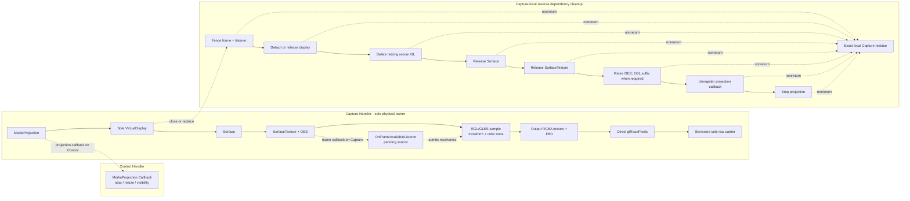

# Screen Capture Engine — Capture and Rendering

## Scope and ownership

This document is the sole physical authority for `MediaProjection`, `VirtualDisplay`, the Capture-local Target,
EGL/GLES, source acquisition, draw/readback, and their dependency-local release. Caller-visible image meaning,
parameters, problems, lifecycle, and observations remain owned by
[the product contract](01-product-contract.md). Cross-component authority, currentness, terminal cutoff, and
bounded role ownership remain owned by [the internal architecture](02-internal-architecture.md).
[The authority index](00-authority-index.md) owns activation, precedence, and topic routing.
Capture records only the raw boundary facts defined here; the product contract alone maps them into a
caller-visible outcome.

One Session has one Capture Handler lane. That lane owns thread affinity for every capture/rendering call:

- projection callback registration and unregistration, the sole display creation, display mutation, and release;
- one current Target's OES texture, `SurfaceTexture`, `Surface`, producer state, listener, and pending-source bit;
- one EGL context and 1x1 pbuffer, one shader pipeline, one output RGBA texture/FBO, and retained small client
  state;
- `updateTexImage`, transform and dataspace reads, draw, direct readback, and dependency-ordered local release.

Same-lane collaborators use direct calls and explicit owner transfer. A returned OES name, Android object, EGL
handle, or GL name is adopted immediately into the Capture owner before the next fallible step. Raw objects are
exposed only for the duration of the direct operation that needs them and never escape Capture. Splitting these
mechanics across private files creates no additional execution context, lock, lifecycle, or ownership authority.

Capture owns only physical resources, the installed immutable plan/current revision, bounded source state, one
mechanic-or-render busy state, and closing/closed state. It does not own desired policy, public lifecycle,
currentness decisions, Stats, cache, delivery, encoder health, fallback selection, or terminal priority.

The Architecture-owned global maxima bound these resources. This table defines only the composition of each
Capture-local owner or occupied slot; it does not establish another cardinality budget:

| Capture-local owner or slot | Composition when occupied |
| --- | --- |
| projection owner | the accepted `MediaProjection`, its registered projection callback, and the architecture-bounded `VirtualDisplay` |
| current Target slot | Target state plus its OES producer texture, `SurfaceTexture`, `Surface`, listener, and producer state |
| EGL owner | the context, 1x1 pbuffer, and currentness/integrity state |
| render owner | the shader pipeline, output RGBA texture, FBO, and retained small client state |
| operation slot | the current Capture mechanic or frame state |
| carrier access slot | the exact writable raw carrier currently exposed to Capture |



Partial construction may temporarily own a strict prefix of a Target or EGL/GL owner. Nonterminal Target
replacement never overlaps two installed Targets: the predecessor first reaches the concrete release outcomes
required below, and only then may its successor become current. Terminal cleanup may retain an unresolved old
owner, but then no successor is installed and the Session cannot resume.

## Projection, callbacks, and sole display

### Startup order and callback routes

Capture establishes its physical startup prefix in this order:

1. Call `mediaProjection.registerCallback(callback, controlHandler)` and observe its normal return.
2. Construct and adopt the EGL context/capabilities, render resources, and the initial Target; install the
   Target's source listener on the Capture Handler before attaching a producer.
3. Call the one permitted `createVirtualDisplay` with that installed Target's nonnull `Surface`.
4. On API 34–37, keep frame admission closed until the first valid captured-content resize has returned timely.

Metrics attachment is an independent readiness input, not a predecessor of Capture construction. Capture acts
only from an already supplied immutable physical plan and reports physical facts; it does not decide when the
Session is Active.

The single `MediaProjection.Callback` is registered on the Control Handler, not the Capture Handler. Therefore:

- `onStop()` reaches Control even when Capture is blocked in a platform or driver call and is the only platform
  source of the capture-ended fact;
- on API 34–37, `onCapturedContentResize(width, height)` and
  `onCapturedContentVisibilityChanged(isVisible)` also reach Control;
- positive captured-resize dimensions are authoritative capture dimensions on API 34–37; visibility is only a
  platform observation;
- every callback is fenced to its Session and accepted projection. A stale or terminal callback cannot touch a
  Target, GL object, carrier, or later Session.

Explicit display release and projection stop are cleanup calls. Neither invents a stop callback or any
capture-ended fact.

The `SurfaceTexture.OnFrameAvailableListener` is instead installed explicitly on the Capture Handler, because
the `SurfaceTexture` and current EGL context are Capture-affine. Its constant-time body checks that its exact
Target is still installed and unfenced, sets one pending-source bit, and requests at most one outstanding
notification. Repeated callbacks coalesce. A callback for a retired Target is inert and cannot touch current
pending state or a released object. Producer timestamps are not freshness, admission, or currentness evidence.

### Exact platform calls and outcomes

Projection and display boundaries have these exact calls and raw partitions:

[Product §9](01-product-contract.md#9-state-terminal-priority-and-public-failures) alone maps these raw outcomes
to caller-visible problems.

| Boundary | Exact call and cardinality | Raw physical outcome |
| --- | --- | --- |
| callback registration | Once before display creation: `mediaProjection.registerCallback(callback, controlHandler)` | Normal return records registration. A thrown `Exception` records that exact exception; unless absence of a side effect is concrete, Capture retains registration ambiguity with the callback/projection owner. Another direct fatal throwable follows the fixed fatal boundary. Ambiguity or nonreturn retains the in-flight call and callback/projection owner. |
| display creation | Once: `mediaProjection.createVirtualDisplay("ScreenCaptureEngine", W, H, D, DisplayManager.VIRTUAL_DISPLAY_FLAG_AUTO_MIRROR, surface, null, null)` | Timely normal nonnull return records the sole returned display owner immediately. A late nonnull return is also recorded immediately but is cleanup-only. Normal null return records no returned display owner. `SecurityException`, direct `OutOfMemoryError`, `IllegalStateException`, or another `Exception` records that exact raw throwable and no returned display owner. Another direct throwable follows the fixed fatal boundary with identical raw identity. Any side-effect ambiguity or nonreturn retains the exact in-flight call, projection, and Target Surface dependencies; it proves neither display nor no-display and never permits another create. |
| size/density mutation | `virtualDisplay.resize(W, H, D)` once for each admitted tuple that differs from the actual tuple | Timely normal return records the exact applied tuple. Throw records the exact throwable and no reliable new applied tuple; ambiguity or nonreturn retains the in-flight call and the last recorded actual tuple without claiming that the platform remained there. Another direct fatal throwable follows the fixed fatal boundary. |
| producer mutation | `virtualDisplay.setSurface(surface)` or `virtualDisplay.setSurface(null)` once for each admitted attach or detach | Only timely normal return records that exact attach or detach. Throw records the exact throwable; expiry, ambiguity, or nonreturn retains the in-flight call. None proves attach or detach. Another direct fatal throwable follows the fixed fatal boundary. |
| display release | `virtualDisplay.release()` at most once | Only normal return proves release and may prove detachment of its current producer. A returned `Exception` is recorded and cleanup continues; direct fatal follows the fixed fatal boundary; nonreturn blocks the dependent suffix. |
| callback unregistration | `mediaProjection.unregisterCallback(callback)` at most once | Only normal return proves unregistration. A returned `Exception` is recorded and cleanup continues; direct fatal follows the fixed fatal boundary; nonreturn blocks the dependent suffix. |
| projection stop | `mediaProjection.stop()` enters at most once after all Capture-owned prerequisites | Only actual normal return proves projection closure. Throw, ambiguity, or nonreturn retains the exact owner. It creates no callback fact. |

`W`, `H`, and `D` are always the authoritative logical display width, height, and density. The creation flag is a
request, not evidence of producer attachment. The display callback and Handler arguments are both null because
projection events use the separately registered projection callback.

One accepted projection token is consumed by exactly one display creation on API 24–37. Reconfiguration uses
only `resize` and `setSurface`; it never restarts the projection or calls `createVirtualDisplay` again. There are
zero `VirtualDisplay.setRotation` calls and zero `ImageReader` objects or calls in the V1 path. Rotation remains
a shader transform.

On API 34–37 a valid resize may reach Control before Capture reports the display's nonnull return. The two facts
join without admitting a provisional frame or creating another display. A stopped projection is never restarted.

## Target planning and direct ownership

### Full and Downscaled plans

For authoritative capture dimensions `(W,H,D)` and resolved positive output `(Ow,Oh)`, the physical Target mode
is closed:

- `Full` is the API 24–37 baseline. The display and Target are both `W x H` at density `D`.
- `Downscaled` is eligible exactly on API 32–37 when the selected region is Full, crop is zero, output sizing is
  a scale factor `f < 1`, and the checked planner below returns `k < g`. Rotation, mirror, and color do not remove
  eligibility.
- A target-size request, either half-region, any crop, API outside 32–37, or `k == g` selects `Full`.
- A selected Downscaled plan that is later denied by a deterministic limit or actual allocation does not fall
  back to Full for that attempt or disable Downscaled for later reconciliation. V1 has no Target-mode health or
  automatic Downscaled-to-Full fallback.

The exact planner is:

```text
g = gcd(W, H)
baseW = W / g; baseH = H / g
rotation 0/180: requiredSourceW = Ow; requiredSourceH = Oh
rotation 90/270: requiredSourceW = Oh; requiredSourceH = Ow
ceilDiv(n,d) = n / d + (if n % d == 0 then 0 else 1)
k = min(g, max(1, max(ceilDiv(requiredSourceW, baseW),
                      ceilDiv(requiredSourceH, baseH))))
Tw = baseW * k; Th = baseH * k
```

All arithmetic is checked before narrowing. `Tw:Th == W:H`, and each Target axis supplies at least its
rotation-aware required source samples. The display remains `W x H` at `D`; only the Surface buffer is
`Tw x Th`. Selection never uses a device/driver allowlist, benchmark, image score, test result, free-memory
sample, or predicted GPU byte count.

API 32–33 plan from source-authoritative dimensions. API 34–37 may bootstrap with a provisional Full Target
while frame admission is closed. After the first valid captured resize, that Target is retained only if the
authoritative dimensions and selected plan require that exact Full Target; otherwise Capture performs the
ordinary pre-frame replacement on the same display.

For unchanged authoritative dimensions, a healthy Full Target is retained exactly while Full remains selected.
A Downscaled selection replaces it. A healthy Downscaled Target is retained while still eligible and while
`Tw >= requiredSourceW` and `Th >= requiredSourceH`; it is not rebuilt merely to shrink. Changed authoritative
dimensions, larger demand exceeding either axis, or Downscaled ineligibility requires replacement.

On API 32–37 only, Android's documented media-projection behavior for an eligible smaller exact-aspect Surface
uniformly fits and centers the logical display content into the entire target bounds. Capture infers no content
rectangle, crop, or freshness evidence from that behavior. API 24–31 do not use it.

### Construction, installation, and producer evidence

After EGL preflight admits both axes, Target construction is one Capture-local sequence:

```text
generate nonzero OES texture
-> bind GL_TEXTURE_EXTERNAL_OES
-> set min/mag GL_LINEAR and wrap S/T GL_CLAMP_TO_EDGE
-> SurfaceTexture(exactOesName, false)
-> setDefaultBufferSize(Tw, Th)
-> Surface(surfaceTexture)
```

Each successful step is adopted before the next call. Direct `Surface.OutOfResourcesException` is
`ResourceExhausted`; another constructor or default-size `Exception` is `InternalFailure`. GL OOM and direct
fatal behavior follow the boundaries below. A partial owner contains exactly the successful prefix and is never
installed.

Only a complete current Target becomes installed. No listener, display producer, or frame use occurs before
installation. Once installed, Capture accesses its `Surface`, `SurfaceTexture`, and OES name directly on the same
Handler only for the active operation. There is no general getter or copied raw-handle fact.

Listener installation must return normally before producer admission. Physical producer state is closed:

```text
AwaitingEvidence -> ProducerAttached -> Detached
AwaitingEvidence -> NoProducer
```

Only these concrete outcomes advance it:

- nonnull normal display creation or normal `setSurface(surface)` proves `ProducerAttached`;
- a structurally unnecessary/unentered attach, or normal display creation returning null, proves `NoProducer`;
- normal `setSurface(null)` or applicable normal display release proves `Detached`.

Throw, expiry, ambiguous entry/return, projection stop, post acceptance, or shutdown intent proves none of those
states. Normal attachment of a new Surface proves only the new producer; it does not prove the old producer was
detached.

Installation calls `surfaceTexture.setOnFrameAvailableListener(listener, captureHandler)` exactly once for the
installed Target. Removal calls the same overload with a null listener exactly once. Normal return is the only
installation/removal outcome Capture may use; a thrown `Exception` or ambiguous completion is
`InternalFailure`, and another direct fatal throwable follows the fixed fatal boundary.

Target replacement or close first stops source/frame admission, waits only for the already-entered Capture
operation to return, fences the exact Target, and discards its pending bit. Listener removal must return normally,
then a marker posted to the same Capture Handler must run before Capture treats earlier accepted listener
invocations as ordered behind the fence. The marker is not buffer freshness or producer-detach evidence.

### Frame admission and source acquisition

Capture begins a frame only when all local preconditions coexist: admission is open, the posted operation is
current at entry, the exact installed Target has an attached producer and pending source, the compatible render
owner and exact writable carrier are present, and no other Capture mechanic or render is active. Cutoff or stale
entry performs zero Target, EGL, GLES, or carrier work. One entered frame must return before another can begin;
there is no frame queue or second carrier.

Materialization atomically consumes the pending bit, then calls `updateTexImage()` once. A listener callback that
arrives during the frame sets the bit again for later consideration. After each normal update, Capture copies all
16 values from `getTransformMatrix(precreatedFloat16)` and rejects any nonfinite value. On API 33+ it then reads
`getDataSpace()` once. No source timestamp controls admission or output currentness.

An unexpected Android or GL-facing `Exception`, malformed value, wrong owner, or ambiguous completion is
`InternalFailure`. A direct fatal throwable is not converted to an ordinary failure except at the expressly named
OOM boundaries. The exact throwable is retained for the owning outer fatal boundary after allocation-free
admission closure and exact owner recording; physical recovery and later teardown are not promised.

## EGL and GLES ownership

### EGL construction and currentness

EGL construction runs entirely on the Capture Handler in this exact order:

| Step | Exact call and requirement |
| --- | --- |
| display | `eglGetDisplay(EGL_DEFAULT_DISPLAY)` must not return `EGL_NO_DISPLAY`; `eglInitialize(display, major, 0, minor, 0)` must return true. The display is a non-owned platform/process handle. |
| config | `eglChooseConfig` requests one config with `EGL_SURFACE_TYPE=PBUFFER_BIT`, `EGL_RENDERABLE_TYPE=OPENGL_ES2_BIT`, `EGL_CONFORMANT=OPENGL_ES2_BIT`, RGBA minima `8/8/8/8`, depth/stencil `0/0`, and `EGL_NONE`; require true, count 1, and a nonnull config. Larger physical components or depth/stencil remain valid. |
| context | `eglCreateContext(display, config, EGL_NO_CONTEXT, [EGL_CONTEXT_CLIENT_VERSION,2,EGL_NONE], 0)` must return a context other than `EGL_NO_CONTEXT`; adopt it immediately. |
| pbuffer | `eglCreatePbufferSurface(display, config, [EGL_WIDTH,1,EGL_HEIGHT,1,EGL_NONE], 0)` must return a surface other than `EGL_NO_SURFACE`; adopt it immediately. |
| bind | `eglMakeCurrent(display, pbuffer, pbuffer, context)` must return true, followed by the initial current-context identity check. Complete EGL ownership publishes only after both succeed. |

The pbuffer exists only to keep the context current; rendering and readback use the output FBO. There is no later
bind except the single teardown unbind.

EGL result/error reads are exact:

| Observed result | Immediate same-thread `eglGetError()` count |
| --- | ---: |
| ordinary true/non-sentinel, including malformed success-shaped output | 0 |
| ordinary false/sentinel | 1 |
| initial or inverse `eglGetCurrentContext()` identity match | 0 |
| initial or inverse identity mismatch | 1 |
| `eglReleaseThread()` true | 0 |
| `eglReleaseThread()` false | 1 |

Each required error read is immediate and there is no retry. `EGL_BAD_ALLOC` is `ResourceExhausted` only when
coherent evidence from the exact display/config/context/pbuffer construction preserves safe partial ownership.
Every other error code, missing or inconsistent code, malformed success-shaped result, currentness mismatch, or
teardown failure is `InternalFailure`.

After initial bind and before every GL construction, frame, or destruction operation, Capture calls only
`eglGetCurrentContext()` and requires referential identity with its context. It does not query current display or
surfaces. Mismatch performs the one error read, marks context integrity unknown, and fails closed without repair
or rebind.

### Capability and resource construction

Immediately after the initial currentness check, one fail-closed GLES group queries into preallocated storage:

```text
glGetIntegerv(GL_MAX_TEXTURE_SIZE, scalar)
glGetIntegerv(GL_MAX_VIEWPORT_DIMS, int[2])
glGetShaderPrecisionFormat(GL_FRAGMENT_SHADER, GL_HIGH_FLOAT, range[2], precision[1])
```

Texture maximum and both viewport axes must be positive. Highp is selected only when range-low, range-high, and
precision are all positive; an all-zero triple selects mediump. A mixed triple, nonpositive capacity, malformed
return, or dirty group is `InternalFailure`. Absence of highp neither rejects a request nor selects another path.

Before Target or render allocation, compare each requested Target/output width and height independently with the
texture maximum and matching viewport axis. Deterministic denial occurs before retirement or allocation and is
`ResourceExhausted` at the owning decision point. Capture performs no GPU-memory-byte prediction. The checked
`B = 4 * Ow * Oh` is only the exact CPU carrier range.

Pipeline construction uses one ESSL 1.00 program with `GL_OES_EGL_image_external`. It compiles the vertex shader
and selected-highp-or-mediump fragment shader, requires compile status, creates and links a nonzero program,
binds `aPosition=0` and `aTexCoord=1`, requires link status and every used uniform location nonnegative, then
detaches and deletes the shaders. A partial program remains owned until clean deletion or context destruction.

The reusable output owner contains exactly one texture and one FBO:

```text
2D texture: min/mag GL_NEAREST; wrap S/T GL_CLAMP_TO_EDGE
glTexImage2D(GL_TEXTURE_2D, 0, GL_RGBA, Ow, Oh, 0, GL_RGBA, GL_UNSIGNED_BYTE, null)
FBO: attach texture at GL_COLOR_ATTACHMENT0
glCheckFramebufferStatus(GL_FRAMEBUFFER) == GL_FRAMEBUFFER_COMPLETE
```

The format makes no claim about physical component storage width. A zero/bad name, compile/link/status/location
failure, incomplete FBO, malformed clean result, or non-OOM GL error is `InternalFailure`. A GL OOM follows the
poison rule below. A healthy output owner is reused only while output size, checked carrier byte count, fixed
format, and pipeline identity remain exactly compatible. Target replacement alone does not retire it.

Retained vertex/texture-coordinate arrays, the 16-float transform array, and other small state are reused. Frame
processing creates no per-frame transform buffer, dependent full-frame buffer, PBO, or second raw-sized copy.

### Fail-closed groups and safety interval

Every capability, construction, frame, and destruction GLES group follows one protocol:

1. Perform exactly one scalar `glGetError()` preprobe.
2. If it is not `GL_NO_ERROR`, execute zero commands in the group.
3. Otherwise run the fixed commands once.
4. After normal command completion, perform exactly one scalar `glGetError()` postprobe.
5. Require a clean postprobe before accepting any physical success.

There is no drain, confirmation probe, continuation probe, retry, or error array. The first observed
`GL_OUT_OF_MEMORY`, including stale, late, or deletion evidence, takes precedence and irreversibly marks the
unshared context poisoned by OOM. Any other nonzero probe marks integrity unknown and is `InternalFailure`.
Either state permits zero later GLES probes, commands, deletion, fallback, render, readback, or pixel use in that
context.

`glEnteredOperationSafetyNanos = 10_000_000_000L`. One interval covers each finite preterminal EGL/GL
construction-validation operation, Target/render construction, complete materialized frame from currentness and
acquisition through readback, or dependent GL destruction. It is not a timer per call or group. A terminal-origin
or pre-entry terminal-converted destruction has no watchdog.

## Transform, color, draw, and readback

### Sampling transform

The product contract owns visible transform meaning and output dimension resolution. Capture realizes it once in
the shader. For source `(W,H)`, choose Full `(0,0,W,H)`, LeftHalf `(0,0,W/2,H)`, or
RightHalf `(W/2,0,W-W/2,H)`. After applying crop:

```text
x0=rx0+left; y0=ry0+top; Sw=rw-left-right; Sh=rh-top-bottom
(Rw,Rh)=(Sw,Sh) for 0/180; (Sh,Sw) for 90/270
u0=(i+0.5)*Rw/Ow; v0=(j+0.5)*Rh/Oh
```

Undo oriented mirror (`Horizontal: u=Rw-u0`; `Vertical: v=Rh-v0`), then undo clockwise rotation:

```text
0: xs=u, ys=v              90: xs=v, ys=Sh-u
180: xs=Sw-u, ys=Sh-v      270: xs=Sw-v, ys=u
```

Full uses `Tw=W,Th=H`; Downscaled preserves `Tw:Th=W:H` and active content fills the Target. Normalized pre-OES
coordinates are `((x0+xs)/W,(y0+ys)/H)`. CPU reference arithmetic uses binary64 without intermediate integer
rounding. The copied 4x4 OES matrix multiplies `(preOesX,preOesY,0,1)` exactly once. Framebuffer row inversion is
separate and occurs exactly once.

External sampling is linear and clamp-to-edge. The reference mapping computes `qx=a*Tw-0.5`, `qy=b*Th-0.5`,
clamps to `[0,Tw-1]` and `[0,Th-1]`, chooses `x0=floor(qx)`, `x1=min(x0+1,Tw-1)` and the equivalent y pair,
then bilinearly interpolates with the remaining fractional parts. Each final normalized channel is clamped to
`[0,1]` and quantized as `min(255,max(0,floor(255*c+0.5)))`.

### Dataspace and shader color actions

API 24–32 performs nominal-SDR handling and does not call `getDataSpace`. API 33+ classifies the returned integer
in this first-match order:

| Evidence | Shader action |
| --- | --- |
| exact `DATASPACE_SRGB` | nominal sRGB |
| exact `DATASPACE_DISPLAY_P3` | fused Display-P3 to sRGB |
| exact `DATASPACE_SCRGB` or `DATASPACE_SCRGB_LINEAR` | system-composited 8-bit best effort |
| remaining transfer exactly `TRANSFER_ST2084` or `TRANSFER_HLG` | system-composited 8-bit best effort |
| every other integer | nominal-SDR best effort |

Exact dataspace equality precedes transfer extraction. Display capability is never source-buffer evidence.
Capture records the first actual classification/action and each later change at this physical site; it does not
select or publish diagnostics. Per-frame equal classifications create no new action fact. V1 makes no HDR
colorimetric claim.

Capture applies the Display-P3 and grayscale transforms owned by
[Product §5](01-product-contract.md#5-dimensions-transform-color-and-jpeg-semantics) exactly once. The selected
fragment shader fuses the applicable Product transform after source sampling and before readback, uses no extra
FBO, and forces opaque alpha in that same pass. Fragment `highp` is preferred; the already-selected `mediump`
shader is the best-effort fallback when `highp` is unavailable. Capture does not restate or independently vary
Product's matrix, evaluation order, clamp, encoding, quantization, or gamma-coded grayscale rule, but neither
precision promises binary64 evaluation or cross-GPU bit-exact output. Verification owns the precision-specific
visual tolerances.

### Canonical frame and carrier use

Each frame binds the exact FBO, program, output viewport, fixed OES texture unit and matching sampler; uploads the
reconciled transform/color state; binds the two retained client arrays; enables their attributes; sets full
color mask and pack alignment `1`; and disables blend, depth, stencil, scissor, cull, and dither.

One fail-closed group installs canonical state. A second calls:

```text
glDrawArrays(GL_TRIANGLE_STRIP, 0, 4)
glReadPixels(0, 0, Ow, Oh, GL_RGBA, GL_UNSIGNED_BYTE, carrier)
```

The carrier's exact writable range is the checked tight `[0,B)` where `B=4*Ow*Oh`; position, limit, and capacity
must make precisely that range writable before GL entry. Readback goes directly into that carrier, with no PBO,
staging copy, or second full-frame array. Clean probes and timely operation return are required before the
bytes may leave Capture. The physical output is tight, opaque, and top-down RGBA. Repeating previously encoded
output performs zero Capture, EGL, or GLES calls.

## Time and nonreturn

All Capture intervals use checked elapsed-realtime construction `D = Math.addExact(S,C)`. A physical return is
timely only when its durable sample `T < D`; equality is expiry. A delayed wake, Handler order, wall time, or later
observation cannot replace that comparison.

| Interval | Exact value and scope | Winning expiry |
| --- | --- | --- |
| `initialResizeSafetyNanos` | `5_000_000_000L`; API 34–37 only, from atomic publication of `S,D` with the nonnull display owner through the first valid captured resize. API 24–33 create no such interval. | `CaptureUnavailable`; a late resize is cleanup/current-physical-state only. |
| `androidEnteredOperationSafetyNanos` | `5_000_000_000L`; one interval for each preterminal callback registration, display create/resize/`setSurface`, source-listener install/remove, or `Surface.release` after entry. Never one compound window. | `InternalFailure`; a late real return may reduce only its exact physical residue. |
| `glEnteredOperationSafetyNanos` | `10_000_000_000L`; one interval for each operation enumerated in the GLES section. | `InternalFailure`; returned pixels or reuse are forbidden, and a late return is cleanup-only. |

Queued work has no start watchdog. Terminal-before-entry converts a required physical cleanup call into the same
one-shot call with no watchdog; terminal after entry retires its deadline but preserves the entered operation.
All terminal-origin cleanup, display/callback/projection release, and Handler shutdown have no watchdog. No
boundary is retried.

Timeout, post acceptance, cancellation, queue observation, `quitSafely`, or a dropped managed reference is not
entry, return, detach, deletion, release, or reclamation evidence. A late return can update only its exact local
operation. A permanently nonreturning Android or driver call retains the Capture Handler and its exact dependent
resources until process death; no replacement Capture lane or topology is created. Other roles and Sessions may
continue when they do not depend on that owner.

## Dependency-ordered physical release and residue

### Healthy and returning cleanup

Capture releases only its own local resources, on its Handler, without waiting for another role. A current installed
Target follows this order:

1. Close new source/frame admission, let the sole already-entered frame or mechanic return, fence the Target, and
   discard its pending bit.
2. Remove its source listener and run the same-Handler ordering marker.
3. For replacement, detach with one normal `setSurface(null)` before attaching a successor to the same display.
   For final close, release the existing display at most once; its normal return also proves detachment of the
   current producer. A structurally absent display skips only that call.
4. If the accepted physical change or final close also retires render ownership, delete its healthy output
   FBO/texture, program, and any partial shader objects through their fixed clean GLES groups. A Target-only
   replacement retains a compatible render owner.
5. Call `Surface.release()` exactly once and require normal return.
6. Call `SurfaceTexture.release()` exactly once and require normal return.
7. With intact current context, unbind and delete the Target OES texture in one clean group.

An uninstalled partial Target skips only structurally absent steps; every returned object still follows the same
dependency order. Throw, expiry, or nonreturn at a step never fabricates its outcome or permits release of a
physical dependent.

A normally returning `Surface.release()` is the only proof used to advance to `SurfaceTexture.release()`. A
normal `SurfaceTexture.release()` return is likewise required before healthy OES deletion. An ordinary throw is
`InternalFailure` before terminal and records the still-owned object; independent cleanup may continue, but the
dependent chain cannot. A direct fatal throwable follows the fixed fatal boundary.

After all reachable Target and other GL objects are gone—or after fail-closed aggregate retirement below—the EGL
suffix is one-shot:

```text
eglMakeCurrent(display, EGL_NO_SURFACE, EGL_NO_SURFACE, EGL_NO_CONTEXT)
-> eglGetCurrentContext() must be EGL_NO_CONTEXT
-> eglDestroyContext(display, context)
-> eglDestroySurface(display, pbuffer)
-> eglReleaseThread()
```

There is at most one unbind, inverse check, context destroy, pbuffer destroy, and release-thread call. There is no
repair bind, retry, or `eglTerminate`. After successful unbind, context and pbuffer destruction are independent
one-shot attempts: a normally returned context-destroy failure does not suppress the pbuffer attempt, although a
same-Handler nonreturn blocks everything behind it. Later pbuffer or release-thread failure does not revise an
already fixed physical classification.

If an unresolved Target prerequisite makes EGL teardown unsafe, Capture records the exact dependent EGL owners
instead of entering that suffix. After every Target/EGL step has either returned or become exact retained
residue, final capture cleanup continues, when reachable, with projection callback unregistration and the single
projection stop. Only after every Handler-reachable operation and
callback dependency has returned or been retained as exact nonreturn residue may Capture request
`quitSafely()`. The request is not proof that the thread returned, and no thread-return acknowledgement is
invented.

### Poisoned or unknown context

After the first GL OOM or unknown-integrity observation, Capture makes zero later GLES calls. Non-GLES ordering
still applies: source admission/listener closure, producer detach/display release, `Surface.release`, and
`SurfaceTexture.release` are attempted when their prerequisites are reachable.

Capture then retires the whole affected GL namespace only through this exact EGL prefix:

```text
one eglMakeCurrent(display, EGL_NO_SURFACE, EGL_NO_SURFACE, EGL_NO_CONTEXT) returning true
-> one inverse eglGetCurrentContext() returning EGL_NO_CONTEXT
-> one eglDestroyContext(display, context) returning true
```

Successful context destruction retires every still-owned or possibly affected GL name, including the Target OES
name, without claiming an individual GLES deletion. For OOM only, complete success of this prefix preserves the
`ResourceExhausted` classification. Unknown integrity remains `InternalFailure`. False/error, expiry, ambiguity,
or nonreturn before context destruction is `InternalFailure` and retains the exact suffix. The pbuffer and
`eglReleaseThread` attempts still follow as above and their later failures retain only their own physical suffix.

### Exact Capture residue

Terminal transfer never converts uncertainty into cleanup success. Capture retains one exact local residue,
containing only the unresolved owners and the minimal physical dependency suffix. The base owner closure is:

| Unresolved boundary | Exact retained dependency suffix |
| --- | --- |
| source listener removal/ordering marker | listener, Target, producer Surface chain, and every affected GL/EGL owner |
| display detach or release | display, attached Target Surface chain, and every affected GL/EGL owner |
| `Surface.release` | `Surface`, `SurfaceTexture`, Target OES, and every still-dependent GL/EGL owner |
| `SurfaceTexture.release` | `SurfaceTexture`, Target OES, and every still-dependent GL/EGL owner |
| healthy GLES deletion or poisoned-context retirement | every known or possibly affected GL name, context, and reachable pbuffer; already-proven independent Android objects are absent |
| EGL unbind/inverse/context destruction | context, every context-dependent GL name, and reachable pbuffer |
| pbuffer destruction | pbuffer; an already destroyed context and its names are absent |
| `eglReleaseThread` | only the unresolved EGL thread-local suffix |
| projection callback unregistration | callback registration and its projection; previously released display/Target/EGL owners are absent |
| projection stop | projection; previously released callback/display/Target/EGL owners are absent |
| entered frame/platform/driver call | that operation, any carrier it currently owns, and all physical owners needed by the call and their unreleased dependents |

A returned failure retains only the base owner closure after Capture attempts every independent reachable step;
the Handler itself need not remain with that self-contained residue. If an entered call has not returned, the
same residue additionally retains the Capture Handler and every still-owned later serial-suffix input that the
blocked Handler cannot yet reach, including display/callback/projection owners when present. Each slot records
actual presence or proven absence; an earlier successful release is never retained.

A real late normal return may reduce only the matching row and then continue its now-reachable suffix. It cannot
install a successor, publish pixels, reopen admission, retry a call, change fallback, or revise the terminal
winner. Independent resources already proven released are never retained merely because another suffix is stuck.

## Physical negative boundary

The V1 Capture path has one Handler lane, one display, one Target topology, one EGL context, one draw/readback,
and one raw carrier. It performs no repair bind, GL error drain, retry, `eglTerminate`, PBO or double-buffered
readback, second output topology, speculative texture pool, predictive GPU-memory selection, device/test-based
selection, `VirtualDisplay.setRotation`, `ImageReader`, HDR guarantee, or linear-light grayscale claim.

Managed-reference loss, timeout, shutdown intent, or semantic terminal never stands in for a concrete platform
return or GL/EGL outcome. Unresolved physical ownership is preserved exactly and is never reused.
